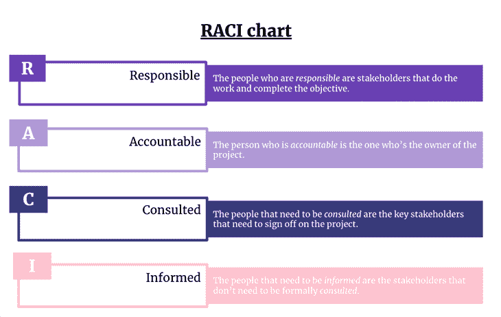
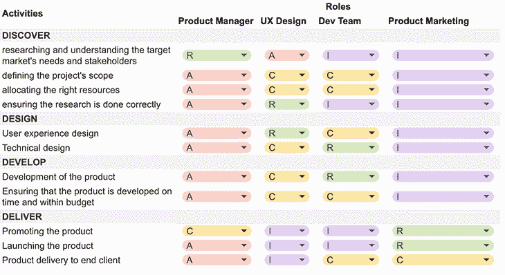
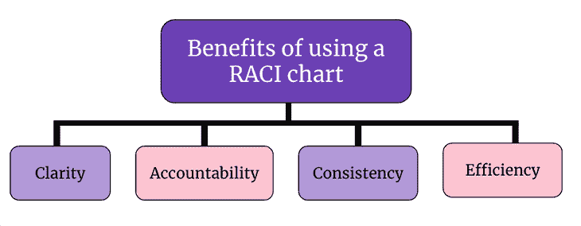

# 什么是 RACI 图表以及如何使用它(带模板)

> 原文：<https://blog.logrocket.com/product-management/what-is-a-raci-chart-and-how-to-use-it-with-template/>

产品工作很复杂。虽然有框架和最佳实践，但由于其性质，您只能在某些地方应用相同的过程。

人们可以采用最佳实践，分析您的环境，然后根据您的具体情况定义工作方式和职责。这取决于你的公司，你正在做的产品的种类，以及你正在处理的整体哲学和心态。

没有两种情况下团队执行产品工作是相似的。

我遇到的最多的重叠是在产品经理和 UX 角色之间，NN Group 进行的[研究也证明了这一事实。](https://www.nngroup.com/articles/ux-product-managers-overlap/)

在这篇文章中，我们将讨论责任分配矩阵，也就是 RACI 图，可以有所帮助。RACI 图表可以帮助您在角色和职责上与您的团队和利益相关者保持一致，同时还可以改善沟通和决策。

* * *

## 目录

* * *

## 什么是 RACI 图表？

RACI 图，或称责任分配矩阵，是一种有助于沟通和澄清一起工作的人的角色和责任的工具。在产品管理中，它增加了对产品开发过程中的协调和沟通的支持:

### 可靠的

该团队成员是负责执行任务的人。每个任务至少需要一个负责人，但也可以有更多。

### 负有责任的

这个团队成员是最终对任务或可交付成果的结果和成功负责的人。他们可以自己完成任务(在这种情况下，他们也要负责)，也可以把工作委托给别人。

每个任务应该只有一个负责的团队成员。

### 请教

你可以有尽可能多的利益相关者。这些团队成员和风险承担者需要他们的输入来完成任务。他们根据自己的专业知识提供信息，或者任务结果会如何影响他们的工作。

### 见多识广的

这些团队成员应该留在圈子里。如果你要为利益相关者管理考虑权力/利益网格[，你会考虑这一类别中权力小、兴趣低的利益相关者。](https://blog.logrocket.com/product-management/what-stakeholder-management-tools-techniques/)

## 将 RACI 图应用于产品开发过程

你可以将 RACI 图表应用到产品开发过程的不同阶段。我们将使用 4D 方法(发现、设计、开发和交付)来展示如何在产品管理、用户体验设计、开发团队和产品营销之间划分职责。

根据您的具体情况，您还可以包括交付经理，他将接管产品经理的部分职责:

让我们通过定义 4D 方法来分解上图。

### 发现

产品经理*负责*研究和了解目标市场的需求和利益相关者。他们*负责*定义项目的范围，分配合适的资源，并确保研究正确完成。

UX 的设计师和开发团队*被咨询*关于用户体验和技术可行性的输入和反馈。

产品营销部门将*被告知*调查结果。

### 设计

UX 设计师*负责*用户体验，而架构师/技术负责人负责技术设计。

产品经理*负责*确保设计满足发现阶段定义的要求，设计是可行的，并且资源得到适当分配。

将*咨询开发团队*关于技术可行性的输入和反馈。

产品营销在这个阶段也仅仅是*被告知*。

* * *

订阅我们的产品管理简讯
将此类文章发送到您的收件箱

* * *

### 发展

开发团队*负责*实施设计和创造产品。

产品经理*负责*确保产品在预算内按时开发，并管理开发过程中出现的任何问题。

UX 设计师应该*咨询*关于用户体验和任何发现的问题的输入和反馈。

产品营销部门*被告知*进度和状态。

### 传递

产品营销部门*负责*推广和发布产品，而*通知*产品已准备好发布。

产品经理*负责*向最终用户或客户交付产品。他们*负责*确保产品满足发现阶段定义的要求，产品准备交付，以及任何最终问题得到解决。

与开发团队*协商*关于技术可行性和任何确定的问题的输入和反馈。

UX 设计公司*被告知*进度和状态。

一般来说，负责某一阶段的人将负责领导该阶段并做出最终决定，而其他人将被适当地咨询和通知。

## 使用 RACI 图表的好处

RACI 图表是帮助产品团队组织和合作的一个很好的工具。以下是一些好处:

### 清楚

RACI 有助于清晰地定义不同任务和决策的角色和职责，减少混乱并确保每个人都知道对他们的期望。这既适用于团队内部，也适用于组织外部。

### 有责任

通过明确定义谁对不同的任务和决策负责，RACI 可以帮助确保每个人都承担自己的责任，并对自己的行为负责。

此外，定义明确的角色和职责有助于避免重复工作和浪费。

### 一致性

RACI 可以确保任务和决策在整个产品管理流程中得到一致处理，从而提高流程的整体质量和效率。

### 效率

通过明确定义角色和职责，RACI 可以帮助简化产品管理流程，提高效率，最终节省时间和资源。

改善沟通

RACI 可以确保所有利益相关方随时了解产品管理流程的进展和任何变更，这有助于改善沟通，减少误解。

## 要避免的常见陷阱

考虑使用 RACI 图表时，需要注意以下几个陷阱:

### 忘记它并且不定期更新它

RACI 图表是一个活的文档——它随着你的团队或产品而发展。每当你经历变化时，重温它是很重要的。即使没有发生变化，您也应该每季度检查一次。

任何时候发生变化，你都应该重新审视 RACI 星盘:

*   一名新成员加入了这个团队
*   一名成员即将离开团队
*   产品有了新的利益相关者
*   工作方式的改变
*   产品进入生命周期的新阶段

### 没有利用其透明度的潜力

RACI 图表是一个方便的交流工具。创建一个 RACI 图表，把它塞进一个文件夹或抽屉里，对你没有任何帮助。

因为它是一个旨在提高一致性和透明度的工具，所以您应该确保每个相关方都知道它，并且可以方便地访问它。这在新团队成员或利益相关者入职时也是有益的。

### 重叠的角色

创建或维护 RACI 图时，请注意职责是如何划分的，并且没有重叠的角色。作为一个团队，你应该清楚地定义谁负责，避免在太多的团队成员之间分配，因为这可能会导致不必要的开销。

### 不平衡的责任

交付成功的产品是一场马拉松，而不是短跑。保持团队内部可持续的步调也很重要，这也适用于工作量。

你应该确保团队成员不会因为过多的*责任*任务而超负荷工作。在你的团队内部讨论，共同决定一个合理的工作量，考虑他们所有的日常职责。如果某些团队成员或角色有太多的责任，你必须考虑增加你的团队或重新分配责任。

例如，您可能有一个产品经理，他需要关注市场，[推动产品与市场的契合度](https://blog.logrocket.com/product-management/what-is-product-market-fit-measure-examples/)，执行发现活动，支持销售和营销，同时还作为开发团队的产品所有者。

这将导致团队在开发团队缺少产品经理的情况下更加沮丧，因此考虑引入一个专门的产品负责人可能是一个好主意。这样，他们将把全部注意力投入到团队中，而产品经理可以专注于产品的更具战略性的方面。

## 种族圣殿

最后，这里有一个[模板](https://bit.ly/RACItemplate)，你可以用它来定义你的产品团队自己的 RACI 图表。复制一份谷歌表单，添加你的任务，定义你的角色和职责。

## 结论

虽然 RACI 图是源于传统项目管理实践的工具，但它对于产品管理同样有价值。它是轻量级的，但是保存了大量相关信息。它还增加了角色和职责的透明度，并简化了新团队成员的入职流程。

*精选图片来源:[icon scout](https://iconscout.com/icon/presentation-2166506)*

## [LogRocket](https://lp.logrocket.com/blg/pm-signup) 产生产品见解，从而导致有意义的行动

[LogRocket](https://lp.logrocket.com/blg/pm-signup) 确定用户体验中的摩擦点，以便您能够做出明智的产品和设计变更决策，从而实现您的目标。

使用 LogRocket，您可以[了解影响您产品的问题的范围](https://logrocket.com/for/analytics-for-web-applications)，并优先考虑需要做出的更改。LogRocket 简化了工作流程，允许工程和设计团队使用与您相同的[数据进行工作](https://logrocket.com/for/web-analytics-solutions)，消除了对需要做什么的困惑。

让你的团队步调一致——今天就试试 [LogRocket](https://lp.logrocket.com/blg/pm-signup) 。

[Raluca Piteiu-Apostol Follow](https://blog.logrocket.com/author/ralucapiteiuapostol/) Product management consultant, innovation facilitator, and trainer helping to build the right products. It's not only about ideas, but about making them happen.