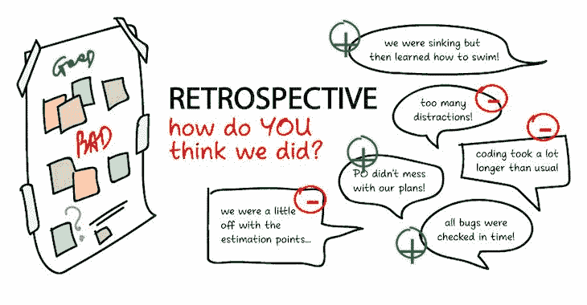
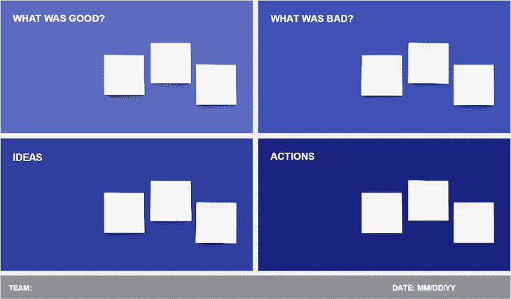
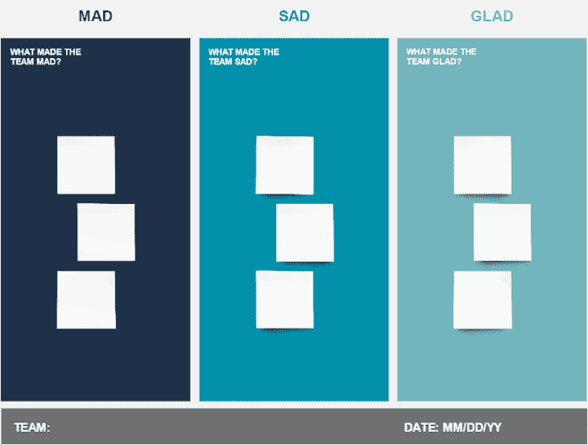
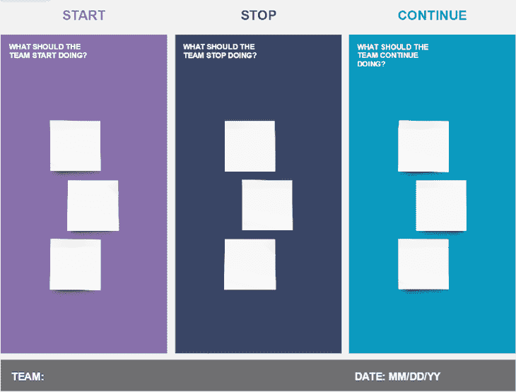
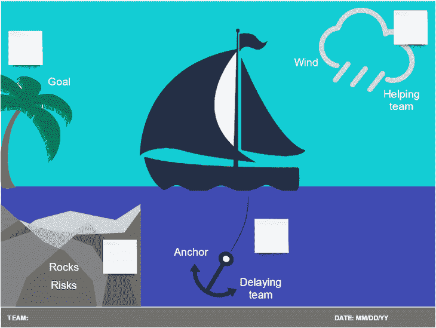
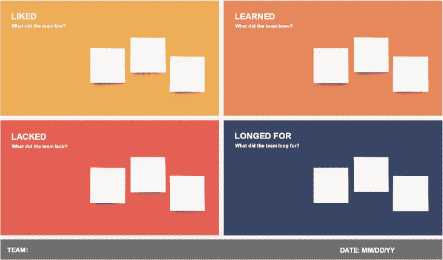

# 什么是冲刺回顾？模板和最佳实践

> 原文：<https://blog.logrocket.com/product-management/what-is-a-sprint-retrospective-templates-and-best-practices/>

如果你是跨职能数字产品团队的一员，你可能听说过或者已经参加过 sprint 回顾会。

如果你对[产品管理](https://blog.logrocket.com/product-management/what-does-a-product-manager-do-role-responsibilities/)不熟悉，这个指南会让你快速了解什么是 sprint 回顾以及它为什么重要。我们还将了解一些最佳实践，以确保您的系统平稳运行。

* * *

## 目录

* * *

## 什么是冲刺回顾？

sprint 回顾会是在 sprint 结束后举行的一次 T2 scrum 会议(有时被称为仪式)，以反思刚刚发生的工作。

sprint 回顾为团队提供了一个回顾过程、工作方式和任何关键学习的机会，目的是在随后的 sprint 中提高团队的绩效。

Sprint [回顾可以远程进行](https://www.atlassian.com/blog/teamwork/run-retrospective-distributed-team-fun)或亲自进行，尽管工具和过程可能略有不同。

## 什么时候召开 sprint 回顾会议？

sprint 回顾通常在 sprint 结束后，下一个 sprint 开始前举行。

Source: [Visual Paradigm](https://www.visual-paradigm.com/scrum/what-is-sprint-retrospective-meeting/)

如果你的 sprint 长达两周，那么 sprint 回顾会议可能只有一个小时。如果你正在进行一个更长的 sprint 周期，或者有一个更大的跨职能团队，回顾可能会持续三个小时。

## 冲刺回顾的目的是什么？

sprint 回顾的目的是让跨职能团队停下来，反思在 sprint 期间事情是如何进行的。回顾中的关键收获和学习应该有助于后续的冲刺跑得更顺利。

目标是不断改进团队合作的方式，优化团队用于交付优秀产品和功能的流程和工具。

Source: [Agilest](https://www.agilest.org/scrum/sprint-retrospective/)

产品经理和团队可以从 sprint 回顾会中学到什么？这里有一个简单的例子。

假设您确定您的团队由于缺乏一些用户故事的细节而浪费了过多的开发时间。在 sprint 回顾会上，您将向团队展示这个发现，并计划在下一个 sprint 开始之前确定所有的用户故事。

## sprint 回顾会讨论什么？

典型的 sprint 回顾会持续一个小时。会话由几个不同的组件组成。

回顾展的介绍包括场景设置。这意味着要求团队反思冲刺阶段。

主持人可以从提示参与者思考关键主题或冲刺阶段的工作开始。这有助于在会议的主要部分唤起团队的集体记忆。

如果之前有过 sprint 回顾，主持人也可以花 5 到 10 分钟回顾任何未完成的行动。

sprint 回顾的主要部分通常集中在以下三个方面:

1.  **进展顺利** *—* 庆祝冲刺阶段取得的成功(例如，设计师和开发人员合作得很好)
2.  **哪些方面可以改进** —回顾团队认为对他们在冲刺阶段完成工作的能力有负面影响的事情(例如，向前推进所必需的关键决策被忙碌的利益相关者阻止，这减缓了团队的努力)
3.  **解决可以改进之处的关键想法和行动** —概述帮助解决“可以改进之处”部分提出的问题的想法和行动(例如，确保在将工作提交给 sprint 之前，已经分配并采取了所有必要的决策)

在 [sprint 回顾会议](https://blog.logrocket.com/product-management/what-are-five-types-of-scrum-meetings/#sprint-retrospective)之后，主持人获取并分配所有行动项目，并在会议之后将这些信息分发给团队。团队(和利益相关者，如果适用的话)然后完成这些行动，目的是改进下一个 sprint 和以后。

## 谁参与了 sprint 回顾会？

sprint 回顾通常由一名[s](https://www.scrum.org/resources/what-is-a-scrum-master)[crum](https://www.scrum.org/resources/what-is-a-scrum-master)[m](https://www.scrum.org/resources/what-is-a-scrum-master)[aster](https://www.scrum.org/resources/what-is-a-scrum-master)主持，但也可以由团队的另一名成员主持，比如交付经理，这取决于团队的设置。也就是说，最好有一个中立的第三方来协助，所以如果可能的话，你也应该召集另一个跨职能团队的成员来进行你的 sprint 回顾。

跨职能团队的其他成员——产品设计师、开发人员、QA、产品经理、UX 设计师等。—向 sprint 回顾会议贡献关键的知识、想法和行动。

如果其他涉众是跨职能团队的核心部分，他们可能会参与到 sprint 回顾中。如果有他们可以帮助解决的行动或障碍，他们也可以发挥作用。

## 冲刺回顾与冲刺回顾

虽然它们都发生在冲刺周期的末尾，但是冲刺回顾和冲刺回顾是完全不同的。

一个 [sprint 回顾会议](https://blog.logrocket.com/product-management/what-is-a-sprint-review-meeting-agenda-example/)集中于检查实际工作(完成的票据，解决的 bug，等等)。)在 sprint 期间完成，目的是[更新 backlog](https://blog.logrocket.com/product-management/what-is-backlog-grooming-aka-refinement/) 。与此同时，sprint 回顾会关注于改进团队的表现和合作方式。

下面是 sprint 回顾和 sprint 回顾仪式之间的一些关键区别。

| **冲刺复习** | **冲刺回顾** |
| Scrum 团队和利益相关者参加 | 只有 scrum 团队参加 |
| 目标是向利益相关者展示工作并收集反馈 | 目标是提高下一次冲刺阶段的效率 |
| 冲刺评审完成产品待办事项列表中的项目 | 冲刺回顾创建任务来改进工作流程 |
| 讨论团队正在进行的工作 | 讨论团队是如何工作的 |

## 如何召开 sprint 回顾会议

在进行回顾时，有几个关键因素、原则和最佳实践需要考虑。下面是一些帮助你成功召开 sprint 回顾会议的提示。

* * *

订阅我们的产品管理简讯
将此类文章发送到您的收件箱

* * *

### 运行 sprint 回顾会议的原则

您可以将这些原则视为会议的内部规则，以确保事情顺利进行。在 sprint 回顾会上，有三件重要的事情需要记住并与你的团队分享:

1.  **会议是一个安全的空间**——sprint 回顾是一个学习和改进的机会，这意味着在讨论不顺利的事情时，不要相互指责
2.  **每个人都有发言的机会** —自然，团队中的一些成员不太愿意发言。作为主持人，你可以温和地提示这些人，并为他们提供输入空间
3.  **倾听他人** **和** **等待轮到你** **—** 在任何给定的时间里，只能有一个人发言；不要谈论彼此

### 冲刺回顾最佳实践

现在，让我们概述一些最佳实践来帮助您[召开引人入胜且有效的 sprint 回顾会议](https://lubiarz.medium.com/sprint-retrospective-a-complete-guide-with-best-practices-abed3ad973cc),这些会议将带来成功的 sprint，并最终带来优秀的产品。

*   考虑会议的最佳工具。如果您正在远程工作，您可以使用 Miro、Mural 或您的团队熟悉的类似工具
*   在开始主要活动之前，让参与者思考他们在做什么，并在便利贴上记录这些任务，以此为背景
*   确保你的每项活动都有时间限制，并使用计时器来保证每个人都在正轨上
*   确保团队在每个便笺条上写下一个项目(如果你亲自进行 sprint 回顾，试着用大写字母写下这些笔记，以便以后阅读)
*   将相似的项目组合在一起，并在进行过程中标记主题
*   拍一张 sprint 回顾会的照片供以后参考(如果会议是亲自召开的)
*   确保清楚地记录行动，分配给团队成员，并以易于分发的格式进行
*   花点时间庆祝一切顺利

## 基本冲刺回顾议程模板

如果你是跑冲刺回顾的新手，一个基本的议程是一个很好的起点！

您需要什么来开始:

*   **如果你是亲自工作** —便利贴、白板、记号笔或记号笔
*   **如果你正在远程工作**——比如 Miro、Google Jamboard 或壁画等数字白板

一个基本的 sprint 回顾会持续大约一个小时。你可以这样分解议程:

1.  首先提醒团队上述核心原则(5 分钟)
2.  让团队在便签上写下他们在冲刺阶段处理的主题、话题或功能，并放在白板上(5 分钟)
3.  什么好吃？让团队写下 sprint 期间进展顺利的事情，每张便笺写一个项目，然后将类似的便笺放在一起(5 分钟)
4.  讨论笔记之间的关键主题(5 分钟)
5.  什么不好？让团队写下 sprint 中不顺利的事情，每个便笺一个项目，然后将类似的便笺放在一起(5 分钟)
6.  讨论关键主题(5 分钟)
7.  对于每个关键主题，要求团队提出可能有助于解决问题的想法和行动(10 分钟)
8.  讨论想法并向团队成员分配行动(15 分钟)
9.  总结(5 分钟)

会议结束后，确保每个人都有一份行动和负责人的副本(如果您亲自主持了回顾会，还要有一张白板的照片)。

Source: [Atlassian](https://www.atlassian.com/blog/jira-software/5-fun-sprint-retrospective-ideas-templates)

## 替代 sprint 回顾模板

一旦你掌握了基本的 sprint 回顾议程，你可以考虑将它与其他一些有趣的模板混合起来，比如下面来自 [Atlassian](https://www.atlassian.com/blog/jira-software/5-fun-sprint-retrospective-ideas-templates) 的:

### 高兴，悲伤，疯狂

高兴、悲伤、疯狂模板的目的是找出在冲刺后提高团队健康和士气的方法。它通过强调人们在冲刺阶段的感受和情绪，关注寻找提高工作满意度的机会。

Source: [Atlassian](https://www.atlassian.com/blog/jira-software/5-fun-sprint-retrospective-ideas-templates)

### 开始、停止、继续

开始、停止、继续冲刺回顾模板都是关于决策的。它旨在帮助团队找出根据他们的工作方式和流程，他们应该开始做什么，停止做什么，或者继续做什么。

Source: [Atlassian](https://www.atlassian.com/blog/jira-software/5-fun-sprint-retrospective-ideas-templates)

### 帆船

帆船回顾模板对于喜欢可视化他们的冲刺思考的团队来说是非常棒的。它着眼于在冲刺阶段是什么推动了团队前进，以及是什么阻碍了团队实现目标。

Source: [Atlassian](https://www.atlassian.com/blog/jira-software/5-fun-sprint-retrospective-ideas-templates)

### 四个 l(喜欢、了解、缺乏、渴望)

四个 l 回顾模板，如 Sad、Mad、Glad，聚焦于团队在冲刺阶段的情感历程，同时考虑积极(“喜欢的”和“缺乏的”)和消极的感受(“学到的”和“更久的”)。

Source: [Atlassian](https://www.atlassian.com/blog/jira-software/5-fun-sprint-retrospective-ideas-templates)

## 结论

召开 sprint 回顾会是一个很有价值的练习，可以停下来反思你的团队是如何感受的，并考虑关键的学习和行动，你们可以在下一次 sprint 中集体采取这些行动来改进工作方式、过程和工具的使用。

记住，sprint 回顾应该是安全的空间，每个人都有机会倾听。这些不同范围的输入将帮助你成功地运行 sprint 回顾会议。

我们回顾了许多 sprint 回顾模板来尝试。我建议先从最基本的框架开始，然后再尝试其他框架，因为这样你会更容易运行回顾，并发现什么对你的团队最有效。祝你好运！

## [LogRocket](https://lp.logrocket.com/blg/pm-signup) 产生产品见解，从而导致有意义的行动

[LogRocket](https://lp.logrocket.com/blg/pm-signup) 确定用户体验中的摩擦点，以便您能够做出明智的产品和设计变更决策，从而实现您的目标。

使用 LogRocket，您可以[了解影响您产品的问题的范围](https://logrocket.com/for/analytics-for-web-applications)，并优先考虑需要做出的更改。LogRocket 简化了工作流程，允许工程和设计团队使用与您相同的[数据进行工作](https://logrocket.com/for/web-analytics-solutions)，消除了对需要做什么的困惑。

让你的团队步调一致——今天就试试 [LogRocket](https://lp.logrocket.com/blg/pm-signup) 。