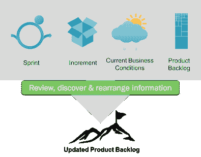
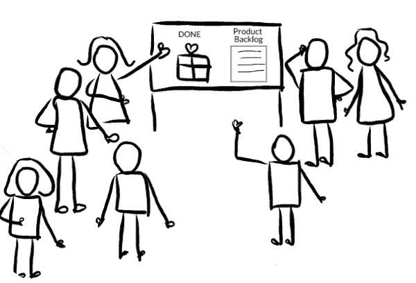
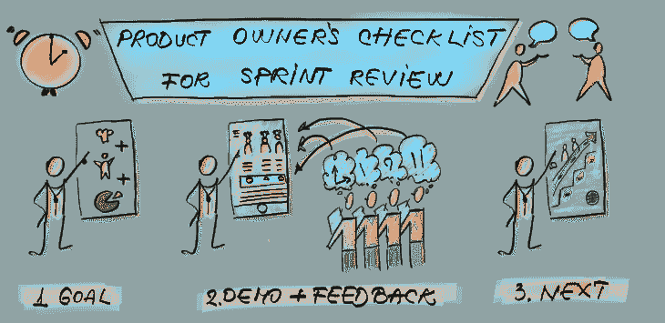
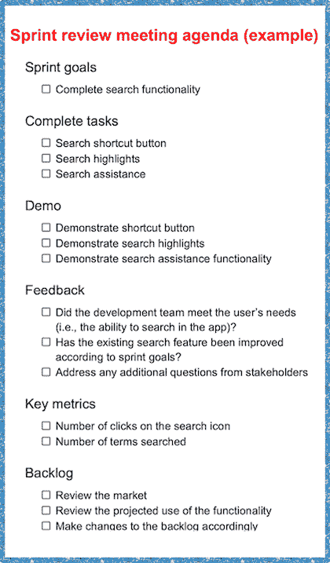

# 什么是冲刺复习？会议议程示例和概述

> 原文：<https://blog.logrocket.com/product-management/what-is-a-sprint-review-meeting-agenda-example/>

冲刺评审是产品开发和管理的 scrum 框架的一部分。

知道如何进行 sprint 评审是任何[产品管理](https://blog.logrocket.com/product-management/what-does-a-product-manager-do-role-responsibilities/)或所有权角色的先决条件，但重要的是要让仪式不仅仅是 sprint 期间完成的工作的演示。

冲刺评审应该促进团队协作，并评估是否在实现[产品愿景](https://blog.logrocket.com/product-management/what-is-a-product-vision-statement-examples/)方面取得了进展。否则，会议可能会变成死记硬背的陈述，你的团队将会错过收集反馈的重要机会。

* * *

## 目录

* * *

## 什么是冲刺复习？

sprint 评审是一个 scrum 仪式，在这个过程中，开发团队强调他们在 sprint 中完成的工作，向涉众演示，并解决他们在检查开发过程中可能遇到的任何问题。

Source: [Scrum.org](https://www.scrum.org/resources/what-is-a-sprint-review)

Scrum 指南将 sprint 评审定义为“检查 sprint 的结果并决定未来的调整”的事件

sprint 评审的期望结果是一个修订的产品 backlog，它定义了下一个 sprint 的可能项目。产品所有者也可以调整总的积压工作来迎接新的机会

## 冲刺评审的目的是什么？

冲刺评审发生在冲刺快结束的时候。这是 scrum 团队和关键涉众之间的非正式会议。

简而言之，在 sprint 回顾会议期间会发生这样的事情:scrum 团队展示 sprint 的结果，所有各方就接下来应该发生的事情进行合作。接下来的步骤可能包括[细化产品积压](https://blog.logrocket.com/product-management/what-is-backlog-grooming-aka-refinement/)以匹配优先级并进行 sprint 回顾。

冲刺评审对整个产品开发过程至关重要。没有它，scrum 团队可能会失去评估产品并做出相应调整的机会。关键利益相关方的反馈对于实现[产品愿景声明](https://blog.logrocket.com/product-management/what-is-a-product-vision-statement-examples/)中设定的目标至关重要。

## 谁会参加冲刺评审会议？

scrum 团队和关键利益相关者参加了 sprint 评审。所有与会者在会议的运行中都扮演着积极的角色。例如，scrum 团队负责展示其工作并收集反馈。

通常，不同的团队成员会负责 sprint 评审的某些方面。一般来说，产品负责人主持 sprint 评审会议，并介绍 sprint 期间发生的事情。与此同时，一个 scrum 大师促进了这一事件。

涉众可以包括像最终用户、投资者或其他团队这样的人。涉众将有机会与产品互动，同时也提供反馈。将利益相关者作为冲刺过程的一部分是至关重要的。这使得涉众感到参与其中，并且更有可能理解产品在开发过程中所走的道路。

## 在冲刺评审会议中会发生什么？

sprint 评审是一个工作会议，这意味着 scrum 团队应该避免把它变成一个只有演示的会议。也就是说，会议的主要目的是展示 sprint 的结果，并收集所有利益相关者的反馈。

一些产品负责人喜欢将 sprint 审查会议作为提高团队士气的一种方式。对已完成工作的回顾是一个庆祝团队及其成就的机会。然而，产品负责人应该避免将 sprint 评审变成团队建设事件。

Source: [Renata Blicharz](https://letsscrumit.com/scrum-events-4-sprint-review)

通常，冲刺评审会议包括以下活动。

### 回顾目标

产品负责人通过分享产品目标和解释 scrum 团队在冲刺阶段的目标来开始会议。这一部分还回顾了最初的 sprint 目标，以及哪些产品待定项是 sprint 的一部分。

### 回顾市场变化

为了准备 sprint 评审，产品负责人应该对当前的市场趋势进行研究。他们可能希望在 sprint 评审期间展示这些信息，这样涉众就可以对产品下一步应该做什么做出明智的决定。

### 呈现冲刺结果

在会议的这一部分，scrum 团队展示了他们在 sprint 过程中所完成和学到的东西。这也包括解决团队面临的任何问题。提出问题是很重要的，这样利益相关者就能理解发生了什么问题，scrum 团队也能得到可能的解决方案。

### 演示软件

一些产品经理犯了一个错误，将 sprint 评审变成了纯粹的产品演示。虽然演示是 sprint 评审的一个重要部分，但是让涉众直接与产品互动也很重要。

scrum 团队可能想要建立工作站来鼓励涉众的互动——例如，建立计算机以便涉众可以使用新的软件特性。这有助于促进对产品更好的反馈。

### 收集反馈

收集反馈是 sprint 评审最有价值的方面之一。有时，利益相关者不提供反馈，但创造一个他们可以分享想法的环境是很重要的。在整个 sprint 评审过程中，您需要征求他们的反馈，并确保参与者知道他们的想法是受欢迎的。

演示完产品后，与会者就产品待办事项进行协作，并确定应该优先考虑什么。这一讨论为[冲刺规划](https://blog.logrocket.com/product-management/what-is-sprint-planning-guide-meeting-agenda-cheat-sheet/)提供了信息。

### 调整产品路线图

基于前一阶段收集的反馈，产品所有者为下一次冲刺调整产品待办事项。这可能包括改变项目的顺序，以优先考虑其他项目。

产品负责人可能还会与利益相关者讨论预算、时间表和功能。所有这些讨论都为可能需要对产品路线图进行的更改提供了信息。

* * *

订阅我们的产品管理简讯
将此类文章发送到您的收件箱

* * *

## 多久举行一次 sprint 评审？

Sprint 评审是为每个 sprint 举行的。sprint 评审的频率取决于您的团队举行 sprint 的频率。

通常，短跑可以从一周到四周不等。一个组织可能每周、每隔一周或每月都有 sprint 评审。

## sprint 回顾需要多长时间？

冲刺评审的持续时间取决于冲刺的计划持续时间。产品经理应该为 sprint 的每一周计划一个小时的 sprint 回顾。

例如，一个月的 sprint 有四个小时的时间用于 sprint 回顾。更短的 sprint 有更短的 sprint 评论。

然而，如果产品团队可以收集必要的反馈并进行热烈的讨论，而不需要最大限度地利用建议的全部时间，就不一定需要全部时间。

## 冲刺回顾和冲刺回顾有什么区别？

冲刺评审是发生在[冲刺回顾](https://blog.logrocket.com/product-management/what-is-a-sprint-retrospective-templates-and-best-practices/)之前的事件。虽然这两个仪式都涉及到回顾短跑的某些方面，但它们有不同的侧重点。

冲刺评审会议集中在检查实际工作(完成的工作单，解决的错误，等等)。)在 sprint 期间完成，目的是更新 backlog。与此同时，sprint 回顾会关注于改进团队的表现和合作方式。

下面是 sprint 回顾和 sprint 回顾仪式之间的一些关键区别。

| **冲刺复习** | **冲刺回顾** |
| Scrum 团队和利益相关者参加 | 只有 scrum 团队参加 |
| 目标是向利益相关者展示工作并收集反馈 | 目标是提高下一次冲刺阶段的效率 |
| 冲刺评审完成产品待办事项列表中的项目 | 冲刺回顾创建任务来改进工作流程 |
| 讨论团队正在进行的工作 | 讨论团队是如何工作的 |

## 成功运行 sprint 评审的最佳实践

下面是一些帮助你召开引人入胜和有影响力的冲刺评审会议的建议。

*   避免用行话说话。使用简单的语言确保所有的利益相关者理解在冲刺阶段发生了什么
*   **关注为什么**。解释在冲刺阶段完成的项目将如何通过消除客户的痛点来支持客户，以及它们将帮助客户获得什么
*   **不要详细讨论每个产品待办事项**。不是所有的项目都重要到值得分享，所以把重点放在亮点上
*   **收集反馈**确保有收集利益相关者反馈的流程。这可能包括在审查后跟踪利益相关者，以确保他们满意
*   **排班中断**。冲刺评审会议可能会变得冗长，所以安排休息时间让与会者放松一下是很重要的
*   **做一次彩排**。有时排练会暴露演示中的缺陷。这让您有时间在实际的 sprint 评审之前解决问题
*   **创建议程**。没有人喜欢冗长的会议。议程可以帮助设定期望，并使冲刺评审保持在正确的轨道上

## 冲刺评审会议议程(示例)

产品负责人/产品经理应该在 sprint 评审之前创建一个议程。这确保了所有重要的点都被涵盖，并且审查不会误入歧途。

Source: [Anca Onuta](https://ancaonuta.medium.com/product-owners-checklist-for-sprint-review-e822bf12ace2)

虽然每个组织都有自己的变化，但典型的 sprint 评审会议议程分为四个部分(参见下面右侧的 sprint 评审会议议程示例):

Sprint review meeting agenda example

1.  **Sprint 回顾** —产品负责人介绍 Sprint 的目标以及完成和未完成的内容，并分享市场趋势的最新信息
2.  **现场演示** —开发团队演示了产品的新特性，并总结了在冲刺阶段遇到的成功和挑战。该团队还可能回答与会者的问题，因为他们最熟悉产品
3.  **反馈** —在 sprint 评审期间和之后收集反馈非常重要。这意味着为讨论创造一个开放和舒适的环境。产品负责人应记录这些意见，以供进一步分析
4.  **更新待办事项清单** —一旦 sprint 评审活动完成，产品负责人可以根据收到的反馈对产品待办事项清单或路线图进行修改

## 结论

冲刺评审是冲刺的必要组成部分。如果你没有计划好，它可能会变成一个无聊的事件。

当深思熟虑地执行时，sprint 审查可以从利益相关者那里得到有价值的反馈，最终导致更有效的 scrum 和解决用户最迫切问题的产品。通过庆祝团队的成功，你可以鼓舞士气。

## [LogRocket](https://lp.logrocket.com/blg/pm-signup) 产生产品见解，从而导致有意义的行动

[LogRocket](https://lp.logrocket.com/blg/pm-signup) 确定用户体验中的摩擦点，以便您能够做出明智的产品和设计变更决策，从而实现您的目标。

使用 LogRocket，您可以[了解影响您产品的问题的范围](https://logrocket.com/for/analytics-for-web-applications)，并优先考虑需要做出的更改。LogRocket 简化了工作流程，允许工程和设计团队使用与您相同的[数据进行工作](https://logrocket.com/for/web-analytics-solutions)，消除了对需要做什么的困惑。

让你的团队步调一致——今天就试试 [LogRocket](https://lp.logrocket.com/blg/pm-signup) 。

[Sara Nguyen Follow](https://blog.logrocket.com/author/saranguyen/) My greatest career achievement was when I was recognized as "GIF Master" for my GIFs in the company Slack channel. A close second is that I've written over 600,000 words in the past two years.