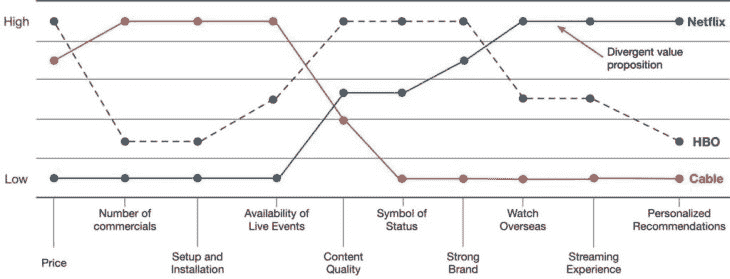
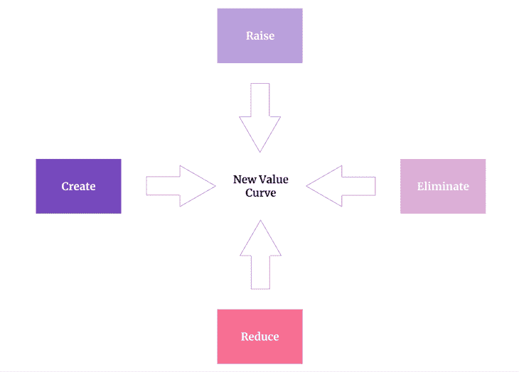
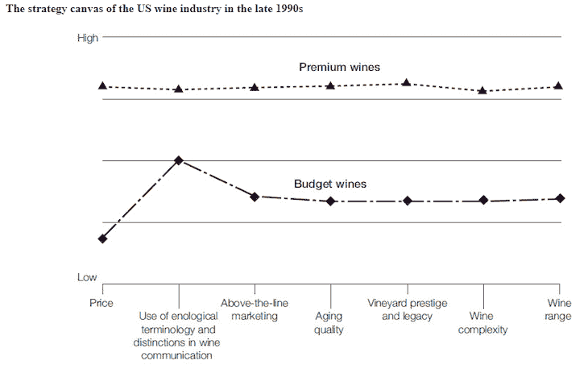
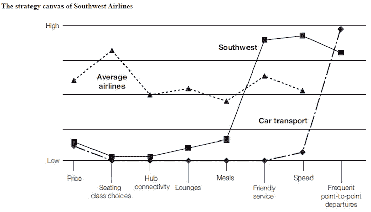

# 什么是战略画布以及如何创建战略画布(附示例)

> 原文：<https://blog.logrocket.com/product-management/what-is-a-strategy-canvas-how-to-create-examples/>

创新者使用各种技术和框架来构建稳固的商业模式，并在竞争中胜出。

在本指南中，我们将回顾其中一种技术:策略画布。

您可以使用战略画布来评估机会、评估竞争对手，甚至策划一个全新的价值主张。请继续阅读，了解什么是战略画布，以及你可以用它做什么。

* * *

* * *

## 什么是战略画布？

W.陈金(Chan Kim)在他 2014 年的畅销书《蓝海战略: *[:如何创造无竞争的市场空间，让竞争变得无关紧要](https://www.amazon.com/Blue-Ocean-Strategy-Uncontested-Competition/dp/1591396190)* 中首次介绍了[战略画布](https://www.blueoceanstrategy.com/tools/strategy-canvas/)。

画布的主要目标是评估所谓的“红海”——不断争夺客户的超竞争市场——并找到一种方法跳入无竞争的“蓝海”

然而，没有什么能阻止我们在稍微不同的环境中使用战略画布。这是一个非常通用的工具。

要构建战略画布，我们需要三个组件:

1.  [玩家](#players)
2.  [竞争因素](#competing-factors)
3.  [分数](#scores)

### 演员

球员是我们比较的对象。

虽然最常见的情况是使用画布[将您的产品或公司与竞争对手](https://blog.logrocket.com/product-management/what-is-competitive-analysis-template-examples-tutorial/)进行比较，但在比较整个市场类别并寻找它们之间的差距时，该工具也很有效(我们将在后面看到一个示例)。

### 竞争因素

进行比较时，什么标准最重要？虽然有可能找到一百个有趣的因素，但关注最关键的因素是关键。

在产品比较的情况下，它是关于理解当最终用户做出购买决定时什么因素是最重要的。

假设你正在买车:在决定一款特定车型时，对你来说最重要的是什么？对许多人来说，这可能是以下几种情况的组合:

*   价格
*   品牌
*   速度
*   安全
*   奢侈
*   效率

虽然有许多其他因素你可能会发现必不可少，如真皮座椅或低音炮，这些不太可能是你的决定因素。关键是确定哪些因素在购买决策中起着关键作用。

### 得分

现在是时候给每个玩家在每个因素上的表现打分了。

虽然你希望评估尽可能充分，但也没必要太科学。这一切都是为了全面了解谁在哪个类别中表现如何。

像 0-6 或 0-10 这样的范围就足够了。

在评估负面因素时，确保每个人都在同一页上。比方说，竞争对手 A 在价格方面得分 6，竞争对手 B 得分 8。这是否意味着竞争对手 B 因为得分较高而价格较高，或者得分反映了他们的竞争力(因此，价格较低)？

哪种方式更“正确”，不值得争论。最终，它是关于确保每个人在使用框架时都在同一页上。

## 战略画布看起来像什么？

在决定了要比较的对象、选择了竞争因素并根据这些标准对每位玩家进行了评分之后，您可以将结果以策略画布的形式呈现出来:

Source: [Strategy for Executives](https://strategyforexecs.com/hbo-vs-netflix/)

战略画布的目的是增加以下方面的透明度:

*   主要竞争对手
*   他们擅长的地方
*   他们表现不佳的地方

战略画布是一种活的、不断变化的工具。不仅玩家在特定因素上的表现会随着时间而改变，整个市场也会改变。几年前与客户相关的因素可能会被今天的其他需求所取代。

## 什么是四个行动框架？

战略画布有一个补充框架，叫做[四个行动框架](https://www.blueoceanstrategy.com/tools/four-actions-framework/)。

绘制战略蓝图后，你可以做四件事来强化你的价值主张，战胜他人，甚至改变游戏规则:

1.  [升起](#raise)
2.  [减少](#reduce)
3.  [创建](#create)
4.  [消除](#eliminate)

让我们仔细看看如何在画布上增加、减少、创造和消除因素。

### 上升

我们可以将哪些因素提升到行业标准之上？

如果某些竞争因素被忽略，它就为你在竞争中脱颖而出提供了机会。即使所有玩家的平均得分为 7 分(满分 10 分)，如果这是特定市场的决定因素之一，那么目标得分 10/10 可能是一个可行的想法。

* * *

订阅我们的产品管理简讯
将此类文章发送到您的收件箱

* * *

请记住“远高于行业标准”的部分。这里稍微改进一下不会扰乱市场。顾客甚至可能不会注意到。

### 减少

*我们可以将哪些因素降低到行业标准以下？*

你可能会考虑放弃一些竞争因素，只保留最低限度。

为什么你会故意忽略关键因素？一个字:资源。

大多数公司的预算、人员和组织能力有限。提高标准或解决新的因素有利于推动创新，但也会消耗更多的资源。

减少你在一些因素上的投资将会释放你可以在其他地方再投资的资源。

### 创造

我们可以创造哪些行业尚未提供的因素？

逃避竞争的最佳方式是在没人想到的地方提供价值。

通过在等式中加入全新的因素来给行业带来惊喜，这才是真正的创新。

例如，即时视频可用性在 90 年代并不是公司竞相实现的目标。然后，网飞决定提出一个新的因素来逃避竞争，并创造一个新的市场类别:电影流媒体。

### 消除

我们应该消除行业长期竞争的哪些因素？

加入一个新的因素通常意味着你需要去掉一些东西。

回到网飞的例子:一旦它开始在视频可用性、下载速度等因素上竞争。随着时间的推移，运输成本和库存等因素变得无关紧要。

还有，你关注的竞争因素越多，你的关注度就越低，支配它们的几率就越低。最终，最好是把 10 个因素固定在 20 个因素中。

此外，释放宝贵资源的最佳方式莫过于完全放弃某些领域:

提高和降低您在竞争因素中的得分，以调整和优化您的价值主张并在市场中胜出。

创造和消除创新和改变游戏规则的因素。

## 战略画布示例

为了说明如何使用 strategy canvas 和四个行动框架，我们来看两个真实的例子:

### [黄色尾巴]

[黄尾]是一家葡萄酒生产商，在 90 年代难以赶上竞争对手。当时，该行业由两类葡萄酒主导:昂贵的高质量品牌和较便宜的廉价版本。

Source: *[Blue Ocean Strategy](https://www.amazon.com/Blue-Ocean-Strategy-Uncontested-Competition/dp/1591396190)*

在做了一些调查后，[黄尾]意识到有一群顾客的需求没有被这两类人满足:年轻人。这群人不太关心品牌、声望或复杂性；它更关注的是简单性，比如容易饮用和选择。

基于这些见解，[黄尾]决定:

*   消除——老化的品质、线上营销、葡萄酒术语和区别只会迷惑年轻人
*   **减少**——葡萄酒的复杂性、范围和葡萄园声望虽然仍然相关，但不是关键因素
*   **创造**——易于饮用和选择灌输了一种乐趣和冒险的意识，这是年轻人未被满足的需求
*   **提高** —价格相对于预算的葡萄酒；[黄尾]确定其目标客户的支付意愿高于廉价葡萄酒

![Strategy Canvas Example: [yellow-tail]](img/0ed60ab85f49516a7064af5529af8349.png)

来源:[蓝海战略](https://www.amazon.com/Blue-Ocean-Strategy-Uncontested-Competition/dp/1591396190)

由于所有这些变化，【黄尾】创造了一个既不适合高档葡萄酒也不适合廉价葡萄酒的新市场类别。如今，[黄尾]是最具辨识度的“休闲酒”品牌之一。

### 西南航空公司

西南航空公司发现有两种类型的顾客:一种喜欢快速航班，另一种喜欢汽车的便宜和灵活性。因此，航空公司开始着手将两者结合起来。

基于这种认识，西南航空公司决定:

*   **降低** —座位选择、枢纽连接、休息室舒适度和餐食选择，所有这些都是为了降低总价格，这是一个核心因素
*   **提高** *—* 从 A 点到 B 点的整体运输速度(除其他外，由于减少了枢纽连接和座位选择)和服务的友好性，使价值主张更具吸引力
*   **创造***——*发车频率，几乎匹配汽车的灵活性

Source: *[Blue Ocean Strategy](https://www.amazon.com/Blue-Ocean-Strategy-Uncontested-Competition/dp/1591396190)*

因此，西南航空公司建立了一种新的航空旅行类别——便宜、快捷、灵活，但旅行舒适度低于传统航空公司。

## 关键要点

战略画布和随附的四个行动框架是功能强大的工具，可用于以下目的:

*   描绘和比较竞争对手
*   寻找跨行业的灵感(比如西南航空)
*   评估不同的市场类别(如[黄尾])
*   计划和假设价值主张

将策略画布用作一次性规划练习或长期监控工件。虽然这是一种相当罕见的技术，尤其是与更流行的框架(如价值主张或精益 UX 画布)相比，但它可以提供宝贵的见解。

*精选图片来源:[icon scout](https://iconscout.com/icon/box-738)*

## [LogRocket](https://lp.logrocket.com/blg/pm-signup) 产生产品见解，从而导致有意义的行动

[LogRocket](https://lp.logrocket.com/blg/pm-signup) 确定用户体验中的摩擦点，以便您能够做出明智的产品和设计变更决策，从而实现您的目标。

使用 LogRocket，您可以[了解影响您产品的问题的范围](https://logrocket.com/for/analytics-for-web-applications)，并优先考虑需要做出的更改。LogRocket 简化了工作流程，允许工程和设计团队使用与您相同的[数据进行工作](https://logrocket.com/for/web-analytics-solutions)，消除了对需要做什么的困惑。

让你的团队步调一致——今天就试试 [LogRocket](https://lp.logrocket.com/blg/pm-signup) 。

[Bart Krawczyk Follow](https://blog.logrocket.com/author/bartkrawczyk/) Learning how to build beautiful products without burning myself out (again). Writing about what I discovered along the way.