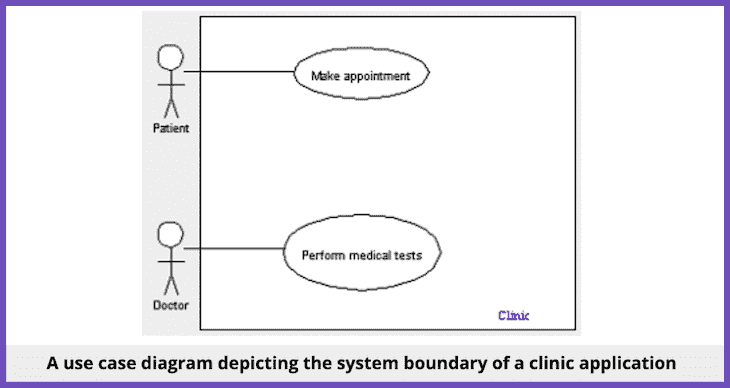
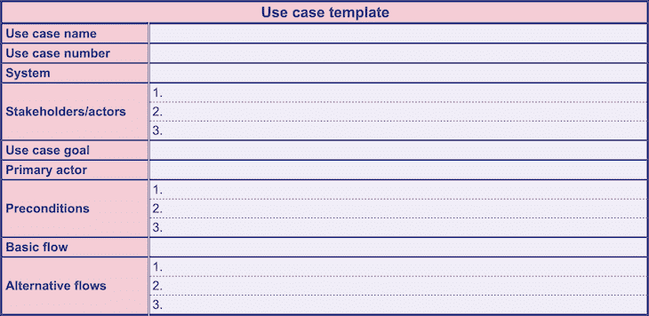

# 什么是用例？定义、模板以及如何编写模板

> 原文：<https://blog.logrocket.com/product-management/what-is-a-use-case-template-how-to-write/>

对于需求收集和高层次的涉众沟通，产品经理需要能够描述消费者将如何与系统或产品交互。这可以包括对产品用户的描述，他们如何与产品交互，以及产品的作用。

可视化表示这些信息的一个很好的方法是创建一个用例。

在本指南中，我们将定义什么是用例，描述其中的元素以及它们的设计用途，并逐步介绍如何构建用例。

我们还将查看一些用例示例，以展示它们在实践中的样子。

如果您想在阅读本文的同时编写自己的用例，这里有一个免费的[用例模板](https://docs.google.com/spreadsheets/d/1g0Q7UhI8aYHTqKCSQYJMx2A1SIJRBhcTXR0YkSBwRSo/edit?usp=sharing)。要使用模板，从顶部菜单栏选择**文件>制作副本**。

* * *

## 目录

* * *

## 什么是用例？

用例是对用户如何与系统或产品交互的描述。公司构建用例来建立成功场景、失败场景以及任何重要的变体或例外。

许多组织使用用例建模工具——例如 Miro、LucidChart 和 smart draw——来编写或可视化地表示用例。

用例在软件开发环境中经常被用来简化复杂的概念，但是它们在项目管理中对于收集需求和定义项目范围同样重要。

## 谁创建用例？

[产品管理](https://blog.logrocket.com/product-management/what-does-a-product-manager-do-role-responsibilities/)、[产品开发](https://blog.logrocket.com/product-management/what-is-product-development-lifecycle-stages-examples/)和[产品测试](https://blog.logrocket.com/product-management/what-is-alpha-testing-definition-process-examples/)领域都使用用例方法。产品经理和开发人员以类似的方式使用用例:作为一种设计工具来指定系统将如何对用户活动做出反应。然而，有一些关键的区别。

产品经理通常记录以用户为中心的用例，而开发人员记录以产品为中心的用例。以用户为中心的用例主要关注用户及其目标。然后将这些信息传递给开发人员，以指导产品开发过程中的决策。

产品开发人员经常添加技术和设计元素来提供关键的背景。这组改进的用例为开发团队提供了开始设计、创建和测试产品及其特性所需的洞察力。

## 用例设计用来做什么？

用例被设计成在过程的早期揭示系统需求。

用例集中于系统的用户，而不是系统本身。一个用户案例应该是所有涉众都能理解的，而不仅仅是开发人员和测试人员，因为他们大多是叙述性的散文。这包括客户、用户和管理人员。

在早期规划阶段，您应该让最适合解决手头问题的角色参与进来。这鼓励最终用户购买该解决方案，并减少系统投入使用后的意外情况。

每个用例都是专门设计的，只覆盖系统的一个应用。也就是说，用例建模的一个关键优势是它也涵盖了所有潜在的问题。通过识别成功场景的例外，在项目早期发现次要需求可以节省大量时间。

最后，在您创建一个用例之后，您可以使用它来指导许多其他软件开发组件的创建，例如对象模型、测试用例定义、用户文档和项目计划(成本、复杂性和进度估计)。

作为一名产品经理，创建用例的最好理由之一是它们作为真正的连接点。他们应该是真正可以被商业和技术用户理解的，这样每个人都可以评论他们。

业务分析师利用用例作为交流工具，让人们采取共同的方法，并分享对软件目标的共同理解。

另一方面，技术产品经理可能会使用用例来接触业务利益相关者，而不使用技术术语——更多地谈论系统做什么，而不是它如何做。当你开始做编码的脏活时，这将真正帮助你加速和澄清沟通，以确保你建立的是企业真正需要和渴望的东西。

## 用例的元素

让我们分解一个典型使用案例的组件，并解释每个组件的用途和目标:

### 演员

参与者是与您的系统交互的人或事物。行动者可以是个人、公司、团队，或者完全是别的什么东西。任何存在于系统之外，并与系统进行某种互动的事物都可以被称为参与者。

使用您的系统通过交互来实现目标的涉众被称为主要参与者。

* * *

订阅我们的产品管理简讯
将此类文章发送到您的收件箱

* * *

### 系统

你的系统，有些人称之为场景，由你的演员做出的许多决定和互动组成。

### 目标

演员与系统互动的结果就是你的目标。

您的系统可能在某些情况下会产生多个输出，而在其他情况下只会产生一个输出。在继续之前，如果你在实现目标的过程中遇到任何障碍，考虑修改你的方法。

### 前提

前提条件是关于在用例之前和之后必须发生什么的断言或现实。

通常，软件开发人员知道下一个动作必须在下一个动作之前。

例如，让我们说一个在线购物者点击一个产品来获得详细的描述和客户反馈。**添加到购物车**按钮不会显示，直到商品有库存并且可以在仓库中使用。

### 基本流程

一个在运行中没有异常或错误的、完美的、完全按照预期运行的用例被称为基本流程或主要成功场景。这通常是开发各种功能的起点。

了解一个典型的场景是如何操作的，可以帮助您编写准确的代码，并提出可供选择的流程。

### 替代流程

与主要成功场景的偏离被称为备选路径或备选流程。这通常在发生系统级错误时表现出来。

在用例的这一部分，您经常会列出一个参与者最有可能或者最值得注意的异常。电子商务示例中的备选流程可能包括:

*   将商品添加到收藏夹，而不是购物车
*   与朋友或家人分享物品
*   查看关于产品或服务的评论和意见

## 用例图看起来像什么？

在用例图中，简笔画是描绘**参与者**的最典型方式。

您创建的**用例/目标**将是水平椭圆，里面有几个字的文本，详细说明每个活动；你可以用不同的颜色来表示不同的目标。

描述组件之间连接的关联使用实线和虚线。

一个**系统**中的每一组用例通过**系统边界框**组合在一起，边界框是矩形的。

医疗诊所应用程序的用例图可能如下所示:

## 如何编写用例

要编写用例，请完成以下步骤:

1.  确定产品的目标受众
2.  从列表中选择一个用户
3.  准确地确定用户想对产品做什么，并为每个动作创建一个单独的用例
4.  当用户使用产品时，确定每个用例的典型事件流
5.  在用例描述中，描述基础课程。举例说明用户做了什么，系统回应了什么，让用户知道这两者
6.  一旦基本过程被提出，考虑可选择的行动过程并包括它们来“扩展”用例
7.  搜索用例之间的联系。提取这些并标记为课程的典型用例
8.  对所有其他用户重复步骤 2–7

## 用例模板

您可以使用下面的[模板](https://docs.google.com/spreadsheets/d/1g0Q7UhI8aYHTqKCSQYJMx2A1SIJRBhcTXR0YkSBwRSo/edit#gid=0)来帮助您编写自己的用例:

[Click here to access this use case template](https://docs.google.com/spreadsheets/d/1g0Q7UhI8aYHTqKCSQYJMx2A1SIJRBhcTXR0YkSBwRSo/edit#gid=0) (File > Make a copy).

要使用这个[用例模板](https://docs.google.com/spreadsheets/d/1g0Q7UhI8aYHTqKCSQYJMx2A1SIJRBhcTXR0YkSBwRSo/edit#gid=0)，点击[这里](https://docs.google.com/spreadsheets/d/1g0Q7UhI8aYHTqKCSQYJMx2A1SIJRBhcTXR0YkSBwRSo/edit#gid=0)并通过从顶部菜单栏选择**文件>制作副本**来制作副本。

## 用例示例

为了展示上面概述的步骤在实践中是如何工作的，让我们来看一个管家洗衣服的示例用例:

*   **演员** —住户、管家等。
*   **主要演员** —管家
*   **目标**——洗衣服，折叠所有物品，必要时熨烫衣服
*   前提条件 —今天是星期五，洗衣房里有衣服要洗

该用例示例的**基本流程**如下:

女管家星期五来到洗衣房。他们整理可用的衣物。之后，他们会清洗并烘干每一件衣物。他们折叠需要折叠的物品，然后熨烫和悬挂起皱的物品

**替代流程**:

*   管家在把有褶皱的物品挂在衣架上之前会先熨一下
*   管家把她发现的任何脏东西都重新洗了一遍

## 摘要

用例帮助产品团队从不同用户的角度理解系统的功能。它们帮助组织中的涉众直观地理解各种流程以及用户组如何与系统交互。

当产生概念和评估用例的可行性时，用例也支持开发团队。用例定义是软件开发过程中的一个关键阶段，也是任何产品经理的一项关键技能。

*精选图片来源:[icon scout](https://iconscout.com/icon/file-3250251)*

## [LogRocket](https://lp.logrocket.com/blg/pm-signup) 产生产品见解，从而导致有意义的行动

[LogRocket](https://lp.logrocket.com/blg/pm-signup) 确定用户体验中的摩擦点，以便您能够做出明智的产品和设计变更决策，从而实现您的目标。

使用 LogRocket，您可以[了解影响您产品的问题的范围](https://logrocket.com/for/analytics-for-web-applications)，并优先考虑需要做出的更改。LogRocket 简化了工作流程，允许工程和设计团队使用与您相同的[数据进行工作](https://logrocket.com/for/web-analytics-solutions)，消除了对需要做什么的困惑。

让你的团队步调一致——今天就试试 [LogRocket](https://lp.logrocket.com/blg/pm-signup) 。

[Advait Lad Follow](https://blog.logrocket.com/author/advaitlad/) Graduate Student @ UC Berkeley (Product Management) | Product enthusiast who loves to talk about features and workflows that drive people toward products.