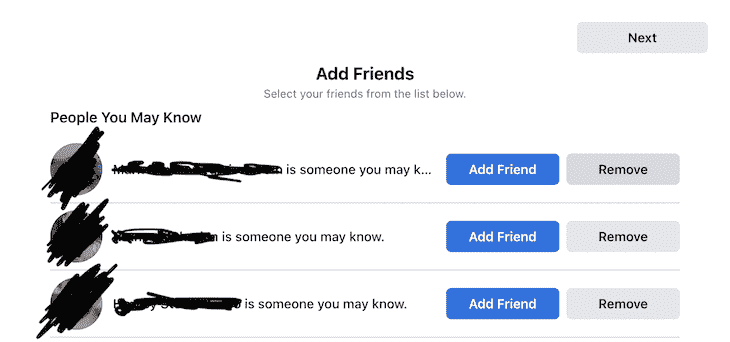
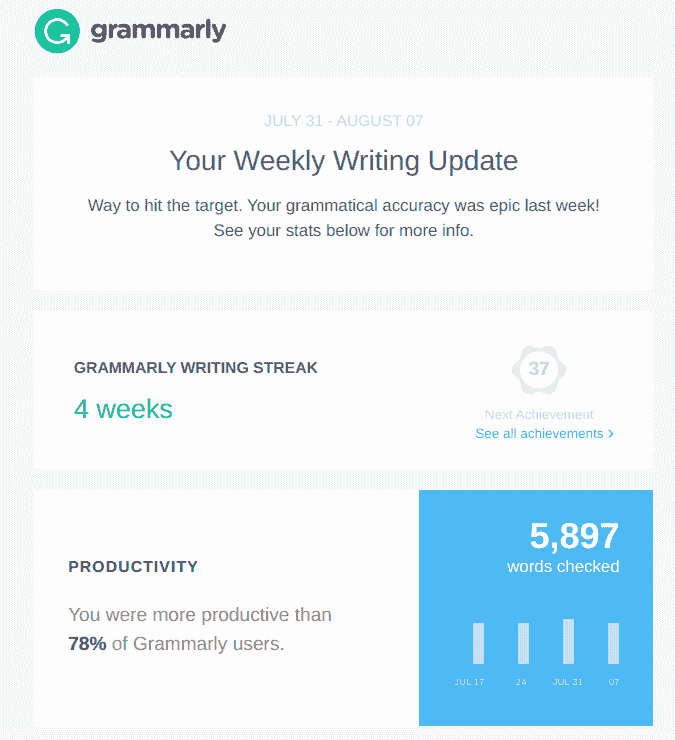

# 什么是 AARRR(又名盗版度量)框架？

> 原文：<https://blog.logrocket.com/product-management/what-is-aarrr-pirate-metrics-framework/>

人们很容易陷入虚荣心的衡量标准中——这些数字看起来很棒，但并没有转化为任何有意义的商业活动。

例如，你可能在 Instagram 帖子上获得 10，000 个赞，但这不一定意味着你实现了 10，000 次销售。当然，你的帖子在社交媒体上的参与度确实很重要，但这不是最重要的衡量标准。

虚荣心指标倾向于描绘客户生命周期的有限画面。AARRR metrics 也称为 pirate metrics 专注于生命周期的每个阶段，以帮助您获得对消费者的可行见解，识别瓶颈，并创造可持续增长。

AARRR 代表:

*   获得物ˌ获得
*   激活
*   保留
*   介绍
*   收入

在本指南中，我们将探讨这些指标如何帮助您构建优化的转化漏斗，创造客户喜爱、反复使用并推荐给其他潜在客户的产品。

* * *

## 目录

* * *

## 什么是 AARRR？

当正确使用[产品指标](https://blog.logrocket.com/product-management/what-product-management-metrics-matter-most-to-pms/)时，公司可以了解哪里出了问题，哪里做得对，以及为什么会发生这种情况。然而，寻找有意义的数据是一项艰巨的工作。

尽管 [AARRR](https://blog.logrocket.com/product-management/what-metrics-kpis-product-managers-track/#what-are-aarrr-priate-metrics) 的设计是为了支持增长，但每一步都有自己的虚荣心衡量标准。作为产品经理，您需要实施*可操作的*指标，以全面了解您的产品套件发生了什么。

让我们进一步分析一下 AARRR，看看产品经理在每一步都能发现什么:

*   **收购***——*用户如何找到你？
*   **激活***——*用户是否有很棒的第一印象或体验？
*   **留存** —用户回来了吗？
*   **推荐***——*用户会把产品告诉其他人吗？
*   **收入***——*你怎么赚钱？

将客户生命周期划分为五个阶段，可以更清晰地了解哪里有改进的空间。

### AARRR 为什么叫盗版度量？

AARRR 指标有时被称为盗版指标，因为如果你大声说出首字母缩写词，它听起来就像臭名昭著的盗版短语，“ARRR，伙计！”

## 谁创造了 AARRR，为什么？

AARRR 是由 Dave McClure 创建的，他是 500 家创业公司的创始人。在他注意到许多初创公司专注于错误的增长指标后，他引入了这个框架。

AARRR 框架旨在有效地分解客户生命周期的每个阶段，并在漏斗中进行必要的改进。

即使 McClure 在 2007 年引入了 AARRR 指标，它仍然是一个受欢迎的[管理框架](https://blog.logrocket.com/product-management/6-product-management-frameworks-you-should-know/)，因为它能够跟踪客户的旅程并衡量每个阶段的成功。

## 如何为产品导向的增长实施 AARRR 框架

一旦[确定了测量](https://blog.logrocket.com/product-management/what-are-okrs-how-to-write-templates-examples/)的正确指标，实现 AARRR 框架就很容易了。然后，您可以设置流程来跟踪和分析用户行为和其他 AARRR 指标。

分析 AARRR 指标可以帮助您识别每个客户生命周期阶段的更好方法和改进产品的新方法。

让我们来分解一下每个阶段的工作原理:

### 获得物ˌ获得

获取指的是找出你的客户来自哪里。一些组织通过增加一个认知阶段来发现人们是如何知道一个产品的存在的，从而进一步分解了这一点。

本质上，这个阶段围绕着你的[营销渠道](https://blog.logrocket.com/product-management/product-marketing-manager-job-description-role-skills/)。你可能会使用多种平台和策略，如社交媒体、联盟营销和搜索引擎优化，来获得新客户和提高品牌知名度。

人们很容易陷入诸如一篇帖子在社交媒体上被分享了多少次或一个应用程序被下载了多少次之类的事情。你不应该关注这些虚荣心指标，而应该通过问这样的问题来衡量什么能带来最好的投资回报:

*   哪个营销渠道拥有最多的潜在客户？
*   哪种营销渠道获得新客户的成本最低？
*   每个渠道的每次采购成本是多少？
*   哪种营销渠道导致的转化最多？
*   我理想中的观众在用这个频道吗？

通过确定哪个渠道可以帮助您获得最大的吸引力，您可以将更多的营销工作集中在几个高性能的渠道上，而不是分散在多个投资回报率很低的渠道上。

### 激活

激活是指当一个人成为活跃用户。例如，用户可能下载了一个应用程序，但如果他们不再使用它，他们就没有被激活。

虽然推动流量很重要，但你也应该进行许多 A/B 测试和登录页面测试，以确定什么能带来最好的转换结果。

跟踪用户行为来确定[是什么让用户对产品](https://docs.logrocket.com/docs/positive-insights)做出承诺也是一个好主意。例如，您可能会注意到成功转换的用户首先会在网站的帮助部分花费更多时间。这可能表明您的登录页面缺少有价值的信息，您需要重新构建它。

在激活阶段，用户需要一个啊哈时刻——当用户意识到产品对他们有意义的价值并让他们想回来的时刻。例如，您可能希望创建一个快速的入职流程，以便用户可以更快地获得您产品的主要组件并实现其价值。

脸书在入职流程中增加了一个功能，让新用户可以下载他们的电子邮件联系人，从而更容易找到朋友。这对脸书啊哈时刻至关重要——没有你的朋友，你可能没有理由再次使用脸书。

### 保留

为了防止流失，你需要一个好的保留策略。除了创造有价值的产品，与客户保持联系也很重要。

自动发送电子邮件是一种简单的保留策略。您可以创建电子邮件活动，在注册活动三天、七天或 30 天后自动发送。这可以帮助提醒您的客户您的产品，如何使用它，以及其他值得注意的公告。

例如，Grammarly 每周发送个性化电子邮件来分享用户的写作统计数据，如他们最常见的写作错误和准确性水平。这些电子邮件活动展示了语法是多么有用，同时也确保用户记得他们下载了语法。

### 介绍

口碑是发展你品牌的最佳途径之一。许多消费者相信家人、朋友，甚至是写谷歌评论的陌生人的推荐。

* * *

订阅我们的产品管理简讯
将此类文章发送到您的收件箱

* * *

当你有客户在使用你的产品，并有愉快的体验时，你应该鼓励他们向其他人推荐你的产品。推荐构成了一个免费的客户获取策略，你的公司可以从为用户提供一个简单的方法来推荐你的产品中获益。

有很多方法可以整合推荐策略。这里有几个例子:

*   当用户推荐的人注册了该产品，用户就会收到现金奖励
*   举办一场社交媒体竞赛，并获得赠品，包括标记朋友或在他们的个人资料上分享帖子
*   要求用户写评论

另一种策略是使用[净推介值](https://www.netpromoter.com/know/)。NPS 通过问用户一个问题来衡量客户忠诚度:“在 1-10 的范围内，你向朋友推荐我们的可能性有多大？”

你可能还想跟进客户，询问他们为什么这样评价你。

### 收入

虽然客户满意度至关重要，但产品经理也必须关注收入。如果一个功能或产品不能为公司赚钱，那么它可能是有害的。

收入阶段有两个重要指标。首先是客户终身价值。这种计算方法决定了客户在一生中为产品支付的金额。

接下来，您需要计算客户获取成本。这是你获得一个新客户所花的钱。

目标是在增加客户终身价值的同时降低客户获取成本。这有助于确保你获得足够的收入来维持增长。

## 最后的想法

作为产品经理，你需要深入了解你的客户才能成功。AARRR 指标为客户在客户生命周期的每个阶段所做的事情提供了可操作的见解。然而，AARRR 指标很少是一次性完成的任务。

Dave McClure 建议[经常进行 A/B 测试来衡量转化率的提高](https://www.slideshare.net/dmc500hats/startup-metrics-for-pirates-long-version)。他还建议尽可能深入地分析你的营销。这意味着超越登录页面，找到有意义的见解。

盗版指标帮助您与客户建立关系，并确定他们为什么喜欢(以及为什么不喜欢)您的产品。提供会话回放、产品分析和性能监控等功能的工具可以帮助您深入了解客户及其需求和行为。

借助合适的指标和分析软件，您可以创建一个优化的转化漏斗。

*精选图片来源:[icon scout](https://iconscout.com/icon/graph-1567975)*

## [LogRocket](https://lp.logrocket.com/blg/pm-signup) 产生产品见解，从而导致有意义的行动

[LogRocket](https://lp.logrocket.com/blg/pm-signup) 确定用户体验中的摩擦点，以便您能够做出明智的产品和设计变更决策，从而实现您的目标。

使用 LogRocket，您可以[了解影响您产品的问题的范围](https://logrocket.com/for/analytics-for-web-applications)，并优先考虑需要做出的更改。LogRocket 简化了工作流程，允许工程和设计团队使用与您相同的[数据进行工作](https://logrocket.com/for/web-analytics-solutions)，消除了对需要做什么的困惑。

让你的团队步调一致——今天就试试 [LogRocket](https://lp.logrocket.com/blg/pm-signup) 。

[Sara Nguyen Follow](https://blog.logrocket.com/author/saranguyen/) My greatest career achievement was when I was recognized as "GIF Master" for my GIFs in the company Slack channel. A close second is that I've written over 600,000 words in the past two years.