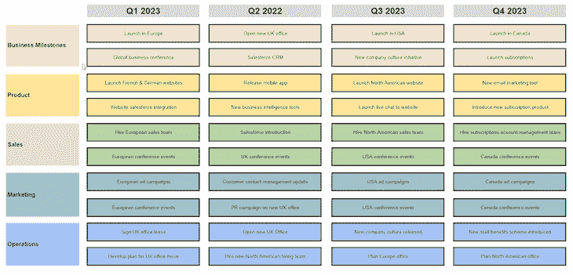
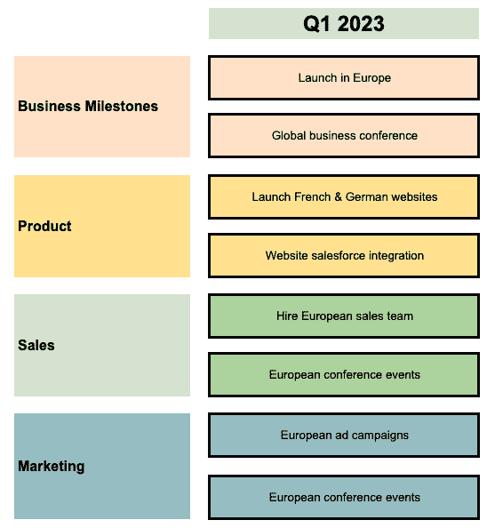

# 什么是商业路线图以及如何创建一个商业路线图的例子

> 原文：<https://blog.logrocket.com/product-management/what-is-business-roadmap-how-to-create-examples/>

如果您在软件开发领域工作，那么您几乎肯定听说过产品路线图——帮助向内部团队和外部利益相关者传达产品方向和进度的文档。

产品路线图显示了将要交付的高级特性，以及大致的顺序和时间框架。它也有助于与不同群体就可能发生的事情以及何时发生的事情进行沟通，而不需要给出太多关于如何进行的细节。

这个愿景支持组织开发产品。同样重要的是，它确保各方都知道产品的方向，这样他们就可以根据这些特性来调整活动。

然而，尽管你可能已经看到了[产品路线图](https://blog.logrocket.com/product-management/how-to-build-product-roadmap-overview-examples/)，但并不是每个组织都有业务路线图。这个文档是什么，它包括什么，你怎么知道你是否需要一个业务路线图？

* * *

## 目录

* * *

## 什么是商业路线图？

与产品路线图一样，业务路线图旨在促进与各种利益相关者团体就业务方向和实现业务目标的行动计划进行沟通。

业务路线图是组织希望实现的目标以及实现顺序的高级可视化。这实际上代表了众所周知的大图景。

业务路线图应该给组织和其中的每个人一个中短期业务目标的大致轮廓。这允许相关的涉众做出适当的业务决策，支持路线图中项目的[交付。](https://blog.logrocket.com/product-management/product-roadmap-tools-best-features-free-paid/)

## 业务计划与业务路线图

我知道你在想什么:商业路线图不就是一个商业计划吗？简单的回答是没有。

商业计划和商业路线图的根本区别在于细节的粒度。商业路线图是比商业计划更高层次的概述，商业计划更加精确和全面。

例如:

*   一份**业务路线图**可能会说，今年在 Q1，我们希望扩大欧洲的销售团队
*   一份**商业计划**可能会说，今年在 Q1，我们计划花费 10 万美元在法国雇佣两个人，花费 10 万美元在德国雇佣两个人，花费 10 万美元雇佣一名欧洲销售经理。这些人都需要销售材料、电话等。

这种深度上的变化意味着任何人在看业务路线图时都会知道结果是什么，但不知道业务打算如何实现。阅读商业计划的人应该理解商业计划的每个步骤。

这里有一个商业计划的例子:

商业路线图的一个例子

当你更深入地研究商业计划时，你还会发现它涵盖了市场分析、[销售和营销计划](https://blog.logrocket.com/product-management/product-marketing-manager-job-description-role-skills/)、设备需求和详细的财务状况等方面。这提供了业务计划如何在中短期内运作的完整、详细的视图，这是您无法从业务路线图中获得的。

这更像是“我们将搬进一个新的办公室”，而不是“我们将为租金支付 X，为新的办公设备支付 Y，为邮件的重定向支付 Z…”

## 如何创建业务路线图

当创建业务路线图时，重要的是要考虑到，尽管它们以相对较高的水平呈现未来的活动，但它们确实需要相当大的努力来产生。

与任何[路线图](https://blog.logrocket.com/product-management/agile-roadmaps-examples-how-to-create/)一样，需要理解来自整个组织的输入和优先级，并将这些整合到一个一致的愿景中。这意味着采取以下步骤:

### 制定业务目标

从头开始:你希望实现什么？

你的目标应该是[独立的、可实现的目标](https://blog.logrocket.com/product-management/what-are-okrs-how-to-write-templates-examples/)，组织中的每个人都能清楚地理解。

在上述示例业务路线图中，路线图的第一行着眼于业务的高级别主要目标，例如，在新市场(欧洲、美国和加拿大)开展业务，以及迁移英国办事处。

从这些目标出发，企业中的各种功能可以决定他们在通往成功的旅程中各自的里程碑。

### 识别业务能力

一旦你确立了你的目标，下一步就是确定什么已经到位来帮助你实现它们。

问自己这样的问题:

*   目前的结构中有哪些支持你的目标？
*   有团队有能力实现它们吗？
*   他们拥有成功所需的知识吗？
*   他们有足够的资金吗？
*   在追求目标的过程中，有哪些可用的工具？

### 确定业务限制

业务能力的另一面是业务限制:

*   支持你的目标所需的当前组织中不存在的是什么？
*   你的团队缺少什么关键技能？
*   哪里需要新的资金来源来实现你的目标？

### 确定有助于实现目标的活动

要考虑的最后一个方面是，为了实现你的目标，需要进行哪些活动。例如:

*   团队必须完成哪些具体任务来驱动用户行为？
*   需要采取什么措施来解决或弥补上一步中发现的任何限制？

### 制定路线图大纲

一旦这一过程完成，旨在推动业务向其目标发展的活动就开始了。有必要将这些任务按某种顺序组织起来。这就是业务路线图的由来。

让我们看一个例子。如果在 Q2，我们计划实现 X，我们不同业务领域的哪些活动需要在 Q1 和 Q2 进行才能实现？这些是我们业务路线图的组成部分。

每个模块都代表了该业务领域的一个可实现的里程碑，清楚地定义了他们在该时间点期望实现的目标。

## 要避免的常见错误

如果你是商业路线图的新手，在你第一次尝试创建一个商业路线图的时候，你肯定会到处碰壁。这需要练习。

* * *

订阅我们的产品管理简讯
将此类文章发送到您的收件箱

* * *

然而，企业会犯的一些常见错误包括:

### 没有明确定义业务目标

如果没有一个清晰的总体业务愿景，就不可能深入到各个业务领域并设定部门里程碑。一个不明确的目标会导致行动混乱，在前进时缺乏焦点。

### 设定太多目标

当看到业务路线图中考虑的长时间周期时，很容易认为你可以完成大量的工作。然而，因为商业目标通常规模很大，你能实际完成的活动数量相对较少。

太多的目标会导致沮丧，因为你的团队永远无法实现他们设定的目标。

### 设定不切实际的时间表

不切实际的时间表做出了无效的假设，即你可以完成比你认为我们能完成的更多的活动。

路线图是您的里程碑的高级可视化，但是当涉及到交付这些目标所需的工作时，路线图条目只是冰山一角。有时候大事需要时间。

### 没有得到业务或客户的认可

如果不是每个人都参与进来，那么创建路线图又有什么意义呢？如果你刚进入第一个月，就有人举起手问:“为什么我们不做 X？”那么创建一个看起来很漂亮的路线图就没有价值了

## 业务路线图示例(模板)

如果我们看一下上面描述的[示例业务路线图](https://docs.google.com/spreadsheets/d/16fcwJtFr19aBYUYRQSVg-hqX6hv_PpHvdYlmvV3aDiI/edit?usp=sharing)，第三季度的业务目标之一是在美国推出我们的服务。这一业务的主要目标将推动我们各个业务领域的业务路线图条目。

销售人员需要了解我们目前在美国的能力，以及可能限制我们实现这一目标的因素。然后，它必须制定一些部门目标，帮助企业朝着其总体目标前进。这将为我们留下一些路线图条目，例如:

*   在 Q2 雇佣新的销售团队
*   在第三季度推出服务

财务部需要了解美国的公司组建和财务报告规则，以及如何为启动融资，这将导致路线图条目，例如:

*   成立一家美国公司
*   确保美国的运营资金

运营部门需要确定我们需要完成哪些工作来支持美国招聘并获得办公室、设备、材料等。针对运营团队的路线图条目可能包括以下内容:

*   雇佣一支北美团队
*   来源北美 IT 设备

### 业务路线图模板

要访问上述业务路线图示例的完整版本，[请点击此链接](https://docs.google.com/spreadsheets/d/16fcwJtFr19aBYUYRQSVg-hqX6hv_PpHvdYlmvV3aDiI/edit#gid=0)。如果您想在创建自己的业务路线图时将其用作[模板](https://docs.google.com/spreadsheets/d/16fcwJtFr19aBYUYRQSVg-hqX6hv_PpHvdYlmvV3aDiI/edit#gid=0)，请点击链接下载该文件，并从电子表格顶部的菜单中选择**文件>制作副本**。

## 从你的商业路线图开始

尽管创建业务路线图需要付出相当大的努力，但这份文档对于支持业务的成功运营是必不可少的。

精心设计的路线图所提供的愿景为整个组织提供了焦点和支持，并确保业务的所有领域都朝着同一个目标前进。

归根结底，这就是我们想要的:一条通往成功的道路。

*精选图片来源:[icon scout](https://iconscout.com/icon/location-pins-1640895)*

## [LogRocket](https://lp.logrocket.com/blg/pm-signup) 产生产品见解，从而导致有意义的行动

[LogRocket](https://lp.logrocket.com/blg/pm-signup) 确定用户体验中的摩擦点，以便您能够做出明智的产品和设计变更决策，从而实现您的目标。

使用 LogRocket，您可以[了解影响您产品的问题的范围](https://logrocket.com/for/analytics-for-web-applications)，并优先考虑需要做出的更改。LogRocket 简化了工作流程，允许工程和设计团队使用与您相同的[数据进行工作](https://logrocket.com/for/web-analytics-solutions)，消除了对需要做什么的困惑。

让你的团队步调一致——今天就试试 [LogRocket](https://lp.logrocket.com/blg/pm-signup) 。