# 什么是竞争分析？模板、示例和操作方法博客

> 原文：<https://blog.logrocket.com/product-management/what-is-competitive-analysis-template-examples-tutorial/>

在这份全面的指南中，我们将定义什么是竞争分析，描述产品团队从进行竞争分析中获得的好处，并介绍如何进行竞争分析的步骤。

在本教程中，我们将通过例子来展示竞争分析的每一步在实践中是如何进行的。我们还将提供一个可定制的免费竞争分析模板列表，供您在自己完成这些步骤时使用。

* * *

## 目录

* * *

## 竞争分析完全指南

想象一下:你刚刚提出了下一个颠覆性的、改变游戏规则的、人工智能驱动的电子商务市场。目标是连接买家和卖家，以满足他们量身定制的产品需求。

你有信心你的产品将在市场上与 Etsy 和其他大公司竞争。你做了一些市场和用户研究，对你的理想客户和他们(未得到充分满足的)需求有很好的了解。基于这些数据，你相信你的市场可以很快达到产品与市场的契合。

现在是你重温《孙子兵法》**的时候了。你会问，这是为什么？**

 **[*《孙子兵法》*](https://en.wikipedia.org/wiki/The_Art_of_War) 是一本中国古代军事教科书，尽管年代大约在公元前 500 年到公元前 400 年之间，却是迄今为止最有影响力的管理书籍之一。它提供了很好的战略和战术建议。此外，它提供指导，帮助您评估自己和您的竞争，以获得优势。

保持竞争优势是目标。即使你有世界上最好的产品，并且你知道它有市场，如果你不了解你的竞争对手，你注定会失败。这就是为什么你需要进行竞争分析。

正如“机器狂怒”乐队所说的，“了解你的敌人”。

## 什么是竞争分析？

竞争分析(有时称为竞争对手分析或竞争分析)正如其听起来的那样:一种识别和分析竞争对手的结构化方法。更具体地说，这是对你的竞争对手的产品、策略、优势和劣势的评估。

竞争分析有助于您回答以下问题:

*   还有哪些公司在提供与我们类似的解决方案？
*   理想客户的最低期望是什么？
*   就这些期望而言，他们目前没有从我们的产品中获得什么？
*   市场上的竞争对手 fce 有哪些壁垒？
*   我们应该避免在产品中引入什么？
*   客户愿意为我们的产品支付什么价格？
*   我们需要提供什么价值才能让我们的产品在市场上脱颖而出？
*   有哪些趋势正在发生，它们会如何改变游戏环境？

如果定期进行彻底的竞争分析，它会为您提供大量信息，可用于改进和优化您的产品。最终结果是对你的竞争对手的整体概况。

## 为什么要做竞争分析？

竞争分析是基本的产品管理工具。它有助于项目经理了解在试图获得市场份额、识别市场趋势和定位其产品供应差距时，哪些可行，哪些不可行。

竞争分析旨在帮助您避免犯错误，让您在追求产品增长和成功的过程中抢先竞争对手一步。

了解你的竞争对手会给你带来巨大的回报。进行竞争分析将更有效地帮助您:

*   创建基准
*   发现更好地为客户服务的机会
*   做出战略决策
*   确定你的定价策略
*   确定市场差距
*   确定分销和营销策略

通常，第一次创建竞争对手分析是在做市场调查的时候。这有助于你了解[产品与市场的契合度](https://blog.logrocket.com/product-management/what-is-product-market-fit-measure-examples/)，这将在你的旅程中不断发展。

作为一名产品经理，您的职责不是分析您的竞争对手展示自己的能力。你的工作是让产品符合客户的需求。了解竞争对手的能力、定价和[产品定位](https://blog.logrocket.com/product-management/what-is-product-positioning-examples-strategies-template/)有助于您实现这一目标。

请记住，你的竞争对手可能会展示自己，让自己看起来比实际情况更好。你可以获得大量关于他们的信息，但是你应该对这些信息持保留态度。

## 如何进行竞争分析

竞争分析没有单一的方法。一般来说，竞争分析由三个基本部分组成:

1.  竞争对手的候选名单
2.  一场[竞争对手的深潜](#do-a-deep-dive-on-each-competitor)
3.  整体概述和战略

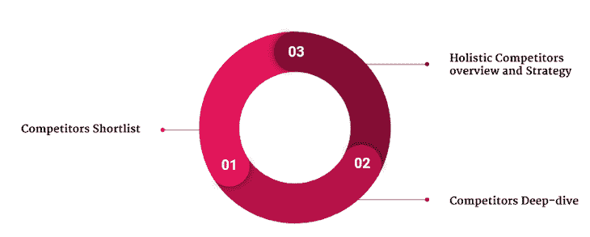

为了演示如何进行竞争对手分析，我们将回头参考引言中概述的例子。

请记住，在我们的例子中，我们希望用人工智能支持的电子商务市场应用程序来扰乱市场，帮助买家和卖家联系起来，以完成高度定制的订单。让我们称我们的创新新产品为 AGORA。

### 1.创建一份竞争对手的名单

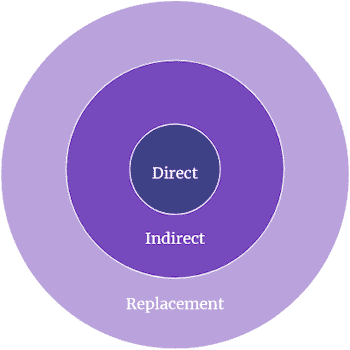

有三种类型的竞争对手:

1.  **直接** —提供相同产品的竞争对手，目标是相同的理想客户；你正在与直接竞争对手正面交锋
2.  **间接** —竞争对手要么提供有点相似的产品，要么瞄准相同的理想客户
3.  **替代** —提供不同产品但目标客户相同的竞争对手

为了进行竞争分析，你至少需要确定你的直接和间接竞争对手。那你是怎么做到的呢？通过[向内看](#look-inward)和[痴迷地研究](#research-obsessively)。

#### 向内看

为了弄清楚谁是你的直接和间接竞争对手，你需要先向内看，了解你的产品定位:你在为谁服务，你提供什么产品？

您可以通过使用[产品画布](https://www.romanpichler.com/tools/the-product-canvas/)进行自我评估来回答这些问题。最初由 Roman Pichler 推出的产品 canvas 后来经过了调整和改进。

产品画布的核心包括:

对于我们的示例产品，竞争分析可能如下所示:

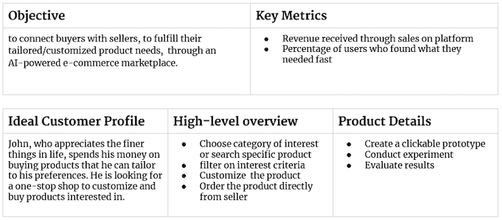

#### 痴迷地研究

使用自我评估中的关键词进行简单的谷歌搜索就能让你走得很远。其他可以帮助你识别竞争对手的资源包括 Crunchbase、Similarweb、Statista 等工具。

俗话说，顾客最清楚。如果你还没有很多客户，像 G2、Capterra、Trustpilot 和 Google Reviews 这样的评论网站可以帮助你。

如果你有顾客，去问问他们。大多数顾客在决定购买正确的产品之前会尝试和评估几种产品。没什么能阻止你问他们考虑过哪些其他品牌，以及为什么他们最终选择了你的品牌。

一旦你确定了谁是你的竞争对手，你可能会发现自己处于一个有许多直接和间接竞争对手的市场。如果是这种情况，选择大约七个最相关的竞争对手，将其纳入您的竞争对手深度调查。

### 2.深入了解每个竞争对手

从你的竞争对手名单中，选择七个最重要的，并挖掘出每一个的相关信息。

* * *

订阅我们的产品管理简讯
将此类文章发送到您的收件箱

* * *

在上一步中进行的调查将有助于您从以下类别中获取与竞争对手最相关的信息:

#### 公司简介

首先为你的每个竞争对手创建一个公司简介，以便更好地了解他们是谁。包括以下信息:

*   **名字** —你的竞争对手叫什么名字？
*   **成立日期** —公司成立于何时？它上市多久了？
*   **公司规模** —公司有多少员工？他们准备好服务市场和创新了吗？
*   **市场份额** —由竞争对手的产品控制的市场份额
*   **收入** —竞争对手从其产品中获得的收入
*   **声誉** —从一到五分，顾客对你的竞争对手的产品有什么看法？

让我们将这个框架应用到我们的 AGORA 竞争分析示例中:

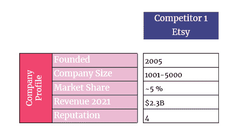

#### 理想的客户档案

了解你的竞争对手在为谁服务，谁在购买产品，这一点很重要。这不仅是为了再次确认竞争对手确实是直接(或间接)竞争对手，也是为了了解客户喜欢和不喜欢竞争对手的产品。

您正在寻找的信息包括:

*   **理想客户** —谁是竞争对手的目标客户，他们的定义是什么？
*   **动机** —客户喜欢你竞争对手产品的什么？
*   **挫折** —客户讨厌产品的什么？
*   **主要买家** —谁是产品的主要买家？是作为理想客户，还是不同的角色？

让我们看看这看起来会像我们的 AGORA 的例子。以下是 Etsy 的理想客户资料示例。首先，对买家来说:

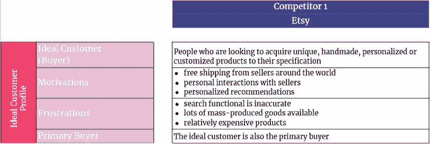

Etsy 卖家的理想客户档案:

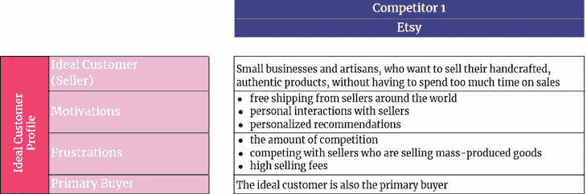

#### 产品资料

我不想表现得太明显，但你需要捕捉更多关于竞争对手提供的产品及其定位的细节。

我们在这一步寻找的信息包括:

*   **产品** —你的竞争对手用什么口号来推销其产品？
*   **定位** —根据产品的质量和价格，将产品放入几个桶中的一个。比如经济(低质低价)、撇取(低质高价)、渗透(优质低价)、溢价(优质高价)
*   **产品特性** —正在营销和推广的关键特性是什么？

参考我们的示例 AGORA 应用程序，在竞争对手分析中与 Etsy 相关的产品信息可能如下所示:

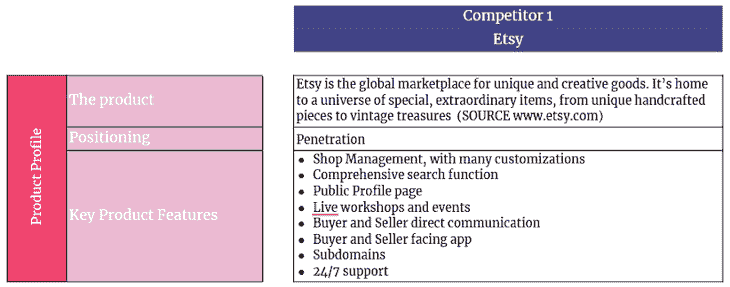

#### 市场方法

接下来，设法了解你的竞争对手如何将产品推向市场。

列出以下信息:

*   **定价** —产品的成本是多少？如果有分层定价模式，它是什么样的？
*   **分销渠道** —你的竞争对手通过哪些渠道销售产品？
*   **营销渠道** —产品通过哪些渠道进行推广？

在我们的 AGORA 竞争对手分析示例中，该部分类似于:

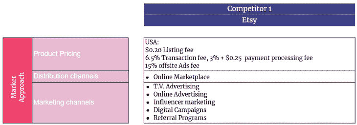

#### 情势分析

有了你收集的所有信息，你会发现自己处于一个做 [SWOT 分析](https://en.wikipedia.org/wiki/SWOT_analysis)的好位置。这是最常见和最流行的竞争分析框架之一。

SWOT 代表优势、劣势、机会和威胁:

*   **优势** —竞争对手的优势是什么？
*   **弱点** —什么不顺利？有哪些明显的瑕疵？
*   **机会**——什么能给你的竞争对手带来优势？
*   **威胁** —什么可能会损害竞争对手的产品？

对于 AGORA，我们的示例竞争分析可能包括如下所示的 SWOT 分析:

### 3.制定整体概述和战略

现在你对你的竞争对手有了更好的了解，是时候决定你想如何在市场上接近他们了:你想避开你的竞争对手还是攻击他们？

两个非常有用的工具可以帮助你进行评估，它们是[竞争矩阵](#competitive-matrix)和[战斗卡片](#battle-cards)。

#### 竞争矩阵

将您在竞争分析中收集的数据付诸实施的一种方法是绘制一个四象限竞争矩阵。

定义 x 轴和 y 轴的关键因素，并相应地绘制出你自己和你的竞争对手，看看你的情况如何。这种方法也称为感知映射。

我们示例中的竞争矩阵如下所示:

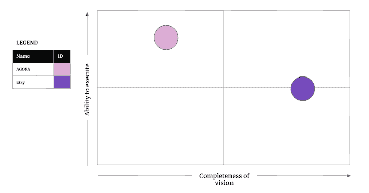

#### 战斗卡片

您可以使用四象限竞争矩阵和竞争对手洞察为您的每个竞争对手制作战斗卡片。

战斗卡是一种视觉辅助工具，可以帮助你一目了然地将自己的产品与竞争对手的产品进行比较。这是一种快速简便的方法，可以了解您在性能和价值的关键领域的表现。这也是帮助销售人员与客户交谈的一种巧妙方式。

以下是你应该在每张战斗卡上包括的内容:

*   **公司名称** —您的竞争对手的名称
*   **力量**——是什么让这个竞争者脱颖而出？
*   **我们如何赢得** —我们应该做些什么来获得相对于竞争对手的竞争优势？
*   **为什么我们会失去** —这个竞争对手更擅长什么？为了不失去市场份额，我们应该避免什么？
*   **定价** —竞争对手的产品对我们的市场份额有多大威胁(低、中、高)？
*   **策略** —我们应该攻击还是避开这个竞争对手？

我们的示例竞争分析的战斗卡可能如下所示:

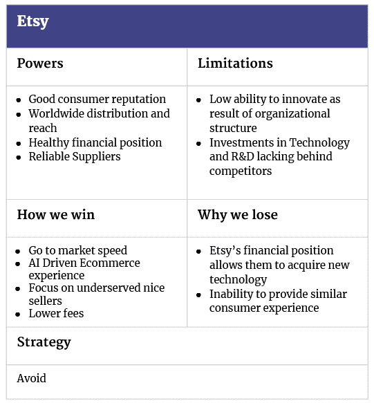

## 备选竞争分析框架

如果你遵循了上面描述的框架，你应该对你的竞争对手、你的产品机会以及在市场上攻击或避开你的竞争对手的最佳策略有深刻的了解。

如果你想深入了解，你可以通过制作[五种力量分析](#the-five-forces-model)和/或[客户旅程图](#customer-journey-map)来跟进你的竞争分析。

### 五力模型

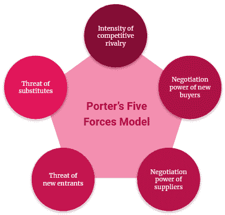

你可能还想考虑更多地了解你所在市场的竞争结构，换句话说，更好地理解进入市场或被竞争对手取代的难易程度。

用于这种竞争对手分析的一个很好的框架是最初由迈克尔·波特构思的[五种力量模型](https://www.isc.hbs.edu/strategy/business-strategy/Pages/the-five-forces.aspx)。

根据五种力量模型，您可以通过以下方式评估您所处的市场:

1.  竞争的激烈程度
2.  新买家的谈判能力
3.  供应商的谈判能力
4.  新进入者的威胁
5.  替代品的威胁

### 客户旅程图

除了缩小，你还可以放大理想客户在与产品本身、分销或营销渠道互动时的旅程。

在旅程图上，你的接触点是客户、执行的活动、客户如何体验活动以及他们的期望。

## 免费竞争分析模板

竞争分析是一份不断更新的文件，其中包含有关您最重要的竞争对手的信息，以帮助您确定如何在目标市场上接近他们。

本文中描述的竞争分析模型包括三个步骤，旨在产生您需要的洞察力，以便一劳永逸地统治市场。

下面是针对本文中描述的流程的每个步骤的免费、可定制的竞争分析模板:

***注*** :要使用和定制上面的竞争分析模板，打开后在主菜单中选择 ***文件>复制*** *。*

*精选图片来源:[icon scout](https://iconscout.com/icon/trophy-2666504)*

## [LogRocket](https://lp.logrocket.com/blg/pm-signup) 产生产品见解，从而导致有意义的行动

[LogRocket](https://lp.logrocket.com/blg/pm-signup) 确定用户体验中的摩擦点，以便您能够做出明智的产品和设计变更决策，从而实现您的目标。

使用 LogRocket，您可以[了解影响您产品的问题的范围](https://logrocket.com/for/analytics-for-web-applications)，并优先考虑需要做出的更改。LogRocket 简化了工作流程，允许工程和设计团队使用与您相同的[数据进行工作](https://logrocket.com/for/web-analytics-solutions)，消除了对需要做什么的困惑。

让你的团队步调一致——今天就试试 [LogRocket](https://lp.logrocket.com/blg/pm-signup) 。

[Klaas Hermans Follow](https://blog.logrocket.com/author/klaashermans/) Lifetime in digital and innovation, ensuring value delivery. I enjoy energizing and motivating teams that create and exceed product expectations.**