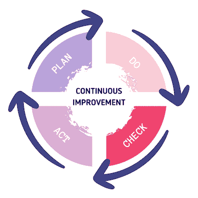

# 什么是持续改进？流程、示例、方法

> 原文：<https://blog.logrocket.com/product-management/what-is-continuous-improvement-process-methodologies/>

我所见过的关于 scrum 的最好的定义之一是，优秀的 scrum 团队在每一次冲刺中都成为他们自己的更好的版本。我爱上了这句话，并从那时起努力寻找帮助团队发展的方法。

遗憾的是，我经常观察到与持续改进完全不同的东西。

许多团队不堪重负，因为他们受到来自业务的不可持续的压力，要交付超过他们可能的能力。不出所料，他们关注的是产量最大化，而不是改进他们的流程。

没有持续的改进，scrum 团队无法超越普通的结果。

在本指南中，我将分享我所学到的关于持续改进的知识，以及一些帮助你在团队中贯彻这一理念的技巧。

* * *

## 目录

* * *

## 什么是持续改进？

持续改进是一种交互式的方法，可以发现问题的根本原因并解决它们，使它们不再发生。

例如，丰田允许员工在出现问题时停止生产线。他们希望确保根本原因得到解决，以避免更多问题。丰田注重持续改进，结果是高质量的产品和更强大的团队。

引用一句关于持续改进的名言:

要在这个世界上成功，你必须一直改变–[萨姆·沃尔顿](https://graciousquotes.com/sam-walton/#:~:text=To%20succeed%20in%20this%20world,spending%20his%20money%20somewhere%20else.)

## 什么是计划-执行-检查-行动(PDCA)？

持续改进的经典方法被称为[计划-执行-检查-行动(PDCA)](https://en.wikipedia.org/wiki/PDCA) 。这个框架旨在帮助你有意识地发现问题，计划解决方案，实现它，并检查结果。

你不需要一个特定的时刻。每次互动都是应用持续改进的机会。

有了 scrum，许多团队认为 [sprint 回顾](https://blog.logrocket.com/product-management/how-to-run-effective-sprint-retrospectives-20-formats-ideas/)是应用持续改进的正确时机。我想说这是一个机会，但是还有很多其他的机会。

持续改进更像是一种心态，而不是一个过程。而是渴望让事情变得更好。

## 如何持续改进 scrum 流程

当团队对自己的舒适区感到恼火时，他们会成为更好的版本。他们努力不断发展，并交付更有价值的成果。然而，这种态度在被误用时会产生压力。

所有团队都有功能障碍；我还没有遇到一个完美的团队没有什么需要改进的。进化的机会总是有的。

专注是关键。当团队试图一次解决所有问题时，他们会不知所措。要实现真正的转型和可持续的持续改进，你最好一次抓住一个机会。

### 衡量持续改进的标准

我认为问题可以帮助团队识别机会。我喜欢创造衡量标准，挑战现状是否是团队所能做到的最好。让我给你举几个例子:

#### 产品积压

你的产品积压项目的平均年龄是多少？听征兆；你的物品越老，你就越像瀑布一样。

#### 周期

一个想法变成有价值的东西需要多长时间？越短越好。声音产品公司不懈地努力[减少他们的周期时间](https://blog.logrocket.com/product-management/8-ways-to-reduce-cycle-time/)，这使他们能够更快地创造价值。

#### 放时间

你的团队[多久发布一次变更](https://blog.logrocket.com/product-management/what-is-change-management-process-guide/)，需要多长时间？花的时间越长，学的越慢。最先进的团队一天发布几次变更。

#### 在制品

你的团队成员完成任务需要多长时间？长时间的 WIP 意味着你要么有依赖，不熟练的专业人员，或者项目太大。

无论哪种方式，你都有很多机会减少在制品并更快地交付价值。

#### 吞吐量

你的团队每个周期能生产多少？这个指标可能很棘手，因为它会误导团队。你不希望你的团队[仅仅为了它而创造更多的特性](https://blog.logrocket.com/product-management/what-is-feature-creep-how-to-avoid/)，但是你确实希望他们以可持续的速度交付，使你能够从最终用户那里学习。

### 如何谈论度量标准

以上指标只是帮助您发现持续改进机会的示例。你可以根据你的场景定义更多。

> “被衡量的东西会得到改进。”–[彼得·德鲁克](https://www.thehrdirector.com/features/big-data/what-gets-measured-gets-improved/#:~:text=This%20was%20recognised%20by%20the,it%20all%20to%20inform%20decisions.)

单靠度量是不够的。一个常见的错误是创建指标而不谈论它们。

每周至少查看一次指标并与您的团队讨论它们是一个很好的实践。以下是我喜欢问的一些问题:

*   我们现在能改变什么，将来会有回报？
*   我们对哪个指标不满意，我们如何改变这种情况？
*   我们如何加快我们的学习时间？

你问的问题越多，你创造的机会就越多。

* * *

订阅我们的产品管理简讯
将此类文章发送到您的收件箱

* * *

## 谁负责持续改进？

谁负责 scrum 中的持续改进？如果你把它当作一个过程，你可能会认为它会落到 scrum 大师的头上。但如果你问我，持续改进最好被当作一种心态，而不是一个过程。

所有的 scrum 团队成员每天都有机会将持续改进应用到他们的活动中。而是寻找机会做得更好。

以下建议适用于所有 scrum 团队成员:

*   每天都是做得更好的新机会
*   不要逃避问题；对它们保持好奇，努力找出它们的根源
*   专注于小的、渐进的改变，而不是试图一次改变一切
*   不要害怕失败；害怕舒适区
*   作为一个团队行动；整体大于部分之和

当 scrum 团队成员接受这些原则时，持续改进就变得很自然。

现在，让我给你举几个具体的团队角色的例子:

### 产品所有者

以开放的心态来确定加强与商务人士和客户合作的方式。对新事物保持开放的心态，对其他团队正在做的有助于你的团队更快创造价值的事情保持好奇。

### 敏捷教练

超越 scrum。努力理解现状如何影响团队的结果。确定将当前协作转化为使团队更快创造价值的可能性。

不要害怕冲突；害怕平庸。

### 开发者

我们的目标不是在每个 sprint 中推出更多的特性，而是创造一些让最终用户满意的东西，并创造商业价值。

今天可以做些什么来使它们更有价值、可伸缩和可维护呢？如何与团队成员分享机会，并不断就小的改进达成一致？

Scrum 是一个为正确的事情发生创造空间的过程框架。从那时起，如何从中获得最大利益就取决于你了。

## 害怕站着不动

许多团队忽略了持续改进，因为他们太忙着给特性工厂喂食了。另一个不好的做法是将持续改进转化为一个机械的过程。

两种情况都导致相同的无意义的结果。当持续改进成为你的心态，你就有机会成就伟大。

我不喜欢过程，因为大多数过程限制了团队的创造力。这就是为什么我总是不厌其烦地挑战方法背后的原因。

不理解我们为什么做某事，我们就不能把它做得更好。我已经看到许多团队仅仅通过提出问题和采取行动而发展。

与你所想的相反，团队变得更好并不复杂。这都是关于好奇心和行动。

我将用另一句我最喜欢的关于持续改进的名言来结束我的演讲:

> *“不要害怕慢慢改进。怕站着不动。”–[利奥·巴巴乌塔](https://www.askideas.com/62-top-improvement-quotes-and-sayings/do-not-be-afraid-of-improving-slowly-be-afraid-of-standing-still-leo-babauta/)*

*精选图片来源:[icon scout](https://iconscout.com/icon/partnership-1543484)*

## [LogRocket](https://lp.logrocket.com/blg/pm-signup) 产生产品见解，从而导致有意义的行动

[LogRocket](https://lp.logrocket.com/blg/pm-signup) 确定用户体验中的摩擦点，以便您能够做出明智的产品和设计变更决策，从而实现您的目标。

使用 LogRocket，您可以[了解影响您产品的问题的范围](https://logrocket.com/for/analytics-for-web-applications)，并优先考虑需要做出的更改。LogRocket 简化了工作流程，允许工程和设计团队使用与您相同的[数据进行工作](https://logrocket.com/for/web-analytics-solutions)，消除了对需要做什么的困惑。

让你的团队步调一致——今天就试试 [LogRocket](https://lp.logrocket.com/blg/pm-signup) 。

[David Pereira Follow](https://blog.logrocket.com/author/davidpereira/) Product Leader with 15+ years of experience. Partner at Value Rebels and interim CPO at omoqo. Almost every product team is trapped somehow; untrapping them is what drives me.