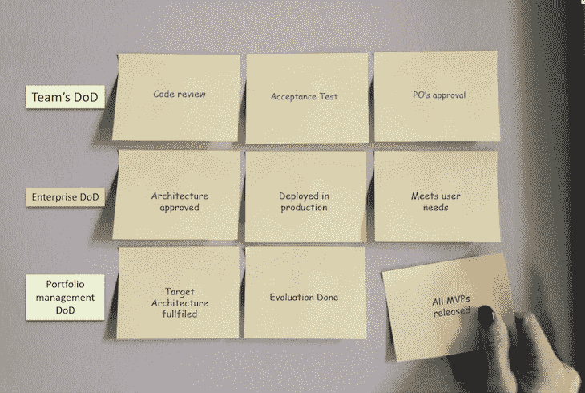

# 完成的定义是什么？敏捷团队示例指南

> 原文：<https://blog.logrocket.com/product-management/what-is-definition-of-done-agile-examples/>

在当今快节奏的世界中，创新层出不穷，技术日新月异，产品开发团队必须不断适应以跟上时代的步伐。这意味着组织还必须自上而下地接受敏捷原则来培养动力。

敏捷产品开发团队由不同领域的专家组成:[软件工程师](https://blog.logrocket.com/product-management/3-scrum-roles-agile/#developers)，质量保证专家， [scrum masters](https://blog.logrocket.com/product-management/scrum-master-job-description-certifications/) ，用户体验设计师，[产品负责人](https://blog.logrocket.com/product-management/3-scrum-roles-agile/#product-owner)，等等。每个人都用自己的专业知识在不同阶段为产品开发做出贡献。因此，有必要围绕产品的开发和交付建立对期望的共同理解。

在本指南中，我们将解释为什么创建完成的定义(DoD)对于 scrum 团队和产品领导拥抱敏捷工作方式如此重要。我们还将定义谁为用户故事、特征/史诗和主题/计划创建了完成的定义，并将国防部与其表亲 ready (DoR)的定义区分开来。

* * *

## 目录

* * *

## done (DoD)的定义是什么？

完成(DoD)的定义是一个一致同意的清单，它清楚地说明了用户故事、史诗或主题何时被认为完成。

根据[Scrum 指南](https://www.agile-academy.com/en/scrum-master/what-is-the-definition-of-done-dod-in-agile/):

> “完成的定义创造了透明度，让每个人都知道作为增量的一部分完成了什么工作。如果一个产品 Backlog 项目不符合 Done 的定义，它就不能被发布，甚至不能在 Sprint 评审中被展示。相反，它会返回到产品待办事项中，以供将来考虑。”

## 创建完成定义的目的是什么？

“完成”定义的主要目的是建立共识，将责任分配给适当的工作站，以便团队能够始终如一地交付高质量的产品。对“完成”的明确定义不仅对执行至关重要，对产品组织中所有层级的[计划和评估](https://blog.logrocket.com/product-management/planning-poker-agile-estimation-scrum/)也是如此。

最初， [scrum 框架](https://blog.logrocket.com/product-management/what-are-five-types-of-scrum-meetings/)在开发阶段为 [scrum 团队](https://blog.logrocket.com/product-management/3-scrum-roles-agile/)建立了完成的定义。从那时起，它已经扩展到产品组织的所有级别。

例如，有主题、计划和[史诗](https://blog.logrocket.com/product-management/what-is-an-epic-in-agile-guide-examples/)的 DOD，它们使组织能够理解[产品生命周期](https://blog.logrocket.com/product-management/product-managers-role-each-product-lifecycle-stage/)，创建相关的[营销计划](https://blog.logrocket.com/product-management/what-is-a-product-launch-plan-how-to-create/#branding-and-marketing)，帮助预算分配，以及评估里程碑和[路线图](https://blog.logrocket.com/product-management/product-roadmap-tools-best-features-free-paid/)。此外，运营协议有利于跨职能团队协作和任何新团队成员的入职。

## 为什么完成的定义对敏捷团队很重要？

当采用[敏捷的工作方式](https://blog.logrocket.com/product-management/four-agile-manifesto-values-explained/)时，每个流程都应该为组织增加价值。done 的定义遵循并实现了产品开发中的核心[敏捷原则](https://blog.logrocket.com/product-management/12-agile-manifesto-principles-how-to-adopt-them/)。

### 透明度

在整个组织内建立清晰的理解有助于提高透明度。它有助于避免由于对问题的意见或观点不同而产生的不必要的冲突和误解。

### 学问

[按照国防部清单对每一步进行持续评估](https://blog.logrocket.com/product-management/12-agile-manifesto-principles-how-to-adopt-them/#3-deliver-working-software-frequently),可以在向最终用户发布产品之前进行彻底的监督，并作为一道安全门。它允许团队专注于速度和交付，毫不犹豫地鼓励自我驱动的创新。

### 循环

交付能够在适当的质量保证水平下快速实现并交付给最终用户的特性是另一个[关键敏捷原则](https://blog.logrocket.com/product-management/12-agile-manifesto-principles-how-to-adopt-them/#8-maintain-a-constant-pace-indefinitely)。快速学习和迭代也培养了产品开发团队的信心，在交付过程中保持质量保证的同时创造创新。

## 完成范例的定义

让我们在不同的级别——团队、企业和项目组合管理——探索完成的定义，并查看一些包含在完成定义中的例子:

我们还会看一些例子，说明在你的完成清单的定义中应该包括什么，以及在每一个层次上谁创建了完成的定义。

### 用户故事(scrum 团队)

众所周知，done 的定义是 scrum 团队级别的[用户故事](https://blog.logrocket.com/product-management/what-is-an-epic-in-agile-guide-examples/#epics-vs-user-stories-vs-initiatives)。

当所有的接受标准都被满足，产品负责人评审并接受用户故事时，用户故事就被认为完成了。一旦被接受，完整的用户故事有助于团队的速度。

国防部的清单会因团队而异，但以下是一些标准项目，包括在国防部的用户故事清单中:

*   单元测试通过
*   代码已审核
*   符合验收标准
*   功能测试通过
*   满足非功能性要求
*   PO 批准的用户故事

#### 谁为用户故事创建了 done 的定义？

scrum 团队协作定义并维护 done 的定义。国防部的清单应该反映 scrum 团队是否满足了所有故事的所有要求和质量标准。它还应该作为一个官方的把关机制，让故事从进行中走向完成，确保过程中的质量和一致性。

当在跨职能团队中工作时，定义什么是合格的完成的过程应该是协作的。国防部的清单是灵活的，应根据产品小组的要求进行审查和修改。scrum master 可以作为一个领导者，在工作中管理和实施 DoD 清单。

如果所有商定的任务都由各自负责的角色执行和检查，产品经理可以在发布前依靠国防部进行质量保证。库存的影响可能是不完整的用户故事在 [sprint backlog](https://blog.logrocket.com/product-management/why-you-need-perfectly-groomed-backlog-sprint-planning/) 中结束，这使得[对下一个 sprint](https://blog.logrocket.com/product-management/what-is-sprint-planning-guide-meeting-agenda-cheat-sheet/) 的计划陷入困境，并最终推迟生产。

### 功能/史诗(企业/产品管理)

在功能或史诗级别，完成意味着准备好并交付给最终用户。一部完成的史诗满足了所有的标准，满足了用户的需求。

一个或多个用户故事可以在涉及几个跨职能团队的多个 sprint 中总结一个特性。

这里有一个美国国防部的特辑/史诗清单的例子:

*   向利益相关者演示并被其接受
*   UX 设计已通过审查和验收
*   集成测试通过
*   符合合规要求
*   自动回归测试已创建
*   满足规定的用户需求
*   功能文档已完成
*   提升到生产环境

如果交付给最终用户的质量是至关重要的，那么国防部在这一层面的共同理解是必不可少的。此外，由于多个团队可能会参与交付，开发周期可能会更长，因此一个定义良好且一致认可的 done 定义有助于节省时间、提高效率，并在发布到生产环境之前确保开发的质量和完整性。

#### 谁为故事片/史诗片定义了“完成”?

基于新的发现和学习，国防部可能会影响你的优先事项和路线图。不满足 DoD 的项目可以返回到[产品积压](https://blog.logrocket.com/product-management/product-vs-sprint-vs-release-backlog/)进行下一个增量。

产品经理可以与架构师、利益相关者、营销团队、设计团队、测试领导等合作，创建一个史诗级的清单。、以及参与将最终产品运送给用户的任务的任何人。

然而，产品经理有责任确保 DoD 中的所有项目都得到执行。毕竟，产品经理的首要职责是将产品交付给最终用户。

### 主题/计划(项目组合管理)

为一个主题或计划设立一个 DoD 是一个相对较新的概念，是对产品生命周期管理的流行做出的反应。

国防部在主题层次上帮助组织在确定优先次序时保持一致，澄清是否有必要将重点转移到新的计划上，并停止对现有产品的任何进一步开发。国防部协助整个产品组织的战略重点和方向。

国防部主题/计划清单的例子包括

*   满足市场需求
*   目标架构设计完成。
*   所有 MVP 都被发布到生产环境中并接受评估。
*   完成并评估了用户测试和调查。
*   没有确定新的要求。

#### 谁为主题/计划创建了完成的定义？

项目组合管理团队为主题和计划创建完成的定义。此外，越来越需要在每个阶段对产品进行评估，以辨别产品是否符合既定的市场预期。

[产品经理](https://blog.logrocket.com/product-management/what-does-a-product-manager-do-role-responsibilities/)负责提交和完成为其产品定义的清单，管理人员需要在 DoD 执行后采取必要的行动。
检查国防部清单确保正确的组织优先次序、重点和预算分配，并最大限度地减少未知盲点的风险。

## 完成的定义(DoD)与就绪的定义(DoR)

当你在执行一个工作协议时，经常会讨论清楚地陈述两个定义:完成(DoD)的定义和准备好(DoR)的定义。然而，在 scrum 框架中，只有 DoD 被正式定义；DoR 是可选的。

类似于 done 的定义，ready 的定义是在开始任何新计划之前应该准备好的事情的清单。定义就绪的目的是为了避免混淆和阻碍，并在处理计划时提高效率。

* * *

订阅我们的产品管理简讯
将此类文章发送到您的收件箱

* * *

从我的个人经验来看，拥有一个 DoR 是好的，但它不应该成为阻止你开始任何新事物的障碍。如果产品团队过于关注 DoR，可能会延误生产，导致错失良机。

完成的定义确保了一致性和高质量的可交付成果，而就绪的定义有助于提高效率。此外，DoR 的目标是在新开发项目开始时建立一个共同的理解并避免混乱，而 DoD 在交付结束时介入。

## 创建完成的定义有助于你接受敏捷原则

所有旨在帮助各种组织结构采用敏捷工作方式的框架至少有一个共同的核心原则:学习和适应最适合你的产品组织的东西。“完成”的定义有助于产品领导者达成共识，避免在整个产品生命周期中出现任何误解。

DoD 通过对标准进行全面盘点，帮助敏捷产品团队确保质量、快速交付和一致性。“完成”的定义也应该根据你的具体计划进行审查和调整。产品经理对国防部各级的执行负责。

done 的定义不仅在开发过程中是实用的；它适用于所有级别的产品管理，从产品组合到团队级别，为整个产品组织提供了透明度和清晰的方向。

*精选图片来源:[icon scout](https://iconscout.com/icon/checklist-1627460)*

## [LogRocket](https://lp.logrocket.com/blg/pm-signup) 产生产品见解，从而导致有意义的行动

[LogRocket](https://lp.logrocket.com/blg/pm-signup) 确定用户体验中的摩擦点，以便您能够做出明智的产品和设计变更决策，从而实现您的目标。

使用 LogRocket，您可以[了解影响您产品的问题的范围](https://logrocket.com/for/analytics-for-web-applications)，并优先考虑需要做出的更改。LogRocket 简化了工作流程，允许工程和设计团队使用与您相同的[数据进行工作](https://logrocket.com/for/web-analytics-solutions)，消除了对需要做什么的困惑。

让你的团队步调一致——今天就试试 [LogRocket](https://lp.logrocket.com/blg/pm-signup) 。

[Bindiya Thakkar Follow](https://blog.logrocket.com/author/bindiyathakkar/) Experienced product manager and product owner with a demonstrated history of working in the Omni channel and digital tools. Skilled in product management, digital strategy, roadmapping, business strategy, and user experience.