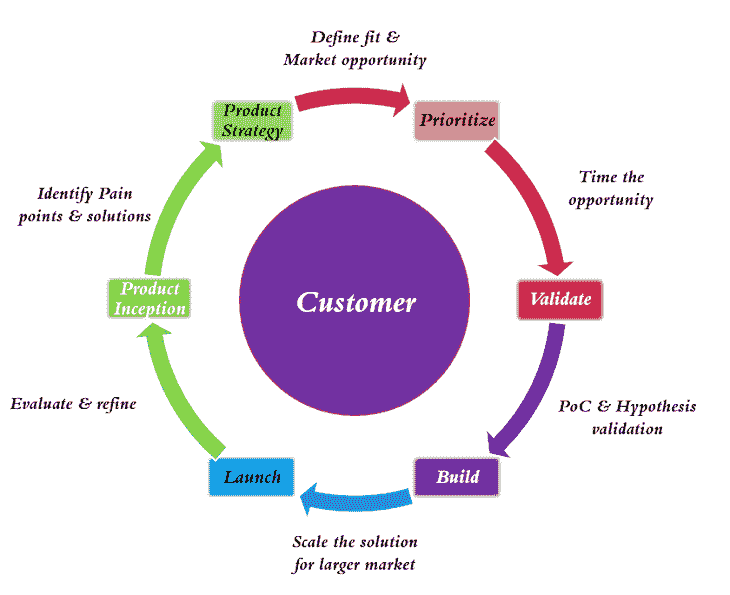
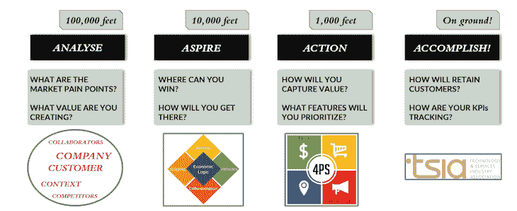
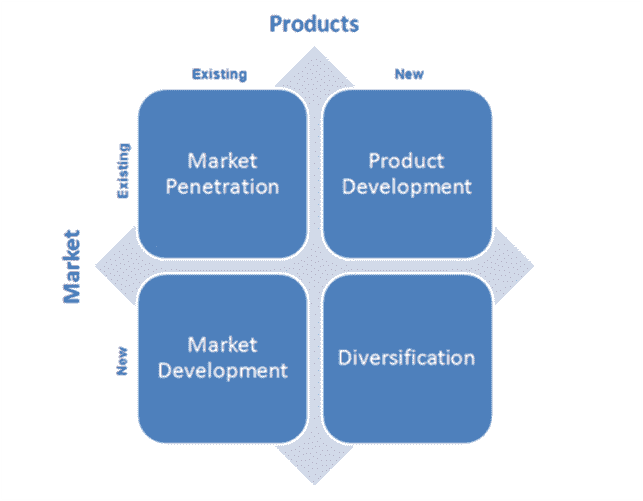

# 什么是走向市场战略？示例指南

> 原文：<https://blog.logrocket.com/product-management/what-is-go-to-market-strategy-examples-guide/>

* * *

## 目录

* * *

## 什么是走向市场(GTM)战略？

走向市场(GTM)策略的定义很简单:从最初的验证到为更大的市场群体扩展，提高产品的认知度、可访问性和留存率。正如你所想象的，所采用的策略会随着时间的推移基于市场的确认而改变。

一般的观念是，走向市场策略是事务性的，所以公司通常等到产品准备好部署时才执行。

然而，一个好的[产品经理](https://blog.logrocket.com/product-management/product-managers-role-each-product-lifecycle-stage/)在构思产品创意时会启动 GTM 战略。该战略应抓住围绕商业模式、市场成熟度、品牌定位、竞争力和增长战略的新现实。

## 新商业模式的演变

软件定义的解决方案和“即服务”业务模式需要一种 GTM 战略转型方法。产品不再达到寿命终点；他们不断发展，推动持续创新。

下面的生命周期代表了组织现在对产品和解决方案的看法。生命周期的每一步都需要有意识地采取市场策略，而不仅仅是发布阶段。

产品初始阶段抓住了痛点和创造性的解决方案。然而，产品策略需要考虑产品的市场进入、差异化、生存能力和可行性。每个阶段都验证假设，并随着我们在整个周期中的前进完善 GTM 策略。

如今的产品很少是一次性的。对建立粘性、增加转换成本和为客户创造长期价值的考虑是至关重要的。

### 分析，渴望，行动，完成

当在新市场或现有市场推出新产品时，我经常使用分析、追求、行动、完成模型，该模型在产品生命周期的不同阶段应用各种框架。

目的不是解释在框架内获得的工具，而是展示每个阶段的关键成果:

#### 分析

分析阶段需要对客户痛点(已说和未说)、市场动态(有什么可用，为什么不足)和潜在的解决方案有充分的了解，以最小化或消除差距。

在这个阶段，GTM 方面通常并不重要。然而，解决一个无法接触到客户的问题也是徒劳的。

#### 追求

我认为 GTM 策略的假设至关重要的地方是期望步骤。用产品术语来说，[细分、定位和定位(STP)](https://en.wikipedia.org/wiki/Segmenting-targeting-positioning) 是一项基本活动。

这里的关键问题是:

*   你在哪些细分市场有真正的机会？
*   实现目标的途径是什么(例如，你还需要谁和你一起走)？

这一步还应告知您关键的竞争对手以及您在市场中取胜所需的独特优势。它应该定义你理想的客户档案，更重要的是，确定滩头客户。

#### 行动

行动阶段应该有助于确定[产品与市场的契合度](https://blog.logrocket.com/product-management/what-is-product-market-fit-measure-examples/)、信息传递(撰写新闻稿、常见问题解答、你期望获得的证书等。)，以及你必须瞄准的不同的[人物](https://marketing-dictionary.org/b/buying-roles/)。

#### 完成

一旦产品[投放到市场](https://blog.logrocket.com/product-management/what-is-a-product-launch-plan-how-to-create/)，完成阶段应该有助于[数据驱动的产品细化](https://blog.logrocket.com/product-management/what-is-backlog-grooming-aka-refinement/)。

### 一个概念性的例子

在攻读 MBA 时，我的团队(非正式地)与万豪合作，提出了一个提供体验至上产品的概念。在考虑万豪的品牌范围时，我们选择了 JW 万豪和喜来登，分别为中年人和千禧一代提供不仅仅是房间和食物的体验。

该套餐考虑了从旅行、活动、定价，甚至是首先提供服务的具体试点地点在内的一切。该概念还确定了人物角色和基本生态系统战略的信息，包括旅行和体验合作伙伴。

## 市场考虑

在制定走向市场战略时，您应该考虑以下几点:

### 产品和市场

采用的最佳 GTM 策略通常取决于市场的成熟度。

以电动汽车为例。这是现有市场上的新产品。采纳门槛取决于范围焦虑的解决。

正如特斯拉所展示的那样，建立超级充电站网络与制造汽车本身同等重要。

我认为自动驾驶汽车将是新市场的新产品。很容易将这想象为一个现有的市场，但自动驾驶汽车有可能彻底重新定义人们对汽车所有权的看法。

### 品牌定位

2018 年，我们研究了汽车、汽车感知品牌以及汽车重塑品牌的尝试。有趣的是，别克和凯迪拉克等汽车已经转型，更适合 40 出头的中上阶层人群(宝马和雷克萨斯占据了这个市场)，而林肯却失败了。

从 GTM 的角度来看，这样的[重新定位](https://www.williamjoseph.com/cadillac-can-teach-us-positioning-brand/)需要一个相当大的思考过程，尤其是关于社交信息、关注、广告、产品考虑——全部九个方面。

### 竞争

考虑竞争时，创造性地思考。例如，Brita 选择不与其他厨房电器竞争。相反，它是在水通道中销售的，这使它能够与瓶装水竞争。

此类决策不是在启动阶段而是在初始阶段确定的。Cialis 通过[重新定义顾客购买标准](https://hbr.org/2013/12/when-marketing-is-strategy)击败了伟哥，而 Levitra 没有。不涉及太多细节，我们只能说产品差异化在这一努力中至关重要。

## 定义理想的客户档案和滩头阵地

作为我们顶点项目的一部分，多亏了牛商学院的一个了不起的倡议，我们制作了一个现实生活中的 GTM，从摇篮到坟墓。

解决办法是尽量减少再入院。可预防的再入院(再入院是指患者因任何原因在出院后 21 天内返回医院)的费用超过 250 亿美元，医疗保险承担了其中的 60%以上。

医疗保险对再次入院率过高的医院进行处罚。所有医院及其再入院率(和 pen 倾向)的数据库是可用的。

* * *

订阅我们的产品管理简讯
将此类文章发送到您的收件箱

* * *

根据这些信息，我们设计了一种方法来细分理想市场、其人口统计数据以及最大化销售活动的五个州。请注意,“理想的客户档案”并不是真正完美的——它是在现有资源条件下的“可能性”。

此外，我们确定了一组最适合试点的医院。大量的数学运算被用于解析电子表格——我的团队愿意推荐我去读博士学位，就为了这项工作——但我们将其提炼为一个单一的客户档案路线图(试点、短期、长期)。

虽然 GTM 的战略是与医院合作，但最终目标是直接与医疗保险合作，为他们节省至少 30%的 170 亿美元不必要的开支。

## 增长战略

大多数关于[销售导向与产品导向增长战略的文章](https://userpilot.com/blog/product-led-vs-sales-led/)都是相互推动的。事实是，你必须选择最适合你的情况。你还应该知道从一个转换到另一个的拐点在哪里(或者串联使用它们)。

在我继续说下去之前，让我解释一下我的最佳理解——因为我的方法通常不是有意识地在两者之间做出选择。

### 销售导向的增长

以销售为导向的增长方式在很大程度上取决于您的销售团队或渠道合作伙伴。根据你的产品(转换型与增量型)和你是谁(亚马逊与创业型)，你的销售团队将与客户联系，建立关系，解释产品优势，并通过合同流程完成。

正如你所想象的，你产品的成功也取决于销售机构的销售意愿。如果你正在考虑从一个永久的模式转向一个循环的模式，而不考虑销售的角度，你肯定会有一个镇纸在你的手上！

B2B 产品需要很长的合同周期和大量的时间来部署和安装，通常需要销售主导的方法。然而，这并不意味着销售会影响[产品特性](https://blog.logrocket.com/product-management/what-are-product-features-define-examples/)或[路线图](https://blog.logrocket.com/product-management/how-to-build-product-roadmap-overview-examples/)。

### 产品导向型增长

以产品为导向的方法通常依赖于有机增长，由探索性模式(免费增值、试用购买)、自助服务功能和无缝的用户体验来支持产品的设置和使用。

公司在营销上花费了大量的资金，而不是在销售活动上。以产品为导向的战略可以扩大销售网络，降低采购成本(CAC)。

一个突出的 B2C 产品采取产品导向的例子包括 Spotify。

令人难以置信的是，AWS 最初是一种以产品为导向的产品，具有自助服务功能和实用程序，可以更快地上市和监控使用情况，免费试用和成本透明。它在云托管领域占据第一的位置，吸引了小企业，尤其是初创企业。

然而，Azure 迟到了，采取了销售主导的方法。它建立了强大的渠道和解决方案合作伙伴，提供端到端的咨询和执行，并在与财富 500 强公司的大型合同的大力推动下，迅速跃升为第一名。

从那以后，AWS 已经过渡到一种混合模式，并通过提供以销售为导向的方法和市场，在大盘股市场建立了实质性的存在，这些都是他们获得客户后的附加产品。

混合方法最重要的驱动因素是向“即服务”模式的转变。许多组织认为客户成功管理是一项销售职能。虽然部分属实，但 CSM 并非完全由佣金驱动，通常在销售的初始阶段不会参与其中。

推动采用、交叉销售、追加销售和续订以最大限度地降低 CAC 的期望意味着它们提供了产品和销售导向方法之间的融合。我向 CSM 寻求产品反馈，因为它往往植根于数据

旁注:如果你不能[监控 KPI](https://blog.logrocket.com/product-management/what-metrics-kpis-product-managers-track/)并支持你的 CSM，你就不应该在 SaaS 做生意！

## 摘要

创造一个走向市场的策略更像是艺术而不是科学。然而，从一个假设开始，尽早做，并使其足够灵活，以基于数据为基础，这是至关重要的。

考虑你正在开发的产品类型，你定义品牌的目标市场，竞争对手，试点客户，以及你必须采取的发展策略。虽然没有水晶球能保证成功，但有意识的方法会放大成功的可能性。

*精选图片来源:[icon scout](https://iconscout.com/icon/strategy-1633190)*

## [LogRocket](https://lp.logrocket.com/blg/pm-signup) 产生产品见解，从而导致有意义的行动

[LogRocket](https://lp.logrocket.com/blg/pm-signup) 确定用户体验中的摩擦点，以便您能够做出明智的产品和设计变更决策，从而实现您的目标。

使用 LogRocket，您可以[了解影响您产品的问题的范围](https://logrocket.com/for/analytics-for-web-applications)，并优先考虑需要做出的更改。LogRocket 简化了工作流程，允许工程和设计团队使用与您相同的[数据进行工作](https://logrocket.com/for/web-analytics-solutions)，消除了对需要做什么的困惑。

让你的团队步调一致——今天就试试 [LogRocket](https://lp.logrocket.com/blg/pm-signup) 。

[Harish Natarahjan Follow](https://blog.logrocket.com/author/harishnatarahjan/) Harish brings 18+ years of product, strategy and technology expertise, delivering solutions in mission-critical environments in public safety, discrete manufacturing, and insurance verticals.