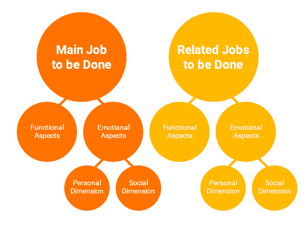

# 什么是要做的工作框架？示例和概述

> 原文：<https://blog.logrocket.com/product-management/what-is-jobs-to-be-done-framework-examples/>

就在我休完产假回到八达通投资公司工作的时候，我被要求领导为我们的客户创建一个新的门户网站。

我们的想法是将门户作为一个单一的中心，让我们所有的客户都可以在线管理他们的投资——这是一个极好的机会，但也是一个巨大的挑战。我的第一步是决定如何接近它。

“要做的工作”框架在我的清单上排在首位。这个框架的核心是一个非常简单的概念，它有助于推动所有的产品开发。让我告诉你更多。

* * *

## 目录

* * *

## 什么是要做的工作(JTBD)框架？

要做的工作框架的核心原则如下:要创造你的客户想要的产品或服务，你需要了解他们想用它做什么。

俗话说，没有人想要四分之一英寸的钻头；他们想要一个四分之一英寸的洞。

 [https://www.youtube.com/embed/RQjBawcU_qg?version=3&rel=1&showsearch=0&showinfo=1&iv_load_policy=1&fs=1&hl=en-US&autohide=2&wmode=transparent](https://www.youtube.com/embed/RQjBawcU_qg?version=3&rel=1&showsearch=0&showinfo=1&iv_load_policy=1&fs=1&hl=en-US&autohide=2&wmode=transparent)

视频

例如，我负责建立的门户网站将允许八达通投资公司的客户在线管理他们的投资，但我知道这对一些客户来说太简单了。

八达通投资公司的主要客户是金融顾问，他们与客户合作，了解他们的金融目标，并就实现这些目标的策略提出建议。因此，如果他们将客户的资金交给我们，他们所做的工作就是为该客户提供持续的服务，这可能包括对投资表现进行定期审查，回答临时问题等等。

虽然从表面上看，客户可能想知道投资的当前价值，但他们需要做的是获得该数字，了解任何变化，并以各种形式进行交流。这需要一个非常不同的设计。

## 待完成工作框架的历史

虽然[产品管理](https://blog.logrocket.com/product-management/)是一个相对较新的实践，但它通常建立在已经存在一段时间的工具和技术之上。托尼·乌尔维克在创建他的公司 Strategyn 时发明了[待完成工作框架](https://jobs-to-be-done.com/the-history-of-jobs-to-be-done-and-outcome-driven-innovation-a2fdfd0c7a9a)可追溯到 1991 年。

 [https://www.youtube.com/embed/u_icOdurOlk?version=3&rel=1&showsearch=0&showinfo=1&iv_load_policy=1&fs=1&hl=en-US&autohide=2&wmode=transparent](https://www.youtube.com/embed/u_icOdurOlk?version=3&rel=1&showsearch=0&showinfo=1&iv_load_policy=1&fs=1&hl=en-US&autohide=2&wmode=transparent)

视频

乌尔维克认为公司需要一种科学的方法来创新。他认为，为了深入了解客户的需求，公司应该停止关注产品或客户，而是寻求理解客户使用该产品或服务想要达到的目的。

Ulwick 运用这一理念，通过一个名为[结果驱动创新(ODI)](https://jobs-to-be-done.com/outcome-driven-innovation-odi-is-jobs-to-be-done-theory-in-practice-2944c6ebc40e) 的过程，帮助公司取得惊人的成功。1999 年，他将 ODI 介绍给哈佛大学教授 Clayton Christensen，后者在其著作《[创新者的解决方案](https://claytonchristensen.com/books/the-innovators-solution/)》中推广了该理论，并将该理论称为“有待完成的工作”。

在 Ulwick 和 Christensen 的工作中，工作要做的理论被证明是为客户制造产品和服务的一个非常有效的工具。

## 工作要做的 9 个原则

有九条原则支撑着“要做的工作”理论。让我们检查一下每个原则，以帮助我们更详细地理解这个框架。

1.  [人们使用一个产品来完成一项工作](#people-use-a-product-to-do-a-job)
2.  [工作有功能、社交和情感的成分](#jobs-have-a-functional-social-and-emotional-component)
3.  [工作长期稳定](#jobs-are-stable-over-time)
4.  [作业与解决方案无关](#jobs-are-solution-agnostic)
5.  成功来自于把工作作为分析的单位
6.  [了解要做的工作使营销更有效，创新更可预测](#understanding-the-job-to-be-done-makes-marketing-more-effective-and-innovation-more-predictable)
7.  [客户希望更好和/或更便宜地完成工作](#customers-want-to-get-their-job-done-better-and-or-more-cheaply)
8.  [客户希望在一个地方完成他们的工作](#customers-want-a-single-place-to-complete-their-jobs)
9.  [需求是衡量成功的标准](#needs-are-the-metrics-for-success)

### 1.人们使用产品来完成工作

想想你最后购买的东西。你为什么购买它？它帮助你实现了什么？

也许你买了午餐，因为你不想挨饿。但是，你是否也考虑过，如果你在遵循一种特定的饮食，你购买的午餐是否有帮助，或者它是否可以在会议之间的短暂休息中准备？或者这个选择让你坐下来，这样你就可以和朋友聊天了。

### 2.工作有功能、社会和情感的成分

以午餐为例，功能组件很简单:你想解渴。

Source: [UX Collective](https://uxdesign.cc/8-things-to-use-in-jobs-to-be-done-framework-for-product-development-4ae7c6f3c30b)

社交可能是让你和朋友一起吃饭。情感部分可能是围绕支持某些健康愿望或条件。

### 3.随着时间的推移，工作是稳定的

我们需要吃午餐已经很久了！如果这个原则被证明是正确的，你就会知道你已经找到了真正要做的工作。然后，它有助于提供一个不变的焦点单元，无论周围发生什么变化。

### 4.作业与解决方案无关

事实上，客户可以选择最适合他们的解决方案。

回顾我建立的门户网站:在它存在之前，客户可以通过电话或电子邮件管理他们的投资。我有充分的证据表明，门户网站会比那些渠道做得更好，但我知道我需要让他们在网上做的工作比使用传统渠道更容易、更高效。

### 5.成功来自于将工作作为分析的单位

了解客户想要完成的工作，你就会发现你必须满足什么样的需求才能让你的产品成功完成这项工作。

之后，我和我的团队开始解释财务顾问为客户做评估意味着什么，他们需要做什么，他们需要展示自己的方式等等。，我们开始发现如何定位门户的各个方面，以使它们以及产品获得成功。

### 6.了解要做的工作使营销更有效，创新更可预测

如果你真正理解客户想要达到的目标，也就是他们想要做的工作，那么你就能在合适的时候说他们的语言，让你的[产品营销](https://blog.logrocket.com/product-management/product-marketing-manager-job-description-role-skills/)更加有效。

至于创新，你可以看到现有的解决方案让客户失望的地方，并解决这些问题，潜在地发明一些新颖的东西。

### 7.客户希望更好和/或更便宜地完成工作

顾客对品牌或产品并不忠诚，但他们确实需要完成这项工作。

* * *

订阅我们的产品管理简讯
将此类文章发送到您的收件箱

* * *

客户会转变，所以你能利用这一点吗，或者你需要捍卫你的立场作为他们的首选？

### 8.客户希望在一个地方完成他们的工作

对我来说，预订假期的过程最能说明这一点。完成这项工作通常意味着跨多个平台工作以获得我需要的东西——如此之多，以至于我最终不可避免地回到一个平台来完成大部分工作。

客户希望简单，因此了解客户需要完成的整个工作将有助于您完全支持他们。

### 9.需求是衡量成功的标准

对于产品团队来说，与[达成一致对于成功](https://blog.logrocket.com/product-management/what-product-management-metrics-matter-most-to-pms/)意味着什么是必须的。待完成工作框架规定，满足使客户能够完成工作的需求是成功的[可衡量的产出](https://blog.logrocket.com/product-management/what-are-okrs-how-to-write-templates-examples/)。此外，这些不会随着时间的推移而改变，允许长期测量。

## 待完成工作示例

使用该框架的第一次成功是在 [Strategyn 与 Cordis Corporation](https://hbr.org/2002/01/turn-customer-input-into-innovation) 合作推出新的血管成形球囊系列时。他们专注于医务人员在手术前、手术中和手术后试图达到的目标，并设计产品来满足这些需求。

他们的研究还表明，他们有可能失败的产品，所以他们停止了这些产品的高成本生产。这导致市场份额从大约 1%急剧增加到 20%以上。

我喜欢《哈佛商业评论》这篇文章讲述的关于餐桌的故事。一家房地产开发公司正在努力向希望缩小规模的人出售房屋，他们无法理解他们得到的相互矛盾的反馈。潜在客户不断提到无法摆放餐桌，这是他们不想购买的原因，但他们并没有在需求中列出正式的餐厅。

当发现没有桌子的空间，潜在买家将无法举办家庭聚会时，该团队拥有了成功销售房产所需的洞察力。

我的公司也成功地实施了“要做的工作”框架。自发布以来，我们已经有了 10，000 名新的在线客户，我们的渠道份额(通过在线、电话和电子邮件联系的人数来衡量)从 40%增加到 60 %,并且我们的客户对使用我们的门户网站有多么容易发表了一些非常好的评论。

## 关键要点和进一步阅读

“要做的工作”是一个简单的框架，强调客户正在做的事情背后的“为什么”。它提供了一个焦点单元(客户希望做的工作)，以建立不随时间变化的衡量成功的可测量方法。

上面的例子展示了如何在软件之外的各种行业和产品中使用待完成工作。他们告诉我们，要模仿这些成功，最重要的是，确保你专注于了解客户想要做的工作，并提供出色的解决方案。

要了解更多关于待办工作框架的信息，请下载乌尔维克的免费电子书《待办工作:理论到实践》

*精选图片来源:[icon scout](https://iconscout.com/icon/frame-corners-3603471)*

## [LogRocket](https://lp.logrocket.com/blg/pm-signup) 产生产品见解，从而导致有意义的行动

[LogRocket](https://lp.logrocket.com/blg/pm-signup) 确定用户体验中的摩擦点，以便您能够做出明智的产品和设计变更决策，从而实现您的目标。

使用 LogRocket，您可以[了解影响您产品的问题的范围](https://logrocket.com/for/analytics-for-web-applications)，并优先考虑需要做出的更改。LogRocket 简化了工作流程，允许工程和设计团队使用与您相同的[数据进行工作](https://logrocket.com/for/web-analytics-solutions)，消除了对需要做什么的困惑。

让你的团队步调一致——今天就试试 [LogRocket](https://lp.logrocket.com/blg/pm-signup) 。

[Emma Burt Follow](https://blog.logrocket.com/author/emmaburt/) Helping product teams to succeed through consultancy and training. www.playinthegrey.co.uk