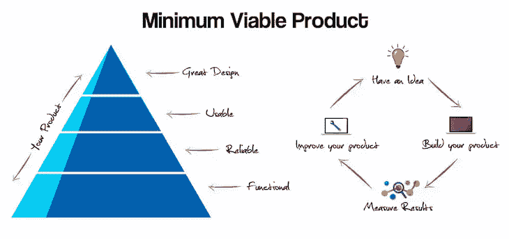
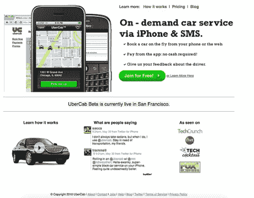

# 什么是最小可行产品(MVP ),你如何定义它？

> 原文：<https://blog.logrocket.com/product-management/what-is-minimum-viable-product-mvp-how-to-define/>

在本指南中，我们将在产品管理的上下文中定义术语最小可行产品(MVP ),列出采用这种方法的一些优势，并带您了解实际研究和创建最小可行产品的步骤。

* * *

## 目录

* * *

## 什么是产品管理中的 MVP？

最小可行产品是指一个应用或产品中解决用户需求并因此提供价值的最小核心功能集。MVP 是从零开始构建的产品的早期版本，具有最基本的特性和基本功能，旨在吸引早期采用者。

2001 年，Syncdev 的联合创始人兼总裁 Frank Robinson 提出了最小可行产品的概念，并将其定义为使客户和供应商的风险回报最大化的独特产品。

为了进一步解释这一点，假设我们有一个从零开始构建的产品，它具有许多消耗大量时间、精力和金钱的特性。当它投放市场时，用户不喜欢这个想法，产品是失败的。

Source: [Henrik Kniberg](https://blog.crisp.se/2016/01/25/henrikkniberg/making-sense-of-mvp)

在这个示例场景中，产品团队浪费了所有的资源来创造市场上甚至不需要的大东西。MVP 的原则是，产品团队应该致力于用最少的功能和努力来构建有用的东西。

一个最低限度可行的产品，当投放市场时，可以帮助首席执行官和产品经理评估该产品在其用户群中的吸引力。MVP 为用户提供了特定的价值，从而使其具有可销售性，并帮助首席执行官测试他们对产品可用性和市场需求的假设。

## 简史

根据弗兰克·罗宾逊的说法，最小可行产品的定义如下:

> “MVP 是适合您的公司和客户的合适产品。它大到足以引起采纳、满足和销售，但又不会大到臃肿和有风险。从技术上来说，它是投资回报率最高的产品除以风险。MVP 由最相关客户的主要功能的收入加权决定，而不是汇总所有客户对所有功能的所有请求。”

后来，企业家、博客作者、《精益创业 一书的作者 Eric Ries 推广了这一概念。Ries 这样描述一个最小可行产品:

> “最小可行产品是新产品的版本，它允许团队以最少的努力收集关于客户的最大量的经验证的知识。”

## 为什么采用 MVP 方法？

MVP 方法对[产品开发和管理](https://blog.logrocket.com/what-is-product-operations/)可以帮助团队利用客户反馈逐步构建性能更好的产品。

让我们来看看采用最小可行产品方法对产品经理或首席执行官有什么好处。

### 假设验证

首席执行官和产品经理通常根据他们收集的数据对目标细分市场和市场需求做出假设。MVP 推出后，这些关于目标细分市场和市场需求的假设实际上可以得到验证。产品经理可以从[客户反馈](https://foldingburritos.com/blog/best-practices-customer-feedback)和使用指标中获得宝贵的洞察力，帮助他们确定产品战略的下一步。

### 更快发布

正如你所想象的，一个最小可行的产品通常包含最小的特性。这是因为与构建具有大量功能的产品所需的资源相比，构建这些功能所需的资源和时间更少。这使得产品经理能够更早地将产品引入市场，并测试核心功能是否真正满足市场需求。

### 重点功能

MVP 由能够为用户提供价值的基本特性组成。这种方法使开发人员能够高度关注这些最小的关键特性，从而带来更高质量的结果和更好的用户体验。

### UX 验证和改进

MVP 是产品的最基本版本，允许团队验证用户流程和核心特性的采用。通过分析用户旅程，产品经理和设计师可以确定功能是否按预期使用，如果有必要，可以建立一个改进范围，使用户体验更加顺畅。任何反馈或分析数据都有助于用更好的版本迭代 MVP。

### 提供资金

大多数创立或打造一个产品的人，在某个阶段都需要风投的投资。如果市场上已经有一个拥有用户的 MVP 此外，如果用户为这些核心功能付费——那么打动投资公司并获得他们的支持就容易得多。

### 降低风险

由于所涉及的工作是最小的，并且只关注核心特性，启动 MVP 所涉及的风险是相当低的。如果你在花费了大量的金钱和资源后推出了一个具有大量功能的成熟产品，如果你后来确定市场需求不存在，那将是一个彻底的失败。通过关注核心特性，产品开发团队可以更快地从失败中吸取教训，从而降低风险。

### 客户关系

突出核心特性和它所能提供的价值可以帮助你与早期采用者建立关系。如果这些用户发现了你的产品的价值，他们更有可能主动分享他们的反馈来帮助你进一步改进产品。他们也更有可能在他们的圈子里传播产品的信息。

## MVP 的类型:低保真度对高保真度

有两种主要类型的最小可行产品:

*   与高保真 MVP 相比,**低保真度 MVP** 更容易开发，需要的精力也更少。这有助于获得更多关于客户问题的信息，并检查所提供的解决方案的价值。低保真度 MVP 是调查问题是否值得努力解决和衡量客户期望的第一步
*   与低保真度 MVP 相比，**高保真 MVP** 有些复杂，因为它确实提供了实际的解决方案，而不仅仅是探索客户的兴趣。高保真 MVP 旨在根据客户愿意支付的金额来评估所提供解决方案的价值

下表进一步说明了高保真 MVP 和低保真度 MVP 之间的区别:

|  | **低保真度 MVP** | **高保真 MVP** |
| **目标** | 探索客户的问题和预期的解决方案 | 确定解决方案的价值和客户的购买意愿 |
| **目标** | 通过收集信息了解客户的问题

*   了解客户的期望
*   评估客户是否愿意参与潜在的解决方案

 | 客户愿意为所提供的解决方案支付多少钱？

*   吸引早期采用者
*   收集反馈以进行改进
*   塑造营销和[产品战略](https://blog.logrocket.com/what-is-a-product-vision-statement-overview-with-examples/)的后续步骤
*   **努力**

 |
| 最低限度；可以用很少的资源在短时间内完成 | 费时费力；涉及一个由开发人员、设计师和质量保证人员组成的小团队 | **复杂度** |
| 简单；可能不需要开发 | 相当复杂；需要发展 | **例子** |
| 登录页面 | 电子邮件活动

*   假门
*   博客
*   论坛
*   调查/焦点访谈
*   如何定义你的 MVP
*   现在我们已经了解了什么是最小可行产品，这种方法对产品经理和 CEO 的好处，以及 MVP 的两种主要类型，让我们更深入地研究并演示如何实际创建一个。

 | 下面是如何定义和构建最小可行产品的逐步分解。 |

## 步骤 1:确定业务和市场需求

第一步是做深入的研究来定义 MVP 要解决的问题。在这一阶段，产品经理应该提出以下问题:

Source: [DevTeam.Space](https://www.devteam.space/blog/how-to-create-a-minimum-viable-product-for-your-enterprise-company/)

产品的市场需求是否重要到足以被抓住？

### 该产品的市场需求是否存在？

这项市场调查的目标是收集足够的数据来支持要提供的解决方案。定性数据也有助于验证市场中的现有差距。创业公司经常失败，因为他们在开始构思之前没有花足够的时间进行市场研究。

*   第二步:确定目标并与你公司的目标保持一致
*   在你进入需要建立什么之前，理解你公司的目标是至关重要的。你必须首先清楚地了解你的公司为什么存在。

你公司的使命宣言应该回答这个问题，你计划建立的 MVP 和它提供的价值必须与这个使命一致。作为一家初创公司，如果你将 MVP 作为你的第一个产品推出，写下组织的使命陈述会有所帮助，为需要做的事情提供一个清晰的方向。

### 订阅我们的产品管理简讯
将此类文章发送到您的收件箱

通过启动 MVP 来定义你想要达到的目标。你是否在努力实现未来一年的一定收入？你是否只关注提高用户参与度？这些目标将有助于定义需要构建什么特性。

步骤 3:制定计划并实施 MVP

* * *

一旦设定了目标，就该定义用户旅程、目标细分市场、用户角色和他们的行动，然后努力识别他们的痛点。

* * *

这个集思广益活动可以帮助您和您的团队确定哪些解决方案可以解决这些棘手问题，并了解每个解决方案的好处。根据您的目标评估解决方案列表，然后定义您将致力于的核心功能。

### 与此同时，重要的是要记住，使 MVP 的功能必须是可行的，公司必须能够在推出后销售产品。

最少可行产品示例

让我们来看看一些众所周知的产品示例，这些产品最初是技术世界中的最小可行产品(MVP ),然后扩展为完全规模化的产品。

Dropbox

## Dropbox 的首席执行官德鲁·休斯顿(Drew Houston)最初很难筹集到投资基金。没有一个有效的应用程序，很难展示产品及其市场需求，直到休斯顿想出了以视频形式创建 MVP 的想法。

[https://www.youtube.com/embed/w4eTR7tci6A](https://www.youtube.com/embed/w4eTR7tci6A)

视频

### 这段[三分钟的视频](https://www.youtube.com/watch?v=w4eTR7tci6A)演示了该应用的基本功能。根据休斯顿的说法，视频发布后，测试等候名单一夜之间从 5000 增加到 75000。这证实了市场需求，并使休斯顿(以及，至关重要的是，投资者)相信，将该产品推向市场所需的宝贵资源是值得的。

优步

2008 年，加勒特·坎普和特拉维斯·卡兰尼克有了一个想法，让愿意载客的司机和想搭车的人配对。他们没有创建一个具有复杂功能和算法的应用程序来匹配司机和乘客，而是推出了 [UberCab](https://www.investopedia.com/articles/personal-finance/111015/story-uber.asp) ，这是当今优步的一个非常简化的版本。

### 预订是通过短信完成的，但付款是通过应用程序处理的。最初，它只在旧金山可用，然后随着其他功能的开发而逐渐扩展。

捷步达康

1999 年，尼克·斯温默恩有了一个在网上卖鞋的想法。为了测试他的想法，他创建了一个简单的网站，shoesite.com，并开始发布他想出售的鞋子的图片。

Swinmum 没有任何库存，也没有对供应链和物流进行投资。每当客户下订单时，他会从当地商店购买商品，然后发货给客户。这帮助他在没有任何风险或投资的情况下验证了他的想法。

### 

后来，shoesite.com 发展成为捷步达康，并最终被亚马逊收购。

结论

从 MVP 开始总是个好主意。这种方法使产品负责人能够收集客户反馈，并最终随着用户群的增长迭代添加新功能。它不仅降低了风险，而且使开发人员能够根据客户的需求来开发产品。构建一个最小可行的产品使您能够在推出一个成熟的产品之前测试业务假设，这反过来增强了组织进行更多投资的信心。

许多知名组织都是从一个 MVP 开始，经过相当多的迭代，创造了一个十亿美元的企业。这些成功的故事验证了 MVP 方法，即在逐步转向健壮的、经过良好测试的、经过验证的开发策略之前，先发布最小可行的产品。

## [LogRocket](https://lp.logrocket.com/blg/pm-signup) 产生产品见解，从而导致有意义的行动

[LogRocket](https://lp.logrocket.com/blg/pm-signup) 确定用户体验中的摩擦点，以便您能够做出明智的产品和设计变更决策，从而实现您的目标。

使用 LogRocket，您可以[了解影响您产品的问题的范围](https://logrocket.com/for/analytics-for-web-applications)，并优先考虑需要做出的更改。LogRocket 简化了工作流程，允许工程和设计团队使用与您相同的[数据进行工作](https://logrocket.com/for/web-analytics-solutions)，消除了对需要做什么的困惑。

让你的团队步调一致——今天就试试 [LogRocket](https://lp.logrocket.com/blg/pm-signup) 。

## [LogRocket](https://lp.logrocket.com/blg/pm-signup) generates product insights that lead to meaningful action

[LogRocket](https://lp.logrocket.com/blg/pm-signup) identifies friction points in the user experience so you can make informed decisions about product and design changes that must happen to hit your goals.

With LogRocket, you can [understand the scope of the issues affecting your product](https://logrocket.com/for/analytics-for-web-applications) and prioritize the changes that need to be made. LogRocket simplifies workflows by allowing Engineering and Design teams to work from the [same data as you](https://logrocket.com/for/web-analytics-solutions), eliminating any confusion about what needs to be done.

Get your teams on the same page — try [LogRocket](https://lp.logrocket.com/blg/pm-signup) today.

[Monica Dhiman Follow](https://blog.logrocket.com/author/monicadhiman/) I am passionate about solving business problems by bringing the team together and removing impediments. I started my career as a business analyst before moving into product management. I am a Certified Scrum Master and I also write my thoughts about product management at [MonicaDhiman.com](http://monicadhiman.com).