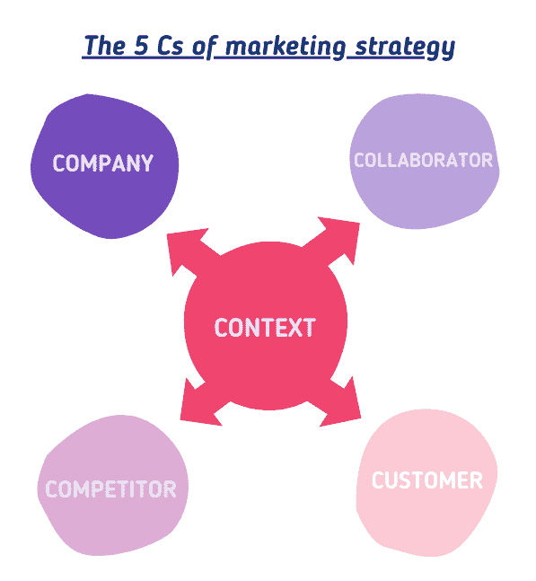
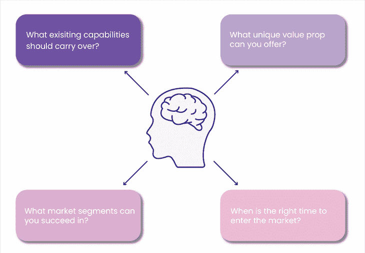

# 什么是产品差异化？定义、策略和示例

> 原文：<https://blog.logrocket.com/product-management/what-is-product-differentiation-definition-strategies-examples/>

组织遵循广泛的产品策略。一些公司的目标是引领创新，一些是快速跟随者，还有一些是成本领先者。他们用自己的核心竞争力来支持这些战略，使他们的产品在市场上与众不同。

市场的类型和产品的成熟度决定了在市场中取得成功所需的差异化。一个组织需要了解它可以基于可用资源(包括人力、资本和伙伴关系)提供的差异化优势。

在本指南中，我们将提供产品差异化的清晰定义，以及在不同市场运营的组织如何使其产品脱颖而出。

在整篇文章中，我们将参考现实世界中的例子，并帮助演示产品差异化在实践中是什么样子，以及强大的差异化战略如何让您从竞争对手中脱颖而出。

* * *

## 目录

* * *

## 什么是产品差异化？

我们先来简单定义一下微分。

产品差异化是努力让你的产品脱颖而出。打造一个在所有有形的方面都模仿另一个产品的产品很少会引起连锁反应。这种类型的产品往往无法与市场上的其他产品竞争，最终会失败。

产品通常基于质量、功能和价格来区分。然而，还有其他几种方式可以让产品脱颖而出。

例如，你的产品差异化可能是基于寻找不同的受众来购买你的产品，使得另一个渠道变得无关紧要。另一种潜在的差异化战略是合作伙伴/生态系统战略，这种战略可以加速产品的销售，例如将产品放在商店的黄金位置。

产品差异化的其他方法包括[通过有效的营销创造产品的知名度](https://blog.logrocket.com/product-management/product-marketing-manager-job-description-role-skills/)。

产品差异化不一定是加法；它也可以是减法。

我最近研究了儿童手表，发现缺乏吸引人的功能:没有游戏，没有社交媒体，没有干扰。我很快淘汰了一套提供这种功能的产品。

如果做得好，差异化有助于提高利润率、[客户终身价值(CLV)](https://www.netsuite.com/portal/resource/articles/ecommerce/customer-lifetime-value-clv.shtml) 和资产回报率。

## 横向与纵向产品差异

有几种方法可以创造产品差异化。也就是说，在所有情况下，差异化都是由市场需求(潜在的或积极的)驱动的。

当你外出就餐时考虑可用的选择时，你的选择通常取决于你个人(或团体)的偏好和地点。这种隔离属于横向差异:同一个市场，但不同的选项不具有直接可比性，并寻求缓解个人需求。

当你购买智能手机时，决定是基于价格和功能(摄像头、处理器、内存、电池容量等)。).价格和功能有直接关联。这些产品是有意识地为不同的细分市场设计的。

放置通常也是细分市场的一个功能。例如，你在沃尔玛看到的通常与你在全食超市看到的不同。这种分离称为**垂直分异**。

在许多情况下，您会看到纵向和横向差异的混合。把丰田凯美瑞和各种装饰想象成垂直差异，而色谱则是水平差异。

这里还有一个例子:早餐吧已经在市场上存在了一段时间。然而，当 RXBar 推出其蛋白质棒时，它是针对特定的市场需求，希望成分透明，价格更高。虽然它的目标是活跃的个人，但它为其他消费者提供了另一种选择，即早餐吧。

## 产品差异化战略是什么样的？

在开发的早期阶段，评估市场需求和所需的差异化可能会很棘手。以自动驾驶汽车为例。

另一方面，一个成熟的产品，如智能手机，将留下很少的差异化选择。

产品可以通过多种选择在市场中脱颖而出，包括:

*   价格
*   质量
*   特征
*   品牌宣传
*   新奇
*   生态系统战略
*   细分市场重点(广泛，利基)

确定最佳杠杆需要大量的分析，并且在缺乏数据的情况下可能是高度推测性的。这使得公司规避风险，并迫使他们采取红海战略，即使有一条通往蓝海的明确道路。

我经常从其他[产品经理](https://blog.logrocket.com/product-management/product-managers-role-each-product-lifecycle-stage/)那里听到的问题是:

*   我如何开发一个策略来不断区分我的产品，使其成为合意的、可行的、有用的和可行的？
*   我如何识别需要新差异化战略的触发因素？
*   相对于较小的产品增量，我如何确定将我的资源转移到下一个最佳方案的时机？

作为产品经理，你的工作是评估新产品的市场能力，以确定它是否能提供足够的差异化，从而为组织带来利润。你可以通过识别当前的市场供应、趋势、细分市场中的产品成熟度及其差距来实现这一点。

* * *

订阅我们的产品管理简讯
将此类文章发送到您的收件箱

* * *

有了这些见解，你就可以带领你的团队开发出令人兴奋的新产品，选择合适的时机进入市场，并在多个参数上充分区分它。部署后，测量和监控产品，以审查和增强您的策略，包括考虑停产产品。

## 认识当前和潜在的趋势

评估新产品或解决方案的潜力时，评估当前环境的重要方面会有所帮助。我通常会找到情境分析的 5c 来帮助这个发现。

5c 是:

*   语境
*   消费者
*   公司
*   竞争
*   合作者

背景和消费者角度应该告知市场成熟度、技术能力、已抓住的痛点和仍待解决的问题。我经常使用[波特的五种力量模型](https://blog.logrocket.com/product-management/what-is-competitive-analysis-template-examples-tutorial/#the-five-forces-model)来确定(在行业层面)此类解决方案的供求关系、产品的替代能力或新进入者的门槛。

例如，红牛可以被视为咖啡的替代品。Salesforce 和 Android 等平台继续降低创业公司的准入门槛。诸如此类…

我们将在下一部分讨论合作者，但是没有[竞争分析](https://blog.logrocket.com/product-management/what-is-competitive-analysis-template-examples-tutorial)就没有完整的发现。这是初创公司经常犯的主要错误:假设他们的工作是纯绿地。至关重要的是，要根据提供的产品来考虑市场需求，从而[定义你的 MVP](https://blog.logrocket.com/product-management/what-is-minimum-viable-product-mvp-how-to-define/) ，并决定如何脱颖而出。

这一发现过程的另一个重要部分是考虑尚未发现的现有棘手问题。这些通常是次要的，具有很高的上升潜力，需要领域专业知识和对业务流程的密切关注(在 B2B 环境中)。

实现这一点的最佳方式是与你的 UX 团队合作，使用[五个为什么](https://en.wikipedia.org/wiki/Five_whys)之类的工具跟踪当前的流程。

最终，该信息收集应回答以下问题:

*   市场饱和程度如何？
*   是否有特定的细分市场比其他市场更有吸引力？
*   当前产品满足当前需求的覆盖范围有多大？
*   市场有多成熟？有没有差异化的机会？
*   谁是关键人物？当今的生态系统是如何建立的，是否存在破坏生态系统的潜在机会？

作为一个例子，考虑救助车辆。当救援人员购买车辆时，他们通常会通过 Carfax 查询车辆历史记录。与购买普通汽车不同，这份报告没有那么有用。然而，大多数救助人员购买它们是为了他们的记录，其他人无法提供更多的细节。我们拥有的是一个垄断的饱和市场。

假设数据只存在于您的组织中，以构建更好的报告。这肯定是一个未被满足的(和潜在的)需求。如果我们决定通过相同的渠道追求相同的受众(例如，建立一个类似 Carfax 的网站)，要取代 CarFax 需要几年时间，因为它的受众非常庞大。

Carfax 的品牌认知度和认知度会让一切对你不利，即使你有更好的产品(至少在纸面上)和更低的价格。在下一节中，我们将继续这个叙述，看看它是否值得探讨。

## 明确你能提供什么，并找出差异化的机会

基于以下问题，具体了解您可以提供什么以及应该在哪里提供:

*   你能把当前的哪些能力带到新产品中去？
*   您能否提供不同于现有解决方案的价值主张？这是什么？
*   如果有的话，你能在哪些细分市场取得成功？
*   现在是入市的合适时机吗？

按照上一节的 Carfax 示例，另一种方法是去市场准入的地方。

打捞车由保险公司出售。在不涉及细节的情况下，柠檬市场的理论解释了为什么认证二手车比私人车辆获得更高的出价。同样的逆向选择的经济学[也可以解释为什么这对保险公司来说是双赢。](https://www.tutor2u.net/economics/reference/information-economics-the-market-for-lemons)

比方说，展示这样一份报告平均使一辆车的价值增加了 200 美元。我们可以以 15-20 美元的价格出售这样一份报告，而 Carfax 报告的价格是 5 美元。当保险公司显示此信息时，就不再需要 CarFax 报告。

由于前十大保险公司占据了大约 75%的市场份额，规模不是问题。一个简单的受众转移就能让你以更高的价格获得巨大的市场渗透。

在区分产品时，不要只考虑直接竞争。你有理由相信这会消灭竞争对手，但不会正面交锋。

## 确定内部利益相关者和超级大国

需要一个村庄来制造和交付一个产品。[获得利益相关者的认同](https://blog.logrocket.com/product-management/how-to-communicate-product-strategy/)至关重要。

当你考虑构建一个差异化的产品时，正如我们之前提到的，这意味着生存能力、可行性和可用性。产品差异化通常始于 UX 和工程团队评估构建差异化的成本。

这反过来决定了产品的生存能力或定价。通过良好的营销，提高价格点是可能的；当有知名度时，它会推动溢价。类似地，包装好的服务——例如，保修包或客户成功团队——是确保采用的另一个好的[策略](https://blog.logrocket.com/product-management/why-product-adoption-strategy-crucial-b2b-scenarios/)。

这也意味着您的组织需要这种能力。不要承诺你无法实现的差异化。

一个经常被忽略的概念是可沟通性。你能用简单的周末语言表达你的差异化优势吗？如果你的销售和营销团队没有提出有影响力的价值主张，你的产品再好也没用。

## 测量和监控

印度电影制片人监控观众参与度并据此进行实验以将舞台戏剧转化为成功电影的过程，可以为我们关于产品差异化的讨论提供信息。在 5-10 次迭代的过程中，最初为舞台而写的剧本被收紧，并为大银幕而精炼。

想象一下，你有办法对你的产品做同样的事情。关键问题是:

*   市场对此次发行的反应如何？有哪些具体的[产品特性](https://blog.logrocket.com/product-management/what-are-product-features-define-examples/)广受好评？什么不起作用？
*   竞争对手对你的产品反应如何？
*   根据反馈，下一个产品增量应该是什么？
*   是时候让产品安息了吗？

我相信你已经看到了谷歌推出和关闭的产品。如果认为这些决定是轻率做出的，那就太简单了，但谷歌对其产品的每一步行动都是基于数据的。

重要的是要记住维护一个产品需要持续的资本投入。当然，资本不是无限的资源。当一种产品支撑它时，它就剥夺了另一种产品，这种产品可能会带来更好的收入和利润。

因此，[测量和监控产品数据](https://blog.logrocket.com/product-management/what-metrics-kpis-product-managers-track/)以确定每种差异如何对正负牵引力做出贡献至关重要。

## 什么是 RoA，为什么它很重要？

[资产回报率(RoA)](https://www.investopedia.com/terms/r/returnonassets.asp) 是衡量一个组织资本运作情况的标准。例如，你可能听说过与 RoA 相关的[库存周转率](https://help.dudesolutions.com/Content/Documentation/Maintenance/Inventory/InventoryEdge%20Transactions/Supplier%20and%20Inventory%20Returns.htm#:~:text=An%20inventory%20return%20is%20when,to%20your%20on%2Dhand%20quantity.)。

假设你有 1000 美元现金。您可以花 100 美元购买一件产品，然后在以下网站转售:

*   每年 300 台，101 美元
*   每年 50 台，105 美元
*   每年 10 台，120 美元

当你考虑利润率(20%)时，最后一个选择最有吸引力。

然而，假设你考虑到你可以购买 10 个单位，快速卖出(几周)，再投资，并重申。在这种情况下，你投资 1000 美元就能赚 300 美元。RoA 为 30 %,而最后一个选项为 20%。

你让你的钱更努力地工作，这可能是一个关键的区别。与此同时，终端消费者并不在乎。

例如，戴尔遵循了这一逻辑，并在各自的全盛时期拥有比康柏和惠普高得多的 RoA。沃尔玛仍然是 RoA 的大师。

## 摘要

在努力使您的产品与众不同时，您应该采取以下步骤:

*   识别当前和潜在的市场趋势——了解谁在这个市场中扮演角色以及如何扮演角色
*   找出你能提供的脱颖而出的东西——你能在这个市场上发挥什么样的核心竞争力？
*   确定你的内部利益相关者——确定他们的动机并让他们兴奋起来
*   衡量和监控—知道如何以数据为中心，而不是以观点为中心

*精选图片来源:[icon scout](https://iconscout.com/icon/trophy-2666504)*

## [LogRocket](https://lp.logrocket.com/blg/pm-signup) 产生产品见解，从而导致有意义的行动

[LogRocket](https://lp.logrocket.com/blg/pm-signup) 确定用户体验中的摩擦点，以便您能够做出明智的产品和设计变更决策，从而实现您的目标。

使用 LogRocket，您可以[了解影响您产品的问题的范围](https://logrocket.com/for/analytics-for-web-applications)，并优先考虑需要做出的更改。LogRocket 简化了工作流程，允许工程和设计团队使用与您相同的[数据进行工作](https://logrocket.com/for/web-analytics-solutions)，消除了对需要做什么的困惑。

让你的团队步调一致——今天就试试 [LogRocket](https://lp.logrocket.com/blg/pm-signup) 。

[Harish Natarahjan Follow](https://blog.logrocket.com/author/harishnatarahjan/) Harish brings 18+ years of product, strategy and technology expertise, delivering solutions in mission-critical environments in public safety, discrete manufacturing, and insurance verticals.