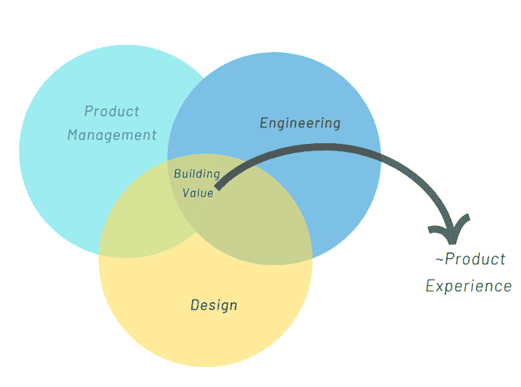
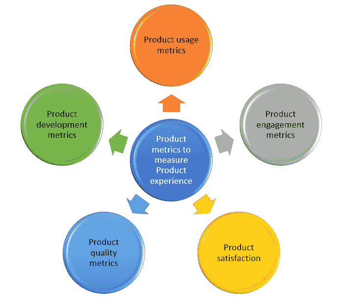

# 什么是产品体验？示例以及如何改进 PX 

> 原文：<https://blog.logrocket.com/product-management/what-is-product-experience-examples-how-to-improve-px/>

* * *

## 目录

* * *

## 什么是产品体验(PX)？

产品体验(PX)是客户旅程的一部分。它展示了用户在产品范围内的行为和参与度。

用户行为和参与通常被称为交互。良好的产品体验能让满意的交互发生，让客户能够直观地探索产品以完成他们的工作。

PX 对于以产品为导向的增长至关重要，因为它极大地促进了客户从免费增值转向订阅和保留，这是基于他们过去和随后与产品的互动。使用[产品指标](https://blog.logrocket.com/product-management/what-product-management-metrics-matter-most-to-pms/)进行衡量，如日活跃用户(DAU)、月活跃用户(MAU)、净推广者得分(NPS)、客户满意度得分(CSAT)等。随着这些指标的增长，影响来自于客户获取率、价值驱动的功能、效率、速度和产品有效性的增加。

创造良好产品体验的最佳实践包括收集客户反馈，坚持质量，遵循[以用户为中心的设计(UCD)](https://www.interaction-design.org/literature/topics/user-centered-design) 原则，进行持续实验，以及应用[数据驱动的产品管理策略](https://blog.logrocket.com/product-management/how-to-communicate-product-strategy/)。

## B2B 与 B2C 产品的产品体验

B2B 和 B2C 产品对产品体验的定义可能略有不同。然而，基本原则是一样的:解决客户问题，获得高客户满意度，通过向客户提供正确的产品价值来提高客户效率。

对于 B2C 产品，PX 之旅始于用户覆盖核心应用内的 A 点到 B 点。

B2B 中的产品体验要复杂得多，因为它不仅包括核心产品体验，还涵盖了客户旅程的一部分，包括产品手册(数字和离线)、研讨会和演示，以及产品功能和订阅的个性化和定制。各个接触点共同为 B2B 客户带来世界级的体验。

## 客户体验与产品体验

客户体验(CX)是客户通过转化漏斗接触点获得的整体体验:

1.  意识
2.  考虑
3.  购买
4.  保留和宣传
5.  购买后体验

因此，它不仅限于核心产品的知识和围绕它的入职支持，而且通常涵盖客户遇到的各种渠道——购买前与销售/营销、社交媒体、登录页面、试用、购买、CRM、履行、运输、忠诚度计划等的互动。

这些接触点共同定义了一个端到端的客户之旅，一个好的或坏的客户体验由客户在整个旅程中的参与程度来定义。

## 为什么产品体验很重要？

让我们看一个例子。假设您有一个产品，当应用程序在 web 或移动设备上加载时间太长，并且只支持特定的操作系统/版本时，客户很失望。此外，尽管这款应用拥有出色的用户界面，但其功能和特性很难理解。

这个示例应用程序没有表现出良好的 PX，因为它不易于使用，并且没有支持，无法让客户直观地完成工作。产品体验是必不可少的，因为它弥合了客户和产品之间的关系，并进一步加强了这种联系。

此外，一个好的 PX 会增加使用率，建立宣传，增加客户的终身价值(LTV)，并提高[客户保持率](https://blog.logrocket.com/product-management/what-is-customer-retention-rate-how-to-calculate/)。此外，它使公司数据驱动，实验，并快速响应市场和客户的需求。

Zoom、Slack、抖音、Tinder、谷歌、Adobe 和 Airbnb、微软都树立了卓越产品体验的典范。这些组织还推动了以产品为导向的增长理念，不断激励他们为客户提供世界级的产品体验。

## 谁负责产品体验？

构建和提升产品体验是一个迭代的过程。在大多数组织中，产品管理团队负责产品体验。产品管理团队由[产品经理、设计师和工程师](https://blog.logrocket.com/product-management/dual-track-agile-continuous-discovery/#the-trio-design-product-and-engineering)组成，他们携手创造卓越的产品体验。

The intersection point is the common goal of building a world-class product experience and delivering the right values (Source: Ben Horowitz)

良好的产品体验是依赖客户反馈的迭代开发的结果。敏捷方法非常适合这种努力，因为它提供了一个框架来帮助产品团队更快更有效地响应客户的工作。[敏捷产品团队](https://blog.logrocket.com/product-management/dual-track-agile-continuous-discovery/#the-trio-design-product-and-engineering)收集客户反馈，识别问题领域，持续评估痛点，并迭代产品(特性)。

负责产品体验的其他利益相关者包括客户支持、营销、品牌和销售。这些角色还充当客户的代言人，并向产品团队提供数据和客户输入，以评估产品的价值是否与业务目标一致。

对于 B2B 产品来说尤其如此，因为支持、营销和销售人员通常是最有资格快速了解购买者、客户需求以及更重要的痛点的人。

此外，分析团队与产品团队跨职能合作，成为打造卓越产品体验的中坚力量。分析团队量化来自各种来源的数据，并将其分类为成功指标、产品使用指标、北极星指标和与产品相关的[跟踪指标。这些指标使组织成为数据驱动的，反过来，帮助产品团队学习和增强产品体验。](https://blog.logrocket.com/product-management/what-metrics-kpis-product-managers-track/)

然而，许多产品组织更喜欢独立的产品分析团队。这个团队的主要工作是评估产品使用情况，推荐个性化产品体验的方法，并支持产品管理团队进行实验——A/B 测试、快速迭代测试和评估(RITE)、 [beta 测试](https://blog.logrocket.com/product-management/what-is-beta-testing-how-to-do-it/)等。—验证关于产品体验的假设。

构建卓越 PX 的关键是打破组织中的孤岛，授权产品管理人员、其他负责任的利益相关者和跨职能团队努力实现产品增长。

## 如何创造和管理卓越的产品体验

了解客户的需求是打造优质 PX 的第一步。同样重要的是，产品团队对市场做出反应，并设法建立良好的产品体验。

让我们回顾一下打造和管理卓越产品体验的一些技巧、策略和最佳实践:

### 个性化用户入职

一刀切的方法并不适用于所有客户或产品。个性化用户入门为客户提供直观的产品之旅。初始接触点的失真总是会导致客户流失；从一开始就有好的产品体验会给人留下好的第一印象。

为了保持流程简洁，您应该通过产品定位实现有指导的直观导航，例如，根据亲和力引导客户了解新的特性和功能，而不要用太多的信息淹没他们。

### 衡量产品成功

一些[精益产品管理实践](https://blog.logrocket.com/product-management/what-is-lean-product-management-how-to-apply/)，比如构建、测量和学习，帮助产品团队迭代地构建产品体验。产品指标提供了关于产品性能、使用、参与度、满意度和客户忠诚度的见解。

总之，这些分析有助于我们了解应用程序中用户行为的整个过程。

### 建立客户反馈回路

反馈循环是产品导向型增长的基础，分析反馈可以让产品团队采取行动。有多种方式来运行反馈循环，包括 CSAT 调查、NPS、有针对性的笔记和跟踪实时情绪。

* * *

订阅我们的产品管理简讯
将此类文章发送到您的收件箱

* * *

此外，许多组织设立焦点小组来听取客户的反馈。有些人甚至召集以用户为中心的设计(UCD)或 UX 研究团队进行有节制和无节制的用户访谈和发现会议，并关注客户行为以了解客户反馈。

### 测试和实验

A/B 测试和可用性测试有助于产品理解用户如何对特定的变化和功能做出反应，从而做出明智的决定。

为了进行实验，团队通常会建立一个假设，并与客户一起验证它。市场上有许多工具可用于运行实验，例如 [Optimizely](https://www.optimizely.com/) 。

### 努力保持产品信息的一致性

产品体验也有助于品牌塑造，一致性是整个产品旅程和接触点中客户满意度的关键。

例如，如果一个高溢价产品展示了一个过时的、非策划的平台，最简单的预测结果是关键指标将在转换漏斗中受到影响。根据客户需求和期望保持产品的一致性和个性化至关重要。

将组织引向 PLG 的愿景非常有助于构建无摩擦的产品体验。体验越好，通过最小化客户获取成本(CAC)和营销成本，产品就越繁荣。

## 如何衡量和跟踪产品体验

有一些特定的性能指标和产品指标可以帮助组织衡量产品体验。这些大致分为五类:

### 

### 产品用途

使用洞察帮助产品团队做出更好的决策，以迭代地改进产品。

最常见的产品使用指标是 **:**

*   **产品采用率**，使产品团队能够衡量有多少新客户成为常规用户，并且在首次使用后不会放弃产品。
*   **价值实现时间**，帮助您了解客户执行一项行动需要多长时间。这与客户理解产品价值所需的时间直接相关
*   **功能使用**，展示了用户在采用特定产品功能时的行为
*   **使用粘性**，显示客户对你的产品的评价频率。高粘性是产品增长的良好指标

**专业提示**:避免使用[虚荣指标](https://blog.logrocket.com/product-management/wsjf-explained-agile-teams/#optimization)来衡量产品使用情况。尽管它们看起来不错，但这些指标并没有提供正确的见解。例如，应用程序下载的数量并不表明 DAU 是否正在执行任何操作

### 产品参与度

参与度指标展示了您的客户与您的产品之间的互动程度。这是通过采用漏斗(曝光、激活和保留)来衡量的。

衡量敬业度的一些流行方法包括:

*   **执行操作的每日/每月活跃用户**
*   **保留率**，显示再次购买你的产品的顾客的百分比
*   **目标完成情况**，显示快速有效完成工作的产品用户数量
*   **每个用户的会话数**，它显示了给定时间段内客户回来使用产品的次数
*   **流失率**，显示停止使用你的产品的用户百分比

### 产品满意度

产品满意度也被称为客户反馈环，是了解客户痛点的一个重要方面。

衡量满意度的一些方法包括:

*   **客户满意度得分(CSAT)** ，衡量客户对整体产品体验的满意程度。它通常来自网站或应用程序上弹出的调查，以 1-5 的等级对产品进行评级
*   **客户努力得分** (CES)，与 CSAT 不同，它侧重于产品导航时的易用性
*   **净推介值** (NPS)调查，反映你的产品特性的受欢迎程度。NPS 将受欢迎程度分为三类:诋毁者、被动者和促进者

**专业提示**:为了最大限度地利用客户反馈指标，建立一个收集、学习和应用反馈的流程，以改善产品体验

### 产品质量

产品质量度量帮助您最大限度地减少客户问题，持续改进和减少缺陷。

产品质量通过以下方式衡量:

*   构建失败率，确保产品可靠地工作
*   缺陷和检测有效性，它确保产品团队如何有效地识别缺陷
*   [代码覆盖率](https://blog.logrocket.com/comparing-react-native-code-coverage-and-testing-tools/)，它测量产品源被测试的程度
*   缺陷率，衡量每单位的代码质量

### 产品开发

产品开发度量使您能够跟踪和控制您的团队构建产品的速度。这是一个重要的指标，因为它影响上市时间。

[敏捷方法](https://blog.logrocket.com/product-management/12-agile-manifesto-principles-how-to-adopt-them/)帮助工程团队实现持续开发和集成，以尽可能快地实现价值，同时创造卓越的产品体验。

用于跟踪产品开发的指标包括:

*   **正常运行时间**，表示产品在规定基线下的可用性。通常，基线被定义为 99.6667%
*   **按时交付**，这有助于您提高交付的可预测性，并使团队能够纠正任何可能偏离基线的问题
*   **团队速度**，它被定义为产品团队通常在每个 sprint 中完成的故事点的数量

## 结论

对于产品团队来说，根据产品需求选择和定义正确的指标来跟踪产品体验是至关重要的。它还应该根据这些指标的洞察力及时采取行动。

团队学习和持续改进产品越多，产品体验就越好。

*精选图片来源:[icon scout](https://iconscout.com/icon/satisfaction-3230594)*

## [LogRocket](https://lp.logrocket.com/blg/pm-signup) 产生产品见解，从而导致有意义的行动

[LogRocket](https://lp.logrocket.com/blg/pm-signup) 可以识别用户体验中的摩擦点，以便用户就产品和设计更改做出明智的决策，从而实现目标。

借助 LogRocket，您可以[了解影响您产品的问题的范围](https://logrocket.com/for/analytics-for-web-applications)，并优先考虑需要进行的更改。LogRocket 允许工程和设计团队使用与您相同的[数据工作，从而简化了工作流，消除了对需要做什么的任何困惑。](https://logrocket.com/for/web-analytics-solutions)

让你的团队步调一致——今天就试试 [LogRocket](https://lp.logrocket.com/blg/pm-signup) 。