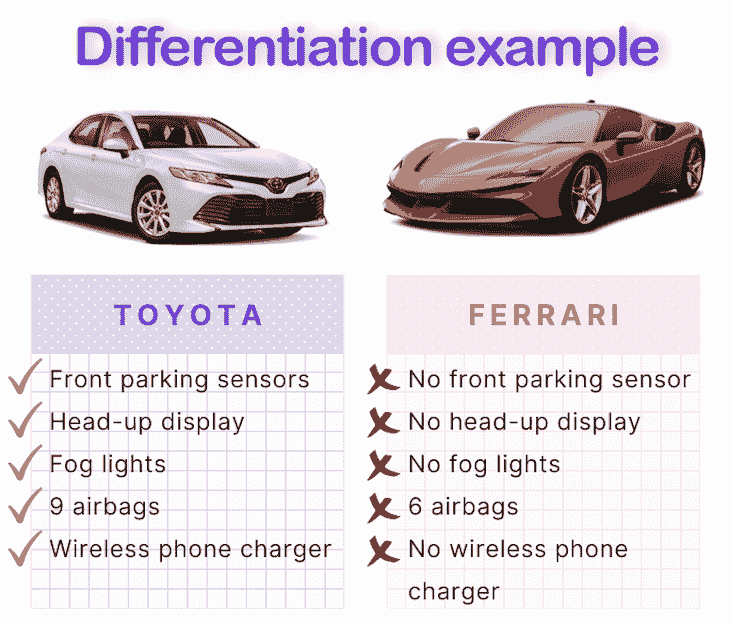
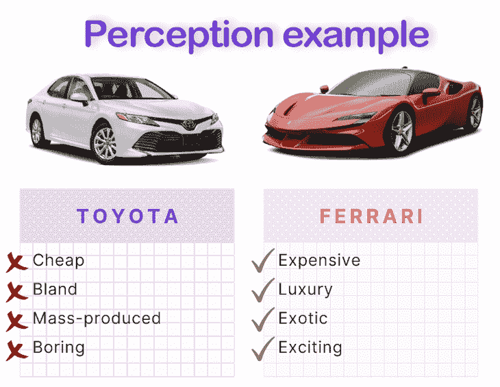
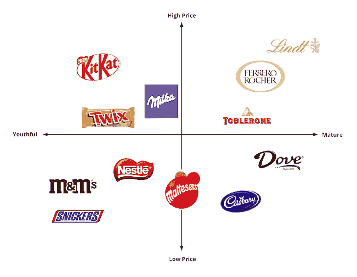
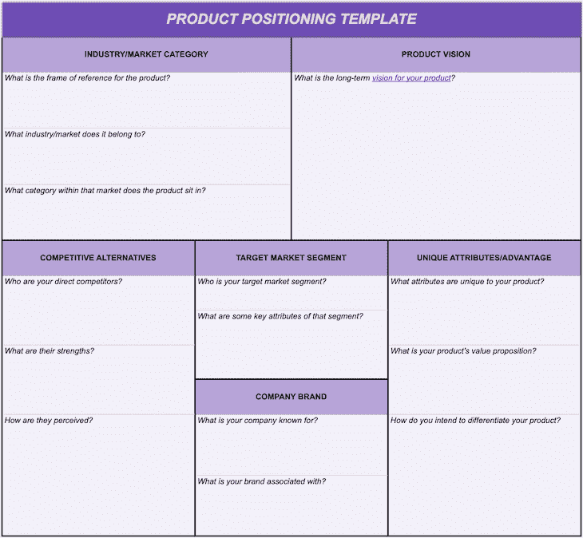

# 什么是产品定位？示例、策略和模板

> 原文：<https://blog.logrocket.com/product-management/what-is-product-positioning-examples-strategies-template/>

正确的定位可以将苦苦挣扎的产品转变为畅销产品。那是因为定位关乎感知；校准对你产品的正确认知对于传达它给竞争对手带来的价值是至关重要的。

* * *

## 目录

* * *

## 产品定位的定义是什么？

产品定位是定义你的产品相对于你的客户所认为的竞争对手在市场中的位置的行为。

让我们来分解一下产品定位的定义:

*   **"… w *这里你的产品适合市场**…**"****——*你的产品是什么，不是什么？
*   ***“……**相对于竞争对手**……”****—*你的竞争对手是谁，你的产品与他们的相比如何？
*   ***“…作为***……”******—*这最后一条尤为重要；产品定位更多的是关于你的产品的感觉，而不是任何种类的物理差异*

 *## 产品定位与差异化

产品定位不是差异化。一个产品的定位必须与其差异化相结合，但这不是一回事。

下面是描述产品定位和差异化之间区别的最简单方式:

*   **分化**是*有形*
*   **定位**是*感性*

换句话说，产品的差异化(通常)是有形的差异。例如，你的产品比你的竞争对手提供更好的功能吗？

假设您正在比较丰田凯美瑞和法拉利的功能:

如你所见，如果你只关心功能性和实用性，丰田是更好的。

另一方面，定位是感性的。它与实际的特性和功能没有什么关系。

你的产品是如何被感知的？是否被视为奢侈品？高端还是预算？它是否被视为比你的竞争对手质量更高？或者，它被认为是有趣的和更有创意的吗？

让我们再来看看丰田和法拉利的例子:

这就是产品定位——相对于你的竞争对手，市场如何看待你的产品。

现在你已经确定了你的产品定位，你可以用它来区分你的产品。这两者需要齐头并进，但关键的区别是定位是关于感知，而不是物理差异。

## 为什么产品定位很重要？

产品定位很重要，因为虽然物理差异很好，但决策往往是基于产品的感知。

例如，购买一辆豪华车或一个手提包是情绪化的——不是因为它的外观、设计或尺寸，而是因为它的感觉。

毕竟，没有人会因为没有平视显示器或无线充电而决定不买法拉利；他们(以过高的价格)购买它，因为它是一辆*法拉利*！

产品和品牌的定位使得它们带有某种感觉，不管实际的物理特征如何，这种感觉都是非常令人想要的。利用感知的力量可以减少对物理差异的需求，并使您能够要求更高的价位。

## 定义你的产品定位策略

以下因素会影响您的产品定位策略:

### 市场分析

定义产品定位策略的第一步也是最重要的一步是了解你的市场。

虽然进行市场分析没有单一的方法，但您可以探索的一些核心问题包括:

*   谁是你所在市场的核心人群？他们是学生吗？富裕家庭？退休人员？
*   需要考虑哪些法规和法律？
*   市场趋势是什么？市场是在增长还是在萎缩？或许正在经历一场重大变革或一段混乱时期？
*   市场受外力冲击有多大？政治、地理和经济影响是什么？
*   市场及其未来的假设、风险和不确定性是什么？

### 竞争格局

产品定位是关于你的产品相对于他们的直接竞争对手是如何被感知的。因此，充分了解你的竞争对手是至关重要的。

当然，你要深入了解你的竞争对手，他们的优势和劣势，以及差异化。同样重要的是，你要分析竞争对手的战略，以及他们在市场中的定位。

构建竞争格局的整体图景可以帮助您识别市场中可能饱和或服务不足的位置。一个很好的工具是[感知映射](uid=441018385899777680768920&h2=What-is-a-perceptual-map?)(稍后会详细介绍)。

* * *

订阅我们的产品管理简讯
将此类文章发送到您的收件箱

* * *

### 目标细分市场

定义你的[目标细分市场](https://www.qualtrics.com/experience-management/brand/what-is-market-segmentation/)是产品定位的核心。例如，假设你想将你的产品定位为奢侈品，但你的核心目标市场是青少年。不用说，他们中很少有人能买得起你的产品。

另一个例子是针对早期创业公司的 B2B 产品，而不是针对大型企业的 B2B 产品。后者会更注重被认为是安全、可靠和有能力的。前者会更关注将自己定位为年轻和有趣。

### 公司和品牌价值(和定位)

你的产品定位将受到你的公司品牌及其当前定位的严重影响。

例如，苹果将自己定位为创新和有创造力的，并试图瞄准这个市场。很长一段时间，苹果利用这一声誉将自己与其他电脑品牌区分开来，并赢得了从音乐家到艺术家等创意专业人士的客户群。

因此，苹果的产品也体现了这种精神:它们美观，通常色彩鲜艳，设计不同于任何竞争对手。

### 产品愿景和价值主张

最后，你的[产品愿景](https://blog.logrocket.com/product-management/what-is-a-product-vision-statement-examples/)和[价值主张](https://blog.logrocket.com/product-management/what-is-product-market-fit-measure-examples/#product)在产品定位中起着关键作用。理解关键区别点——你的护城河——是定义什么使你的产品在市场上独一无二的核心。一个有效的产品定位将在这一点上磨练和放大。

## 什么是感知地图？

我了解市场以找到理想产品定位的常用工具之一是[感知图](https://en.wikipedia.org/wiki/Perceptual_mapping)。

感知映射，也称为市场映射，是一种图形技术，用于可视化竞争产品的相对定位。感知图通常采用 2×2 矩阵的形式，旨在找出直接竞争对手之间的相对位置。

感知地图可以帮助您识别市场缺口、拥挤的定位以及何时需要重新定位。

感知地图上的轴会根据你的市场、产品和客户而变化。

例如，您可以根据产品是否被认为是:

*   便宜<>贵
*   低质量高质量
*   年轻的<>成熟的
*   有趣<>严肃
*   小<>大
*   常见的<>罕见的

创建感知地图没有完美的科学。然而，感知地图应基于研究，即竞争分析和客户研究。使用这些数据，您需要确定哪些属性对您的客户很重要，以及他们如何看待市场上的产品。

如果您愿意，您还可以在客户访谈中通过基于感知的问题来验证您的感知图。

## 成功的产品定位示例

艾普丽尔·邓福德(April Dunford)在她的书《明显令人敬畏的 T2》中分享了一个关于正确定位所能产生的影响的个人故事。

在一家 B2B 数据库产品的初创公司工作时，该公司正为销售而苦苦挣扎。尽管该产品优于其竞争对手，但该公司发现客户往往不了解该产品将为他们当前的数据库解决方案带来的价值。最后，邓福德的团队遇到了一个潜在客户，他认为该产品根本不是数据库，而是一个商业智能工具。

通过将产品重新定位为商业智能工具，销售团队看到了立竿见影的效果。一旦潜在客户停止将产品与他们现有的数据库进行比较，他们就开始理解该产品旨在解决的问题以及它可能带来的价值。

如您所见，正确定位您的产品可以改变游戏规则。[苹果](#apple-macbook)、[耐克](#nike-shoes)、 [Lush](#lush) 、[巴塔哥尼亚](#patagonia)都是产品定位做得特别好的公司的例子。

让我们更深入地了解每个产品定位示例。

### 苹果(MacBook)

苹果利用其创新公司的声誉，将自己定位于有创造力的个人。它在市场上的主导地位如此之好，以至于你很难找到一个不使用 MacBook 的设计师。

这种定位体现在 MacBook 的各个方面，从面向创意行业的应用程序，如用于视频编辑的 Final Cut Pro 和用于音乐的 Logic Pro，到其时尚的设计和挑战常规的独特功能。

### 耐克鞋

耐克将自己定位为精英运动员的品牌。从它的口号“照做就是了”到产品本身，它的定位是推动人类表现的极限，而产品本身往往是运动员的首选。

### 丰富的

Lush 以其手工制作、不含动物和化学物质的产品而闻名。他们将自己定位为一家可持续发展的、有道德的公司，不做动物试验，生产不仅对你有益，而且对环境有益的产品。这转化为 Lush 独特的商店设计和产品本身。

例如，你会发现在一个豪华的商店里，除了付款时用再生纸包裹之外，没有任何包装。产品本身是不完美和脆弱的，经常有瑕疵。这并没有降低产品的价值；事实上，它很好地发挥了它的定位，宣传产品是手工制作的，不含化学物质。

### 巴塔哥尼亚

几年前，巴塔哥尼亚上了头条新闻，当时他们发起了一场名为“不要买这件夹克”的黑色星期五广告活动。这场运动是反对快速时尚和促进可持续发展的游说。

巴塔哥尼亚的公司使命引领公司参与积极的可持续发展工作。这转化为他们的产品和服务，从 100%回收材料到免费维修服务。

## 产品定位模板

定义您的产品定位策略从围绕以下要素的关键考虑开始:

*   您的[产品愿景](https://blog.logrocket.com/product-management/what-is-a-product-vision-statement-examples/)
    *   你的产品的长期愿景是什么？
*   行业/市场类别
    *   产品的参照系是什么？
    *   属于什么行业？
    *   它在你的市场/行业中属于哪个类别？
*   竞争对手
    *   谁是你的直接竞争对手？
    *   他们的优势是什么？
    *   他们是如何被感知的？
*   目标细分市场
    *   谁是你的目标市场？
    *   你的产品将进入的细分市场的一些关键属性是什么？
*   独特的属性/优势
    *   你的产品有哪些独特的属性？
    *   你的产品的价值主张是什么？
    *   你打算如何使你的产品与众不同？
*   公司品牌
    *   你的公司以什么闻名？
    *   与你的品牌相关的关键属性是什么？

下载可定制的 [Google Sheets 版本的产品定位模板](https://docs.google.com/spreadsheets/d/1dyHlbsgw_VMf3qWUKeJ1YXI088hOM6QFVzdk5gM5tcs/edit?usp=sharing)，如下所示:

## 结论

产品定位可以成就你的产品，也可以毁掉你的产品。如果你在市场上的地位很差，你的产品就会沉没。

请记住，要获得正确的定位，您需要对您的市场、客户和竞争对手有很好的了解。有一个很好的工具可以帮助你想象这一点，这就是感知映射。它可以帮助您识别市场中的饱和位置和服务不足的位置，帮助您找到产品的理想定位。

*精选图片来源:[icon scout](https://iconscout.com/icon/graph-217)*

## [LogRocket](https://lp.logrocket.com/blg/pm-signup) 产生产品见解，从而导致有意义的行动

[LogRocket](https://lp.logrocket.com/blg/pm-signup) 确定用户体验中的摩擦点，以便您能够做出明智的产品和设计变更决策，从而实现您的目标。

使用 LogRocket，您可以[了解影响您产品的问题的范围](https://logrocket.com/for/analytics-for-web-applications)，并优先考虑需要做出的更改。LogRocket 简化了工作流程，允许工程和设计团队使用与您相同的[数据进行工作](https://logrocket.com/for/web-analytics-solutions)，消除了对需要做什么的困惑。

让你的团队步调一致——今天就试试 [LogRocket](https://lp.logrocket.com/blg/pm-signup) 。*