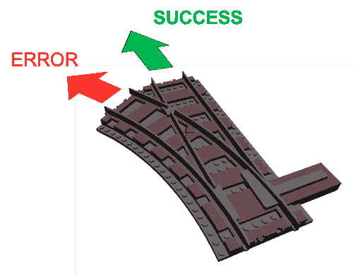
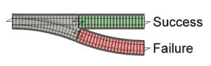
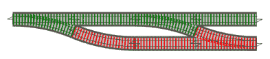
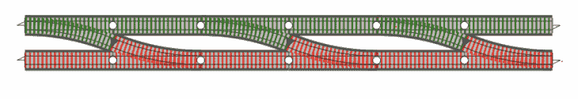

# 什么是面向铁路的编程？

> 原文：<https://blog.logrocket.com/what-is-railway-oriented-programming/>

## 错误处理的不同方法

我最近偶然发现了 Scott Wlaschin 关于面向铁路的编程的演讲，他谈到了一种使用函数方法处理错误的新方法。在这个讲座中，他用一条铁路轨道作为类比，让开发人员更好地理解这个模式。哲学本身与编程没有直接关系，但是它可以帮助你改进你的代码库。

面向铁路的编程是一种按顺序执行功能的函数方法。我将在这里使用错误处理作为案例研究。除了错误处理，面向铁路的模式还有其他各种应用。

要点是你的函数只能返回成功或者失败。应该使用`[throw](https://developer.mozilla.org/en-US/docs/Web/JavaScript/Reference/Statements/throw)`语句处理失败，以便抛出异常，而成功则导致另一个函数，它可以是任何类型。

这种错误处理方式使用一元行为，这是处理错误的替代方式。我非常喜欢这种风格的一点是它为您的代码库提供了优雅和可读性。

如今，几乎不可能有一个不需要处理错误的程序。[即使是最简单的程序也需要错误处理](https://blog.logrocket.com/rethinking-frontend-apm/)，从验证用户的输入细节、网络问题、处理数据库访问期间的错误，以及编码时可能出现的许多相关情况。

回到面向铁路的编程到底是什么。下面是这种情况的直观表示:



更简单地说，每个方法或函数要么产生成功，要么产生错误(不过，失败这个词对我来说听起来更酷。)

在现实世界的应用程序中，我们可能也想从错误走向成功。例如，这在 Node.js 中称为自我修复。

根据我的理解，我发现面向铁路的模式有各种各样的应用，不仅仅是错误处理。一个是[控制流](https://developer.mozilla.org/en-US/docs/Glossary/Control_flow)。这种想法将交互性融入到应用程序中，从而提供了条件。

现在，让我们更深入地了解这个模式的细节。最终，面向铁路的编程归结为两个选项:快乐的路径和不快乐的路径。

### 快乐之路

假设我们想读取一个文件的内容，并以电子邮件的形式发送给客户。为了成功完成此任务，客户的电子邮件必须有效，并且必须有完整的名称。

```
# Happy Path
> read file
> get email address
> get firstname and lastname
> send email
```

其中:

```
const sendWayBillMail = async() => {
  const data = await fs.readFile('emailContent.txt', 'binary')
  const { emailAddress, firstName, lastName } = await User.findById(userId)
  sendMail(emailAddress, firstName, lastName, data)

  return 'Done'
}
```

这就是了。这让我们很开心。这看起来很理想，但在现实生活中并不完美。如果我们没有得到我们想要的具体结果呢？文件无效怎么办？如果我们的`firstName`没救了怎么办？如果呢？如果呢？现在，我们在这里很不开心。有很多事情可能会出错。

不愉快路径的一个例子是:

```
const sendWayBillMail = async() => {
  const data = await fs.readFile('emailContent.txt', 'binary')
  if (!data){
    return 'Empty content or invalid!'
  }
  const { emailAddress, firstName, lastName } = await User.findById(userId)

  if (!emailAddress) {
      return 'Email address not found!'
    }  

  const isValidated = await validateEmail(emailAddress)

  if (!isValidated) {
      return 'Email address not valid!'
    }
  if (!lastName) {
    return 'Last name not found!'
  }
  if (!firstName) {
    return 'First name not found!'
  }

  sendMail(emailAddress, firstName, lastName, data)

  return 'Done'
}
```

不幸的道路比预想的发展得更快。首先，您认为读取的文件可能是空的或无效的。然后，您会看到`isValidated`响应可能会失败。然后你记得你需要检查一封空邮件。然后你意识到`lastName`一定不在那里，等等。

找到不愉快的路径总是一个相当大的挑战，这对构建软件非常不利。您可能会在收件箱中发现一系列来自用户的错误报告。最好的办法是永远站在用户的角度考虑问题。

### 我们的救世主

面向铁路的编程的主要目标是确保每个函数或方法应该并且必须总是返回成功或失败。把它想象成一条典型的铁路轨道——它要么向左走，要么向右走。

主要的想法是处理快乐的路径，就像它是主要的路径一样——它应该是你通常前进的方向。在下图中，是绿色的轨道。如果有失败，我们就进入错误轨道。在我们的例子中，是红色的轨迹。

我们停留在这个轨道上，直到使用恢复来处理错误，将流程转移回主轨道。



通过这种方法，我们将错误处理推到它应该在的地方，并在创建管道时控制异常流。如果有一个快乐的结果，一切都在绿色轨道上移动，如果我们得到一个不快乐的结果，它在那一瞬间切换到红色轨道，流向终点。



那么，我们如何将它应用到我们当前的代码中呢？ROP 的主要思想还是创建几个函数，这些函数可以在两个轨道之间切换，同时仍然遵循管道。

这种“转换”的想法带来了双轨系统:



在我们的代码中，我们已经有了`validateEmail`函数，所以我们只需通过添加 if/else 将开关应用于它。If/else 将处理成功和失败函数。

```
const validateEmail = async (email) => {
  if (email.includes('@')) Success
  else Failure
}
```

但是，上面的代码语法是不正确的。我们通过绿色和红色轨迹来展示成功和失败。

这种观点要求我们将每一项任务都作为一个函数来实现，这样除了一个接口之外就没有其他接口了。这提供了更好的代码可维护性和对应用程序流的控制。

```
const sendWayBillMail = async(file) => {
  const data = await readFile(file)

  const { emailAddress, firstName, lastName } = await User.findById(userId)

  const response = await checkForNull(emailAddress, firstName, lastName)

  const isValidated = await validateEmail(response.emailAddress)

  sendMail(response.emailAddress, response.firstName, response.lastName, data)

  return 'Done'
}
```

在每个函数中，我们通过两个跟踪单元处理应该处理的错误。上述代码仍然可以重构，以实现简单性和可靠性。

* * *

### 更多来自 LogRocket 的精彩文章:

* * *

## 面向铁路规划的优势

重要的是要记住，铁路模式是一种方向或设计风格。这与代码本身关系不大，更多的是将模式应用到代码中以提高效率和可靠性。

一般来说，模式有优点也有缺点。也就是说，您应该将面向铁路的编程视为您为代码做出的选择，而不是在构建应用程序时必须遵循的规则。

决定如何执行错误处理是一个视角问题，这就是为什么我们有面向铁路的模式。

如果您打算选择利用面向铁路的编程，下面是您将看到的一些好处:

*   **真实性**:每一个功能总会产生一个失败或者一个成功
*   **清晰度**:非常容易涂抹，也相当清晰。它不需要您实现任何特殊的功能
*   **兼容性**:通过组合连接的每个功能(或任务)都是兼容的。这意味着每个函数都是一个黑盒，在开发人员的可维护性期间不会干扰下一个函数

以上优势最终会改善你的代码库。它伴随着测试驱动开发而来，不会影响应用程序的性能。

## 结论

本文帮助您理解“并行错误处理”技术的概念。你可以通过查看 Scott Wlaschin 的关于这个模式的完整讲座来获得更多关于这个方法的信息。

面向铁路的编程让我们感觉到我们的验证是一个独立的功能，[为我们的管道](https://blog.logrocket.com/crafting-build-pipelines-with-docker/)创建两个结果。现在，您可以应用这个方法，以一种简洁而实用的方式处理代码中的快乐和不快乐的路径。

## 通过理解上下文，更容易地调试 JavaScript 错误

调试代码总是一项单调乏味的任务。但是你越了解自己的错误，就越容易改正。

LogRocket 让你以新的独特的方式理解这些错误。我们的前端监控解决方案跟踪用户与您的 JavaScript 前端的互动，让您能够准确找出导致错误的用户行为。

[](https://lp.logrocket.com/blg/javascript-signup)

LogRocket 记录控制台日志、页面加载时间、堆栈跟踪、慢速网络请求/响应(带有标题+正文)、浏览器元数据和自定义日志。理解您的 JavaScript 代码的影响从来没有这么简单过！

[Try it for free](https://lp.logrocket.com/blg/javascript-signup)

.