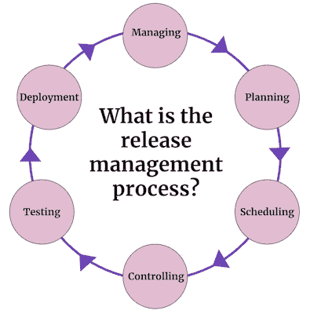

# 什么是发布管理？敏捷团队的 3 步流程

> 原文：<https://blog.logrocket.com/product-management/what-is-release-management-3-step-process-agile-teams/>

你的释放策略是你学习速度的关键，否则会损害你的形象。

在对一个秘密功能进行了几次冲刺之后，终于到了让它上线的时候了。当我们准备发布我们的市场整合启动状态时，每个人都感到紧张和兴奋。

什么会出错？

我们为此工作了一个多月，运行了自动化测试，并遵循了我们的计划。我们毫不犹豫地点击了上线按钮，等待反馈，没用多长时间。

发布三分钟后，我接到市场总监的电话。他的声音咄咄逼人，我感到焦虑。他说:

“不管你做了什么，现在就把它还原。所有产品都从我们的市场蒸发了。你把他们找回来的每一分钟都会让我们付出金钱和名誉的代价。”

我们是如何到达那里的？

不幸的是，和许多团队一样，我们有一个大爆炸式的部署。尽管我们称自己为 scrum 团队，但我们没有足够快的学习能力。

在本指南中，我将演示如何通过实现一个简单的三步发布管理过程来避免这种痛苦的经历。

* * *

## 目录

* * *

## 什么是发布管理？

定义产品可用的频率对于任何团队来说都是一个重要的考虑因素。这就是所谓的发布管理。

公司越现代化，发布就越频繁。例如，亚马逊一天发布几款产品。由于持续部署，这是可能的，这也使得在必要时恢复更改变得更加容易。

其他公司不那么频繁地大规模发布。这种方法使得发布软件更加困难，因为它需要更复杂的版本控制、合并和质量保证。

你发布的越频繁，就越容易对问题做出反应。

### 传统的发布管理过程是什么样子的？

传统的发布管理过程可以被视为一个由以下阶段组成的循环:

*   规划
*   行程安排
*   控制
*   测试
*   部署
*   管理的

尽管每一个都很重要，正如我们将在下面提到的，我们不会过多的讨论发布管理过程的各个阶段。相反，我们将强调敏捷团队在发布变更时经常陷入的一些陷阱和反模式，并概述一个新的三步流程，以帮助确保您未来的部署更加顺利。

## 发布变更时的常见问题和反模式

在过去的几十年里，向最终用户发布软件曾经是一个大日子。

我把它比作向太空发射火箭。许多专家聚在一起，评估几十个，如果不是几百个项目，并决定是否发射。赌注很高。不允许有任何错误。

发布软件曾经有那种紧迫感。您会发现以下内容:

*   **回滚计划**——让一些东西活起来很难；恢复它是一场噩梦。团队必须创建回滚计划，以确保他们知道当出现问题时该做什么
*   **测试计划** —大多数公司都有一个庞大的计划[来评估一个发布是否成功](https://blog.logrocket.com/product-management/how-to-measure-success-after-product-launch/)。一组人负责手动运行详尽的测试，创建错误报告，并将它们交付给软件工程师
*   **全有或全无** —要么让每个人都可以使用该功能，要么不让任何人使用。这就是为什么每个人都对部署如此谨慎。它会影响整个用户——这意味着如果你做了什么，每个人都会注意到
*   部署工程师 —发布意味着很多责任。整个团队中可能只有一两个人有权按下“释放”按钮
*   **多级** —在将软件发布到产品之前，团队会经历不同的阶段，可能包括开发环境、试运行，然后是预生产。这一切都是为了[在一个活生生的环境中避免一场大灾难](https://blog.logrocket.com/product-management/crisis-management-plan-5-steps-examples/)

尽管采取了这些谨慎的措施，团队仍然面临不可预见的问题，必须集中精力解决问题。上面描述的反模式和陷阱应该是过去的遗物，但是我今天仍然看到其中的一些特征。

## 成功发布管理的三步流程

以上提到的问题不仅仅是速度，还有修复问题的成本和大量的时间消耗。

* * *

订阅我们的产品管理简讯
将此类文章发送到您的收件箱

* * *

幸运的是，有一种方法可以更有效地发布变更，并使您能够获得更好的洞察力来持续改进。你需要做的就是遵循这三个步骤:

1.  [限制爆炸半径](#limittheblastradius)
2.  [快速释放](#releasequickly)
3.  [测量结果](#measureresults)

### 1.限制爆炸半径

敏捷性的核心部分之一是我们加速学习的能力。尽快测试我们的想法是最基本的。

然而，这并不意味着向你的所有观众展示新的功能。这是一个危险的赌注，往往适得其反。

提高我们向用户学习的能力是非常重要的。为此，限制受众至关重要:

*   **有限范围** —减少用户使用新功能的能力；例如，1%的观众。逐渐扩大规模是可能的
*   **量身定制的受众** —大多数时候，你希望有特定的受众来测试你的新功能。这使你能够向你想为之创造价值的人学习；例如，在过去四周内购物的用户。

为什么不立即向所有人发布变更呢？很简单:开始的时候，你想通过构建来学习，如果有意义的话就扩展。

作为一个经验法则，你应该假设 10 个想法中有 9 个不会像预期的那样起作用。向所有观众展示你的坏主意是不明智的。

### 2.快速释放

你把你的软件拿到用户手里有多容易？在发布之前，你会紧张吗？还是对有机会[向你的观众](https://blog.logrocket.com/product-management/consumer-insights-how-to-use-examples/)学习充满热情？

传统上，公司计划发布并为大日子做准备。这应该是过去的事了。

让我这么说吧:你释放得越快，你学得越快。这很重要，因为你可能不会从一开始就把事情做好。

[产品主导的公司](https://blog.logrocket.com/product-management/what-is-product-led-growth-strategies-principles-examples/)每天做几个发布；过时的公司每月最多发布一个版本。

你把你的作品送到用户手中的时间越长，赌注就越大。除非你想靠运气，否则这条路是走不通的。我们已经有了更好的释放方式。

发布变更应该是微不足道的；它应该在几分钟内发生。

回滚应该是一样的。如果你使用[连续部署](https://www.atlassian.com/continuous-delivery/principles/continuous-integration-vs-delivery-vs-deployment)，那对你来说已经是旧闻了，但是许多公司仍然没有。

问问你自己，你会信任一个初级软件工程师发布产品中的变更吗？如果你的答案是否定的，那么你缺少一个自动防故障的发布过程。

### 3.测量结果

好吧，假设你可以在几分钟内定制你的受众并发布改变。你还需要什么？这还不够好吗？没那么快。

价值驱动思维的美妙之处在于了解你是否在创造价值。你必须保持好奇。

用户会给你惊喜。你在发现、假设测试等方面投入了多少努力并不重要。一旦人们开始使用你闪亮的新功能，他们会想出一些意想不到的东西。从中吸取教训至关重要。

这是一种常见的反模式，让特性生效，然后跳到下一个特性，或者搜索确认你做得对不对。这两者都不会帮助你更快地创造价值。

你创造的一切都是达到目的的手段。我想在你开始工作之前，你已经知道你想要实现什么。我是说，一旦你有了活的东西，你需要弄清楚你是否达到了你的目标。

分段测试——更好地称为 [A/B 测试](https://blog.logrocket.com/product-management/what-is-a-b-testing-optimizely-demo-examples/)——通常用于测量结果。当你在改进某样东西和比较结果时，它们会很有帮助。虽然我强烈推荐你进行 A/B 测试，但你不必局限于这种方法。

关键是衡量你提供给观众的任何东西的效果。目的是根据证据采取行动。一旦你学会了什么，你就可以检查和适应。游戏的名字是创造价值，而不是运输功能。

## 结论:从我的错误中吸取教训

我以一个故事开始这篇文章，在这个故事中，我的团队完全弄错了。我们对所有观众进行了一次大爆炸式的部署，几分钟内一切都崩溃了。我们花了几天时间来解决我们造成的混乱，花了几个月来恢复我们的信誉。

不要重蹈我们的覆辙；投入时间让您的团队准备好尽可能平稳地处理发布。好处是无法估量的。

*精选图片来源:[icon scout](https://iconscout.com/icon/checklist-1627460)*

## [LogRocket](https://lp.logrocket.com/blg/pm-signup) 产生产品见解，从而导致有意义的行动

[LogRocket](https://lp.logrocket.com/blg/pm-signup) 确定用户体验中的摩擦点，以便您能够做出明智的产品和设计变更决策，从而实现您的目标。

使用 LogRocket，您可以[了解影响您产品的问题的范围](https://logrocket.com/for/analytics-for-web-applications)，并优先考虑需要做出的更改。LogRocket 简化了工作流程，允许工程和设计团队使用与您相同的[数据进行工作](https://logrocket.com/for/web-analytics-solutions)，消除了对需要做什么的困惑。

让你的团队步调一致——今天就试试 [LogRocket](https://lp.logrocket.com/blg/pm-signup) 。

[David Pereira Follow](https://blog.logrocket.com/author/davidpereira/) Product Leader with 15+ years of experience. Partner at Value Rebels and interim CPO at omoqo. Almost every product team is trapped somehow; untrapping them is what drives me.