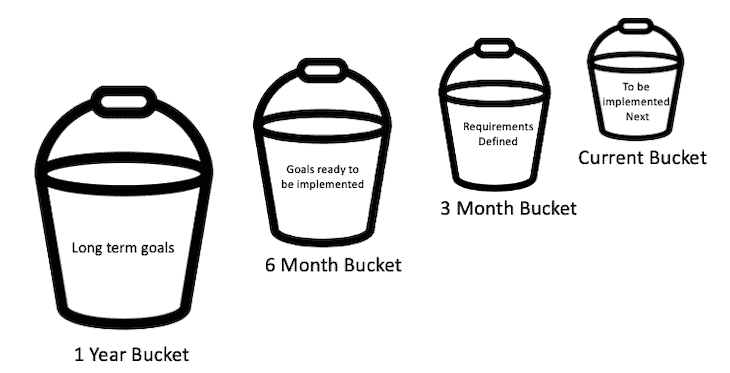
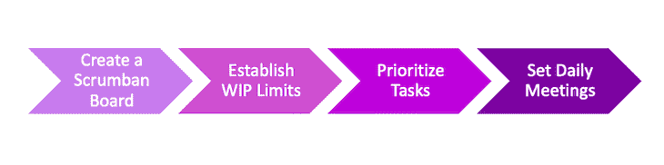

# scrumban 方法论是什么，如何实现？

> 原文：<https://blog.logrocket.com/product-management/what-is-scrumban-methodology-how-to-implement/>

在本指南中，我们将定义 scrumban 方法，解释它是如何工作的，并强调单独采用 scrumban 相对于看板或 scrum 的一些优势。

我们还将为产品经理介绍实现 scrumban 方法的步骤，帮助他们的敏捷团队实现两个世界的最佳状态。

* * *

## 目录

* * *

## scrumban 是什么？

Scrum 和看板是两种非常流行的敏捷方法。Scrumban，顾名思义，是 [scrum](#what-is-scrum) 和[看板](#what-is-kanban)的组合。

这种混合方法结合了两种框架的最佳特性 scrum 的结构和可预测性与看板的灵活性和可视化——使团队更加高效和多产，并帮助他们不断改进。

### scrum 是什么？

Scrum 是一个敏捷的框架，它使团队能够逐步完成较小的工作块(而不是持续地处理大块工作),以[交付工作产品](https://blog.logrocket.com/product-management/12-agile-manifesto-principles-how-to-adopt-them/#3-deliver-working-software-frequently)。敏捷方法旨在帮助产品团队接受敏捷宣言中概述的[价值观](https://blog.logrocket.com/product-management/four-agile-manifesto-values-explained/)和[原则](https://blog.logrocket.com/product-management/12-agile-manifesto-principles-how-to-adopt-them/)，包括[适应性](https://blog.logrocket.com/product-management/12-agile-manifesto-principles-how-to-adopt-them/#2-welcome-changing-requirements)和[持续改进的承诺](https://blog.logrocket.com/product-management/12-agile-manifesto-principles-how-to-adopt-them/#12-reflect-and-adapt)。

在 scrum 中，产品团队在一个叫做[冲刺](https://blog.logrocket.com/product-management/what-are-five-types-of-scrum-meetings/#what-are-sprints)的限时事件中完成一组定义好的任务。短跑可以持续一到两周。在 sprint 结束时，涉众评审完成的工作，并向构建产品的人提供反馈。

Scrum 围绕着一套 [scrum 仪式](https://blog.logrocket.com/product-management/what-are-five-types-of-scrum-meetings/)，包括[冲刺规划](https://blog.logrocket.com/product-management/what-is-sprint-planning-guide-meeting-agenda-cheat-sheet/)、[日常 scrum](https://blog.logrocket.com/product-management/the-daily-scrum-meeting-overview-best-practices-anti-patterns/) 、[冲刺回顾](https://blog.logrocket.com/product-management/what-is-a-sprint-review-meeting-agenda-example/)、[回顾](https://blog.logrocket.com/product-management/what-is-a-sprint-retrospective-templates-and-best-practices/)、[积压细化](https://blog.logrocket.com/product-management/what-is-backlog-grooming-aka-refinement/)。

每日 scrum 会议每天早上召开，以跟踪团队的进展，并移除任何需要解决的障碍。产品负责人对待办事项进行排序和[优先级排序](https://blog.logrocket.com/product-management/sprint-backlog-how-to-prioritize-examples/)，而独立团队在优先级任务列表上工作，以在每个冲刺阶段结束时以小增量交付。

### 什么是看板？

看板源于制造业，关注流程步骤。日语单词“看板”的意思是视觉板。

采用看板方法的团队在一块板上以卡片的形式显示工作项目。然后，这些卡片在代表流程步骤的各个泳道中移动，例如“准备好”、“进行中”、“测试中”、“关闭”等。

看板方法使整个团队能够直观地看到正在做什么，哪里出了问题。如果需要，卡片可以向后移动。这样，团队可以专注于改善每个流程步骤的交付周期，从而更快地完成项目，换句话说，就是更快地向客户交付价值。

## scrumban 方法论是如何工作的？

根据定义，Scrum 是结构化的和严格的，因为需要定期的迭代计划、评审和回顾。看板为 scrum 过程增加了持续改进、可视化和灵活性。

一个被称为 scrumban 的混合模型对于受到 scrum 和看板作为独立方法的局限性挑战的团队来说尤其有价值。Scrumban 的开发是为了促进从 scrum 到看板的过渡。由于 scrumban 相对于 scrum 和看板的优势，它逐渐流行起来。

## 实现 scrumban 有什么好处？

组织采用 scrumban 是因为它结合了 scrum 和看板的优点，同时去掉了缺点。这对于需要连续流程的项目特别有用。

以下是在您的组织中采用 scrumban 方法的一些最显著的优势:

### 轻松高效的团队

Scrumban 没有指定任何[团队角色](https://blog.logrocket.com/product-management/3-scrum-roles-agile/)；这个团队是[自组织](https://blog.logrocket.com/product-management/12-agile-manifesto-principles-how-to-adopt-them/#11-trust-your-team)的，在工作方式上很灵活。团队成员可以选择自己的任务，管理人员的参与最少。这种环境使团队更有效率和生产力。

### 易于采用

Scrumban 的规则和指导方针很简单，因此它们可以被任何行业采用。视觉板帮助团队保持在正确的轨道上，无截止日期的环境使团队能够灵活地适应不断变化的需求。

### 持续改进

关注过程步骤并努力增加交付时间可以帮助产品团队减少不必要的步骤并持续改进过程。我们的目标是主动预测并消除尽可能多的障碍，以使团队能够更高效地交付更好的特性。

### 效率

Scrumban 比传统的 scrum 方法需要更少的会议，传统的 scrum 方法需要大量的会议。在 scrumban 下，规划会议可以根据需要召开。

随着计划会议的减少，团队成员有更多的时间和精力专注于他们的任务，并更有效地完成任务。

### 大型项目的理想选择

在 scrumban 中，白板从来不会像在 scrum 中那样被清空；它表示从一列到另一列的连续项目流。这就是为什么有连续工作流和没有明确截止日期的项目特别适合 scrumban 方法。

### 按需规划

Scrumban 支持按需规划，因此当团队需要在迭代中处理某一组任务时，它就开始从就绪列表中提取任务。计划会议是基于列表何时耗尽来安排的，这取决于团队完成当前任务集的速度。

### 桶大小计划

Scrumban 使团队能够根据公司的长期目标和愿景，通过桶大小的规划来规划任务。

* * *

订阅我们的产品管理简讯
将此类文章发送到您的收件箱

* * *

例如，您可以将待办事项分为四个阶段，这四个阶段由粗略的预计完成时间表定义:

*   **一年** —公司希望在一年内实现的松散定义的目标或模糊的想法
*   **六个月** —来自一年时段的想法，更详细地描述了具体要求，被移入该时段
*   **三个月**——具有即将实现的需求的任务，以及如何完成它们的逐步说明
*   **当前** —在按需计划会议期间从三个月时段中挑选的任务。这个任务列表代表了团队下一步计划实现的内容。当前的 bucket 任务拥有团队成员开始工作的所有必要信息

## scrumban 的核心原则

scrumban 方法结合了 scrum 的结构和看板的持续改进特性来优化团队的工作，同时也为 it 提供了根据需要适应变化的灵活性。

下面我们来强调一下 scrumban 的一些核心原则。

1.  **限时迭代和计划** —类似于 sprints，scrumban 的迭代时间不超过两周，在此期间团队处理优先任务。在认为有必要时进行规划，以确保足够的工作处于“就绪”状态
2.  **在制品限制**——和看板一样，scrumban 对每个流程步骤状态中的项目数量设置了限制，以最大限度地减少混乱，并使团队能够专注于有限数量的项目
3.  **拉动系统**——与 scum 不同，在 scum 中，优先任务被设置为在 sprint 中完成，scrumban 是灵活的，因此团队可以将优先任务从“就绪”状态拉出来，由团队成员根据可用能力来处理
4.  与 scrum 类似，在 scrumban 中，任务被区分优先级，团队成员被告知什么需要首先完成

## 如何实现 scrumban 方法

要为您的敏捷产品团队实施 scrumban 方法，请遵循以下步骤:

1.  [创建 scrumban 板](#1-create-a-scrumban-board)
2.  [建立 WIP 限制](#2-establish-wip-limits)
3.  [区分任务优先级](#3-prioritize-tasks)
4.  [设置每日会议](#4-set-daily-meetings)

### 1.创建 scrumban 板

为每个流程步骤创建一列。团队成员在完成每一步时将卡片从一列移到另一列。

重要的是只创建所需数量的列。确保创建的列不要超过几列，以免过程过于复杂。

下面是一个 scrumban 板的例子。正如您所看到的，它在每一列中都有几个项目。

在进行中的列中的**项上设置了 WIP 限制；这表明在任何给定时间，只有固定数量的项目可以填充该列。**

### 2.建立 WIP 限制

作为一个团队，为每一列设置 WIP 项目的限制是至关重要的。这为在任何时间点完成的工作量设定了限制。

WIP 限制旨在让团队成员专注于有限数量的任务，并确保在完成这些任务的过程中取得有意义的进展。当团队被同时进行的任务压得喘不过气来时，生产力就会受到影响。

### 3.区分任务的优先级

没有特定的角色——例如， [scrum master](https://blog.logrocket.com/product-management/scrum-master-job-description-certifications/) 、[产品负责人](https://blog.logrocket.com/product-management/product-manager-vs-product-owner/)等等。—在 scrumban。团队成员可以自主选择他们想要完成的任务。

团队一起决定首先需要做什么，并讨论优先任务列表。当团队成员完成他们当前的任务时，他们开始将优先任务放入他们的队列中。

### 4.设置每日会议

尽管没有 scrum master 来领导，但是团队召开一个[每日例会](https://blog.logrocket.com/product-management/the-daily-scrum-meeting-overview-best-practices-anti-patterns/)来了解每个人正在做什么，并回顾优先任务列表总是有好处的。

团队成员可以轮流主持每日站立会议。[冲刺规划](https://blog.logrocket.com/product-management/what-is-sprint-planning-guide-meeting-agenda-cheat-sheet/)可以每两周进行一次，也可以根据需要，在必须生成优先任务列表时进行。

## 何时考虑采用 scrumban 方法

scrumban 方法并不适合每个组织。然而，如果你的敏捷团队正在从事长期项目，挣扎于 scrum 的僵化，或者缺乏实现 scrum 的资源，scrumban 可能是一个灵活、轻量级的选择。

### 长期项目

scrumban 方法对于产生连续工作队列且没有明确完成期限的项目尤其有价值。工作正在进行并且没有明确完成日期的技术支持和维护项目也是采用 scrumban 方法的良好候选。

### 与 scrum 的斗争

scrum 方法，有着严格的仪式和严格的期限，会让你的敏捷团队承受很大的压力。Scrumban 使产品经理能够提供一个灵活的环境，在这个环境中，团队可以按照自己的节奏工作，并以考虑团队技能、可用资源和其他独特变量的方式提高效率。

### scrum 资源不足

Scrumban 没有等级或定义的角色(例如，产品负责人、scrum master 等。).因此，如果公司没有足够的资源来实现 scrum 方法论，scrumban 可能是一个很好的替代方法。

*精选图片来源:[icon scout](https://iconscout.com/icon/scrum-task-board-5338938)*

## [LogRocket](https://lp.logrocket.com/blg/pm-signup) 产生产品见解，从而导致有意义的行动

[LogRocket](https://lp.logrocket.com/blg/pm-signup) 确定用户体验中的摩擦点，以便您能够做出明智的产品和设计变更决策，从而实现您的目标。

使用 LogRocket，您可以[了解影响您产品的问题的范围](https://logrocket.com/for/analytics-for-web-applications)，并优先考虑需要做出的更改。LogRocket 简化了工作流程，允许工程和设计团队使用与您相同的[数据进行工作](https://logrocket.com/for/web-analytics-solutions)，消除了对需要做什么的困惑。

让你的团队步调一致——今天就试试 [LogRocket](https://lp.logrocket.com/blg/pm-signup) 。

[Monica Dhiman Follow](https://blog.logrocket.com/author/monicadhiman/) I am passionate about solving business problems by bringing the team together and removing impediments. I started my career as a business analyst before moving into product management. I am a Certified Scrum Master and I also write my thoughts about product management at [MonicaDhiman.com](http://monicadhiman.com).