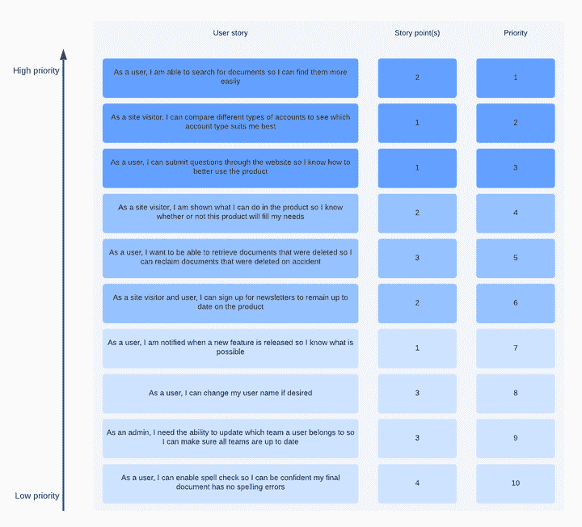

# 什么是冲刺规划？指南和会议议程备忘单

> 原文：<https://blog.logrocket.com/product-management/what-is-sprint-planning-guide-meeting-agenda-cheat-sheet/>

Sprint 规划是一个重要的 scrum 仪式，scrum 团队在这个仪式中决定在即将到来的 sprint 中要做什么工作。无论您的团队是在两周还是四周的冲刺中工作，冲刺计划仪式应该在每个冲刺的开始进行。

在本指南中，在深入细节之前，我们将从较高的层面定义 sprint 规划，包括谁参与 sprint 规划，仪式期间发生了什么，以及召开 sprint 规划会议的最佳实践。

滚动到末尾查看 [sprint 规划会议议程模板](#template-sprint-planning-meeting-agenda)，您可以在进行自己的 sprint 规划仪式时用作备忘单。

* * *

## 目录

* * *

## 什么是冲刺规划？

[sprint 规划会议](https://www.scrum.org/resources/what-is-sprint-planning)是产品经理和开发团队计划团队在接下来的 2-3 周内要做的工作的会议。

Sprint 计划会议通常是一个月 sprint 的全天会议，但是对于由 scrum master 管理的更短的 sprint，会议可以按比例缩短。

[https://www.youtube.com/embed/2A9rkiIcnVI](https://www.youtube.com/embed/2A9rkiIcnVI)

视频

## 谁会参加冲刺计划会议？

sprint 规划仪式通常由[产品经理](https://blog.logrocket.com/what-does-a-product-manager-do-role-responsibilities-best-practices/)、产品负责人或 scrum master 领导。scrum 团队的所有成员都应该出席。这包括工程师、QA 和设计师，他们每个人都是 sprint 规划过程的关键。

除了领导会议，产品经理还帮助提供业务或用户背景，并对权衡进行优先级排序。

设计师可以帮助澄清任何关于设计和验收标准的最后一分钟的困惑。

工程师定义实现的复杂性以及它可以承担多少工作。在这方面，质量保证也很重要。仅仅因为一个故事是开发完成的，并不意味着它可以被发布；还需要有测试能力。

## 你在冲刺计划期间做什么？

在 sprint 规划期间，scrum 团队回顾前一个 sprint 的工作，确定它在即将到来的 sprint 中的能力，并承诺最高优先级的工作来填补这个能力。

从回顾前一个 sprint 中完成的工作开始。所有提交的故事都完成了吗？如果没有，确定在任何滚动的故事或任务上剩余的工作量。将这些考虑在内可以确保你不会过度投入到新的工作中，就好像你有全部能力一样(因为你没有)。

关于 sprint 翻转的一些注意事项:

*   冲刺翻车并不总是坏事！许多事情都可能导致 sprint 翻转，包括提交工作中的关键错误和未知因素(稍后将详细介绍)
*   当团队比预期更早地完成提交的工作，并且可以开始从优先化的待办事项中提取时，Sprint rollover 甚至可以是一件好事
*   无论在什么情况下，都可以将 sprint rollover 作为一个学习机会，为将来的速度调整和更精确的计划做准备

在您评估了工作和努力之后，团队可以讨论新的故事来引入。同样，作为产品经理，您应该定义优先级并提供上下文，但是团队的其他成员应该决定他们能完成多少。

在这些讨论中，可能需要做出权衡决策。这就是你的产品管理技能至关重要的地方。

例如，假设您希望放入一个三点和五点的故事，但是只剩下五点的容量。你可以决定拉五分或者选择三分球加另一个小故事。

当面对像这个例子这样的场景时，您应该与团队讨论业务、用户和技术的权衡。不要因为你不重视的故事而推迟未来的工作。

下面是一个详细的例子，展示了 sprint 规划后整理和优先化的产品待办事项:

Source: [Lucidchart](https://www.lucidchart.com/blog/how-to-run-a-sprint-planning-meeting)

## 需要设定冲刺目标吗？

冲刺目标起源于 scrum 的早期，作为衡量每个完成的冲刺是否成功的方法。虽然一些团队仍然高度重视冲刺目标，但它们并不总是必要的。在某些情况下，它们甚至是不可能的。

如果你正在开发一个新产品，可能需要几次冲刺才能达到 MVP 水平，很难定义有用的冲刺目标。设定一个在 sprint 中交付所有提交的故事的目标可能很诱人，但是这将你的注意力放在了产出上，而不是结果上。

只要你在发布的过程中优先考虑最重要的工作，并且整个团队对每个 sprint 的承诺感到满意，你可能最好完全放弃 sprint 的目标。

## 冲刺计划的最佳实践

冲刺计划不仅仅是把故事拉到待办事项列表中，直到团队说“停止”让我们回顾一些关键的考虑因素和最佳实践，以帮助您致力于最高质量和适当数量的工作，同时先发制人地避免障碍。

### 在冲刺规划之前评估故事

使用 sprint 计划来决定提交什么样的故事，不要迷失在茫茫人海中。深入这些故事的需求，并估计它们可能需要多长时间，这是一种肯定会打乱 sprint 计划并使团队陷入不必要的冗长会议的方法。

在进入冲刺阶段之前，[待办事项整理仪式](https://blog.logrocket.com/what-is-backlog-grooming-aka-refinement/)是一个更好的时机来审视和评估故事。这给了团队时间和空间来钻研验收标准，并完全理解工作，而没有立即弄清楚的额外压力。这也可能会暴露出与复杂性或依赖性相关的折衷，这可能需要在评估或提交工作之前进行评估。

在 sprint 规划之前评估故事可以帮助你避免 sprint 延迟和不切实际的期望。

* * *

订阅我们的产品管理简讯
将此类文章发送到您的收件箱

* * *

### 说明已提交工作中的未知因素

在冲刺之前，尽可能多地解决未知问题。这通常可以通过梳理仪式、技术高峰或其他工作前调查来完成。然而，在实际工作开始之前，有些未知是不可避免的。

您应该为这些场景做好计划，以避免过度投入复杂的工作。最好的方法是在你的梳理仪式上估算故事时，提前考虑这些未知因素。

例如，如果一个故事感觉可能是三分，那么高估考虑不可预见的问题所需的时间是一个好主意。

### 协调与其他团队的依赖性

如果不提前协调，依赖性会成为路障的催化剂。他们可以双向选择。

也许你的团队正在构建一个依赖于另一个团队完成 API 更新的特性。或者，营销团队正在等待发起新的电子邮件活动，而您的团队正在努力构建和发布相关的登录页面。

作为一名产品经理，在将工作引入 sprint 规划之前，你有责任与利益相关者或其他产品经理协调这些依赖性，并确定它们的优先级。

### 了解你的团队在即将到来的冲刺阶段的真实能力

了解团队的工作能力对于成功的规划至关重要。这不应该仅仅基于过去的冲刺速度，因为每次冲刺都是不同的。

我们已经讨论了在确定每个 sprint 的容量时考虑 sprint 翻转，但是还有其他因素需要权衡:是否有任何假期即将到来？是否有公司或部门异地？你的公司为非冲刺相关的追求做开发日吗？所有这些因素对于了解你的真实能力都很重要。

### 预见计划外的工作并知道如何应对

计划外的工作可能会出现在冲刺阶段，让你的承诺偏离轨道，但事情并不一定如此。作为一名产品经理，你的工作是评估和决定某件事情是否重要到足以被拉进正在进行的 sprint。

这并不是说您应该在万一发生什么事情时保持容量开放，而是您应该在进入冲刺阶段时知道一些承诺的工作可能会被计划外的工作搁置。

您可能会遇到三种主要类型的计划外工作:

*   **关键错误** —这些是团队应该立即解决的所有问题(例如，主页无法加载、支付无法处理等)。)
*   **不太严重的错误** —除了严重的错误，严重性可以从低到高。与您的工程师和利益相关者讨论这些问题，并收集足够的信息来评估现在和以后引入他们的利弊
*   **紧急功能请求** —这些请求可能来自领导、客户或利益相关方，应该仔细评估。很少会有某个功能需求紧急到需要立即处理的情况

## 如何准备冲刺规划会议

运行一个有效的冲刺计划从有意识的前期准备开始。

在计划之前，你应该清楚地知道你希望在冲刺阶段达到什么目标。早期步骤包括产品发现、研究、用户测试和其他方法，以确定最有影响力的工作。如果你带着一个还没有经过适当审查的新想法进入冲刺规划，那可能是一个灾难。

您还应该确保工作真正准备好了。是否根据影响或紧急程度对门票进行了整理和优先排序？必要的尖峰、权衡和依赖性都解决了吗？

如果任何一个问题的答案是否定的，那么考虑一下这项工作是否真的准备好进行开发了。在某些情况下，“不”可能是不可避免的(例如，应该解决的最后一分钟的 bug，但还没有确定范围)，但通常不是这样。

## 如何开一个冲刺规划会议

一旦你为冲刺计划做好准备，就该开会了。我们已经讨论了如何根据转存工作、资源可用性和其他因素来确定容量，这些因素对于运行一个成功的 sprint 规划都很重要。

如果对于产品经理来说有一条有效运行冲刺计划的黄金法则，那就是:倾听你的团队。开发人员知道他们的能力，也理解你所讨论的工作的复杂性。不要推动或挑战他们的专业知识。如果他们说他们可以承诺不超过 20 分，不要强迫或说服他们增加到 25 分。

最坏的情况是，您错过了您的 sprint 承诺，并且失去了团队的信任。最好的情况是，你按时完成了任务，但你的团队仍然不信任你。你应该领导，而不是发号施令。

有时，这意味着您在准备过程中计划的故事没有全部出现。如果你与你的团队的工作和典型的速度相一致，你的愿望清单应该和实际结果非常接近，但是如果星星没有完全对齐，不要沮丧。

如果你倾听团队的意见，考虑能力，愿意做出权衡或范围缩减，为依赖性和优先级做前期工作，并理解内外的接受标准以帮助回答问题，你的 sprint 计划应该是成功的。

* * *

### 冲刺规划会议议程备忘单

如上所述，领导成功的 sprint 计划会议需要付出很多。下面的 sprint 规划会议议程模板旨在帮助您跟踪取得成功的最重要事项。

#### 会前准备

 *故事被整理、评估，并准备好进行*

 *依赖关系与其他团队和/或利益相关方协调*

 *通过考虑影响、紧急性、依赖性和阻碍因素来确定待办事项的优先级*

#### 回顾之前的 sprint

 *回顾在冲刺阶段完成并交付的工作*

 *定义故事或任务的剩余工作量*

 *发现速度调整的机会或使计划更有效的方法*

#### 定义冲刺能力

 *考虑 sprint 延期和其他可能降低产能的因素，包括假期、休假时间、异地和开发天数*

#### 决定冲刺承诺

 *可选:设定一个冲刺目标(避免使其成为“船 x 数故事”)*

 *讨论团队可以承诺哪些优先故事*

 *促进折衷讨论(例如，两个 3 分故事比一个 5 分故事)*

 *说明任何故事中的未知数*

* * *

*精选图片来源:[icon scout](https://iconscout.com/icon/planning-3155200)*

## [LogRocket](https://lp.logrocket.com/blg/pm-signup) 产生产品见解，从而导致有意义的行动

[LogRocket](https://lp.logrocket.com/blg/pm-signup) 确定用户体验中的摩擦点，以便您能够做出明智的产品和设计变更决策，从而实现您的目标。

使用 LogRocket，您可以[了解影响您产品的问题的范围](https://logrocket.com/for/analytics-for-web-applications)，并优先考虑需要做出的更改。LogRocket 简化了工作流程，允许工程和设计团队使用与您相同的[数据进行工作](https://logrocket.com/for/web-analytics-solutions)，消除了对需要做什么的困惑。

让你的团队步调一致——今天就试试 [LogRocket](https://lp.logrocket.com/blg/pm-signup) 。

[Bill Ryan Follow](https://blog.logrocket.com/author/billryan/) Product manager with B2C and extensive marketplace experience. As a steadfast follower of the Jobs-to-be-Done methodology, I strive to understand customer struggles as the primary catalyst for innovation and optimization.