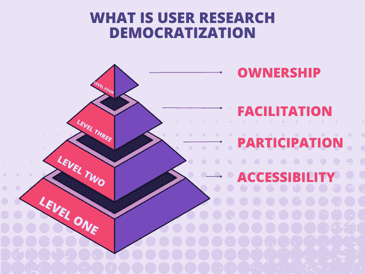
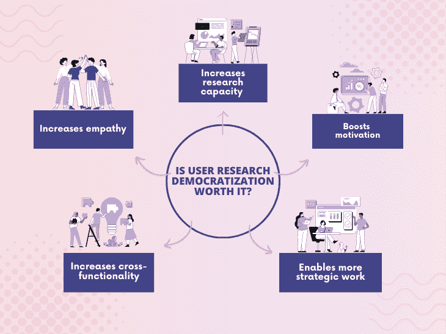
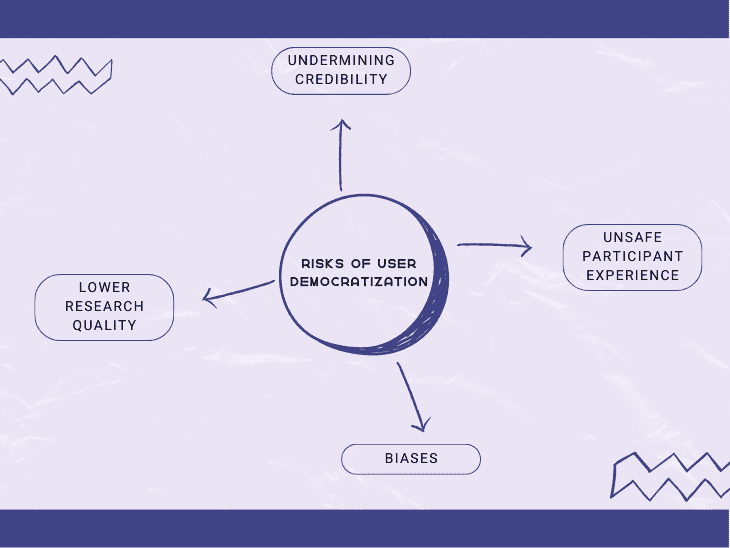
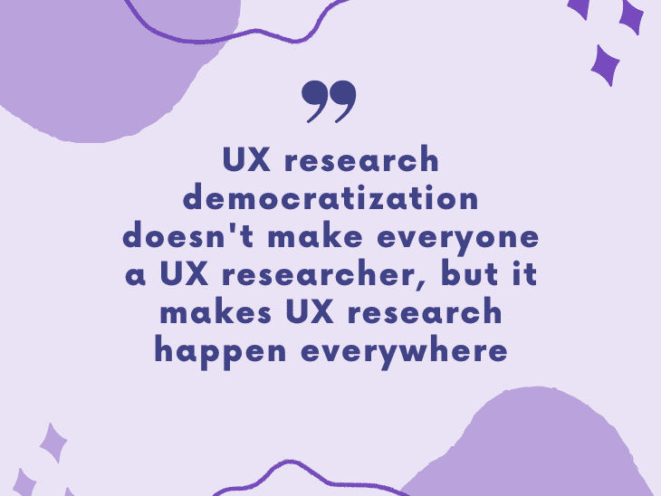

# 什么是用户研究民主化，为什么它很重要？

> 原文：<https://blog.logrocket.com/product-management/what-is-user-research-democratization-why-does-it-matter/>

随着时间的推移，我们认识到产品发现和用户研究对于产品的成功至关重要。它变得如此重要，以至于不再仅仅是 UX 研究人员的领域。目前的趋势是让每个人都参与用户研究。

让整个团队参与到用户研究的过程中，发现用户的需求和痛点，这就是所谓的用户研究民主化。虽然很诱人，但它也有自己的挑战和风险。

让我们深入探讨一下用户研究民主化的话题。

* * *

## 目录

* * *

## 什么是用户研究民主化？

用户研究民主化是一个相当宽泛的术语。尽管所有旨在授权团队帮助用户研究的活动都构成了民主化，但我们可以区分不同层次的民主化。在高层次上，我们可以民主化:

### 接近

我们从民主化访问开始，这意味着允许每个人访问、查看和分析用户研究结果。这包括访问:

*   采访快照
*   可用性测试记录
*   调查结果
*   原始研究数据

然而，这不仅仅是关于访问。整个公司必须经历建立研究文化的过程。人们不仅应该有理解研究结果的能力；应该鼓励和奖励他们得出结论，并在结果中发现真知灼见。

采用正确的文化并允许访问结果将会产生一个建立用户同理心的团队。用户同理心最大的好处是，它总是会带来更有价值的见解，从而带来更好的产品。

### 参与

通过鼓励每个人都参与到研究过程中来，你达到了用户研究民主化的新水平。

例如，非 UX 研究人员可能是:

*   面试过程中的记录者
*   可用性研究期间的观察站
*   实地研究的参与者

非研究人员也可以参与研究后的工作，同时也要记住被动参与和主动参与是有区别的。

例如，他们可以:

*   文字采访视频
*   搜索感兴趣的用户报价
*   可用性测试中遇到的时间戳问题

这样，他们不仅减轻了 UX 研究人员的负担，而且这种方法还有效地建立了用户同理心和对问题的理解。

### 简易化

通过足够的接触和适当的培训，你可以考虑让整个团队参与到研究活动中来。

在这个层面上，UX 的研究人员仍然负责规划研究，包括它们的形式和数量，但更多的人可以作为推动者参与。例如，你可以让开发人员对用户进行可用性研究，或者让 QA 去采访用户。

促进民主化的最大好处之一是增加研究能力和[团队的交叉功能](https://blog.logrocket.com/product-management/what-cross-functional-team-how-build/)。这也让你的 [UX 人](https://blog.logrocket.com/ux-design/)可以花更多的时间在高层次的战略活动上。

然而，这是有代价的，并且充满了巨大的风险:

*   非研究人员容易受到各种偏见的影响，很容易得出错误的结论
*   这需要在整个团队中建立一套硬技能
*   需要大量的努力来保证适当的研究实践

向这一层次的过渡应该是有意的、缓慢的、彻底的。不要为了酷而把促进民主化。确保你有足够强大的理由去忍受它带来的挑战。

### 所有权

民主化的最高形式是所有权的民主化，允许每个人在既定的范围内进行他们认为合适的 UX 研究。

如果 QA 对他们刚刚测试的特性不确定，他们可以运行一个特别的可用性研究，或者如果开发者不确定应该推荐什么样的范围削减，他们可以和一些用户聊天，以更好地理解他们正在解决的问题。

UX 研究人员有责任建立正确的界限。这些界限可以包括:

*   研究类型
*   有多少研究
*   应该多久进行一次研究
*   过程监督
*   团队训练

UX 大学的研究人员应该设定这些界限，以确保他们有最高质量的研究。

尽管这个愿景可能很诱人，但是让我们快速检查一下现实:只有最成熟和最熟练的团队才应该考虑民主化所有权。

这就像一个圣杯，大多数团队永远不会得到它，这没关系。

## 用户研究民主化的优势

如果用户研究的大众化需要时间，大量的努力，并且有许多风险和挑战，这是值得的努力吗？

是啊！有许多优点使得用户研究民主化值得所有的时间和努力。这些优势包括:

### 增加同理心

人们离用户越近，就越容易产生共鸣。参与用户研究可以让团队直接体验用户问题，而不仅仅是从研究者那里听来的。

* * *

订阅我们的产品管理简讯
将此类文章发送到您的收件箱

* * *

随着对用户同情心的增加，团队最终会创造出更好的产品，更加关注消费者的需求。

### 提高研究能力

随着越来越多的人从事用户研究，即使是在有限的范围内，团队的整体研究能力也会增加。你可以验证更多的假设，测试更多的假设，降低更多的风险。

### 增强动力

更接近用户的团队往往有更高的整体动机。研究民主化使他们能够体验用户的问题，并看到他们的解决方案如何解决这些问题。在吉拉，特色不再只是商品，而是问题的真正解决方案。

### 支持更具战略性的工作

由于整个团队都在处理小事情，研究人员可以处理更大的问题，也许是在公司范围内。他们可以通过在所有部门建立[持续发现习惯](https://blog.logrocket.com/product-management/dual-track-agile-continuous-discovery/)来利用他们的专业知识，并促进从功能工厂到结果驱动型公司的转变。

### 增加交叉功能

自然，由于 UX 研究团队规模较小，会出现瓶颈。你必须对研究课题进行优先排序，这会减缓改进过程。

如果团队中的每个人都可以进行或分析用户研究，那么你就减少了瓶颈，可以进行每个研究课题。同样，如果你的 UX 研究员离开很长一段时间，你仍然可以维持你的基本研究过程。

## 用户研究民主化的风险

然而，并不全是阳光和玫瑰。用户研究民主化伴随着风险，如果不认真对待，可能弊大于利。

与用户民主化相关的一些风险包括:

### 引入偏见并降低研究质量

我们都充满了自己的偏见。优秀的 UX 研究人员受过训练，能够发现他们有偏见的解读，并学会忽略它。他们还擅长注意小细节和识别用户情绪。

这不是你能在一周内教和学的东西。你通过训练来学习，但更重要的是通过多年的经验。在非研究人员参与的过程中，自然会出现更多的误解，重要的细节会被遗漏。

### 创造不安全的参与者体验

另一个领域是 UX 研究人员接受大量培训，为参与者提供安全和包容的体验。专业研究人员知道如何恰当地提出敏感问题。

包括非研究人员在内，更难保证这样的情感安全水平。

### 破坏用户研究人员的可信度

我注意到，当人们第一次从事用户研究时，他们往往低估了过程的复杂性。

他们倾向于问这样的问题，“你需要做的就是问几个问题；有什么难的？”

他们没有意识到从研究中获得真正有价值的见解所需的所有技能和努力。这可能导致团队和成员之间的紧张关系。

## 如何找到平衡

一方面，完全依赖专业的 UX 研究人员是有局限性的，而且不可扩展。这也削弱了产品团队的力量。

另一方面，你不能仅仅将所有的用户研究委托给团队，而忽略使过程安全和高质量所需的专业知识。

这一切都是为了在吸引专业人士和民主化研究之间找到正确的平衡。

非研究人员可以通过关注安全的用户研究领域来建立共鸣和用户理解，例如:

*   促进脚本化可用性测试
*   进行定期的探索性用户访谈
*   观察测试和用户记录
*   查看客户支持票证
*   接听销售电话

这些活动会给团队带来洞察力，如果这些洞察力中的一些是错误的，它们很少会造成那么大的伤害。从长远来看，如果每个人都得到适当的培训，这个过程应该会带来更积极的结果。

通过取消用户研究，您可以让您的 UX 研究人员将更多精力放在真正关键的工作上。

这可以包括:

*   早期产品发现
*   验证关键假设和假说
*   需要技术方法的研究，如人种学研究。
*   针对敏感话题或受损社区的研究
*   纵向研究
*   战略性 UX 工作

归根结底，你不能用民主化来取代一个熟练的 UX 研究员。用户研究民主化是为了帮助你最大限度地利用你的 UX 团队。

## 包裹

用户研究民主化可以帮助你建立真正自主的、有同理心的和授权的团队。但是，并不是所有的事情都可以民主化，也不是每个团队都要求同样程度的民主化。

从第一层开始:民主化的访问。建立一种文化，在这种文化中，了解最新的研究和见解是很自然的事情。

一旦你到了那里，问自己三个问题来决定你是否应该移动到另一个水平:

*   团队[是否足够成熟](https://blog.logrocket.com/product-management/improve-operations-product-management-maturity-model/)去尝试进入另一个层次？
*   我们是否有足够的能力来支持过渡中的团队？
*   升到另一个层次会给我们带来更多的好处还是更多的问题？

如果没有一个在当前水平上已经高度成熟和流畅的团队，民主化将弊大于利。

用户民主化就像一把双刃剑。它可以是一个强大的武器，但如果你处理不好，你会严重伤害自己。

*精选图片来源:[icon scout](https://iconscout.com/icon/chart-growth-1913955)*

## [LogRocket](https://lp.logrocket.com/blg/pm-signup) 产生产品见解，从而导致有意义的行动

[LogRocket](https://lp.logrocket.com/blg/pm-signup) 确定用户体验中的摩擦点，以便您能够做出明智的产品和设计变更决策，从而实现您的目标。

使用 LogRocket，您可以[了解影响您产品的问题的范围](https://logrocket.com/for/analytics-for-web-applications)，并优先考虑需要做出的更改。LogRocket 简化了工作流程，允许工程和设计团队使用与您相同的[数据进行工作](https://logrocket.com/for/web-analytics-solutions)，消除了对需要做什么的困惑。

让你的团队步调一致——今天就试试 [LogRocket](https://lp.logrocket.com/blg/pm-signup) 。

[Bart Krawczyk Follow](https://blog.logrocket.com/author/bartkrawczyk/) Learning how to build beautiful products without burning myself out (again). Writing about what I discovered along the way.