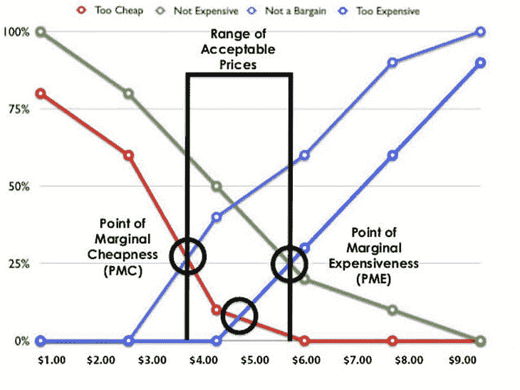

# 什么是支付意愿(WTP)以及如何测试

> 原文：<https://blog.logrocket.com/product-management/what-is-willingness-to-pay-and-how-to-test-it/>

定价一直是个棘手的话题。一方面，你想吸引尽可能多的顾客，但你也想避免把钱留在桌子上。

有许多产品定价策略，如竞争定价、成本加成定价和价格撇除。但是它们真的有用吗？

客户真的那么在乎你维护产品的费用或者其他竞争对手的收费吗？

剧透:不，他们没有。

* * *

## 目录

* * *

## 什么是支付意愿(WTP)？

影响销售机会的最关键因素是客户的支付意愿。

简而言之，支付意愿——通常缩写为 WTP——是客户愿意为给定产品或服务支付的最高价格。它来自于顾客感知到的他们所获得的价值。

它通常是一个美元数字，但对于一组客户，它可能表示为一个范围，如每月 10-15 美元。

由于客户更关心他们(相信)得到的价值，因此将支付意愿作为指路明灯，比仅仅在成本之上增加利润或削弱竞争对手更可靠。

## 如何测试支付意愿

这在理论上听起来很棒，但是你如何真正发现你的潜在客户愿意支付多少钱呢？

你不能只问“你愿意为 X 支付多少钱？”无论如何，这些答案都太过偏颇，毫无用处。此外，有效地给产品定价不是你的客户的工作——他们总是以便宜货为目标。

但是，您可以使用一些技巧来更好地了解客户的 WTP。虽然没有哪一个是完美的，但如果相互补充并与其他研究相结合，这些应该会让你很好地了解客户的支付意愿。

### 价格点

第一种技术可能是最直接的一种，但它也是锚定您的探索的良好起点。

向顾客展示你的产品/原型，问顾客三个问题。他们发现什么价格:

*   便宜？
*   贵吗？
*   离谱？

根据经验，便宜意味着很便宜，昂贵最接近他们的实际支付意愿，而离谱意味着他们支付不起。

### 范·韦斯滕多尔普价格敏感度计

Van Westendorp 的价格敏感度量表是 price-point 的一个更复杂、更强大的版本，通常由最知名的咨询机构使用。

为了有效地使用这个模型，你需要一个大的数据样本——接近数百个调查对象，而不是数十个。

这次你问四个问题。他们发现什么价格:

*   太便宜了？
*   不贵？
*   不是便宜货？
*   太贵了？

然后，使用累积频率图来显示数据:

Source: [https://www.forbes.com/sites/rebeccasadwick/2020/06/22/how-to-price-products/?sh=13e44fc555c7](https://www.forbes.com/sites/rebeccasadwick/2020/06/22/how-to-price-products/?sh=13e44fc555c7).

该图表将帮助您确定三个关键的价格点。

1.  **边际便宜点(PMC)** :这里“太便宜”和“不划算”是交叉的，应该是你收取的最低价格
2.  **边际成本点(PMC)** :这里“不贵”和“太贵”的交叉应该是你收取的最高价格
3.  **最佳价格点**:当“太便宜”和“太贵”交叉时，假设是最理想的价格

边际廉价点和边际昂贵点的范围是你的顾客可以接受的价格范围。超过这个限度，你就会开始失去顾客；低于这个数字，你就把钱留在了桌子上。

### 索引

索引是一种将你自己与竞争产品和替代产品进行比较的好方法。[选择一个竞争对手](https://blog.logrocket.com/product-management/what-is-competitive-analysis-template-examples-tutorial/)，请你的顾客将你的产品与竞争对手的产品进行对比。

假设你正在建立一个吉拉的替代品。向潜在客户提出两个问题:

*   如果吉拉的价值指数为 100 点，您会如何评价我们的产品？
*   如果吉拉价格指数为 100 点，你会为我们的产品支付多少钱？

它有助于你比较顾客对你和其他产品的看法，而且它可能会带来更多的发现。

如果客户对你的评价高于吉拉(比如 120 分)，但愿意支付更低的价格(比如 70 分)，为什么会这样？如果需要，提出后续问题。

* * *

订阅我们的产品管理简讯
将此类文章发送到您的收件箱

* * *

### 直接问题

虽然你不应该问客户愿意为一个产品或服务付多少钱，但是你可以直接问他们是否愿意付一个具体的价格。

如果你心里已经有一些经过充分研究的数字，这是一个很好的验证练习。

你可以问他们是否愿意支付每月 30 美元的订阅费，然后等待回答。如果他们说是，问他们是否愿意每月支付 35 美元，并不断提高价格，直到他们说不是。然后评估大多数客户停止的价格点。

### 概率问题

一旦你有了主意，概率问题是另一个很好的验证工具。与直接提问类似，给你的客户一个具体的价格，但这次问他们购买该价格产品的可能性有多大(1-5 分)。

1–3 表示价格对他们来说太高。

4–5 表示他们是潜在买家。

根据经验，如果客户说 5 分之 5，他们实际购买该产品的可能性大约为 50%。

### “构建您自己的”

上面提到的技术也可以用于特定的功能，而不仅仅是整个产品。这样做可以让您测试各种特性/选项的组合。

一个有趣的工具是“建立你自己的”练习。列出所有潜在/现有功能，并标明各自的价格标签(根据其 WTP ),要求潜在客户选择他们最感兴趣的功能。不用说，他们选择的功能越多，产品就变得越贵。

这不仅是了解他们愿意支付多少的另一种方式(他们在什么价位停止？)还会告诉你什么样的产品功能对他们来说最重要。

### 模拟销售/实际销售

最终愿意向验证者付款就是实际销售。

如果你已经做好了产品——希望针对之前研究过的 WTP 进行优化，并专注于客户最愿意购买的功能——那么试着销售它。比起实际数字，更关注 CVR 和 LTV。后者取决于多个其他因素，[，比如你的增长战略](https://blog.logrocket.com/product-management/what-is-product-led-growth-strategies-principles-examples/)。

如果你还没有原型，那么试着把它当作一个实际的产品卖给客户，一旦他们同意，就告诉他们还没有准备好，你就可以把他们加入等待名单。

## 结论

支付意愿(WTP)是你在设定价格点时应该考虑的一个关键因素。它来自客户对产品价值的认知，这是一个比你的成本重要得多的因素。

有许多策略可以测试支付意愿。其中包括:

*   价格点
*   范·韦斯滕多尔普定价模型
*   索引
*   直接问题
*   概率问题
*   “构建自己的”练习
*   模拟销售/实际销售

虽然这些练习都不会给你一个明确的答案，告诉你应该收取多少费用，但是将它们与各种定价实验结合起来，将有助于你找到产品的最佳价格点。

*精选图片来源:[icon scout](https://iconscout.com/icon/product-2676449)*

## [LogRocket](https://lp.logrocket.com/blg/pm-signup) 产生产品见解，从而导致有意义的行动

[LogRocket](https://lp.logrocket.com/blg/pm-signup) 确定用户体验中的摩擦点，以便您能够做出明智的产品和设计变更决策，从而实现您的目标。

使用 LogRocket，您可以[了解影响您产品的问题的范围](https://logrocket.com/for/analytics-for-web-applications)，并优先考虑需要做出的更改。LogRocket 简化了工作流程，允许工程和设计团队使用与您相同的[数据进行工作](https://logrocket.com/for/web-analytics-solutions)，消除了对需要做什么的困惑。

让你的团队步调一致——今天就试试 [LogRocket](https://lp.logrocket.com/blg/pm-signup) 。

[Bart Krawczyk Follow](https://blog.logrocket.com/author/bartkrawczyk/) Learning how to build beautiful products without burning myself out (again). Writing about what I discovered along the way.