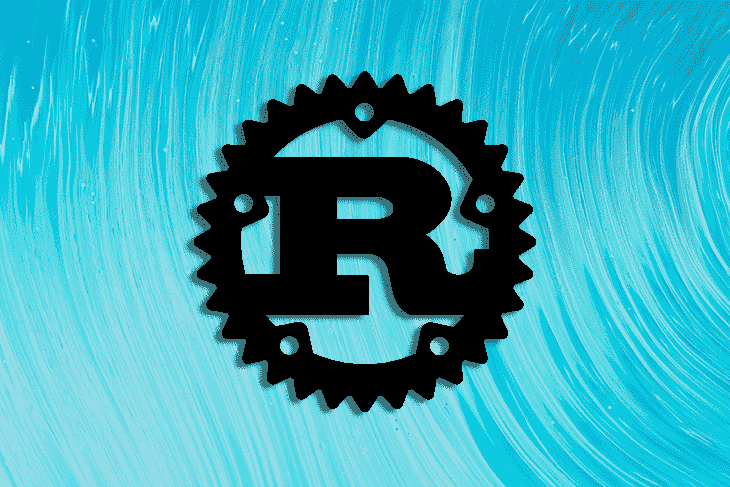

# 是什么让 Rust 中的内存管理如此独特和强大？

> 原文：<https://blog.logrocket.com/what-makes-memory-management-in-rust-so-unique-and-powerful/>

加入亚历克斯·默塞德

**September 20th at 12 p.m. EDT**

了解 Rust 的内存管理为何如此独特，以及它为何能有效解决 Python 和 C/C++等其他语言出现的问题。

在这次聚会中，您将了解到:

*   在 C/C++中如何管理内存
*   Python 和其他高级语言如何管理内存
*   生锈的方法
*   生锈的借款

#### 您的主持人:

Alex Merced
Alex 是一名开发人员，曾在 General Assembly、CampusGuard、ServiceLink、GenEd SYstems 和 Crossfield Digital 等公司工作过。他是 DevNursery.com 的创始人，在那里他与有抱负的开发者分享教育内容，也主持 Web Dev 101 和 DataNation 播客。

#### 注册 meetup:

9 月 20 日|美国东部时间中午 12 点

之后要发送的录音

### 谢谢大家！

我们已经收到你的活动注册。