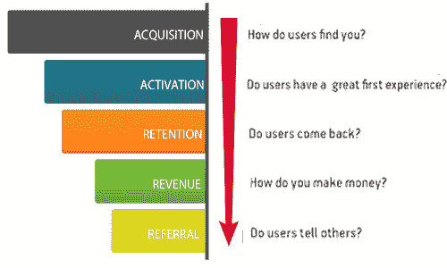

# 产品经理跟踪哪些指标和 KPI？- LogRocket 博客

> 原文：<https://blog.logrocket.com/product-management/what-metrics-kpis-product-managers-track/>

选择正确的指标和分析方法来跟踪它们，可以决定交付一个合格的产品还是交付一个优秀的产品。

在本指南中，我们将概述产品团队如何定义 KPI 并使用数据来衡量产品的成功和健康。我们将列出一些具体的指标[产品经理](https://blog.logrocket.com/product-management/what-does-a-product-manager-do-role-responsibilities/)通常会跟踪并描述几种类型的分析，您的团队可以使用这些分析从数据中提取可操作的见解。

最后，我们将提供一些提示来帮助您确定您的团队应该收集哪些指标，并选择合适的工具类型来帮助您充分利用您的产品分析。

* * *

## 目录

* * *

## 什么是产品分析？

[产品分析](https://heap.io/topics/what-is-product-analytics)指的是一套工具和技术，揭示用户如何互动和对你的产品做出反应的细节。关于用户实际行为的客观数据对产品团队来说非常有价值。跟踪这些指标可以回答一些问题，例如客户使用最多的功能、他们使用一个功能多长时间、是什么让他们停止使用它等等。

如果没有产品分析，您的产品团队将会错过对客户有意义的洞察。虽然调查和客户访谈可以提供客户对产品的看法，但行为数据可以揭示趋势和错过的机会。

## 为什么产品分析至关重要？

当构建一个产品时，相互冲突的观点往往会扰乱开发过程。通过提供不带感情偏见的硬数据，您可以确保您的产品团队在保持业务目标的同时构建吸引用户的功能。

产品分析对于建立忠诚的客户群也至关重要。理解为什么你的客户选择你的产品而不是你的竞争对手是很重要的。数据可以洞察是什么让人们转化为客户，以及他们最常用的功能是什么。组织可以获取这些数据，并尝试将其复制给其他用户，以提高他们的转化率。

另一方面，你也可以使用产品分析来确定用户为什么没有完成一个过程，通过揭示他们可能在哪里变得沮丧和掉出漏斗。

## 产品经理如何定义 KPI？

在您定义 KPI 并确定要分析哪些指标之前，您需要[建立一个期望的结果或目标](https://blog.logrocket.com/product-management/how-to-build-product-roadmap-overview-examples/)。如果你没有如何使用数据的计划，收集数据就没有意义。

通过首先创建问题列表，您可以确保您的团队在不浪费时间或资源的情况下收集最相关的数据。

您可能会问一些问题来帮助缩小要分析的 KPI、指标和事件的范围:

*   为什么用户没有完成漏斗？
*   旅程中的哪些行为导致了转变？
*   用户使用产品的频率如何？
*   一个免费试用用户完成了哪些动作才能成为付费用户？

## 产品经理如何使用产品指标？

当制定一个假设或目标来测试一个新的 beta 特性时，跟踪产品度量标准就变得很方便了。例如，你可能假设在结帐页面上添加一个“帮助”链接会增加销售额。这将促使您的团队开始收集数据，并对与从购物车中结帐相关的事件进行分析。

因为这些数据是有目的的，它实际上可以帮助产品团队产生可操作的见解，而不是浪费时间收集分散的数据点，这些数据点被存档，很少被再次引用。

## 什么是 AARRR(盗版)指标？

有许多框架旨在帮助产品经理和他们的团队关注目标，并决定测量哪些指标。最流行的产品分析框架之一被称为 AARRR 或盗版指标。

[AARRR 框架](https://blog.logrocket.com/product-management/6-product-management-frameworks-you-should-know/#aarrr-metrics)跟踪整个客户旅程，并展示每个阶段分析哪些用户行为指标。这有助于产品经理评估产品在整个客户旅程中是否满足用户需求。

Source: [Product Frameworks](https://www.product-frameworks.com/AARRR-Metrics.html)

AARRR 框架的步骤如下。

### 获得物ˌ获得

收购关注人们在哪里发现产品。这通常是对不同营销渠道及其有效性的总结。

您可以从跟踪采购指标中获得一些见解，包括:

*   人们在一个页面上停留多长时间？
*   他们点击什么？
*   他们查看哪些页面？
*   哪些营销渠道最吸引人？

### 激活

激活是指有多少人对某个产品有了愉快的初次体验，并表示他们想继续使用它。

要监控的一些用户行为指标包括:

*   用户倾向于创建帐户吗？
*   什么事件导致了转变？
*   他们与哪些页面或功能进行交互？
*   他们在每个页面或专题上花多长时间？

### 保留

留存率描述的是用户在一段时间内对某个产品或应用保持关注的时间。

以下是一些用户行为指标的示例，可帮助您确定留存率:

*   每日/每周/每月活动用户
*   电子邮件简讯的点击率
*   哪些功能最常用，哪些不用
*   什么事件导致用户关闭应用

### 介绍

跟踪推荐来衡量客户满意度总是很有价值的，因为快乐的客户更有可能分享或推荐你的产品。

为深入了解推荐情况而监控的一些指标包括:

*   共享邀请的活动用户数
*   推荐链接的点击率
*   推荐链接的转化率
*   什么事件会导致转化？

### 收入

作为一个产品经理，你有责任证明这些特性是或将会是有利可图的。

一些产品分析软件可以为渠道创造收入洞察力，以查明关键领域。否则，您可以查看回答以下问题的指标:

*   每个用户的平均收入是多少？
*   客户获取成本是多少？
*   什么是客户终身价值？
*   营销活动的转化率是多少？

一旦您确定了想要分析哪个 AARRR 阶段和度量标准，产品团队就可以实现工具来收集数据。下一步是分析数据并进行必要的调整，以改进产品和营销策略。

* * *

订阅我们的产品管理简讯
将此类文章发送到您的收件箱

* * *

## 如何从产品分析中获得洞察力

跟踪产品指标是一回事，但从结果数据中收集有意义和可操作的见解是完全不同的技能。这就是数据分析发挥作用的地方。

最相关的分析类型取决于您的团队需要什么样的答案。让我们回顾一些常见的产品分析类型，您可以使用它们来衡量和理解您收集的产品数据。

### 趋势分析

趋势分析评估特定功能在一段时间内的表现。趋势分析的主要目标是确定采用率是上升还是下降。这可以帮助您决定产品功能是否需要调整。

例如，许多工具会揭示导致人们停止使用你的产品的确切点击动作。这种类型的数据可以显示一个动作是孤立的事件还是用户之间的趋势。

通过注意诸如愤怒点击(当用户重复点击一个元素时，表示沮丧)之类的趋势，您可以补救这个问题以改善用户体验。

### 路径分析

一个[路径分析](https://docs.logrocket.com/docs/path-analysis)评估用户完成一次旅程的步骤。一些例子可能包括购买或提交表单。

通过评估用户旅程，您可以看到用户在哪里脱离了期望的漏斗，以及漏斗的转化率有多成功。

### 归因分析

归因分析评估完成预期旅程的用户，并确定哪些属性有助于成功完成。这可以揭示影响用户继续使用产品的积极因素。

例如，属性分析可能揭示“帮助”按钮有助于提高用户转化率。

### 断代分析

群组分析将具有相似特征的用户分组在一起，并分析他们的行为。这些数据可以帮助你识别高价值客户在平台上做什么，新的客户群对客户服务体验的反应等。

您还可以按浏览器或设备对用户进行分组。这可以帮助您发现并解决在移动设备上使用您的产品的客户与使用笔记本电脑的客户之间的用户体验不一致。

### 滞留分析

留存分析关注的是随着时间的推移不断使用或参与你的产品的用户。客户满意率、活跃用户或反馈调查等指标可以帮助您确定是什么让用户继续使用您的产品。

留存分析还评估了[流失率](https://www.salesforce.com/resources/articles/how-calculate-customer-churn-and-revenue-churn/)，即用户停止使用你的产品的比率。

### 漏斗分析

最后但同样重要的是，[漏斗分析](https://logrocket.com/funnel-insights)评估整个漏斗，并帮助您确定需要改进的地方。

第一步是分析未能完成漏斗的用户旅程。

例如，假设只有 27%的用户进入了漏斗的下一步。这一比率显然有增长的潜力，所以你可能会决定分析没有完成漏斗的用户的视频播放或会话。

您也可以评估提供的漏斗洞察，这将深入研究丢失转换的可能原因，如愤怒点击，死亡点击，异常和网络错误。

产品团队经常需要使用不止一种工具来收集和分析数据。这是因为很难找到一个单一的数据分析工具，可以生成产品团队所需的所有报告和图表。

选择产品分析软件时，问问自己:

*   这个工具与产品管理团队使用的其他工具集成了吗？
*   用户界面是否易于团队成员使用？
*   它能生成可操作的报告吗？
*   团队可以跟踪自定义事件吗？
*   它是否涵盖了基本的产品指标？
*   性价比高吗？

最流行和最广泛使用的数据分析工具帮助产品经理和团队完成两项任务:

*   收集相关数据
*   产生可行的见解

产品经理经常投资多种工具来访问他们想要监控和评估的所有数据。

从确定他们需要回答什么问题开始你的搜索。这将帮助您辨别哪些工具具有必要的功能来跟踪和分析您需要的数据，以让您的用户满意，获得新客户，并发展您的产品和业务。

定量产品数据对于理解用户行为至关重要。一旦您获得了具有统计意义的数据，您的产品团队就可以利用这些知识来改善用户体验、降低流失率并提高投资回报率。

这一切都从选择正确的工具和监控最相关的指标开始。

*精选图片来源:[icon scout](https://iconscout.com/icon/analytics-1784728)*

## [LogRocket](https://lp.logrocket.com/blg/pm-signup) 产生产品见解，从而导致有意义的行动

[LogRocket](https://lp.logrocket.com/blg/pm-signup) 确定用户体验中的摩擦点，以便您能够做出明智的产品和设计变更决策，从而实现您的目标。

使用 LogRocket，您可以[了解影响您产品的问题的范围](https://logrocket.com/for/analytics-for-web-applications)，并优先考虑需要做出的更改。LogRocket 简化了工作流程，允许工程和设计团队使用与您相同的[数据进行工作](https://logrocket.com/for/web-analytics-solutions)，消除了对需要做什么的困惑。

让你的团队步调一致——今天就试试 [LogRocket](https://lp.logrocket.com/blg/pm-signup) 。

[Sara Nguyen Follow](https://blog.logrocket.com/author/saranguyen/) My greatest career achievement was when I was recognized as "GIF Master" for my GIFs in the company Slack channel. A close second is that I've written over 600,000 words in the past two years.