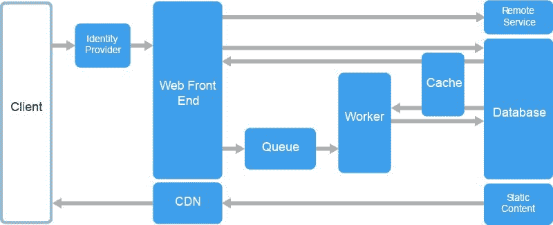

# 最低功耗规则对现代开发者意味着什么

> 原文：<https://blog.logrocket.com/what-the-rule-of-least-power-means-for-modern-developers-b846010a8595/>



前端 web 开发的力量正在稳步增长。我们可以用 HTML、CSS 和 JavaScript 做一些五年前只能梦想的事情。

有了所有这些新特性，对于任何给定的任务，想要使用最强大的工具是很自然的。然而，这是最好的政策吗？

往往是有问题的。事实上，网络的创造者考虑到了这种可能性。蒂姆·伯纳斯·李和诺亚·门德尔松在 2006 年写了一份名为“最小权力法则”的文件。

> 在设计计算机系统时，人们经常面临着选择使用功能更强或更弱的语言来发布信息、表达约束或解决某些问题。这一发现探索了语言的选择与信息的可重用性之间的权衡。“最小权力原则”建议选择适合特定目的的最小权力的语言。

### 为什么是最没有力量的语言？

W3C 似乎想折磨 web 开发人员。为什么建议开发人员*而不是*使用最强大的工具来完成这项工作？

Berners-Lee 和 Mendelsohn 提出，权力和灵活性成反比。随着功率的增长，分析输出的能力下降。

他们认为网络的未来是由可重复使用的部分组成的。许多设备和应用程序可以读取数据，使用数据，并以多种方式组合数据。

> 发布在 Web 上的信息可以灵活地与其他信息组合在一起，由各种软件工具阅读，并由 Web 的用户浏览。

换句话说，网络是一个无休止混合的世界。

这应该会引起我们现代人的兴趣。模块化胜于集成。页面上的组件。

这对现代开发者来说意味着什么？

### 现代 web 开发中的最小功率法则状态

在某些情况下，在现代网络开发中，最少能量法则发挥着作用。模块化、组件和包等概念都是现代结构。它们也是像 Berners-Lee 和 Mendelsohn 讨论的可重复使用网络的关键概念。

有鉴于此，你可能会认为我们符合这一理念。不过，我看到了数量惊人的现代“最佳实践”，它们似乎与这种哲学不一致。

不相信我？

我想提出三种情况。每一种情况都会越来越有争议。

### 场景 1:描述应用程序的数据

对于大多数现代 JavaScript 开发人员来说，这种场景应该是显而易见的。

当您想要为您的应用程序描述数据时，您应该如何以及在哪里创建它？

您可以选择:在函数代码中动态创建变量，或者创建一个数据对象。

让我们看看如何在函数代码中创建您需要的数据。

在本例中，我们用变量声明在函数中构建数据，然后立即使用这些数据:

```
function makeAndUseData() {
   const array = [];
   const obj = {};
   array.push('a value');
   array.push('another value');
   array.push('a third value');

   obj['name'] = "Author";
   obj['information'] = {
       "age": 30,
       "occupation": "Developer"
   }

 useData(array, obj) {
   someFunctionality...
 }

}; 
```

在这个例子中，我们有功能代码。这样就能完成任务。但是，我们的数据可以重用吗？不。数据将永远存在于该函数中。

相反，我们创建一个数据对象。这可能是 RESTful 端点、GraphQL 调用或平面数据文件的结果。

* * *

### 更多来自 LogRocket 的精彩文章:

* * *

该数据对象表示相同的数据，但可以无限地分析和重用:

```
[
    [
        "a value",
        "another value",
        "a third value"
    ], {
        "name": "Author",
        "information": {
            "age": 30,
            "occupation": "Developer"
        }
    }
] 
```

这是 JavaScript 对象符号(JSON)的一个例子，大多数 JS 开发人员对此都很熟悉。JSON 函数是我们大多数应用程序的主干。

这就是 RLP 所说的“可扩展语系”的一个例子

> 具体来说，JSON 提供了 JavaScript 语言中文字声明语法的声明子集的独立使用。语言子集的标准化可以简化 Web 发布的模型，同时在必要时提供与更强大的语言变体的集成。

它带来了声明性语言的好处，并使其与 JS 的强大优势相匹配。

大多数开发人员都会同意这种设置。JSON 中数据层的数据；用强大的编程语言编写的应用程序。

使这成为最好结果的是数据的可移植性。您今天计划的 JavaScript 应用程序可以使用这些数据。它也可以由您尚未编写的未来应用程序使用，或者您可以向其他人开放该数据集来编写新的应用程序。

这种关注点的分离打开了所有这些门。

这是最没有争议的场景。让我们来看一个更新的、稍微有点争议的例子。

### 场景 2:服务器

就像我们应该寻找功能最弱的机制来包含我们的数据一样，我们应该寻找功能最弱的服务器来将我们的应用程序或网站交付给我们的用户。

在这种情况下，我不是指 RAM 和处理器。我的意思是，我们应该使用软件复杂度最低的服务器。

在网络出现的时候，服务器是任何一台连接到互联网上提供 HTML 页面的计算机。简单。

随着对更多动态内容的需求越来越大，我们的服务器需求也越来越大。我们现在需要一个数据库。我们需要编程语言来访问、操作和存储数据。不过，最终，这一切都以向浏览器提供 HTML 文档而告终(如果我们忽略 Flash 和 Java 小程序的黑暗时代的话)。

现在有一个大实验正在进行。有一个现代的静态网站运动。我强烈支持这场运动。

静态网站过去意味着把一堆 index.html 文件放在服务器上。对于开发人员来说，这从来都不是最友好的方法。现在我们得到了我们所有的现代便利和一个伟大的静态输出。我们已经将复杂性从服务器转移到了开发环境。

请记住，您仍然可以使用您选择的编程语言。您只需在本地使用它，构建文件并发布到服务器，无需脚本语言。

#### 为什么这样？

1.  因为只提供 HTML，这给了我们闪电般的下载速度
2.  因为没有数据库或脚本语言，它给了我们更少的安全漏洞
3.  这使得我们的应用程序具有高度的可移植性和可重用性——为静态文件找到非常便宜的主机非常简单

#### 当静态站点不够用时

当您需要服务器来处理某些事情时，这种方法就变得更成问题了。这是否是一个安全存储 API 密钥、处理表单或接受支付的地方。

这就是“无服务器”功能的用武之地。这有点用词不当，但这些功能是在别人的服务器上租用的时间。提供这种功能往往是一种低成本、低维护的资源。

#### 您应用的未来

如果您目前正在为您的应用程序管理自己的服务器，那么无论如何都要保留那个服务器。当事情正在运行时，很少有一个主要的重构点。你也许已经可以开始利用这个潜在的未来了。

如果您将服务器视为一系列端点，而不是为整个应用程序服务的机器，那么您可以利用当前的设置来利用静态站点的功能。如果您能够将后端逻辑从前端表示层中分离出来，您就可以获得我上面提到的优势，而无需从头开始。

如果您是从零开始，那么绝对值得考虑“无服务器”架构。通过利用最小功率原则，我们获得了可移植性和灵活性——更不用说更低的成本、更高的速度和更快乐的前端开发人员。

随着工具变得越来越强大，这种情况在未来几年将变得不那么有争议。

在过去的两年里，我的下一个剧本已经成为一个热门话题。

### 场景 web 开发的三位一体

传统的 web 开发是这样的:

1.  服务器收到请求
2.  服务器语言处理请求并把它发送给浏览器的 HTML 拼凑起来
3.  浏览器喜欢这个
4.  它创建 DOM，然后让 CSS 和 JS 利用这些 DOM 元素肆意妄为
5.  CSS 样式化它们
6.  JS 让他们互动
7.  漂亮的交互式页面出现了！

这种方法在当时是完全合理的。然后是 iPhone 和应用程序的巧妙展示。每个项目所有者或客户都希望他们的应用程序感觉像 iOS 应用程序一样好。这个问题的答案似乎很简单:JavaScript。

更新、更“现代”的 web 开发通常看起来更像这样:

1.  服务器收到请求
2.  发送尽可能少的标记(在中有一个并且可能有一个)
3.  JS 接管、创建 DOM、样式化 DOM、使 DOM 具有交互性
4.  漂亮的交互式页面出现了！

让 JavaScript 来处理这个负担会创建出越来越像应用程序的页面。他们高度互动。每个后续的“页面加载”通常是即时的，而不是发出新的服务器请求。我们可以用令人惊叹的动画加载内容片段。

这些网站和应用总是令人惊叹。它们用起来感觉很棒。

当然，他们的突出和巧妙的交互和巨大的可用性，他们必须要走的路！

如果我们回头参考最小功率法则，我们会很快意识到这个方法违反了它。

#### 问题是

如果我们看看 web 开发的神圣三位一体——HTML、CSS 和 JS——就很容易看出权力的等级。HTML 是一种声明性的语义语言。这意味着没有编程能力，它的每个标签都描述一种数据类型。 **CSS** 也是声明性的。它比 HTML 功能更强大，但也足以完成它的工作。

**JS** 是一种编程语言。它可以用来做小事情，也可以用来做非常大、非常复杂的事情。它无疑是三种语言中最强大的。

在第二个工作流程中，我们使用了最强大的语言来完成所有的工作。

为什么这是一个问题？

由于 DOM 是由 JS 创建的，默认情况下数据不太容易分析。HTML 创建了一个可分析的数据树。任何数量的应用程序都可以使用这些数据。

*   浏览器可以将其转换为 DOM
*   谷歌的机器人可以毫不费力地抓取它
*   屏幕阅读器可以阅读它
*   未来，语音助手也许能读懂它

诚然，谷歌的机器人和屏幕阅读器都比以前更擅长渲染 JavaScript。你必须问问自己，他们够好吗？

如果你这样问自己，你已经走在了很多开发者的前面。

如果你担心这些事情，你应该去做测试。如果你认为对最近两个版本的浏览器进行测试是困难的，这听起来应该不会让你感到兴奋。

#### 解决方案

想想“[标记优先开发](https://bryanlrobinson.com/blog/2018/12/19/markup-first-development/)”

首先，向浏览器呈现有意义的 HTML。这将涵盖你的屏幕阅读器，机器人，和旧浏览器与现代 JavaScript 的斗争。

我可能是个老古董，但是我喜欢写 HTML。如果这不是你最喜欢的活动，我能理解。如果你写 JavaScript 是因为你喜欢写 JavaScript，我理解。

在这种情况下，您仍然可以首先考虑标记。确保你的应用预渲染。有[服务](https://prerender.io/)、[框架](https://www.gatsbyjs.org/)和[主机](https://netlify.com)都可以帮你不费吹灰之力做到这一点。用你最喜欢的框架写作——无论是 Vue、Angular 还是 React 等等。—然后提供**服务器呈现的**和**浏览器呈现的**内容。

这解决了问题的一个主要方面。现在页面上有了 HTML。浏览器和其他应用程序有一些他们可以轻松消费的东西。然而，仅仅将 HTML 呈现给浏览器是不够的。您的标记应该经过深思熟虑，并且语义正确。

注意你的标签。不是所有事情都是

或。

注意你的巢。不是所有的东西都需要无限嵌套的元素。这也正是 React 在 v16.2.0 中发布[“碎片”的原因。](https://reactjs.org/blog/2017/11/28/react-v16.2.0-fragment-support.html)

最后，不要假设一个 HTML 标签等于另一个。如果您在设计标记时尽可能多地考虑应用程序逻辑，那么您将创建高度可重用的东西。其他应用程序越容易使用您的数据，对您的最终用户就越有利。

### 最后的想法

在一天结束时，最小功率的规则是关于创建干净的代码。

通过使用最不强大的语言来完成工作，我们可以得到最不复杂的、最可移植的、经得起未来考验的代码。

当你建立下一个网站时，把 RLP 放在你的脑海深处。你未来的自己可能会为此感谢你。

## 使用 [LogRocket](https://lp.logrocket.com/blg/signup) 消除传统错误报告的干扰

[](https://lp.logrocket.com/blg/signup)

[LogRocket](https://lp.logrocket.com/blg/signup) 是一个数字体验分析解决方案，它可以保护您免受数百个假阳性错误警报的影响，只针对几个真正重要的项目。LogRocket 会告诉您应用程序中实际影响用户的最具影响力的 bug 和 UX 问题。

然后，使用具有深层技术遥测的会话重放来确切地查看用户看到了什么以及是什么导致了问题，就像你在他们身后看一样。

LogRocket 自动聚合客户端错误、JS 异常、前端性能指标和用户交互。然后 LogRocket 使用机器学习来告诉你哪些问题正在影响大多数用户，并提供你需要修复它的上下文。

关注重要的 bug—[今天就试试 LogRocket】。](https://lp.logrocket.com/blg/signup-issue-free)