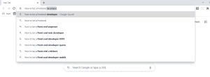
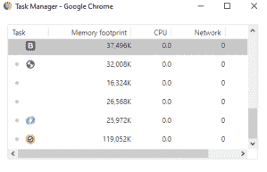
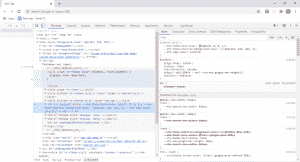

# 使用 Chrome 时要注意什么

> 原文：<https://blog.logrocket.com/what-to-look-out-for-when-working-with-chrome/>

谷歌浏览器是许多人都熟悉的名字。这是因为它是一个已经被广泛使用的流行浏览器，并且在许多情况下，预装在我们的一些设备中。Chrome 是谷歌推出的免费互联网浏览器，于 2008 年 9 月 2 日首次公开发布，随后于 2008 年 12 月 11 日正式发布。

由于其惊人的功能和易用性，Chrome 在互联网上广受欢迎。

除了正常的互联网浏览功能，Chrome 还为用户提供了许多其他功能。本文讨论了 Chrome 的一些值得关注的特性，以及如何在使用 Chrome 浏览器时访问这些特性。

## Chrome 的 Omnibox

Chrome 的地址栏也被称为 Omnibox。Omnibox 内置了很多功能。它同时也是一个搜索栏，这使得人们可以更容易地输入新的搜索查询，而不必进入谷歌主页。Omnibox 也可以用作计时器。当你需要设置一个定时器时，你需要做的是输入 timer，然后输入你需要设置定时器的时间:例如“timer 30s seconds”。计时器开始倒计时，当它停止时，会发出嘟嘟声。

它也作为一个计算器，并解决数学方程时，打字。大多数情况下，它会在你输入的时候进行计算，所以一旦你输入完毕，方程式的答案就马上出来了。如果您在输入方程式后点击回车键，将会显示一个基本的功能计算器。

当你陷入困境，需要快速做出决定时，Omnibox 也派上了用场。你可以简单地在 Omnibox 中输入这些东西来掷骰子或掷硬币:例如，“掷骰子”和“掷硬币”。

此外，可以使用 Omnibox 进行单位转换。您可以通过键入“convert 10c to f”将摄氏温度转换为华氏温度。

使用 Chrome 时，你可以做很多事情，而不需要离开当前标签。这有助于用户保持专注，并节省时间。

### 任务管理器

Chrome 有一个内置的任务管理器，可以帮助用户查看浏览器中运行的所有活动程序。这可以包括打开的选项卡或活动扩展。

任务管理器帮助 Chrome 用户轻松查看所有活动进程的执行情况，以及哪些进程可能有问题或减慢了工作流程。

有两种方法可以访问 Chrome 的任务管理器。首先，点击屏幕右上角的三个点图标。将出现一个菜单。点击更多工具。然后，从更多工具中，单击任务管理器。第二种更快的方法是同时按住 shift 和 escape 键。

任务管理器显示了每个任务使用的基本资源表:网络、CPU 时间和内存占用等资源。如果你感兴趣的话，它还可以让用户查看更多的类别。

要查看每个任务使用的更多类别和资源，右键单击任务。一个包含不同类别的统计菜单将会出现。单击您想要的，它将被添加到任务管理器表中。

类别菜单上有一个勾号来标识已经显示的统计数据，所以一旦统计数据的左侧有勾号，就意味着它已经在表上可用了。

如果您不需要某个特定的 stat，并希望将其从表中删除，请右键单击某个任务，stat 类别表将会出现。然后点击您想要删除的特定统计数据。当您再次检查类别菜单时，它旁边将没有复选标记，这意味着它不再显示在任务管理器上。

Chrome 的任务管理器可以帮助用户了解哪些标签或扩展是活动的，它们占用了多少资源，以及不再需要的最终进程。一些标签或扩展可能会很麻烦。为了结束这样的过程，单击特定的任务来选择它。然后，点击下面写着“结束流程”的按钮。

### 隐名模式

有时候，我们需要浏览互联网，但我们的浏览活动却没有被保存。在这种情况下，Chrome 的匿名模式就变得有用了。

隐姓埋名模式就像其他一些浏览器的隐私模式一样。要使用隐姓埋名模式，请点击屏幕右上角的三点图标。将出现一个菜单。然后，点击“新隐姓埋名窗口”选项。或者，可以通过按住 ctrl + shift + N 来使用键盘快捷键。

Chrome 的隐姓埋名模式非常适合你想进行私人浏览的时候。它确保在会话期间输入的所有信息都不会被保存。一旦窗口关闭，浏览器就会忘记该会话的所有内容。诸如输入的帐户详细信息、给予某些网站的权限以及输入的所有其他信息都被遗忘了。

当你想访问一个网站，但不希望它出现在你的浏览历史中，或者当你不想保存你的登录凭证时，隐名模式也是很好的选择。

Chrome 的隐姓埋名模式是一个非常有帮助的功能。然而，它只提供了一定程度的隐私。虽然它可以防止浏览器存储您的密码和浏览历史记录，但它不能防止您访问的网站、您的互联网和网络服务提供商看到您的 IP 地址。

### 从当前页面的地址栏打开一个新标签

Chrome 为用户创造了各种途径来节省时间和提高生产力。其中一种方法是在当前页面的地址栏中进行新的搜索，并将结果显示在新的选项卡中。

为此，您可以在当前页面的地址中键入搜索查询，然后按住 alt 键并按 enter 键。

它会自动打开一个新标签，显示您的搜索结果。这样做不会关闭您的旧标签页，它只是打开这个新标签页，当您完成当前标签页并关闭它时，它还会自动将您带回到以前的标签页。这种方法非常有用，因为不用手动打开一个新标签页，关闭它，然后导航到以前的标签页，您可以在更少的步骤中完成所有这些操作。

### 在访客模式的帮助下与他人分享 Chrome

大多数时候，Chrome 会跨设备同步密码、设置等。这是一个很大的进步，因为它减少了手动为一个设备对另一个设备做同样事情的需要。

但是，在某些情况下，您可能希望在短时间内将您的设备借给另一个人，并且不希望他们访问您的所有信息。这根本不是问题。

有了 Chrome 的访客模式，你可以为这样的人建立一个访客档案。要进入 Chrome 的访客模式，点击页面右上角带有你的图像或你名字的第一个字母的图标。当它打开时，点击右侧写有“客人”的用户图标，该图标位于您的个人信息下方。来宾模式不会创建新选项卡。相反，它完全创建了一个新窗口。新窗口删除后不会留下 cookies、浏览器历史和其他痕迹。

这种模式的主要好处是，你可以为另一个人打开一个新的 Chrome 实例来使用你的笔记本电脑，而不会在你的浏览历史上留下他们的痕迹，也不会访问你的帐户信息。

### 使用 Chrome 进行快速搜索

我们每天都在学习新单词，并在使用互联网的同时扩大词汇量。Chrome 创造了一种快速搜索的方法，使得搜索单词的意思变得更加容易。要做到这一点，你需要突出显示你想了解其含义的单词，然后右击。将出现一个菜单框，可以选择在谷歌上搜索该词。当你点击它的时候，一个新的标签会立即打开。

对于不喜欢在阅读时分心的人来说，这个功能无疑是一个游戏改变者。花在学习单词意思上的时间相对较短，不会成功地分散他们的注意力。与他们在新标签中手动搜索单词的含义相比，这使用了更短的时间。

## Chrome 的开发者工具

Chrome 的开发者工具(devtools)是专门为网络开发者创建的工具，内置于 Chrome 浏览器中，因此无需额外下载。

它帮助用户检查网页，查看页面上使用的样式，它们是如何应用的，还可以检查错误以便修复它们。它有助于在工作时在浏览器上编辑页面。

使用 devtools，人们可以在浏览器中进行一系列更改，并在对这些更改的结果感到满意时将其复制到他们的工作环境中。

访问 Chrome 的 devtools 有不同的方式。一种方法是点击屏幕右上角的三个点图标，当菜单显示时，点击更多工具，然后开发者工具。

您也可以右键单击页面上的任意位置，并从出现的菜单中选择检查。

另一种访问开发工具的方法是在 windows 上按住 ctrl + shift + I，在 mac 上按住 cmd + shift + I。

如果您希望直接导航到控制台，可以在 windows 上按住 ctrl + shift + J，在 Mac 上按住 cmd + shift + J。

Chrome 的 devtools 内置了许多功能。它显示页面的 DOM 树、应用于元素的 CSS、记录到 JavaScript 脚本控制台的消息以及许多其他有用的信息。

使用 devtools，您可以无缝地调试代码，以及检查页面的网络活动并查看其整体性能。

通过使用“元素”面板，您可以轻松编辑页面内容并更改其样式。

此外，当在网站上工作时，您可以使用 devtools 响应和设备模式功能。这个特性可以帮助开发人员看到他们的网页在各种设备上的样子，以及它是否有响应。模拟的设备屏幕尺寸范围从桌面尺寸到非常小的屏幕尺寸。这有助于消除网页内容对于设备屏幕来说太大或太小的情况。

要阅读更多关于开发工具的内容，你可以查看下面的官方页面，然后[打开 Chrome 开发工具](https://developers.google.com/web/tools/chrome-devtools)

## 结论

大多数时候，我们使用网络浏览器的唯一目的就是上网冲浪。然而，它们中的许多还有更多我们不熟悉的用途，只是因为我们没有阅读文档，或者觉得没有必要深入研究它们的特性。这篇文章讨论了 Chrome 的一些特性，这些特性使它成为一个很好的浏览器，也揭示了使用 Chrome 时需要注意的一些事情。为了从 Chrome 中获得最大的利益，熟悉这些特性是非常有益的。

## 使用 [LogRocket](https://lp.logrocket.com/blg/signup) 消除传统错误报告的干扰

[LogRocket](https://lp.logrocket.com/blg/signup) 是一个数字体验分析解决方案，它可以保护您免受数百个假阳性错误警报的影响，只针对几个真正重要的项目。LogRocket 会告诉您应用程序中实际影响用户的最具影响力的 bug 和 UX 问题。

然后，使用具有深层技术遥测的会话重放来确切地查看用户看到了什么以及是什么导致了问题，就像你在他们身后看一样。

LogRocket 自动聚合客户端错误、JS 异常、前端性能指标和用户交互。然后 LogRocket 使用机器学习来告诉你哪些问题正在影响大多数用户，并提供你需要修复它的上下文。

关注重要的 bug—[今天就试试 LogRocket】。](https://lp.logrocket.com/blg/signup-issue-free)