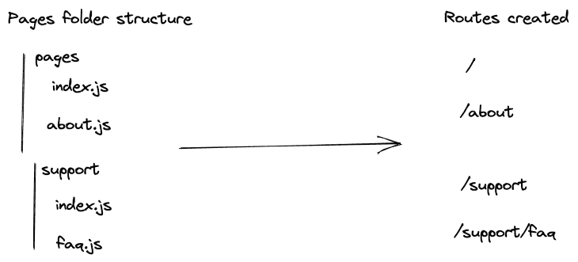
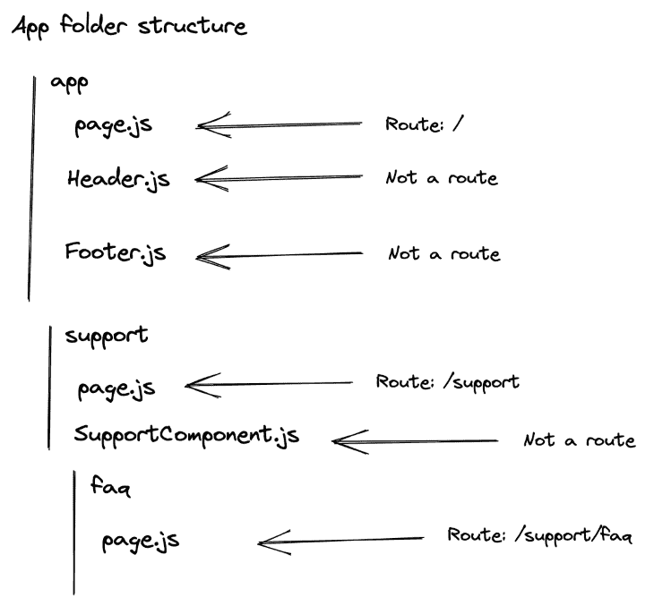
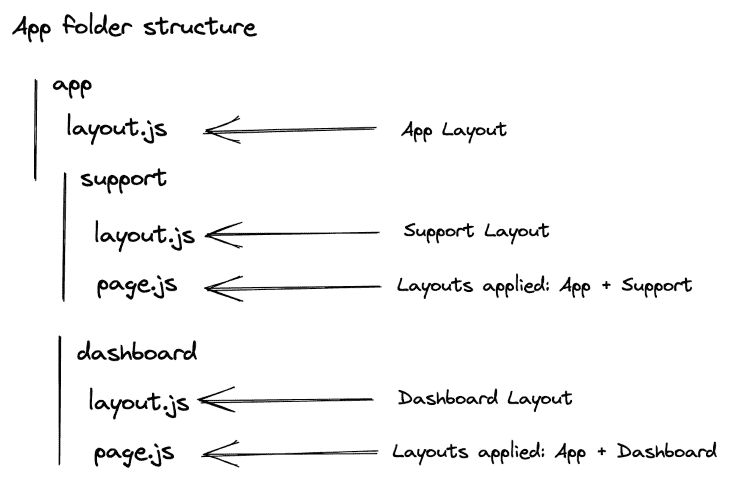

# 关于新的 Next.js router ，你需要知道什么

> 原文：<https://blog.logrocket.com/what-you-need-know-new-next-js-router/>

自 2016 年成立以来，Next.js 一直对自己的路由固执己见。其基于页面的方法允许开发人员指定何时呈现这些页面(服务器、客户端或静态页面的预呈现)。

然而，这种方法并非没有一些不便之处。幸运的是，托管平台背后的公司和 Next.js 的创造者 Vercel 听到了这些担忧。在 5 月 4 日戏弄了一次重大升级后，一篇[博客帖子](https://nextjs.org/blog/layouts-rfc?utm_source=next-site&utm_medium=banner&utm_campaign=next-website)在两周后删除，解释了 Next.js 路由器的一些重大变化:

> 📣Next.js 路由器正在进行重大升级！◆嵌套路由/布局◆客户端和服务器路由◆ React 18 个功能–开始过渡、暂停◆专为服务器组件设计◆ 100%可增量采用🤯预计 RFC 将很快出台👀

在本文中，如果您还不熟悉 Next.js 的路由器，您将了解它目前是如何工作的。然后，您将发现会出现什么样的问题，以及此更新计划如何解决这些问题。

## Next.js 路由当前如何工作

如上所述，Next.js 使用基于页面的方法来创建路线。具体来说，这意味着在每个 Next.js 项目中，都存在一个`pages`文件夹。在这个特殊的文件夹中，每个文件和文件夹都构成了一条新的路径。

在`pages`文件夹中，第一个根路径是`index.js`，在`/` URL 呈现主页。您也可以命名您的文件并创建一个静态路由(例如，`/about`路由的`about.js`)。

同样，文件夹也可用于创建嵌套路线。例如，创建一个名为`support`的文件夹和一个在`faq.js`中的文件将会创建路线`/support/faq`。

下面的图表可以更好地说明这一点:



也支持动态路由。通过在文件名或文件夹名中加上方括号，可以创建动态路由。例如，`/blog/[article-id].js`将支持`/blog/1`、`/blog/nextjs-dynamic-routing`等多条路线。

## Next.js 路由器限制

不幸的是，这种方法有一个很大的局限性。也就是说，尽管嵌套路由共享一个父路由，但您不能在它们之间共享状态或布局。

例如，以认证为例。在 React 中，使用 [react-router](https://reactrouterdotcom.fly.dev/docs/en/v6) 库，您可以创建自定义路由。例如，您可以创建一个受保护的路由来验证用户是否登录。如果用户没有登录，路由会将他们重定向到登录或注册页面。然后，您可以将这个受保护的路由分配给路由器中`/authentication`下的任何路径。这样，嵌套路由就不必担心身份验证，因为父路由会为它们处理身份验证。

不幸的是，这种情况在 Next.js 中是不可能的。您可以创建一个自定义的 route 组件，但是您必须将它分别包装在每个受保护的页面上。

同样的问题也适用于布局。如果你的应用程序有一个仪表板，那么多个页面将共享一个相似的布局(导航、页脚等)。).就目前情况而言，一次将一个布局应用到多个页面的唯一方法是在应用程序级别上这样做。这种布局将应用于您的整个应用程序。不幸的是，如果你有多个布局，你必须在每页的基础上定义它们。

## Next.js 路由器变更

知道了所有这些，Vercel 的团队决定修正这些限制。

### 路线创建更改

首先，与`pages`文件夹类似，将有一个名为`app`的新文件夹。这是为了提供向后兼容性，并允许开发人员慢慢迁移到新的路由器。

然后，文件夹结构仍将决定新的路由。这意味着`app`中的`dashboard`文件夹将链接到`/dashboard`路线。然而，有趣的是这些路径中的文件。

之前的路由器假设`/pages`中的每个文件都是一个新的路由。顺便说一句，这导致开发人员将他们的页面和非页面 React 组件(即`Navbar`、`Header`、`Footer`)分开。将类似于`Navbar.js`的文件放在主页上，即`/pages/index.js`，会使路由器认为`Navbar`是一条新的路由，而不是一个简单的子组件。结果，许多开发人员不得不创建一个`components`文件夹，并将他们不同的组件分开。

但是，新路由器假定每个文件都不是路由，除非明确说明。因此，要创建新的路线，您必须在文件夹中创建一个`page.js`。

因此，对于新路由器，我们之前的项目示例如下所示:



也支持动态路由。有了这种新格式，例如，要有一个`/blog/[article-id]` URL，您将需要一个`/app/blog/[article-id]/page.js`文件夹结构。

简而言之，以下是一些文件夹结构及其对应的路径:

*   `/app/blog/[article-id]/page.js` → `/blog/[article-id]`
*   `/app/blog/[category-id]/page.js` → `/blog/[category-id]`
*   `/app/blog/[category-id]/[article-id]/page.js` → `/blog/[category-id]/[article-id]`

### 嵌套布局

布局也得到了更新。

以前，您可以在单独的文件中创建布局，然后将布局导入到页面中。例如，下面是一个仪表板页面:

```
    import DashboardLayout from '../components/DashboardLayout'

    export default function DashboardPage() {
      /* The content for your dashboard page */
    }

    DashboardPage.getLayout = function getLayout(page) {
      return (
        <DashboardLayout>
          {page}
        </DashboardLayout>
      )
    }
```

如果需要嵌套，可以将多个布局导入到页面中。但是，由于这是在每页的基础上完成的，所以嵌套在仪表板中的每个页面都必须导入布局并嵌套它们。

谢天谢地，这种情况正在改变！使用新的路由器，您将能够为您的仪表板页面指定布局，任何嵌套的页面都将自动接收此布局。您只需在文件夹中创建一个`layout.js`文件，将该布局应用于该文件夹中的所有路线。

更具体地说，这里有一个例子:



在这个例子中，在根级别创建了一个`layout.js`文件，也就是在`app`文件夹中。该布局自动应用于应用程序中的任何路线。

这个应用程序也有两个部分:仪表板和支持。因为每个都有自己的样式，所以会创建一个`layout.js`文件来为它们的路线应用特定的样式。在根布局之上，这意味着`/dashboard`下的任何路线都将接收应用程序的布局和仪表板的布局。

因此，`pages.js`不再需要指定它使用的布局，因为它是由`layout.js`文件自动完成的。

与 Next.js 目前的路由器相反，它只允许你在页面级别获取数据，你也可以从布局中获取数据。您将能够使用`getStaticProps`和`getServerProps`来检索数据并构建您的布局。

因此，您的`/dashboard`页面将能够从多个组件(应用程序的布局、仪表板的布局和页面本身)获取数据。

## 结论

我们已经快速浏览了 Next.js 当前路由器的工作方式及其局限性。然后，我们发现 Next.js 的新路由器带来了一些最大的变化，包括嵌套布局和新的子树导航。

接下来还有更多。该 RFC 包括考虑 React 18 的新特性和服务器组件的更改。因此，我强烈建议你查看 RFC 以获得完整的要点:[https://github.com/vercel/next.js/discussions/37136](https://github.com/vercel/next.js/discussions/37136)。

Next.js 团队还计划在未来发表一篇博文，介绍更先进的路由技术。所以，敬请期待！

## [LogRocket](https://lp.logrocket.com/blg/nextjs-signup) :全面了解生产 Next.js 应用

调试下一个应用程序可能会很困难，尤其是当用户遇到难以重现的问题时。如果您对监视和跟踪状态、自动显示 JavaScript 错误、跟踪缓慢的网络请求和组件加载时间感兴趣，

[try LogRocket](https://lp.logrocket.com/blg/nextjs-signup)

.

[](https://lp.logrocket.com/blg/nextjs-signup)[](https://lp.logrocket.com/blg/nextjs-signup)

LogRocket 就像是网络和移动应用的 DVR，记录下你的 Next.js 应用上发生的一切。您可以汇总并报告问题发生时应用程序的状态，而不是猜测问题发生的原因。LogRocket 还可以监控应用程序的性能，报告客户端 CPU 负载、客户端内存使用等指标。

LogRocket Redux 中间件包为您的用户会话增加了一层额外的可见性。LogRocket 记录 Redux 存储中的所有操作和状态。

让您调试 Next.js 应用的方式现代化— [开始免费监控](https://lp.logrocket.com/blg/nextjs-signup)。