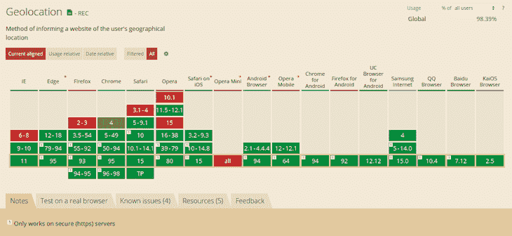

# 使用地理定位 API 时你需要知道什么

> 原文：<https://blog.logrocket.com/what-you-need-know-while-using-geolocation-api/>

## 介绍

当构建需要访问精确客户端位置的应用程序时,[地理定位 API](https://developer.mozilla.org/en-US/docs/Web/API/Geolocation_API) 就派上了用场。除其他原因外，您可以使用定位服务为客户提供定制体验，或者在构建需要实时定位访问的应用程序时使用定位服务。其中一个应用程序是健身应用程序，它需要精确的实时位置数据来跟踪用户散步或慢跑时的路线。

出于隐私和安全方面的考虑，地理定位 API 要求您在访问用户位置数据之前获得许可。在当今这个时代，极端的偏执状态对于某种程度的隐私和在线安全是必要的，你应该温和而负责任地请求访问位置数据，以便用户授予许可。此外，拥有这样的位置数据会带来更大的伦理、道德和法律责任。

因此，仅仅知道如何使用地理定位 API 是不够的。有效和负责任地使用它同样重要。

本文的主要目标是向您介绍地理定位 API 的主要特性，并解释如何有效地使用它。我们还将进一步强调您作为开发人员在使用地理定位 API 时的责任，并探索浏览器支持的范围。

在下一节中，让我们先简要介绍一下地理定位 API。

## 什么是地理定位 API？

地理位置 API 是用于访问客户端设备位置的内置 API。大多数最新版本的桌面浏览器完全支持这一特性，但你不能说他们的移动版浏览器也支持这一特性。因此，如果某些浏览器还不完全支持这个 API，您需要有一个后备选项。

位置数据的准确性很大程度上取决于客户端设备所使用的地理定位设备。如果设备具有 GPS 接收器，则地理定位 API 可以从 GPS 检索位置数据。它还可以从 IP 地址、WiFi 和蓝牙 MAC 地址等推断用户位置。地理位置 API 不知道客户端设备用来访问地理位置数据的技术。

不能保证地理位置信息是准确的，因为在没有更准确的技术(如客户端设备上的 GPS 接收器)的情况下，该 API 也可以使用 IP 地址来推断用户位置。

浏览器通过`navigator.geolocation`属性公开这个 API。然而，正如已经提到的，您需要小心行事，因为浏览器对该 API 的支持远非普遍。您应该仅在检查其可用性后访问它；这将确保您在客户端使用不支持 API 的浏览器时有一个后备选项。

一个备选方案是使用第三方地理定位服务:

```
if ("geolocation" in navigator) {
    // Access the API
    navigator.geolocation.getCurrentPosition(successCallback);
  } else {
    // Use a third-party geolocation service
    console.log("Browser does not support the Geolocation API");
  }

```

在我们进入下一节之前，您应该注意，只有当您的站点使用安全 HTTPS 协议时，大多数或所有浏览器才会公开地理位置 API。

## 获取用户位置

现在，让我们学习如何使用地理定位 API 访问用户位置，以及在这样做时的一些关键注意事项。

首先，我们将看到如何使用`getCurrentPosition`方法来访问用户位置。`getCurrentPosition`方法最多接受三个参数。

第一个(也是唯一需要的)参数是当 API 成功接收到位置数据时调用的回调函数。API 将设备位置数据作为参数传递给回调函数。

第二个是发生错误时调用的可选回调函数，第三个参数是 options 的对象。

下面的代码片段演示了如何使用`getCurrentPosition`方法来访问位置数据:

```
const successCallback = (geolocation) => {
  console.log(geolocation);
};

const errorCallback = (error) => {
  console.log(error);
};

const geolocationOptions = {
  enableHighAccuracy: true,
  maximumAge: 10000,
  timeout: 5000,
};

 if ("geolocation" in navigator) {
    // Access the API
    navigator.geolocation.getCurrentPosition(
      successCallback,
      errorCallback,
      geolocationOptions
    );
  } else {
    // Use a third-party geolocation service
    console.log("Browser does not support the Geolocation API");
  }

```

这就是使用地理定位 API 的`getCurrentPosition`方法访问客户端设备位置所需的全部内容。

但是，在使用这种方法访问客户端位置时，需要了解一些最佳实践。

### 响应于用户动作而访问地理定位 API

不要试图在页面加载时立即访问地理位置 API。如果你这样做了，API 将立即请求用户访问他们的位置。

这提供了一个糟糕的用户体验，并且会吓坏你的一些客户。在征求客户同意时，尽量保持耐心和温和，让他们相信你会提供他们的位置数据。

### 解释你为什么需要位置数据

在浏览器显示提示信息“此站点需要知道您的位置”之前，向用户解释您为什么需要他们的位置数据以及您打算如何使用这些数据是一种很好的做法。

* * *

### 更多来自 LogRocket 的精彩文章:

* * *

此外，您还可以包含指向您的隐私政策和服务条款的链接。

### 明确对位置数据的需求

在你的行动号召中，要清楚地表明对位置数据的需求。例如，如果您有一个带有文本“显示我附近的商店”的按钮或链接，您也可以在按钮旁边或作为工具提示提供类似“此服务需要访问您的位置”的附带消息。

因此，如果浏览器要求用户授权访问他们的位置，这并不奇怪。

### 设置超时，以防响应时间过长

如果客户使用带有 GPS 接收器的设备，如移动电话，访问位置数据所需的时间以及其他因素取决于大气条件和用户的位置。GPS 可能需要一分钟或更长时间来三角测量设备的位置。

您可以决定可接受的等待时间，如果等待时间过长，可以让操作超时。

此外，如果用户有意或无意地未能响应权限请求，设置超时同样有用。然后你可以使用一个替代的第三方地理定位服务或者显示一个不错的信息，比如“应用程序花了太长时间来访问你的位置。也许以后再试一次。”

### 优雅地处理错误

可能发生错误，或者用户可以拒绝授权访问位置数据。您总是可以传递另一个回调函数作为第二个参数，并使用它来优雅地处理错误。

这很有用，因为浏览器具有禁用位置查找的功能。如果用户在浏览器中禁用地理位置查找或拒绝授予权限，传递给`getCurrentPosition`方法的第二个回调函数将被 error 对象调用。然后，您可以采取适当的措施。

## 监视用户位置

有时访问一次地理位置数据可能是不够的，尤其是当用户在移动时。每当用户的位置发生变化时，您都必须使用`watchPosition`方法来访问位置数据。

`watchPosition`方法类似于`getCurrentPosition`方法。第一个参数是 API 接收位置数据时调用的回调函数，也是唯一必需的参数。第二个参数也是一个回调函数，但它是可选的。出错时会调用它。第三个参数是可选对象。

与`getCurrentPosition`方法不同，`watchPosition`方法返回一个唯一标识位置观察器的数字 ID。你可以用这个 ID 通过`clearWatch`方法停止监视用户位置。

传递给`watchPosition`方法的第一个回调函数被多次调用，以更新移动中的客户端位置，或者当更精确的地理位置数据可用时。

下面的代码块说明了如何使用`watchPosition`方法。它与`getCurrentPosition`方法非常相似。唯一的区别在于`watchPosition`方法返回的唯一编号 ID:

```
const successCallback = (position) => {
  console.log(position);
};

const errorCallback = (error) => {
  console.log(error);
};

let geolocationID;

if ("geolocation" in navigator) {
  // Access the API
  geolocationID = navigator.geolocation.watchPosition(
    successCallback,
    errorCallback
  );
} else {
  // Use a third-party geolocation service
  console.log("Browser does not support the Geolocation API");
}

```

这就是地理定位 API 的`watchPosition`方法的全部内容。但是，使用这种方法时，您应该考虑某些事情。

本文的目标是教你如何以最好的方式使用地理定位 API。因此，在使用`watchPosition`方法时，上一小节中强调的所有考虑事项也适用。

此外，您应该注意以下几点:

### 注意效率

如上所述，监视用户位置需要多次调用`watchPosition`方法。无论如何，这是一个计算量很大的操作。它需要计算资源来执行。

随着移动设备的广泛使用，您需要注意重复调用`watchPosition`方法对用户性能的影响。类似地，使用 GPS 接收器的移动设备将在三角测量设备位置时监听卫星信号。不断观察用户位置会消耗大量电池电量。

### 如果必须，只观察位置

如上所述，监视用户位置可能是一项昂贵的操作。如果你确定这样做会提高客户的服务质量，你应该使用`watchPosition`方法。

如果您必须观察用户位置，最好在地理位置信息停止变化时停止跟踪。确保在不再需要监视用户位置时停止监视。我们将在下一节强调如何停止监视用户位置。

## 如何停止监视用户位置

如果你开始观察用户位置，那么你肯定会在某个时候停止观察。

您可以使用`clearWatch`方法停止监视用户位置。`clearWatch`方法将由`watchPosition`方法返回的唯一手表 ID 作为参数:

```
// Start watching user location
const geolocationID = navigator.geolocation.watchPosition(
  successCallback,
  errorCallback
);

// Stop watching after 5 seconds
setTimeout(function () {
  navigator.geolocation.clearWatch(geolocationID);
}, 5000);

```

上面的代码片段演示了如何使用`clearWatch`方法来停止监视用户位置。

## 使用地理定位 API 时您的职责

既然您已经知道了什么是地理位置 API 以及如何使用它，那么让我们来看看您作为开发人员的职责。

当使用这个 API 时，您实际上是要求用户信任您的位置。如此敏感的数据会给你带来很多责任。

下面重点介绍了其中的一些职责。它们主要围绕数据保护和隐私政策。这不一定是一个详尽的列表，但它涵盖了大部分的基本内容。

### 遵守数据保护法

当您使用地理定位 API 时，您有责任遵守您所在司法管辖区内的相关隐私和数据保护法。您应该知道，一些数据隐私和安全立法超越了地域界限。

一个很好的例子是欧盟通过的一般数据保护条例(GDPR)。如果您的应用程序被欧盟的人使用，无论您在世界的哪个地方，不遵守 GDPR 都将受到严厉的处罚。

### 服务条款和隐私政策

当您使用地理位置 API 时，您要求用户授予对敏感数据的访问权限。因此，您有责任提供对您的服务条款和隐私政策的访问。
提供服务条款和隐私政策将告知用户使用服务的隐私含义，并帮助他们做出明智的决定。

可能没有多少人会阅读服务条款和隐私政策，但作为一名开发人员，您已经尽了自己的职责。您也可以在该服务可用之前显示“通过使用该服务，您同意我们的服务条款和隐私政策”消息。

### 将数据用于预期目的

您应该在服务条款中明确说明您打算如何使用地理位置数据。您还应该将数据用于指定的目的，并在此后丢弃它，除非用户明确允许您这样做。

## 允许用户删除他们的数据

如果您打算将地理位置数据保存在数据库中，您应该给用户删除或更新数据的自由和方法，如果他们愿意的话。

### 保护用户数据和隐私

保护客户隐私的责任完全落在你的肩上。一种可能的安全措施是加密数据。数据加密至关重要，尤其是当您打算将数据保存到数据库中，或者用户明确授权您将数据传输给第三方时。

## 浏览器对地理定位 API 的支持

正如在引言部分已经强调的，一些浏览器，尤其是移动浏览器，还没有实现地理位置 API 的一些功能。

尽管支持移动浏览器，最新版本的流行浏览器支持地理定位 API。如果您的目标是为所有浏览器提供支持，那么最安全的做法是有一个后备选项。回退选项的一个典型示例是使用第三方地理定位服务，这主要依赖于不太准确的 IP 地址来推断地理定位数据。

下图显示了浏览器对地理定位 API 的支持，根据[可以使用](https://caniuse.com)。



## 结论

如以上小节所述，如果您想在浏览器中访问客户端的位置数据，地理定位 API 可能永远是您的首选。出于隐私原因，在授予您的应用程序访问用户位置数据的权限之前，浏览器需要用户权限。

位置数据的准确性取决于客户端设备使用的地理定位技术。地理定位 API 不知道设备所使用的底层地理定位技术。它可以使用 GPS、IP 地址、蓝牙和 WiFi MAC 地址等来推断用户的地理位置。因此，位置可能不总是准确的。带有 GPS 接收器的移动设备往往能提供更高的精确度。

使用地理位置 API 时，您需要遵循一些最佳实践。它们将增加您获得用户位置数据的机会，并建立您的客户对其安全和隐私的信心。这也会增加采用你的产品和服务的可能性。

在获得访问客户位置数据的权限后，您有责任提供隐私和数据保护。大多数国家都有可能适用于您的隐私和数据保护立法。不遵守这些规定会给你带来麻烦。

希望你喜欢阅读这篇文章。关于如何有效和负责任地使用地理定位 API，你有更多的建议吗？请在下面的评论区告诉我。

## 通过理解上下文，更容易地调试 JavaScript 错误

调试代码总是一项单调乏味的任务。但是你越了解自己的错误，就越容易改正。

LogRocket 让你以新的独特的方式理解这些错误。我们的前端监控解决方案跟踪用户与您的 JavaScript 前端的互动，让您能够准确找出导致错误的用户行为。

[](https://lp.logrocket.com/blg/javascript-signup)

LogRocket 记录控制台日志、页面加载时间、堆栈跟踪、慢速网络请求/响应(带有标题+正文)、浏览器元数据和自定义日志。理解您的 JavaScript 代码的影响从来没有这么简单过！

[Try it for free](https://lp.logrocket.com/blg/javascript-signup)

.