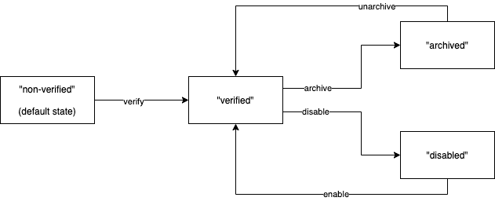
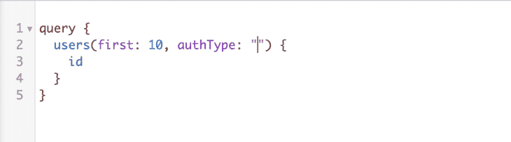
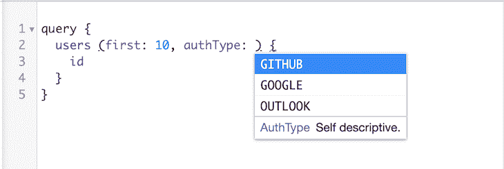
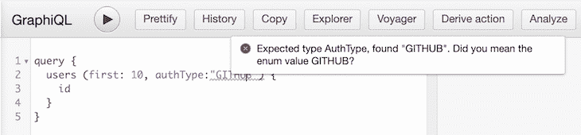
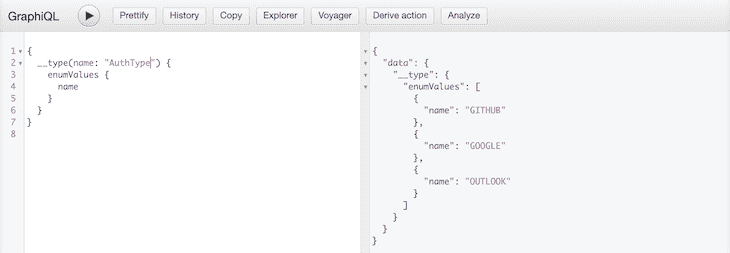

# 关于 GraphQL enums - LogRocket 博客你需要知道什么

> 原文：<https://blog.logrocket.com/what-you-need-to-know-about-graphql-enums/>

GraphQL 是一种语言和一组技术，使现代前端应用程序更容易查询数据。在“[2019 JavaScript 状态](https://2019.stateofjs.com/awards/)”报告中，GraphQL 被命名为开发人员最有兴趣学习的技术，被认为是一种可扩展的生产就绪工具，被许多行业巨头使用，如 Github、网飞和 Shopify 等。

虽然 GraphQL 的大部分特性都很好理解(例如，指令、输入类型、解析器)，但枚举类型经常被低估，它们的有用性很大程度上是未知的。在本教程中，我们将阐明枚举的重要性，并探索这种简单类型在构建健壮的 GraphQL APIs 中的重要作用。

## GraphQL 架构

GraphQL APIs 依赖 GraphQL 模式来公开数据。GraphQL 提供了自己的标量类型(`Int`、`Float`、`String`、`Boolean`和`ID`，并允许您使用以下关键字创建自己的数据类型。

*   `type`定义查询使用的复杂对象类型(读取数据)
*   `input`定义被突变用作自变量的输入类型(创建、更新、删除数据)

我们所有的例子都基于下面描述用户管理 API 的模式。

```
# A User (profile) is linked to some Accounts that carries all authentication information
type Account {
  id: ID! # "!" indicate a non-null (mandatory) field
  authType: String! # "google-auth", "github-auth", "outlook-auth"
  email: String!
  token: String
  archived: Boolean!
  disabled: Boolean!
  verified: Boolean!
}

type User {
  id: ID!
  accounts: [Account!]! # (a non-null array of non-null Account values)
  givenName: String!
}

# a single query is exposed to list all users and filter by status and authType
type Query {
  users(first: Int!, from: ID, status: String, authType: String): [User!]!
}

# we define an "input" type for our updateAccount mutation
input UpdateAccountInput {
  id: ID!
  state: String! # "verified", "disabled", "archived"
}

type Mutation {
  updateAccount(input: UpdateAccountInput!): Account!
}

```

我们的 GraphQL API 允许我们使用一些可选的过滤器列出所有用户。

*   `String`类型的`status`，允许我们使用一个简单的`String`值:`“verified”, “disabled”, “archived”`来过滤`User`的多个布尔字段
*   `authType`基于`Account.authType`

API 在内部使用`Account.authType`值(`“google-auth”, “github-auth”, “outlook-auth”`)来利用适当的提供者进行身份验证，并获取用户配置文件信息。`“google-auth”`导致了`GoogleProfileProvide`名称空间下的适当逻辑。

我们可以通过以下方式让前 10 个活跃用户使用 Google。

```
   user(first: 10, authType: "google-auth", status: "verified") {
      id
      # ...
   }

```

我们的 API 还公开了一个`updateAccount`突变，它允许我们在帐户的生命周期中更新帐户状态。



该模式按原样运行。然而，我们可以通过利用 GraphQL 枚举使它更加健壮。

## 为什么使用枚举？

虽然当使用`String`、`Account.authType`和`UpdateAccountInput.state`时，我们可以期望得到特定的值，但这会在多个层面上引入问题。

### 字符串区分大小写，会破坏 GraphQL 验证

下面是一个如何使用`users`查询的例子。

```
query {
  users(first: 10, status: "Verified") {
   id
  }
}

```

在客户端(例如，Apollo)，这个查询是完全有效的。然而，你能发现这个错别字吗？

`status`值`“Verified”`，应该写成`“verified”`。

在这里使用自由格式的`String`类型可能会触发意外的 500、静默错误，或者更糟的是，安全漏洞。

为了防止这种情况，我们必须向我们的`users`查询解析器添加一些验证逻辑。

```
interface UsersArgs {
  first: number,
  from?: string,
  status?: String,
  authType?: string,
}

const STATUSES = ['', '', ]

export const resolvers = {
  Query: {
    users: (_record: never, args: UsersArgs, _context: never) {
      if (args?.status &&  !STATUSES.includes(args.status)) {
        // throw error
      }
      // ...
    }
  }
}

```

这是适得其反的，因为基于 GraphQL 类型的模式的主要价值是提供开箱即用的操作和数据验证。使用枚举将状态值限制在一组给定的已定义值内，并避免重复的验证逻辑。

### 公开内部值

我们看到`Account.authType`依赖于`String`类型，这导致了下面的`users`查询。

```
query {
  users(first: 10, authType: "google-auth") {
   id
  }
}

```

这种模式不是最佳的，因为公开内部值违背了 API 应该公开一个简单的、解耦的数据接口的原则。

* * *

### 更多来自 LogRocket 的精彩文章:

* * *

同样，我们可以改进我们的`users`查询解析器，以允许过滤公共友好的值。

```
interface UsersArgs {
  first: number,
  from?: string,
  status?: String,
  authType?: string,
}

const AUTH_TYPES_FILTER_MAP = {
   'GOOGLE': 'google-auth',
   'GITHUB': 'github-auth,
   'OUTLOOK': 'outlook-auth',
}

export const resolvers = {
  Query: {
    users: (_record: never, args: UsersArgs, _context: never) {
      // does both mapping and validation (invalid value will be ignored)
      const authType = AUTH_TYPES_FILTER_MAP[args.authType]
      // ...
    }
  }
}

```

这将允许以下查询。

```
query {
  users(first: 10, authType: "GOOGLE") {
   id
  }
}

```

然而，在这里，我们必须再次构建一个已经由 GraphQL 通过 enums 提供的特性。

在下一节中，我们将通过将我们的模式迁移到枚举来演示如何将枚举映射到内部值。

### 可发现性问题(类型脚本、图形/资源管理器)

依赖`String`类型获得基于过滤器或选择的值的最后一个缺点是可发现性。

如果您有一个依赖于`String`类型的`UpdateAccountInput.status`，GraphQL 将无法在自省查询期间检查`UpdateAccountInput.status`的可能值，因为只有解析器知道它们。

[GraphQL 自省](https://graphql.org/learn/introspection/)是 GraphQL 的核心特性之一，它允许客户端通过执行 GraphQL 查询(inception)来动态检查模式定义。

下面是一个例子，列出了我们的模式中定义的所有查询:

```
query {
  __schema {
    queryType {
      fields {
        name
        args {
          name
          type {
            name
            description
          }
        }
        description
        deprecationReason
      }
    }
  }
}

{
  "data": {
    "__schema": {
      "queryType": {
        "fields": [
          {
            "args": [
              {
                "name": "authType",
                "type": {
                  "name": "String",
                  "description": null
                }
              },
              {
                "name": "first",
                "type": {
                  "name": null,
                  "description": null
                }
              },
              {
                "name": "from",
                "type": {
                  "name": "ID",
                  "description": null
                }
              },
              {
                "name": "status",
                "type": {
                  "name": "String",
                  "description": null
                }
              }
            ],
            "deprecationReason": null,
            "name": "users",
            "description": "perform the action: \"users\""
          }
        ]
      }
    }
  }
}

```

像 GraphiQL 这样的工具使用自省来提供自动完成功能。 [GraphQL 代码生成器](https://graphql-code-generator.com/)也用它来生成 TypeScript 类型。

类型不允许我们检查可能的值。



GraphQL 枚举是自省的，允许应用程序自动完成可能的值并生成相应的 TypeScript 类型。

## 迁移到枚举

依赖于`String`可能会导致安全问题、解析器端不必要的验证逻辑以及糟糕的开发人员体验。

让我们通过迁移到枚举来使我们的 GraphQL 模式更加健壮。

### 如何使用枚举

GraphQL 枚举可以使用`enum`关键字来定义。

```
enum AuthType {
   GOOGLE
   GITHUB
   OUTLOOK
}

```

根据[官方规范](http://spec.graphql.org/June2018/#EnumValue)，您应该使用全大写约定来命名枚举值。枚举值不需要任何公共前缀，因为它们是由枚举的名称命名的。

### 更新模式

让我们来看看新的基于枚举的模式:

```
enum AuthType {
   GOOGLE
   GITHUB
   OUTLOOK
}

# A User (profile) is linked to some Accounts that carries all authentication information
type Account {
  id: ID! # "!" indicate a non-null (mandatory) field
  authType: AuthType!
  email: String!
  token: String
  archived: Boolean!
  disabled: Boolean!
  verified: Boolean!
}

type User {
  id: ID!
  accounts: [Account!]! # (a non-null array of non-null Account values)
  givenName: String!
}

# a single query is exposed to list all users and filter by status and authType
type Query {
  users(first: Int!, from: ID, status: String, authType: String): [User!]!
}

enum AccountState {
   VERIFIED,
   DISABLED,
   ARCHIVED
}

# we define an "input" type for our updateAccount mutation
input UpdateAccountInput {
  id: ID!
  state: AccountState!
}

type Mutation {
  updateAccount(input: UpdateAccountInput!): Account!
}

```

**枚举内部值**

枚举值解析(在解析器和客户端)是一个实现细节，这意味着每个库选择如何将给定的枚举值解析为特定于语言的值。

使用 Apollo Server，每个枚举值都将被解析为它的等效字符串。

*   `AuthType.GOOGLE`解析为`“GOOGLE”`
*   `AuthType.GITHUB`解析为`“GITHUB”`
*   `AuthType.OUTLOOK`解析为`“OUTLOOK”`

然而，我们的 API 期望被操纵的内部值(`“google-auth”, “github-auth”, “outlook-auth”`)适当地运行。

根据[官方文档](https://www.apollographql.com/docs/graphql-tools/scalars/#internal-values)，Apollo Server 使您能够提供 enum 解析器，如下图所示，我们更新了`users`查询解析器。

JavaScript 版本:

```
export const resolvers = {
  AuthType: {
   GOOGLE: 'google-auth',
   GITHUB: 'github-auth',
   OUTLOOK: 'outlook-auth',
  },
  Query: {
    users: (_record, args, _context) {
      // args.authType will always be 'google-auth' or  'github-auth' or 'outlook-auth'
      // ...
    }
  }
}

```

TypeScript 版本:

```
enum AuthType {
 GOOGLE =  'google-auth',
 GITHUB =  'github-auth',
 OUTLOOK = 'outlook-auth',
}

interface UsersArgs {
  first: number,
  from?: string,
  status?: String,
  authType?: AuthType,
}

export const resolvers = {
  AuthType,
  Query: {
    users: (_record: never, args: UsersArgs, _context: never) {
      // args.authType will always be 'google-auth' or  'github-auth' or 'outlook-auth'
      // ...
    }
  }
}

```

请注意，使用 TypeScript，枚举类型可以作为解析器直接传递。

对于输入和输出数据(`Mutation`参数和`Query`返回的数据)，Apollo 服务器会将枚举值解析为其正确的内部值(`resolvers.AuthType`)。

现在我们的模式依赖于枚举，让我们看看它是如何改进我们的查询和突变用法的。

## 使用枚举查询

我们现在可以查询我们的用户，并使用我们的`AuthType` enum 进行过滤。

```
query {
  users (first: 10, authType: GOOGLE) {
    id
  }
}

```

我们的查询现在是安全的、无类型的、完全可发现的。



但是枚举值`String`无效。使用枚举类型的字段需要枚举引用，因此传递枚举值被认为是无效的。




## 额外收获:打字稿生成

GraphQL 枚举是可内省的，如下所示。



自省枚举意味着像 [GraphQL 代码生成器](https://graphql-code-generator.com/)这样的工具会为你的前端应用程序生成相应的 TypeScript 枚举类型。

使用我们的模式，GraphQL 代码生成器将能够创建相应的 TypeScript 枚举:

```
export enum AuthType {
 GOOGLE =  'google-auth',
 GITHUB =  'github-auth',
 OUTLOOK = 'outlook-auth',
}

```

这对于以后的使用会很方便(`useQuery()`，`useMutation()`):

```
const ActiveUsersList = () => {
  const { loading, data } = useQuery(
    usersQueryDocument,
    {
      variables: {
        first: 10,
        authType: AuthType.GOOGLE,
      }
    })

  // ...
}

```

同时依赖 GraphQL 枚举和 TypeScript 生成的枚举有助于增强开发人员的体验。

## 摘要

即使在小的 GraphQL APIs 上，比如用户管理 API，枚举也带来了很多一致性，并使您的模式更加健壮。

在本教程中，我们探索了 GraphQL 枚举如何帮助:

*   **提供更健壮、更易发现的 API** —模式中每个基于列表或过滤的字段都应该利用枚举来避免安全性、与输入错误相关的问题和可发现性问题。使用枚举是充分利用 GraphQL 强大功能的一个很好的例子:语义操作和动态数据验证
*   **公开一个简单的接口**—API 的主要目标是为数据或复杂系统提供一个简化的接口。GraphQL 更是如此，它为前端世界带来了自然的、类似 JSON 的 API。当涉及到过滤时，GraphQL 枚举是将内部值抽象为简单选择的极好方法
*   **维护精简解析器** —在构建 GraphQL API 时，重要的是不要重新实现 GraphQL 提供的特性。如果 GraphQL 的主要特性是操作验证(例如，操作询问、参数的结构)和数据验证(对于输入和输出)，那么解析器应该精简，只关注业务逻辑(例如，数据操作、额外复杂的验证)

## 监控生产中失败和缓慢的 GraphQL 请求

虽然 GraphQL 有一些调试请求和响应的特性，但确保 GraphQL 可靠地为您的生产应用程序提供资源是一件比较困难的事情。如果您对确保对后端或第三方服务的网络请求成功感兴趣，

[try LogRocket](https://lp.logrocket.com/blg/graphql-signup)

.

[](https://lp.logrocket.com/blg/graphql-signup)[https://logrocket.com/signup/](https://lp.logrocket.com/blg/graphql-signup)

LogRocket 就像是网络和移动应用的 DVR，记录下你网站上发生的每一件事。您可以汇总并报告有问题的 GraphQL 请求，以快速了解根本原因，而不是猜测问题发生的原因。此外，您可以跟踪 Apollo 客户机状态并检查 GraphQL 查询的键值对。

LogRocket 检测您的应用程序以记录基线性能计时，如页面加载时间、到达第一个字节的时间、慢速网络请求，还记录 Redux、NgRx 和 Vuex 操作/状态。

[Start monitoring for free](https://lp.logrocket.com/blg/graphql-signup)

.