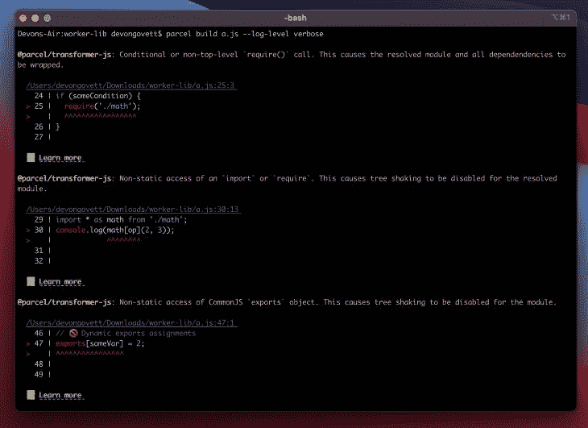

# 你需要知道的关于 2 号地块的信息

> 原文：<https://blog.logrocket.com/what-you-need-to-know-about-parcel-2/>

捆绑 JavaScript 文件是减少服务器请求 JavaScript 文件数量的一种方法。它通过将大量 JavaScript 文件合并到一个文件中来实现这一点，从而减少页面请求并改善网站性能和用户体验。

在模块捆绑出现之前，通常每个模块必须有单独的`<script>`标签，所以浏览器必须一个接一个地加载每个脚本，导致页面加载时间更长。

现在，捆绑销售比以往任何时候都更重要，原因有很多:

*   HTTP1 在单个连接上只能处理有限数量的请求。为每个资产建立连接会破坏性能
*   浏览器不一定能运行我们写的代码，比如 TypeScript 和 CoffeeScript。打包者可以简单地将这些代码打包
*   捆绑通过删除不必要的代码和缩小代码来最小化页面大小

在本帖中，我们将关注 JavaScript 捆绑工具 [Parcel](https://parceljs.org/) ，特别是它的最新版本 Parcel 2，它包括一系列旨在帮助开发人员构建更快网站并增强整体用户和开发人员体验的新功能。

有一些替代工具，比如 [webpack 和 snowpack](https://blog.logrocket.com/snowpack-vs-webpack/) ，但是让 package 与众不同的是它在零配置的项目中集成和使用是多么简单。

## 包裹 2 有什么新内容？

Parcel 团队于 2021 年 9 月 10 日发布了稳定版的 Parcel 2 (v2.0.0 ),带来了许多激动人心的消息。它仍然具有您从 Parcel 1 中了解并喜爱的零配置体验，同时还使其可伸缩并可扩展到任何规模和复杂性的项目。

它还提供了几个新功能，比如通过本机 [ES 模块](https://blog.logrocket.com/how-to-use-ecmascript-modules-with-node-js/)的自动差异捆绑，一个全新的插件系统，默认情况下支持树摇动，等等。

《包裹 2》已经制作了三年，本质上是对《包裹》的彻底翻拍。其新的基于 Rust 的 JavaScript 编译器声称构建性能提高了 10 倍。

以下是你需要知道的。

## Parcel 2 提供了一个全新的插件系统

package 2 包括对整个插件系统的全面检查，以及由 package 团队添加的配置文件。配置文件不用于配置任何插件中的任何特定内容；相反，它用于指定特定文件类型应该使用哪个插件。

例如，transformer 插件可以设置为使用`TypeScript-tsc`编译器，而不是对 TypeScript 文件使用 Babel。

从接受一种文件类型并将其转换为另一种文件类型的转换器(如现代 JavaScript 到传统 JavaScript 或 TypeScript 到 JavaScript ),到优化器、验证器等等，管道的每个阶段都有自己的插件类型和进入阶段。这里是插件类型的完整列表。

这使得 Parcel 完全可扩展，并允许它从小规模项目扩展到具有复杂构建要求的大型生产应用程序。

## 现在，默认情况下在宗地中启用树摇动

现在 Parcel 2 中默认启用了树抖动，支持 ES 模块、CommonJS、动态导入和 CSS 模块，树抖动机制得到了极大的增强。

Parcel 2 还为树抖动包生成源地图，这是自最初的树抖动发布以来的一个限制和主要困难。因为树抖动并不是简单地以线性方式连接文件，适当地合并源地图被证明是具有挑战性的。

此外，Parcel 显示了改进的和更彻底的错误警告，包括错误的代码帧，如导入不存在的模块导出或访问未知符号等。

## 巨大的性能提升

在 Parcel bundler 的早期版本中，JavaScript 编译是 Parcel 最慢的方面。

序列化大型 JavaScript [抽象语法树(ASTs)](https://deepsource.io/glossary/ast/) 以跨线程发送特别慢，JavaScript 垃圾收集器承受了很大的压力。此外，因为 JavaScript 代码必须在每次运行时由引擎编译，所以启动起来很慢。

因此，package 团队使用了 [speedy web compiler](https://swc.rs/) (swc)编译器。swc 是在 Rust 中开发的一个 TypeScript/JavaScript 编译器，据称在单线程执行上比 Babel JavaScript 编译器快 20 倍，在四核基准测试上快 70 倍。

当一个浏览器列表被设置时，swc 也默认替换 Babel 用于 transpilation，以及编译 JSX 和 TypeScript 并提供 [React 快速刷新](https://www.netlify.com/blog/2020/12/03/what-is-react-fast-refresh/)。

## 包裹通过本地 ES 模块提供自动差异捆绑

差异捆绑的概念是将不同的代码副本发送到不同的目标，并让浏览器决定下载哪一个。

除了导入和导出语法之外，现代浏览器还支持诸如类、箭头函数、异步/等待等语法。

不需要将现代语法移植到旧的 JavaScript 版本中，发布它可以减少包的大小并改善加载时间。

对于当前的浏览器，Parcel 2 现在自动生成本机 es 模块，以及用于旧浏览器的回退经典脚本。通过发布现代语法而不是转换到 ES5，极大地减少了大多数用户的包大小。

## 包裹中的自动代码分割

开箱即用，Parcel 无需配置即可启用[代码拆分](https://parceljs.org/features/code-splitting/)。这允许您将应用程序代码分解成可以并行加载和缓存的不同包，从而减少初始包的大小并加快加载速度。

动态的`import()`语法，作为一个常规的 import 语句，但返回一个承诺，被用来规范代码分割。这表明模块可以异步加载。

* * *

### 更多来自 LogRocket 的精彩文章:

* * *

下面是一个来自 Parcel 的示例，展示了如何使用动态导入按需加载应用程序的子页:

```
//pages/index.js:

import("./pages/about").then(function (page) {
  // Render page
  page.render();
});
```

```
//pages/about.js:

export function render() {
  // Render the page
}

```

因为`import()`返回一个承诺，所以也可以使用 async/await 语法:

```
//pages/index.js:

async function load() {
  const page = await import("./pages/about");
  // Render page
  page.render();
}
load();
```

```
// pages/about.js:

export function render() {
  // Render the page
}

```

## 宗地 2 中的图像大小调整、转换和优化

“包裹”附带了一个图像转换器，可让您调整照片的大小，将它们转换为新的格式，并通过调整质量来最小化文件大小。当引用图片时，这可以通过查询参数或配置文件来完成。

在生产模式下，Parcel 现在自动为 JPEGs 和 png 启用无损图像优化。这在不影响图像质量的情况下减小了图像的尺寸。根据所提供的图像，它可以产生惊人的差异。

## 更好的诊断

当无法找到您提到的模块时，Parcel 现在包含增强的错误报告。它包含一个漂亮的语法突出显示的代码框架堆栈、提示，甚至文档链接，向您显示错误发生的位置，以及导致问题的任何中间文件。



Source: [JavaScript Daily](https://morioh.com/p/4021789a5799)

## 结论

最新版本的 Parcel 包括一系列新的和增强的功能，旨在提高网站性能，并为开发人员提供工具箱中的即用型工具。

在本帖中，我们讨论了当前版本中一些值得注意的特性。访问[官方文档](https://parceljs.org/blog/v2/)查看公告，其中包括所有激动人心的新功能和升级。

如果你想将一个现有的项目从地块 1 升级到地块 2，你应该查看一下[迁移指南](https://parceljs.org/getting-started/migration/)——就像更新你的`package.json`中的依赖关系一样简单！

## 使用 [LogRocket](https://lp.logrocket.com/blg/signup) 消除传统错误报告的干扰

[](https://lp.logrocket.com/blg/signup)

[LogRocket](https://lp.logrocket.com/blg/signup) 是一个数字体验分析解决方案，它可以保护您免受数百个假阳性错误警报的影响，只针对几个真正重要的项目。LogRocket 会告诉您应用程序中实际影响用户的最具影响力的 bug 和 UX 问题。

然后，使用具有深层技术遥测的会话重放来确切地查看用户看到了什么以及是什么导致了问题，就像你在他们身后看一样。

LogRocket 自动聚合客户端错误、JS 异常、前端性能指标和用户交互。然后 LogRocket 使用机器学习来告诉你哪些问题正在影响大多数用户，并提供你需要修复它的上下文。

关注重要的 bug—[今天就试试 LogRocket】。](https://lp.logrocket.com/blg/signup-issue-free)