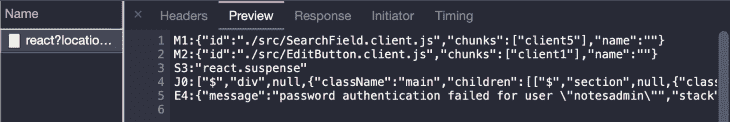

# 关于 React 服务器组件你需要知道什么

> 原文：<https://blog.logrocket.com/what-you-need-to-know-about-react-server-components/>

现代应用程序需要大量的时间来研究、设计、开发和测试。有很多不同的技术可以用来构建现代应用程序，每种技术都是为了解决特定的问题，每种技术都有其优缺点。构建现代应用程序没有灵丹妙药。

当使用 React 时，我们可以说出一些现在使用的不同技术，但最常用的是服务器端渲染和客户端渲染。这两种技术都解决了特定的问题，是开发人员构建丰富的现代应用程序时最常用的技术。

2020 年底，React 团队提出了一个名为 [React 服务器组件](https://reactjs.org/blog/2020/12/21/data-fetching-with-react-server-components.html)的 React 新功能。从那时起，React 社区开始讨论这种构建 React 应用程序的新方法的利弊，以及它如何影响 React 应用程序的未来。

我们将讨论 React 服务器组件，以及它们将如何改变 React 应用程序的现代构建方式。

## React 服务器组件

在了解更多关于 React 服务器组件的信息之前，请记住它仍处于开发阶段，不建议用于生产。

来自 [React 团队](https://github.com/reactjs/rfcs/pull/188):

> 服务器组件允许开发人员构建跨服务器和客户端的应用程序，将客户端应用程序的丰富交互性与传统服务器渲染的改进性能相结合。

[React 服务器组件](https://reactjs.org/blog/2020/12/21/data-fetching-with-react-server-components.html)对捆绑包大小没有任何影响，它可能会改变我们构建 React 应用的方式。这不仅会减少包本身的大小，还会改善初始页面加载时间。

[React 服务器组件](https://reactjs.org/blog/2020/12/21/data-fetching-with-react-server-components.html)在服务器上呈现，并且只有呈现的内容被发送到客户端:

```
import db from "database";

const Comment = (props) => {
  const { id } = props;
  const comment = db.comments.get(id);
  return (
    <div>
      <h1>{comment.title}</h1>
      <p>{comment.text}</p>
    </div>
  );
};

```

React 服务器组件看起来像一个传统的 React 组件，它接受 props 并有一个 render 方法。它只有一些附加功能，例如:

*   他们可以直接访问服务器数据源，如微服务、函数、数据库等。这种能力带来的可能性是巨大的，我们将能够创建与各种数据源一起工作的内部 API，我们可以访问我们组件内部的服务器，而不必将它直接暴露给 API。
*   它们是按照一个有效的命名约定创建的，在组件名称后使用`.server.js`后缀。例如，如果你的组件将被命名为`note.js`，那么它必须被命名为`note.server.js`。客户端组件将分别按照组件名称后使用`.client.js`后缀的命名约定创建。

React 服务器组件并不能解决我们现在面临的所有问题。以下是 React 服务器组件不具备的一些功能:

*   React 服务器组件不能有状态，因为它们对每个请求只执行一次，所以不支持使用 React 钩子来处理状态数据，比如`useState`和`useReducer`
*   React 服务器组件不能使用 React 挂钩来呈现生命周期方法，如`useEffect`和`useLayoutEffect`
*   React 服务器组件不能使用浏览器专用的 API

我们可以创建 React 组件和钩子，既可以用在我们的服务器组件上，也可以用在客户机组件上。钩子是在组件之间共享逻辑的一种非常简单而强大的方式，我们仍然可以在服务器组件中使用它。

我们应该确保遵守所有的约束条件，包括:

*   我们**不能**使用像 useState 或 useReducer 这样的钩子来利用状态逻辑
*   我们**不能**使用服务器端数据源
*   我们**不能**使用依赖于状态、效果或浏览器专用 API 的定制钩子

在遵循了所有的约束之后，我们可以创建在服务器端和客户端都可以使用的组件和钩子。

传统的 React 组件被称为客户端组件，因为它是在客户端呈现的。客户端组件是您所熟悉的组件，它可以处理状态数据，可以与仅支持浏览器的 API 一起工作，等等。

React 服务器组件可以呈现服务器组件、本机 HTML 元素或客户端组件。假设我们有一个名为`CommentLikeButton`的组件，它是一个客户端组件，我们可以简单地将它导入到我们的服务器组件中，然后毫无问题地使用它:

```
import db from "database";
import CommentLikeButton from 'CommentLikeButton.client';

const Comment = (props) => {
  const { id } = props;
  const comment = db.comments.get(id);
  return (
    <div>
      <h1>{comment.title}</h1>
      <section>{comment.body}</section>
      <CommentLikeButton />
    </div>
  );
};

```

## RSC 与。战略科研署

服务器端渲染是一种在服务器端渲染应用程序的技术，将 HTML 发送到客户端，然后由浏览器渲染 HTML。这是服务器端渲染应用的两个最重要的优势之一:

*   **性能—** 客户端收到的 HTML 文件已经填充了内容并准备好呈现，因此浏览器不需要获取任何 JavaScript
*   **SEO —** 由于 JavaScript 通常需要搜索引擎花费更多时间来渲染应用程序，因此 SEO 性能得以提高。因为客户机需要的所有内容都在服务器上呈现，所以文件将准备好呈现，从而产生更好的排序搜索

服务器组件是在服务器端呈现的组件，但不是 HTML。服务器组件使用一种特殊的格式呈现，并传输到客户端。这是 React 服务器组件的呈现方式:



React 服务器组件用于呈现组件的流目前没有标准协议，但看起来很像 JSON 格式。

尽管 React 服务器组件非常强大，但它们不会取代服务器端呈现的应用程序。我们需要辨别一些差异:

*   React 服务器组件可以随时重新呈现，而 SSR 应用程序可以重新呈现，但它们将重新呈现一个全新的 HTML 页面，并丢失其应用程序状态(如果有的话)
*   React 服务器组件可以从树中的任何位置访问服务器数据源，如微服务、函数、数据库，而对于 SSR 应用程序，尤其是 Next，我们需要使用 getServerProps()，它只在页面的顶层工作

大多数时候，当我们使用服务器端渲染时，我们只使用它一次进行初始渲染。可以多次重新提取服务器组件来重新呈现我们的数据。我们可以定期重新获取我们的服务器组件，服务器会将更新流传下来，而不会丢失我们的客户端组件上的任何状态数据。

## React 服务器组件的影响

web 开发社区中发布的每一个新事物都可以改变我们正在构建的方式，并将在未来构建现代应用程序。开发人员总是在寻找新的技术来改进他们的应用程序，当然，React 服务器组件可能会带来一种构建现代应用程序的新方法。

我们知道 React 服务器组件不同于服务器端渲染应用程序，我们使用一种特殊的格式进行渲染，并且我们还可以根据需要多次重新提取组件以重新渲染数据。仅通过这两个特性，我们就可以很容易地改变我们构建 React 应用程序的整个方式。

使用 React 服务器组件，我们可以通过混合客户端和服务器端呈现的组件来构建现代应用程序，我们可以只使用 React 服务器组件呈现一小部分 UI 服务器端，而使用传统 React 组件呈现其他 UI 部分。

尽管 React Server Components 是一项新技术，但它有许多潜在的出色特性，这些特性无疑将改善未来构建现代应用程序的方式，例如零捆绑包大小、直接从服务器访问数据源、与客户端组件集成等。

## 结论

React 有许多不同的技术来构建现代应用程序，React 服务器组件是一种非常强大的技术，用于在服务器端呈现组件，并仅将内容发送给客户端。正如我们所看到的，服务器组件与服务器端呈现的应用还是有一点点不同，它有一些不同的功能。React 团队仍在研究和开发服务器组件，但我们可以预测 React 应用的未来非常光明，允许开发人员将服务器端渲染和客户端渲染的组件混合在一起，改善客户端体验和应用性能。

## 使用 LogRocket 消除传统反应错误报告的噪音

[LogRocket](https://lp.logrocket.com/blg/react-signup-issue-free)

是一款 React analytics 解决方案，可保护您免受数百个误报错误警报的影响，只针对少数真正重要的项目。LogRocket 告诉您 React 应用程序中实际影响用户的最具影响力的 bug 和 UX 问题。

[ ](https://lp.logrocket.com/blg/react-signup-general) [  ](https://lp.logrocket.com/blg/react-signup-general) [LogRocket](https://lp.logrocket.com/blg/react-signup-issue-free)

自动聚合客户端错误、反应错误边界、还原状态、缓慢的组件加载时间、JS 异常、前端性能指标和用户交互。然后，LogRocket 使用机器学习来通知您影响大多数用户的最具影响力的问题，并提供您修复它所需的上下文。

关注重要的 React bug—[今天就试试 LogRocket】。](https://lp.logrocket.com/blg/react-signup-issue-free)