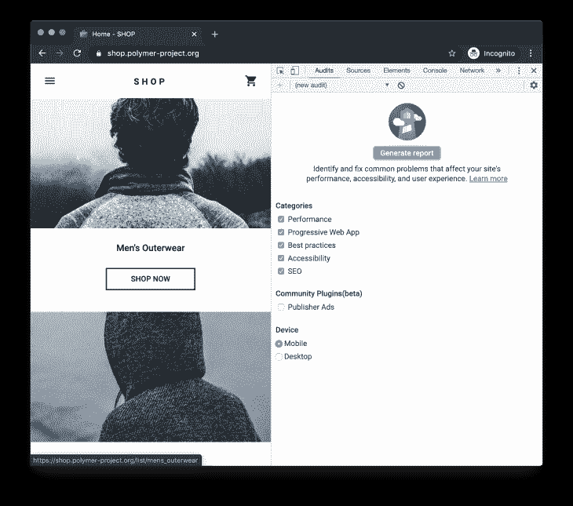
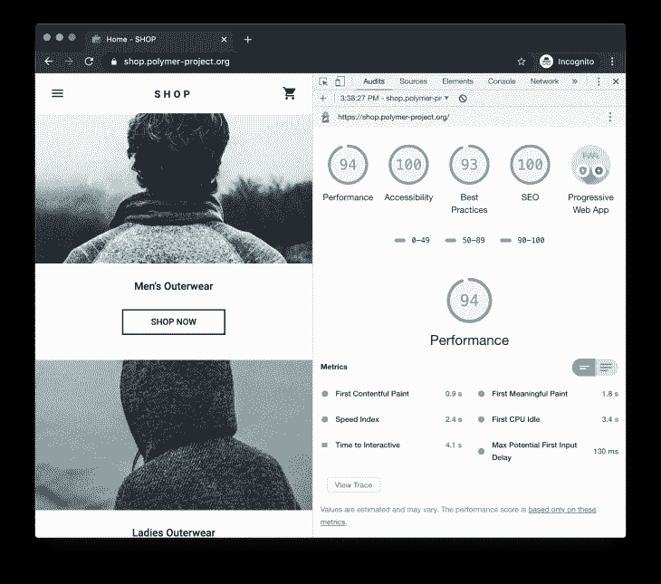
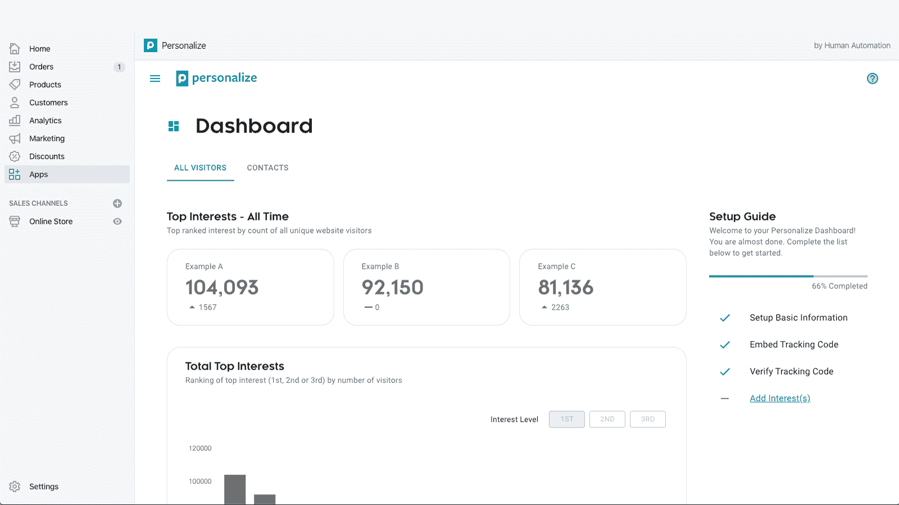
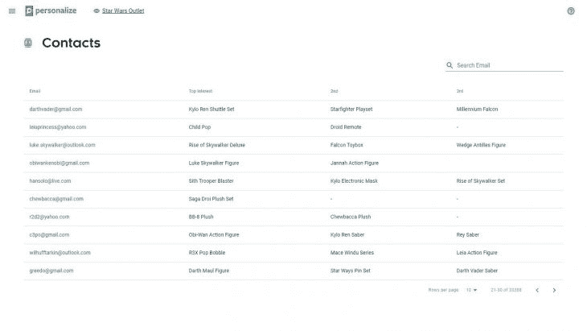
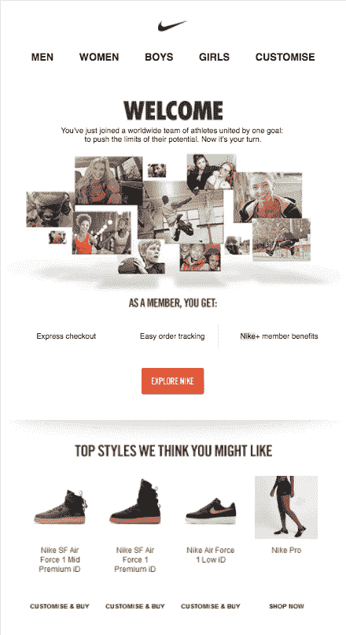
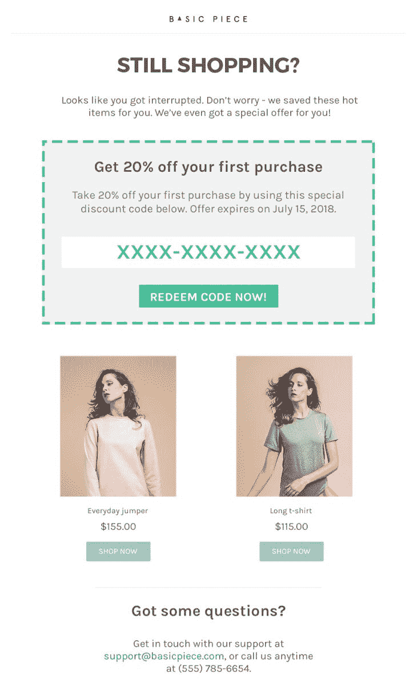
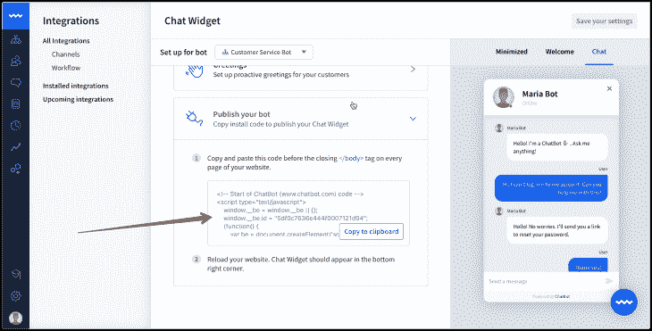

# 你的电子商务中缺少什么？

> 原文：<https://blog.logrocket.com/whats-missing-in-your-ecommerce-stack/>

## 介绍

在本文中，我们将讨论您的电子商务堆栈中可能缺少的五个基本工具/流程，如果正确实施，可以显著提高您的商店的转化率。

## 速度优化

网站加载时间是谷歌在搜索结果中对网站进行排名时考虑的最重要的因素之一。

根据[这篇文章](https://backlinko.com/search-engine-ranking)，你的网页必须在 **3 秒**内加载，以获得排名时搜索算法的最大回报。要知道，[谷歌首页的结果平均在 1.65 秒](https://backlinko.com/search-engine-ranking)内加载。

作为第一步，你需要检查你的电子商务网站的加载时间。要做到这一点，有几个工具来衡量一个网站的速度。但是，最常用的工具之一是谷歌灯塔。它为我们提供了一个完整的网页审计。也就是说，Lighthouse 不仅收集性能信息，还会帮助我们改进性能。

默认自带谷歌 Chrome。所以，你不需要单独安装任何东西。按照以下步骤快速审计任何网页。

1.  在你的电脑上打开谷歌浏览器
2.  按 *Command+Option+C (Mac)* 或 *Control+Shift+C (Windows)* 显示 *Chrome DevTools*
3.  在 Chrome DevTools 上，点击“灯塔”或“审计”标签

Source: [https://developers.google.com/web/tools/lighthouse](https://developers.google.com/web/tools/lighthouse)

这里你会看到一个**“生成报告”**按钮，通过它你可以开始网页的审计。请记住，您只能审核使用 HTTP 或 HTTPS 协议提供的网页。

此时，您将对您的电子商务商店的绩效有所了解。现在，我们将研究增强它的方法。

Source: [https://developers.google.com/web/tools/lighthouse](https://developers.google.com/web/tools/lighthouse)

### 提高电子商务网站速度的方法:

*   启用 gzip 压缩
*   缓存您的网页
*   使用像 [CloudFlare](https://www.cloudflare.com/) 这样的内容交付网络(CDN)
*   聚合和缩小 CSS 和 JavaScript 代码
*   使用类似于 [TinyJPG](https://tinyjpg.com/) 的工具缩小图像尺寸
*   延迟加载图像，意味着只有当用户滚动到图像附近时才从服务器获取图像
*   使用预取技术(例如，DNS/链接预取或甚至预渲染整个网页)

WordPress [WooCommerce](https://woocommerce.com/) 插件在建立网上商店时很常见。它使我们能够挑选一些现成的 WordPress 速度优化插件，如[自动优化](https://wordpress.org/plugins/autoptimize/)、 [W3 总缓存](https://wordpress.org/plugins/w3-total-cache/)和 [Smush](https://wordpress.org/plugins/wp-smushit/) 。如果你正在使用的话，你会发现其他电子商务平台也有类似的工具，比如 [Shopify](https://www.shopify.com/) 。

## 搜索引擎优化分析

像谷歌和必应这样的搜索引擎使用数百个因素来决定哪个页面在搜索结果中排名更高。网站的速度只是其中之一。坦率地说，搜索引擎通常不会透露其排名因素，以减少人为技术的影响。他们的主要目标是提供最佳的用户体验。

因此，为了优化搜索引擎的电子商务商店，我们必须遵循已经被许多研究人员验证的最佳实践。首先，建议分析一下你的网站目前的搜索引擎优化状况。这里有一些在线工具可以帮助你进行完整的搜索引擎优化分析。

这些工具将帮助您解决一些常见问题。但是，这只是在搜索结果中表现良好的开始。作为一个电子商务店主，研究潜在客户使用的关键词是你的任务。最后，对他们进行排名，以提高你的电子商务转化率。

这里有一些技巧来增加你网站的有机流量，并最终促进销售。

### 关键词研究的推荐工具

### 推荐的搜索引擎优化插件

## 个性化

电子商务网站的个性化将大大提高转化率。个性化的主要目的是在个人层面上提供有针对性的用户体验。

让我们想象一个场景，一名访客来到您的商店购买一台游戏电脑。现在，他/她很可能还想要一个游戏鼠标、键盘和耳机。那么，如果我们主动向他们推荐所有相关产品，岂不是很棒？这对买卖双方来说绝对是双赢。

基本上，您可以通过以下方式增强用户体验:

*   个性化产品推荐
*   定制产品(如颜色、款式、尺寸等。)
*   显示智能和相关评论
*   定制产品教育
*   提供定制产品以满足特定用户的需求

有一些现成的解决方案，如 WooCommerce 的[产品插件](https://woocommerce.com/products/product-add-ons/)和 Shopify 的[人工智能购物个性化](https://apps.shopify.com/personalize)，将使店主比竞争对手更有优势。例如，通过 Shopify 的人工智能购物个性化，您可以在[人工智能](https://en.wikipedia.org/wiki/Artificial_intelligence)的帮助下了解客户群的兴趣。基于网站上的用户互动，你还可以实时看到每个个体最感兴趣的前五个产品是什么。这是非常有价值的信息，将帮助您发送个性化的电子邮件，宣传客户已经感兴趣的产品。

如今，[增强现实(AR)](https://arvr.google.com/ar/) 越来越成熟，如果集成到您的电子商务堆栈中，它可以通过提供互动体验为您的客户进一步增值。例如，如果你经营一家网上时装店，你可以向你的顾客提供工具，这样他们就可以自己进行人体测量。如果你经营一家 Shopify 商店，那么你可以使用 [Shopify AR](https://www.shopify.com/ar) 为你的客户尝试增强现实。

## 电子邮件自动化

你正在建立你的潜在客户电子邮件列表吗？

如果“不”，那么你可能会把钱留在桌子上。

电子邮件自动化是一个使您能够根据用户的活动(新用户、一次性购买者、经常购买者等)自动向用户发送个性化电子邮件的过程。

让我们假设一个新的访问者刚刚加入了你的网站。现在，一个可能的电子邮件营销工作流从一条欢迎消息开始，其中包含入门指南或商店目录的信息和链接。然后，你可以每周发一系列电子邮件来建立信任。

Source: [https://artysmm.com/](https://artysmm.com/)

同样，如果一个顾客在购物车中添加了一些产品，但是没有结账，该怎么办？一个很好的营销策略是发送一封自动“废弃结账”的电子邮件，提醒他们废弃的购物车，甚至提供额外的奖励，如折扣代码，以鼓励他们购买。

Source: [https://www.omnisend.com/](https://www.omnisend.com/)

所有这些策略只有在你建立了某种电子邮件自动化机制的情况下才有可能。否则，当你有一个庞大的邮件列表时，手动写/发邮件是一项令人生畏的任务。

您可能想知道如何开始自动与您的电子邮件列表进行交互。你可以通过使用这些众所周知的电子邮件自动化工具之一 [Mailchimp](https://mailchimp.com/) 或 [MailerLite](https://www.mailerlite.com/) 来轻松开始。这两种电子邮件服务都非常容易设置，即使对于没有任何技术背景的新手用户也是如此。

这两个工具都有一个非常简单和直观的用户界面，并带有预先制作的电子邮件模板以及定制它们和添加您的品牌标识的功能。在所有的营销策略中，[电子邮件自动化就其投资回报率而言是最有效的策略之一](https://www.litmus.com/blog/the-roi-for-email-marketing-the-good-news-and-the-bad-news/),绝对应该包括在你的电子商务堆栈中。

## AI 聊天机器人

无论你销售的是什么产品，无论你的企业规模有多大，客户支持都是一项必不可少的服务。它包括说服顾客购买产品的售前问题和对顾客的售后支持。

毫无疑问，这可能是您业务中最耗费资源的任务之一。但是，随着人工智能领域的最新增强，我们可以建立聊天机器人，可以有效地回答客户的常见问题。

这意味着您不必再雇用专门的员工来回答客户的问题。聊天机器人最大的优点是它们不会累，也不需要休息。他们将全天候提供服务，顾客也不必排长队等候。所有这些都可以同时处理，没有任何问题。对于企业来说，从头开始构建一个人工智能聊天机器人可能很困难。相反，最好使用现有的服务提供商，它可以很容易地与您的系统集成。

聊天机器人提供不同的解决方案，这些解决方案是专为更有效地处理客户支持、销售、教育和营销而设计的。你只需要提供一些初始设置参数，根据你的业务定制聊天机器人。聊天机器人的一个很大的特点是，他们为不同的用例设计了一些模板，可以立即部署。

Source: [https://www.chatbot.com/](https://www.chatbot.com/)

## 结论

自从 Covid 爆发以来，消费者在网上购买的东西比平时多。因此，随着这一转变，这是升级您现有的技术堆栈并采用新技术和概念来提高您的电子商务转换率的最佳时机。在本文中，我们回顾了可以帮助你实现这一目标的五个最重要的策略。

## 资源

[https://ecommerce-stack.com/](https://ecommerce-stack.com/)

[https://dinarys . com/blog/technology-stack-for-e-commerce-websites](https://dinarys.com/blog/technology-stack-for-e-commerce-websites)

[https://www . shopify . com/enterprise/six-must-have-technologies-to-build-the-best-ecommerce-tech-stack](https://www.shopify.com/enterprise/six-must-have-technologies-to-build-the-best-ecommerce-tech-stack)

## [LogRocket](https://lp.logrocket.com/blg/ecommerce-signup) :看看用户为什么不完成你的电子商务流程中的一个步骤的技术和 UX 原因。

LogRocket 就像是一个网络和移动应用程序和网站的 DVR，记录你的电子商务应用程序上发生的一切。LogRocket 没有猜测用户不转化的原因，而是主动揭示了阻止你转化的根本原因，比如 JavaScript 错误或死点击。LogRocket 还可以监控应用的性能，报告客户端 CPU 负载、客户端内存使用等指标。

开始主动监控您的电子商务应用程序— [免费试用](https://lp.logrocket.com/blg/ecommerce-signup)。