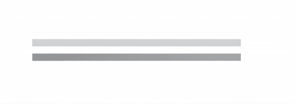
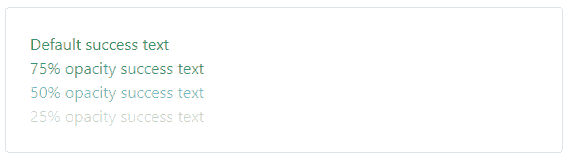
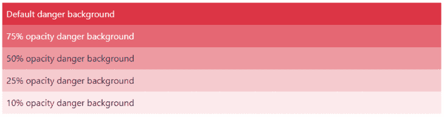

# Bootstrap 5.1.0 的新特性

> 原文：<https://blog.logrocket.com/whats-new-bootstrap-5-1-0/>

## 介绍

今年早些时候，Bootstrap 团队发布了一个主要版本:Bootstrap v5，它附带了一些有趣的变化，比如从 jQuery 到 vanilla JavaScript 的迁移、大量更新的组件和其他更新的实用程序类。

几周前，该团队再次宣布了 Bootstrap 5: v5.1.0 的第一个次要版本。在本文中，我们将探索第一个次要版本中的新内容，以及与以前的版本相比，现在的工作方式。

## 引导数据库 4 与 5.0

ICYMI，将 Bootstrap 4 与最新的 [Bootstrap 5](https://blog.logrocket.com/how-to-use-bootstrap-with-react-a354715d1121/) 区分开来的一些显著变化包括:

*   **放弃 jQuery** —与之前依赖 jQuery 运行 JavaScript 相关代码的版本相比，Bootstrap 5 放弃了对 jQuery 的支持，转而支持普通的 JavaScript
*   **没有旧浏览器支持** —在 v5 中，Bootstrap 团队还决定放弃对大量旧浏览器的支持，如 IE 10 和 11、微软 Edge legacy 等
*   **更新的颜色**—V5 中引入了更新的颜色系统，因此您可以轻松定制您的应用程序的外观和感觉，并且现有的调色板也得到了改进，使它们更加易于使用
*   **表单元素** —表单元素现在被设计成具有一致的外观，与浏览器或操作系统无关
*   **可扩展性** — Bootstrap 现在允许用户轻松地修改、扩展或创建他们的实用程序类

## 5.1.0 中的最新功能

如果您还不熟悉安装过程，您可以开始使用 Bootstrap，方法是在您的标记中包含其简化的 CSS 和 JavaScript CDN，如下所示:

```
<!DOCTYPE html>
<html lang="en">
  <head>
    <!-- Required meta tags -->
    <meta charset="utf-8" />
    <meta name="viewport" content="width=device-width, initial-scale=1" />

    <!-- Bootstrap CSS -->
    <link
      href="https://cdn.jsdelivr.net/npm/[email protected]/dist/css/bootstrap.min.css"
      rel="stylesheet"
    />
    <title>Bootstrap App</title>
  </head>
  <body>
    <div>
      <!-- main content here -->
    </div>
    <!-- Bootstrap bundled JS -->
    <script src="https://cdn.jsdelivr.net/npm/[email protected]/dist/js/bootstrap.bundle.min.js"></script>
  </body>
</html>

```

更多安装选项，请访问官方[下载页面](https://getbootstrap.com/docs/5.1/getting-started/download/)。

## CSS 网格

这个新版本的 Bootstrap 提供了一个实验性的选项，支持一个基于 CSS Grid 的独立网格系统。

在 Bootstrap 的早期版本中，网格系统是建立在 CSS `display: flex;`属性之上的。v5.1.0 中的这个最新更新可以启用一个选项，让您使用传统的 CSS 网格系统(即`display: grid;`属性)。

### 它是如何工作的

默认情况下不启用此功能，因为它是实验性的。要启用它，您需要首先通过在未编译的引导 Sass 文件中设置`$enable-grid-classes: false`来禁用默认网格系统，最后，通过设置`$enable-cssgrid: true`来启用新的 CSS 网格，然后您可以重新编译您的 Sass 文件。

实现这个特性非常简单，您需要做的就是:

*   用`.grid` 替换`.row`的所有实例
*   用`.g-col-*`类替换所有实例`.col-*`类

例如，要创建两列栅格系统，使所有视口的宽度相等，请执行以下操作:

```
<div class="grid">
  <div class="g-col-6">.g-col-6</div>
  <div class="g-col-6">.g-col-6</div>
</div>

```

为了响应，仍然支持不同视窗和设备(`xs, sm, md, lg, xl`)的引导实用程序类:

```
<div class="grid">
  <div class="g-col-4 g-col-md-6">..</div>
  <div class="g-col-4 g-col-md-6">..</div>
  <div class="g-col-4 g-col-md-6">..</div>
</div>

```

## 占位符组件

Bootstrap 5.1.0 引入了令人兴奋的新占位符组件(也称为骨架加载器)，它们是临时的灰色块，用于在加载块内容之前描述块的结构。

这个新组件是一个游戏改变者，因为它有助于增强您的应用程序的体验，而且它仅由 HTML 和 CSS 构建，(即，您不需要任何 JavaScript 代码来开始集成它们，尽管您仍然需要编写一些自定义的 JavaScript 代码来切换其内容的可见性)。

### 它是如何工作的

通过将`.placeholder`类添加到要显示为占位符的特定元素，可以轻松创建占位符:

```
<h1 class="placeholder col-4"></h1>
<p class="placeholder col-6"></p>
<button
  class="col-3 btn btn-primary disabled placeholder"
  style="height: 40px"
></button>

```

这将产生以下输出:


### 宽度和尺寸

占位符宽度可以通过使用引导网格列类(如上例所示)、宽度实用程序(w-50、w-75)或内嵌样式来调整。

默认情况下，占位符的大小取决于父元素的印刷样式或内容。然而，我们可以使用内置的大小调整工具类定制它的大小:`.placeholder-lg`、`.placeholder-sm`或`.placeholder-xs`。

### 占位符动画

您还可以向占位符添加动画，让用户更好地理解正在主动加载的内容。目前，只有两个支持动画占位符的类:`.placeholder-glow`和`.placeholder-wave.`

下面是一个例子:

```
<p class="placeholder-glow">
  <span class="placeholder col-4"></span>
</p>
<p class="placeholder-wave">
  <span class="placeholder col-4"></span>
</p>

```



## 水平塌陷

目前，Bootstrap 只支持垂直折叠，但在最新版本中，团队增加了对水平折叠的支持。

### 它是如何工作的

如果您过去使用过引导折叠，那么您需要做的就是将`.collapse-horizontal`修饰符类添加到您的可折叠元素中，当您切换折叠时，这个新类将转换这个元素的宽度(而不是高度)。

下面是一个代码示例:

```
<p>
  <button
    class="btn btn-primary"
    type="button"
    data-bs-toggle="collapse"
    data-bs-target="#horizontalCollapseExample"
    aria-expanded="false"
    aria-controls="horizontalCollapseExample"
  >
    Toggle Horizontal Collapse
  </button>
</p>
<div style="min-height: 120px">
  <div class="collapse collapse-horizontal" id="horizontalCollapseExample">
    <div class="card card-body" style="width: 300px">
      Placeholder content here, this is hidden by default.
    </div>
  </div>
</div>

```

当我们运行它时，我们会得到以下输出:


## 更新的实用程序类(。`bg-*`和`.text-*`

更新的`.text-opacity-*`和`.bg-opacity-*`类也被引入来轻松调整文本和背景元素的不透明度。但是，在让这个新的实用程序类工作之前，元素(取决于您想要调整的属性)必须有一个优先的`.text-*`或`.bg-*`实用程序类。

### `text-opacity`举例

```
<div class="text-success">Default success text</div>
<div class="text-success text-opacity-75">75% opacity success text</div>
<div class="text-success text-opacity-50">50% opacity success text</div>
<div class="text-success text-opacity-25">25% opacity success text</div>

```

这将产生:



### `bg-opacity`举例

```
<div class="bg-danger p-2 text-white">Default danger background</div>
<div class="bg-danger p-2 text-white bg-opacity-75">
  75% opacity danger background
</div>
<div class="bg-danger p-2 text-dark bg-opacity-50">
  50% opacity danger background
</div>
<div class="bg-danger p-2 text-dark bg-opacity-25">
  25% opacity danger background
</div>
<div class="bg-danger p-2 text-dark bg-opacity-10">
  10% opacity danger background
</div>

```

这将产生:



## 较新的 CSS 变量

在这个最新的次要版本中，`:root`变量已经更新，包括新的灰色调色板和新的 RGB 颜色主题变量。此外，CSS 变量现在控制`<body>`标签以及其他一些标签和自定义实用程序类。这将使定制和扩展默认的引导方式更加容易。

# 结论

在这篇文章中，我们介绍了 Bootstrap 5.1.0 中引入的一些新变化，这是 Bootstrap 5 的第一个次要版本。我们还研究了区分 Bootstrap v4 和 v5 的变化，以及如何开始使用新的 Bootstrap 5.1.0。

关于所有新变化的完整参考，请查看 Bootstrap 创建者 Mark Otto 的官方声明。

## 你的前端是否占用了用户的 CPU？

随着 web 前端变得越来越复杂，资源贪婪的特性对浏览器的要求越来越高。如果您对监控和跟踪生产环境中所有用户的客户端 CPU 使用、内存使用等感兴趣，

[try LogRocket](https://lp.logrocket.com/blg/css-signup)

.

[](https://lp.logrocket.com/blg/css-signup)[https://logrocket.com/signup/](https://lp.logrocket.com/blg/css-signup)

LogRocket 就像是网络和移动应用的 DVR，记录你的网络应用或网站上发生的一切。您可以汇总和报告关键的前端性能指标，重放用户会话和应用程序状态，记录网络请求，并自动显示所有错误，而不是猜测问题发生的原因。

现代化您调试 web 和移动应用的方式— [开始免费监控](https://lp.logrocket.com/blg/css-signup)。