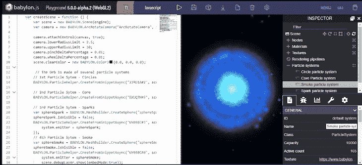
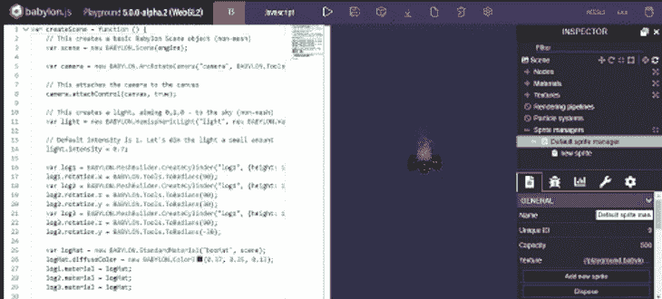

# Bablyon.js 4.2 中的新功能

> 原文：<https://blog.logrocket.com/whats-new-in-bablyon-js-4-2/>

Babylon.js 团队最近公布了框架的最新版本: [Babylon.js 4.2](https://doc.babylonjs.com/) 。

Babylon.js 是一个强大、漂亮、简单、开放的游戏和渲染引擎，被打包到一个友好的 JavaScript 框架中。

在这篇文章中，我们将看看这个版本提供的主要新特性和更新。

以下是该框架的最新补充内容:

*   新粒子编辑器
*   新精灵编辑器
*   骨架观察器
*   纹理检查器
*   节点材质编辑器中基于物理的渲染(PBR)支持
*   新的节点材质编辑器模式
*   在节点材质编辑器中自定义和重用帧
*   操场模板
*   直接支持`.hdr`过滤
*   巴比伦本地人的反应
*   新的和重新组织的文档
*   KTX+BasisU 支持
*   更新的 WebXR 支持
*   柔和的透明阴影
*   新实例超能力
*   下一个是 PBR
*   支持最新的`.glTF`扩展

## 新粒子编辑器

有了新的粒子编辑器，使用 Babylon.js 丰富的粒子系统变得更加容易和更好。

使用新的编辑器，您可以:

*   点击鼠标创建粒子系统
*   通过用户界面访问几乎每一个粒子系统属性
*   编辑和塑造粒子系统，无需编写任何代码
*   导出您的粒子系统，甚至将其保存到 snippet 服务器，并将其加载到 Babylon.js 场景中

你可以在[这个游乐场](https://aka.ms/4_2_particlePlayground)里玩新的粒子编辑器。



## 新精灵编辑器

精灵编辑器允许你创建、控制和管理[精灵](https://doc.babylonjs.com/divingDeeper/sprites#snippet-server)系统。因为精灵编辑器内置在检查器中，你可以保存你的精灵系统而不用写任何代码。只需一个简单的命令，您就可以将 sprite 系统加载到 Babylon.js 场景中。



## 骨架观察器

调试是开发的一个重要方面。一个好的调试工具不应该碍手碍脚，应该简单易用。

使用 Skeleton Map Shader、Bones Viewer、Render Grid、Bone Weight Shader、Physics Viewer 等工具，您可以轻松地在网格上为每个骨骼渲染唯一的颜色，渲染您的骨骼，在平面上渲染网格，分别渲染显示骨骼贡献的热图和渲染物理视点替用特效。

## 纹理检查器

在此之前，如果您正在构建一个场景，并且有一个不寻常的接缝或奇怪的视觉伪像，您必须在图像编辑器中打开→保存→重新加载循环来识别问题。这个过程通常是多余的，会浪费时间。

但有了新的纹理检查器，您现在有了一个工具，可以让您放大单个像素，检查颜色通道，使用简单的标记工具，并创建与场景的实时连接。

你可以从主检查器面板访问纹理检查器，方法是从列表中选择一个纹理，然后点击纹理预览下面的“编辑”按钮。

### 节点材质编辑器中基于物理的渲染(PBR)支持

该功能为节点材质编辑器添加了 PBR 支持。这将允许您创建自定义 PBR 材质和着色器。它为您提供了金属，粗糙度，环境遮挡，环境照明和反射率，透明涂层，光泽，次表面，各向异性和更多。

你可以在这里阅读更多关于 PBR 支持者的信息。

### 新的节点材质编辑器模式

随着新模式添加到节点材质编辑器(NME)，您不仅可以创建网格着色器，还可以创建过程纹理，粒子着色器和后期处理效果。

### 在节点材质编辑器中自定义和重用帧

在 Babylon.js 4.2 之前，您可以将节点组合成可折叠的框架。很酷，对吧？但是现在，你甚至可以做得更多！

Babylon.js.4.2 允许您自定义这些帧，导出它们，保存，重用，甚至直接从节点材质编辑器共享它们。

## 操场模板

代码片段通过减少我们需要键入的东西的数量来帮助我们加速开发。有了操场模板，你就可以使用`autocomplete`片段来减少你的开发时间。

要使用可用的模板代码，请按 CTRL + SPACE 并从建议中单击一个。


### 直接支持`.hdr`过滤

以前，在 Babylon.js 中使用基于图像的照明(IBL)时，需要一个`.env`或`.dds`文件。Babylon.js 4.2 增加了对预过滤`.hdr`文件的直接支持！这意味着您现在可以在 Babylon.js 场景中直接使用`.hdr`文件。

你可以通过前往 [HDRI 天堂](https://hdrihaven.com/)，抓取你最喜欢的 HDR 文件，并将其加载到 [Babylon.js 沙箱](https://sandbox.babylonjs.com/)中来玩这个功能。

### 巴比伦本地人的反应

如果您是 React 原生开发人员，这对您来说是个好消息。

借助 Babylon.js 4.2，您将能够将 React Native 与 Babylon.js 结合起来，创建流畅的跨平台体验。

参见下方的[视频，了解如何将这两个强大的工具结合使用:](https://youtu.be/x6baGsEQhcU)

 [https://www.youtube.com/embed/x6baGsEQhcU?version=3&rel=1&showsearch=0&showinfo=1&iv_load_policy=1&fs=1&hl=en-US&autohide=2&wmode=transparent](https://www.youtube.com/embed/x6baGsEQhcU?version=3&rel=1&showsearch=0&showinfo=1&iv_load_policy=1&fs=1&hl=en-US&autohide=2&wmode=transparent)

视频

* * *

### 更多来自 LogRocket 的精彩文章:

* * *

### 新的和重新组织的文档

产品和它的文档一样好。这就是为什么 Babylon.js 团队决定给产品的[文档](https://doc.babylonjs.com/)注入新的生命。

这份新文档更加有条理，采用了基于章节的方法。文档分为 7 个主要部分，带您了解整个平台。

无论您是刚刚开始使用 Babylon.js，还是正在寻求复习，新文档都非常适合您。

[查看新文档](https://doc.babylonjs.com/)。

### KTX+BasisU 支持

KTX Basis Universal 是一个 Unity 包，允许您加载 KTX2.0 或 Basis Universal 纹理文件。

这项新功能为 Babylon.js 开发人员提供了高级压缩，与`.jpeg`文件相比，它可以生成更小的文件和 GPU 大小。

这意味着，过去对大型 3D 文件有贡献的纹理现在可以在 web 上更快地加载和渲染。

### 更新的 WebXR 支持

Babylon.js 4.2 包含对 WebXR 的更新支持。这一令人兴奋的新标准允许开发人员轻松创建引人注目的跨浏览器 AR/VR web 体验。Babylon.js 4.2 增加了对手部跟踪、点击测试、高级传送、跨设备输入管理和控制器支持等更多功能的支持。

### 柔和的透明阴影

软透明阴影功能改进了 Babylon.js 现有的丰富阴影系统。但是现在，它支持在透明物体上渲染柔和的透明阴影。

### 新实例超级能力(瘦实例)

实例是一种使用硬件加速渲染来绘制大量相同网格的方法。

您可以像这样创建一个新的精简实例:

```
var matrix = BABYLON.Matrix.Translation(-2, 2, 0);
var idx = sphere.thinInstanceAdd(matrix);
```

与常规实例不同，瘦实例不会创建新对象。因此，性能得到了提高。

然而，这种改进是有代价的:

*   所有瘦实例总是全部绘制(如果网格被认为是可见的),或者一个也不绘制——要么全有，要么全无
*   添加和删除精简实例比使用`InstancedMesh`的成本更高

只有当您需要大量静态实例，并且确信不会经常更改或根本不会更改时，才应该考虑使用瘦实例。

### PBR 支持(基于物理的渲染)

Babylon.js .4.2 通过一些很酷的新功能进一步推动了渲染的极限。

模拟光线在半透明物体表面下反弹的方式现在可以通过高级次表面散射支持来实现。随着实时 PBR 滤波的引入，现在只需几行代码就可以实现高级折射和反射。

## 支持最新的`.glTF`扩展

Babylon.js 4.2 支持最新的`.glTF`扩展，包括正式的和实验性的！通过不断更新对`.glTF`格式最新功能的支持，Babylon.js 可确保您的 3D 对象完全按照您的预期呈现。

Babylon.js 4.2 增加了对以下`.glTF`扩展的支持:

#### 批准的:

请看`KHR_materials_clearcoat`在这里的作用:[透明涂层演示](https://aka.ms/4_2_khr_materials_clearcoat_demo)。

#### 实验性:

## 结论

在本指南中，我们介绍了 Babylon.js 4.2 为我们提供的新增强功能。如果你对 Babylon.js 或网络游戏渲染不熟悉，那么 [Babylon.js 文档](https://doc.babylonjs.com/)是一个很好的学习起点。

你也可以去[游乐场](https://playground.babylonjs.com/)体验新的创意。

Babylon.js 还可以提供更多的东西，这个最新版本仅仅是个开始。你可以在这里查看更多的小特性、修复和增强[。](https://aka.ms/4_2_whats_new)

## 您是否添加了新的 JS 库来提高性能或构建新特性？如果他们反其道而行之呢？

毫无疑问，前端变得越来越复杂。当您向应用程序添加新的 JavaScript 库和其他依赖项时，您将需要更多的可见性，以确保您的用户不会遇到未知的问题。

LogRocket 是一个前端应用程序监控解决方案，可以让您回放 JavaScript 错误，就像它们发生在您自己的浏览器中一样，这样您就可以更有效地对错误做出反应。

[](https://lp.logrocket.com/blg/javascript-signup)[https://logrocket.com/signup/](https://lp.logrocket.com/blg/javascript-signup)

[LogRocket](https://lp.logrocket.com/blg/javascript-signup) 可以与任何应用程序完美配合，不管是什么框架，并且有插件可以记录来自 Redux、Vuex 和@ngrx/store 的额外上下文。您可以汇总并报告问题发生时应用程序的状态，而不是猜测问题发生的原因。LogRocket 还可以监控应用的性能，报告客户端 CPU 负载、客户端内存使用等指标。

自信地构建— [开始免费监控](https://lp.logrocket.com/blg/javascript-signup)。