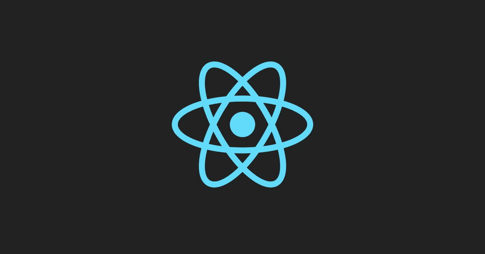
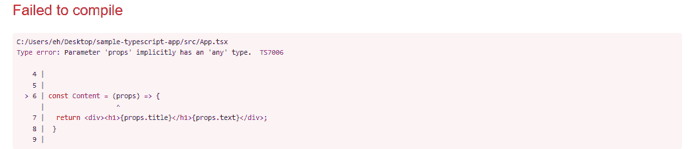
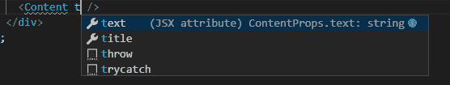
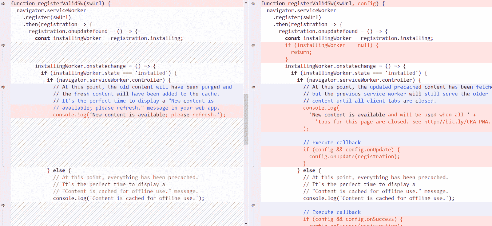
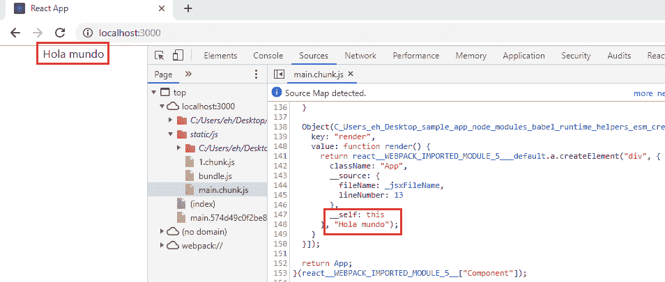

# Create React App 2 的新特性

> 原文：<https://blog.logrocket.com/whats-new-in-create-react-app-2-fe8f4f448c75/>



[Create React App 2.1](https://github.com/facebook/create-react-app/releases/tag/v2.1.0) ，2018 年 10 月底发布，增加了对 TypeScript 的官方支持。这一点，加上 Create React App 第二版带来的所有改进和特性，大大降低了创建和配置 React App 的复杂性。

在本文中，我将介绍 Create React App 2 的以下特性:

*   类型脚本支持
*   服务人员(默认情况下未注册)
*   Sass、CSS 模块和 PostCSS
*   反应片段短语法
*   巴别塔宏
*   自定义代理实现
*   纱线即插即用模式

关于所有特性的完整列表(和一些突破性的变化)，你可以查看关于这个版本的官方帖子和这个项目的[变更日志](https://github.com/facebook/create-react-app/blob/master/CHANGELOG.md#203-october-1-2018)。

#### 类型脚本支持

对于新的应用程序，您只需使用`--typescript`选项执行 create-react-app:

```
npx create-react-app sample-typescript-app --typescript
```

如果 npx 没有执行最新版本(在撰写本文时是 2.1.1)，请指定 create-react-app 的版本:

```
npx [email protected] sample-typescript-app --typescript
```

这将安装与 TypeScript 相关的包并创建一个默认的`tsconfig.json`文件。以下是该命令输出的摘录:

```
Installing react, react-dom, and react-scripts...
+ [email protected]
+ [email protected]
+ [email protected]
+ @types/[email protected]
+ @types/[email protected]
+ @types/[email protected]
+ @types/[email protected]
+ [email protected]
...
We detected TypeScript in your project (srcApp.test.tsx) and created a tsconfig.json file for you.
Your tsconfig.json has been populated with default values.
```

然而，文件`src/App.tsx`将与其 JavaScript 副本相同，例如，如果您像这样向文件添加一个功能组件:

```
 //...
const Content = (props) => {
  return <div><h1>{props.title}</h1>{props.text}</div>;
 }

class App extends Component {
  // ...
} 
```

将抛出一个关于`props`参数类型的错误:



因为现在，你必须使用 [React 声明一个类型定义。SFC](https://www.sohamkamani.com/blog/react/2018-08-22-using-react-with-typescript/) :

```
interface ContentProps {
  title: string,
  text: string,
 }

const Content: React.SFC<ContentProps> = (props) => {
  return <div><h1>{props.title}</h1>{props.text}</div>;
}
```

如果您的 IDE 支持它(下图中的 Visual Studio 代码)，它会向您显示组件属性的类型，还会捕捉类型错误:



另一方面，要将 TypeScript 添加到现有的 Create React App 应用程序，首先，手动安装与 TypeScript 相关的包:

```
npm install --save typescript @types/node @types/react @types/react-dom @types/jest
```

接下来，将文件的扩展名从`*.js`更改为`*.tsx`，并重启应用程序(如果它正在运行的话)。

#### 默认情况下，服务人员是未注册的

Create React App 创建的项目结构保持不变。

唯一的变化与服务人员有关。

首先，文件`src/registerServiceWorker.js`被重命名为`src/serviceWorker.js`，现在，在这个文件内部，一个`config`对象被传递给函数`registerValidSW`以启用回调`onUpdate`和`onSuccess`:



第二个变化是在`src/index.js`中，默认情况下服务人员是未注册的:

```
// If you want your app to work offline and load faster, you can change
// unregister() to register() below. Note this comes with some pitfalls.
// Learn more about service workers: http://bit.ly/CRA-PWA
serviceWorker.unregister();
```

你可以在这里了解更多关于服务人员和渐进式网络应用的信息[。](https://facebook.github.io/create-react-app/docs/making-a-progressive-web-app)

#### Sass、CSS 模块和 PostCSS

Create React App 2 为您提供了更多选项来设计您的应用程序，而无需复杂的配置、弹出应用程序或使用 [react-app-rewired](https://github.com/timarney/react-app-rewired) 。

第一个选项是 [Sass](https://sass-lang.com/) 。要使用它，首先安装 [node-sass](https://github.com/sass/node-sass) :

```
npm install --save node-sass
```

现在你可以创建一个 Sass 文件(`src/Message.scss`)。例如:

```
$theme-color: green;
```
.my-message {
  color: $theme-color;
}
```

并以这种方式在组件(`src/Message.js`)中使用它:

```
import React from 'react'
import './Message.scss'
const Message = props => {
  return <li className={my-message}> {children} <li>
}
export default Message;
```

另一方面，使用 [CSS 模块](https://www.javascriptstuff.com/what-are-css-modules/)，你不需要安装更多的依赖项，你只需要遵循`[name].module.css`文件命名约定。

例如，如果您有一个`Message.js`组件(如前面的例子所示)，您可以在文件`Message.module.css`中定义它的样式(记住，使用 CSS 模块，您可以[组成](https://bambielli.com/til/2017-08-11-css-modules-composes/)类):

```
.my-theme {
  color: green;
}
.my-message {
  composes: my-theme;
  font-size: 20px;
}
```

在组件中，使用如下样式:

```
import styles from './Message.module.css'
// ...
<li className={styles.my-message}> {children} </li>
```

这样，在运行时，将生成一个具有半随机名称的 CSS 类，以便在本地将这些样式限定在组件范围内:

```
<li class="Message_my-message_tp3lv"></li>
```

此外，Create React App 2 中还包含了[postscs-flex bugs-fixes](https://github.com/luisrudge/postcss-flexbugs-fixes)和[postscs-preset-env](https://github.com/csstools/postcss-preset-env)([仅支持](https://github.com/facebook/create-react-app/blob/master/packages/react-scripts/config/webpack.config.js#L104)的 [stage3+功能](https://preset-env.cssdb.org/features#stage-3))，这意味着会自动添加供应商前缀，并为旧浏览器填充新的 css 功能。你可以在这里了解更多[。](https://facebook.github.io/create-react-app/docs/post-processing-css)

### 反应片段短语法

React 16.2 添加了对[片段](https://reactjs.org/blog/2017/11/28/react-v16.2.0-fragment-support.html)的支持，以从组件的渲染方法中返回多个子组件，这已经有一段时间了:

```
render() {
  return (
    <React.Fragment>
      <h1>My Messages</h2>
      <p>Message 1</p>
      <p>Message 2</p>
    </React.Fragment>
  );
}
```

然而，作为 JSX 片段语法(或简称语法):

```
render() {
  return (
    <>
      <h1>My Messages</h2>
      <p>Message 1</p>
      <p>Message 2</p>
    </>
  );
}
```

它只受 Babel 7 支持，你现在可以使用它，因为 Create React App 2 使用这个版本的 Babel。

然而，记住`<></>`只是`<React.Fragment>`的语法糖，但是没有使用键或其他属性的选项。

### 巴别塔宏

在 Create React App 2 的上下文中，Babel 宏允许您使用特殊类型的 Babel 插件，而无需任何配置。

让我解释一下。

巴别塔插件允许你在编译时操作和转换代码。例如，有一个[插件](https://babeljs.io/docs/en/babel-plugin-transform-arrow-functions)可以转换箭头功能:

```
const a = (b) => b;
```

普通 JavaScript 函数:

```
const a = function (b) {
  return b;
};
```

然而，Babel 插件的一个问题是，你必须配置每一个你想使用的插件。通常，这是在`.babel.rc`中完成的，但是当使用 Create React App 时，除非弹出应用程序，否则无法访问该文件。

幸运的是，有 [babel-plugin-macros](https://www.npmjs.com/package/babel-plugin-macros) ，一个为…宏定义标准接口的插件(即执行构建时转换的插件)。

这样，你只需要将这个插件添加到你的项目中(这就是 Create React App 所做的)就可以使用任意数量的宏。

由于宏是在编译时处理的，在运行时并不需要，所以它们应该被指定为`devDependencies`。

您可以在 [npm 中搜索关键字 babel-plugin-macros](https://www.npmjs.com/search?q=keywords:babel-plugin-macros) 来查找宏。

以 Babel 插件/宏[标记翻译](https://github.com/vinhlh/tagged-translations)为例，它在编译时翻译文本。

只需将此库添加到 Create React 应用程序项目中:

```
npm install --save-dev tagged-translations
```

在项目的根目录下添加文件`translations/default.json`,翻译如下:

```
{
  "Hello world": "Hola mundo"
}
```

并在你的组件中使用它作为一个宏(不是作为一个插件，[有区别](https://github.com/kentcdodds/babel-plugin-macros#whats-the-difference-between-babel-plugins-and-macros)):

```
import t from 'tagged-translations/macro'

class App extends Component {
  render() {
    return (
      <div className="App">
          {t`Hello world`}
      </div>
    );
  }
}
```

如下图所示，在编译时创建包时会发生转换:



### 自定义代理实现

在 Create React App 的第一个版本中，当发出 API 请求时，您可以选择对请求的完整 URL 进行硬编码，如下所示:

```
fetch('http://localhost:3001/messages')
  .then(res => {
    // ...
})
```

或者在`package.json`文件中添加一个代理字段:

```
'proxy': 'http://localhost:3001/'
```

要在`fetch`调用中只使用资源的路径:

```
fetch('/messages')
  .then(res => {
    // ...
})
```

使用 Create React App 2，除了上面显示的方法，您还可以通过安装 [http-proxy-middleware](https://github.com/chimurai/http-proxy-middleware) 来配置自定义代理:

```
npm install --save http-proxy-middleware
```

并创建文件`src/setupProxy.js`来配置代理:

```
const proxy = require('http-proxy-middleware');
module.exports = function(app) {
  // ...
};
```

当应用程序启动时，这个文件将被自动导入，它让您可以访问一个 [Express](https://expressjs.com/) 实例来做类似这样的事情:

```
const proxy = require('http-proxy-middleware');
module.exports = function(app) {
  app.use(proxy('/api', { target: 'http://localhost:3001/' }));
  app.use(proxy('/public', { target: 'http://localhost:3002/' }));
};
```

#### 纱线即插即用模式

纱线即插即用模式允许您的应用程序在没有`node_modules`目录的情况下工作。

通过这种方式，应用程序依赖项从 Yarn 的缓存中加载，而不需要在安装步骤中将它们复制到`node_modules`目录中。这有一个额外的好处，就是可以更快地创建应用程序。

要使用该功能，您需要 [Yarn 1.12+](https://yarnpkg.com/lang/en/docs/install/) ，Node.js 8.9+，并确保使用选项`--use-pnp`创建您的 React 应用程序:

```
npx create-react-app light-app --use-pnp
```

如果命令执行成功，在文件`package.json`中，你会发现一个额外的配置选项:

```
{
  ...
  "installConfig": {
    "pnp": true
  },
  ...
}
```

此外，您将获得一个`.pnp`目录，该目录链接到 Yarn 的缓存目录和文件`.pnp.js`，后者验证依赖关系并提供从全局缓存而不是从`node_modules`目录中搜索它们的能力。

这是一个实验性的特性(在我写这篇文章的时候),所以它可能不能在所有情况下工作(例如，我没有在我的 Windows 10 机器上工作),也不能与直接处理`node_modules`目录的工具一起工作。

### 结论

Create React App 2 增加了更多的选项来简化 React 应用程序的创建和配置。我个人认为最有帮助的三个新功能是 TypeScript、Saas 和 Babel macros。

然而，我不得不说，对于一个现有的应用程序，如果你不需要这些新功能，或者如果你有一个使用 [react-app-rewired](https://github.com/timarney/react-app-rewired) 或 [craco](https://github.com/sharegate/craco) 的工作配置，它可能不值得升级。

即使是 Create React App 团队[也建议这样做](https://reactjs.org/blog/2018/10/01/create-react-app-v2.html):

> 不要觉得升级什么都有压力。如果您对当前的特性集、其性能和可靠性感到满意，您可以继续使用当前的版本！在生产中切换到 2.0 版本之前，让它稳定一点也是一个好主意。

但是对于新的应用程序，您可以随意使用许多新功能。

黑客快乐！

* * *

### 更多来自 LogRocket 的精彩文章:

* * *