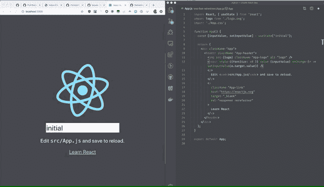

# create-react-app 4 . 0 . 0-log rocket 博客的新特性

> 原文：<https://blog.logrocket.com/whats-new-in-create-react-app-4-0-0/>

创建 React 应用程序是创建单页 React 应用程序(spa)的推荐方法。它得到了 React 的官方支持，提供了一个无需配置的现代构建设置。

有了它，你可以用一个简单的命令启动一个现代的 React 应用。因为 Create React App 同时支持`npm`和`yarn`，所以这个命令会根据您想要使用的包管理器而略有不同。

要创建新的 React 应用程序，您可以运行以下任一命令:

```
npx create-react-app my-app
```

或者

```
npm init react-app my-app
```

或者

```
yarn create react-app my-app
```

此外，Create React App 消除了安装和配置预先配置和隐藏的 Webpack 和 Babel 等繁重任务，因此您可以专注于编码。这意味着需要学习的东西更少，开始创建 React 应用程序所需要做的就是运行上面的任何命令。

尽管 Create React App 附带了针对 Webpack 和 Babel 的预配置，但它并不强迫您使用它自己的配置。您可以`eject`从 Create React App 中，根据您的喜好添加您的自定义配置。

版本 4.0 是一个主要的发行版，附带了几个有趣的特性。

如果您已经全局安装了`create-react-app`，您应该运行:

```
npm uninstall -g create-react-app
```

或者

```
yarn global remove create-react-app
```

卸载它。然后运行:

```
npx create-react-app my-app
```

今后，请确保`npx`始终使用最新版本。你可以在这里获得更多关于这个[的信息。如果您有一个使用旧版本的项目，您可以在下一节中看到关于迁移的说明。](https://create-react-app.dev/docs/getting-started#quick-start)

## 移民

从版本 3.4.x 迁移到版本 4.0.0 时，从尚未退出的项目内部运行以下命令:

```
npm install --save --save-exact [email protected]
```

或者

```
yarn add --exact [email protected]
```

这应该可以无缝地更新 react 脚本。如果您遇到任何错误，建议您删除您的`node_modules`文件夹，并通过运行以下命令重新安装您的依赖项:

```
npm install or yarn install
```

这将完成迁移，不会出现任何错误。我们将在下一节继续讨论新特性。

## 新功能

### 快速刷新

快速刷新是旧功能热重装的官方 React 实现。它类似于热重装，但更可靠。

快速刷新使您能够在运行的应用程序中编辑 React 组件，而不会丢失它们的状态，如下图所示:



简而言之，它使您能够实时调整 React 组件。这类似于`react-hot-loader`。

但是 fash refresh 相对于其前身的一个主要优势是它支持热重载挂钩和状态保存。

Create React App 4.0.0 使用 [react-refresh](https://www.npmjs.com/package/react-refresh) 包和 [react refresh webpack 插件](https://github.com/pmmmwh/react-refresh-webpack-plugin)实现了这一点。

### React 17(新 JSX 变换)和类型脚本支持

Create React App 4.0.0 提供了对新的 [JSX 变换](https://reactjs.org/blog/2020/09/22/introducing-the-new-jsx-transform.html)和 React 17 的支持。新的 JSX 变换没有改变 JSX 语法，但是，它带来了显着的改进反应。

由于浏览器不理解开箱即用的 JSX，React 开发人员依赖编译器将他们的 JSX 转换成浏览器可以理解的 React 函数调用。Babel 和 TypeScript 等编译器大多用于此目的。

此外，Create React App 等工具包也附带了 JSX 变换，4.0.0 通过 TypeScript 4.1.0 提供了对新的 JSX 变换的支持。

虽然升级到新 JSX 变换是可选的，但它确实带来了一些有趣的好处，例如:

*   新的 JSX 变换允许你使用 JSX 而不用导入 React

如上所述，浏览器不理解 JSX，所以它必须被编译成 JavaScript 函数。如果您有这样的 React 代码:

```
import React from 'react';

function App() {
  return <p>Hi I am Lawrence Eagles</p>;
}
```

旧的`JSX`转换会将其转换为:

```
import React from 'react';

function App() {
  return `('p', null, 'Hi I am Lawrence Eagles');
}
```

这样做的问题是它调用了`React.createElement`函数，因此，必须导入 React。

另外，`React.createElement`不支持一些性能优化技术。因此，在`JSX`变换的实现中还有改进的空间。

* * *

### 更多来自 LogRocket 的精彩文章:

* * *

使用新的`JSX`转换，如果我们有以下代码:

```
function App() {
  return <p>Hi I am Lawrence Eagles</p>;
}
```

它会把它变成这样:

```
// Inserted by a compiler (don't import it yourself!)
import {jsx as _jsx} from 'react/jsx-runtime';

function App() {
  return _jsx('p', { children: 'Hi I am Lawrence Eagles });
}
```

> 上面的代码示例来自于[文档](https://reactjs.org/blog/2020/09/22/introducing-the-new-jsx-transform.html#whats-different-in-the-new-transform)。

注意，我们的原始代码不需要导入 React，它仍然工作得很好。

此外，根据您的配置，新的`JSX`转换可以减少您的应用包大小。

### ESLint 7 支持

React 使用 [ESLint](https://www.npmjs.com/package/eslint) 隐藏我们的代码。这很重要，因为 React 是一个 JavaScript 库，而 JavaScript 是松散类型的。这意味着错误不是在开发期间或在`compile time`被捕获，而是在`runtime`被捕获。

诸如 ESLint 之类的 Linters 为您提供了一种在开发过程中过滤代码和捕捉错误的机制。这可能是救命稻草。此外，使用 linters，您可以编写自定义规则来加强您的编码风格。如果你想加强编码风格，建议你使用[更漂亮的](https://github.com/prettier/prettier)。

Create React App 4.0.0 自带更新的`eslint-config-react-app`来支持新发布的 [ESLint 7](https://eslint.org/blog/2020/05/eslint-v7.0.0-released) 。它还为`import/no-anonymous-default-export`、`Jest`和`React testing library`增加了新的规则。

创建 React 应用程序，允许您扩展默认的 ESLint 规则，甚至替换它。但是替换它是不明智的，因为这是令人讨厌的错误的已知原因。

在扩展基本 ESLint 规则之前，需要注意一些问题，它们是:

*   任何设置为`error`的规则都会破坏应用程序构建过程
*   使用 TypeScript 时，您需要提供一个仅针对 TypeScript 文件的`override`对象
*   如前所述，扩展而不是取代 ESLint 规则

以下是扩展的 ESLint 规则的示例:

```
{
  "eslintConfig": {
    "extends": ["react-app", "shared-config"],
    "rules": {
      "additional-rule": "warn",
      "indent": ["error", 4]
    },
    "overrides": [
      {
        "files": ["**/*.ts?(x)"],
        "rules": {
          "additional-typescript-only-rule": "warn",
          "indent": ["error", "tab"]
        }
      }
    ]
  }
}
```

上述规则简单地执行以下操作:

*   首先延长`react-app`:
    *   `"extends": ["react-app", "shared-config"]`
*   将任何附加规则设置为`“warn”`以避免停止构建过程:
    *   `"additional-rule": "warn"`
*   将一致的缩进样式设置为`4 spaces`:
*   如果正在使用 TypeScript，请将 TypeScript 特定配置放在`override`部分:
```
        "overrides": [           {             "files": ["**/*.ts?(x)"],             "rules": {               "additional-typescript-only-rule": "warn",               "indent": ["error", "tab"] // enforce tab indentation.             }           }         ]
        ```

你也可以在这里了解更多关于这个[的信息。](https://create-react-app.dev/docs/setting-up-your-editor/#extending-or-replacing-the-default-eslint-config)

## 其他显著变化

*   不再支持`typescript flag`和`NODE_PATH`

要添加 TypeScript 以创建 React App 4.0.0，请执行以下操作:

```
npx create-react-app my-app --template typescript
```

而不是这个:

```
npx create-react-app hello-tsx --typescript
```

此外，对`NODE_PATH`的支持已经被删除，因为它被在`jsconfig.json`中设置基本路径所取代。

*   笑话升级到 26
*   停止对节点 8 的支持，该节点已于 2019 年底停产，不再受支持
*   切换到 [Workbox injectManifest 插件](https://developers.google.com/web/tools/workbox/reference-docs/latest/module-workbox-webpack-plugin.InjectManifest)，并使`PWA`模板独立于它们自己的仓库

## 结论

Create React App 4.0.0 是一个主要版本，它提供了一些非常棒的功能。最让我兴奋的是`fast refresh`。有这个真的很好，不需要额外的包装。

新的`JSX transform`也是一个很好的补充，但这并没有增强开发者的体验，因为语法保持不变。

其他更新也很酷，迁移过程是无缝的，这是一件好事。我们可以通过运行一个命令来获得所有这些更新。

最后，如果你需要这个版本的更多细节，你可以在这里找到。

## [LogRocket](https://lp.logrocket.com/blg/react-signup-general) :全面了解您的生产 React 应用

调试 React 应用程序可能很困难，尤其是当用户遇到难以重现的问题时。如果您对监视和跟踪 Redux 状态、自动显示 JavaScript 错误以及跟踪缓慢的网络请求和组件加载时间感兴趣，

[try LogRocket](https://lp.logrocket.com/blg/react-signup-general)

.

[ ](https://lp.logrocket.com/blg/react-signup-general) [](https://lp.logrocket.com/blg/react-signup-general) 

LogRocket 结合了会话回放、产品分析和错误跟踪，使软件团队能够创建理想的 web 和移动产品体验。这对你来说意味着什么？

LogRocket 不是猜测错误发生的原因，也不是要求用户提供截图和日志转储，而是让您回放问题，就像它们发生在您自己的浏览器中一样，以快速了解哪里出错了。

不再有嘈杂的警报。智能错误跟踪允许您对问题进行分类，然后从中学习。获得有影响的用户问题的通知，而不是误报。警报越少，有用的信号越多。

LogRocket Redux 中间件包为您的用户会话增加了一层额外的可见性。LogRocket 记录 Redux 存储中的所有操作和状态。

现代化您调试 React 应用的方式— [开始免费监控](https://lp.logrocket.com/blg/react-signup-general)。