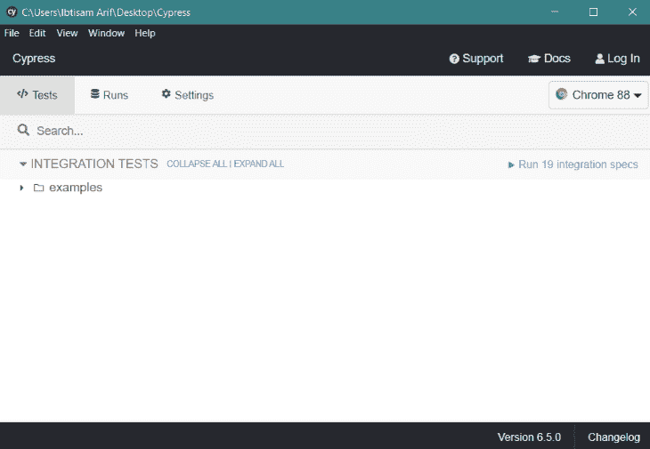
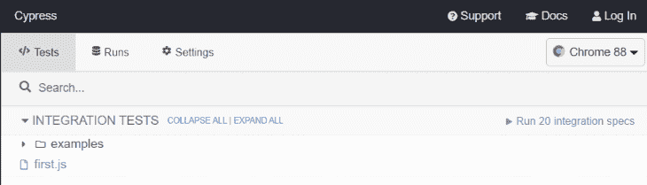
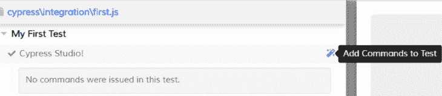

# Cypress 6.0 的新特性- LogRocket 博客

> 原文：<https://blog.logrocket.com/whats-new-in-cypress-6-0/>

经常看到开发人员忽视端到端测试的重要性。测试可能很累，也很贵，但它的重要性不容忽视。

为了测试 web 应用程序，开发人员一直在使用 Selenium——一个 2004 年开发的老软件——但是从那以后，web 发生了巨大的变化。进入 [Cypress](https://www.cypress.io/) ，一个开发测试工具。

Cypress 是自动化和测试 web 应用程序发展最快的工具之一。它是开源的，在 GitHub 上有超过 27，000 颗星。这个库能够从用户的角度测试 web 应用程序，从而增强最终产品。

使用 Cypress，您可以操作 DOM、检查 UI 元素、测试表单等等。在本文中，我们将设置它并探索 Cypress 6.0 中发布的令人兴奋的特性。

## 什么是 Cypress，它与其他测试工具有什么不同？

赛普拉斯提供以下服务:

*   **浏览器内工作:**大多数测试工具依赖于浏览器的外部环境，但是 Cypress 能够在浏览器中运行应用程序
*   **网络层** : Cypress 能够通过读取和更改进出浏览器的数据来处理网络层
*   绝对控制:使用 Cypress，您可以最终控制您的 web 应用程序。它允许你改变你选择的每一个方面，使得这个库非常强大。

现在我们已经讨论了 Cypress，让我们在我们的开发环境中启动它。

## Cypress 入门

首先，在您的本地计算机中创建一个分隔符目录，并使用以下命令初始化 npm 包。

```
$ npm init

```

有了这个，我们就可以安装 Cypress 了。运行下面的命令，它会将 Cypress 安装为项目的开发依赖项。

```
$ npm install cypress --save-dev

```

安装可能需要几分钟，请耐心等待。安装完 Cypress 之后，输入下面的命令将从同一个目录运行 Cypress。

```
./node_modules/.bin/cypress open

```

这将打开 Cypress GUI，如下所示。



第一次启动后，Cypress 创建了自己的文件夹结构。

*   **Fixtures** :这里我们将样本数据保存在 JSON 文件中
*   集成:这是存放所有测试的文件夹
*   **插件**:你可以为 Cypress 下载不同的插件并包含在这里
*   **支持**:有不同的支持命令，用于配置 Cypress


在 example 文件夹中，Cypress 附带了许多示例测试用例。如果我们必须编写自己的测试用例，我们可以在同一个目录中创建一个 JavaScript 文件。

让我们创建一个基本的测试来演示事情是如何工作的。在集成文件夹中创建 **first.js** 并输入以下代码:

```
describe("My First Test", () => {
  it("Does not do much!", () => {
    expect(true).to.equal(true);
  });
});

```

运行代码后，我们的第一个测试在 Cypress GUI 中可见。



单击它将开始测试，然后我们将得到以下输出。


这是一个用`true`断言`true`的示例测试。现在我们已经了解了 Cypress 的基本知识，让我们来探索一下新的 6.0 版本中引入的特性。

## Cypress 6.0 的特性

网络存根是 Cypress 最受欢迎的特性之一。它允许开发者让他们的应用程序对不同测试用例的网络请求做出相应的响应。在以前版本的 Cypress 中，网络存根是通过使用这些命令实现的。

*   `cy.server()`:创建 Cypress 服务器
*   `cy.route()`:定义请求的路径

但现在，用户可以用一个命令`cy.intercept()`发出同样的请求，这是`cy.route()`的改进版本。它更加灵活，并提供了对网络层的更多控制。

有了这个巨大的变化，我们现在有了对页面重新加载、截取获取调用和资源加载的内置支持。与上一代 Cypress 相比，`cy.intercept()`支持所有网络请求。我们可以在`cy.intercept()`中明确地指定它，如下所示。

```
cy.intercept("GET", "/articles", { fixture: "great-articles.json" })

```

使用新的`cy.intercept()`，您可以轻松地向它迁移。让我们看看它的实际效果吧！

* * *

### 更多来自 LogRocket 的精彩文章:

* * *

## 在 Cypress 6.0 中使用 cy.intercept()

在 6.0 之前，您的代码通常是这样的。但是现在，我们可以去掉`cy.server()`，用`cy.intercept()`代替`cy.route()`。

```
cy.server()
cy.route('/users').as('getUsers')
cy.route('POST', '/project').as('createProject')
cy.route('PATCH', '/projects/*').as('updateProject')

```

上面的代码看起来会像这样。

```
cy.intercept('/users').as('getUsers')
cy.intercept('POST', '/project').as('createProject')
cy.intercept('PATCH', '/projects/*').as('updateProject')

```

## Cypress 6.0 中的 URL 匹配

类似地，`cy.intercept()`中的 URL 参数现在寻找一个完整的 URL。

```
cy.route({
    method: 'POST',
    url: '/users'
  }).as('getUsers')

```

在 Cypress 6.0 中，我们将拥有类似于:

```
cy.intercept({
    method: 'POST',
    url: 'https://example.cypress.io/users'
  }).as('getUsers')

```

## Cypress 6.0 中的设备

存根请求和响应如下。

之前:

```
cy.route('GET', '/projects', 'fx:projects')

```

现在:

```
cy.intercept('GET', '/projects', {
    fixture: 'projects'
  })

```

## 赛普拉斯工作室

这是在 6.3.0 版本中发布的 Cypress 的另一个优秀的补充。它通过记录我们与应用程序的交互，以可视化的方式为应用程序生成测试。

尽管这是一个实验性的特性，但是社区正在使用它，因为它提供了额外的功能。我们可以通过在第一次运行 Cypress 时生成的`cypress.json`文件中输入以下配置来启用 Cypress studio。

```
{
  "experimentalStudio": true
}

```

启用 Cypress Studio 后，您对 web 应用程序的操作将被自动记录为测试。但是请确保您不完全依赖 Cypress Studio，并确保仔细检查生成的测试，以防任何歧义。

让我们来看看新的赛普拉斯工作室。我的`first.js`如下图。

```
describe("My First Test", () => {
  it("Cypress Studio!", () => {});
});

```

运行测试，我们将得到下面的输出，其中有一个从 GUI 向测试添加命令的选项。



点击**添加命令来测试**启动我们的 Cypress studio。


在工作室中所做的一切都将在测试中被记录为命令。打开任何项目并与之交互以查看结果。我已经打开了一个本地项目，在交互之后，我在我们的`first.js`文件中得到如下输出。

```
 /* === Test Created with Cypress Studio === */
it('Mine', function() {
    /* ==== Generated with Cypress Studio ==== */
    cy.visit('localhost:8080');
    cy.get('#outlined-basic').type('asdsdsdsdsd');
    cy.get('.MuiBox-root-12 > .MuiTypography-body1 > .MuiTypography-root').click();
    cy.get(':nth-child(1) > :nth-child(1) > .MuiBox-root > img').click();
    cy.get(':nth-child(2) > :nth-child(3) > .MuiButtonBase-root').click();
    cy.get('.makeStyles-spacing-13.MuiGrid-spacing-xs-4 > :nth-child(3) > .MuiButtonBase-root').click();
    /* ==== End Cypress Studio ==== */
  });
});

```

## 结论

有了 Cypress，测试和自动化我们的 web 项目现在只需要几分钟。它为我们提供了一体化的解决方案，我们不必像过去那样依赖多种工具。社区发展迅速，赛普拉斯的前景一片光明！

## 通过理解上下文，更容易地调试 JavaScript 错误

调试代码总是一项单调乏味的任务。但是你越了解自己的错误，就越容易改正。

LogRocket 让你以新的独特的方式理解这些错误。我们的前端监控解决方案跟踪用户与您的 JavaScript 前端的互动，让您能够准确找出导致错误的用户行为。

[](https://lp.logrocket.com/blg/javascript-signup)

LogRocket 记录控制台日志、页面加载时间、堆栈跟踪、慢速网络请求/响应(带有标题+正文)、浏览器元数据和自定义日志。理解您的 JavaScript 代码的影响从来没有这么简单过！

[Try it for free](https://lp.logrocket.com/blg/javascript-signup)

.