# DevTools (Chrome 85)的新功能

> 原文：<https://blog.logrocket.com/whats-new-in-devtools-chrome-85/>

毫无疑问，DevTools 是我们在开发和测试 web 应用程序时可以使用的最有用的工具之一。在 Chrome 85 中，DevTools 增加了几项改进，比如:

*   **网络**面板的**计时**标签现在包含`respondWith`事件，记录服务工作者`fetch`事件处理程序运行到承诺完成的时间(issue [#1066579](https://crbug.com/1066579) )
*   在**控制台设置**中，**分组相似**切换现在适用于重复消息，并且控制台设置中的**仅选定上下文**设置现在保持不变(问题 [#1082963](https://crbug.com/1082963) 和 [#1055875](https://crbug.com/1055875) )
*   如果应用程序图标的大小不正确或者不是方形的，**清单**面板现在会显示应用程序快捷方式的警告(问题 [#955497](https://crbug.com/955497)
*   跨多种视窗尺寸的计算窗格的一致显示(问题 [#1073899](https://crbug.com/1073899) )

这些都是有益的变化，但在这篇文章中，我将回顾与样式编辑和新 JavaScript 特性相关的变化，以及在**源**和**性能**面板中的变化。

最有可能的是，当你读到这里的时候，Chrome 85 将会是主流的、稳定的版本。在本文撰写之时(2020 年 7 月)，你只能通过下载 Chrome 的[开发版来获得 Chrome 85。你可以在关于](https://www.google.com/chrome/dev/) [Chrome 发布渠道](http://www.chromium.org/getting-involved/dev-channel)的页面上了解更多关于 Chrome 的发布版本。

## CSS-in-JS 框架的样式编辑

就地编辑代码或样式以实时查看变化是 DevTools 最有用的特性之一。

使用 CSS 样式时，您可以选择使用 [CSS 对象模型](https://drafts.csswg.org/cssom/) (CSSOM) API 以编程方式操作 CSS 规则:

```
const style = document.createElement('style');
document.head.appendChild(style);
style.sheet.insertRule('#myDiv {background-color: blue; color: yellow}');
```

然而，DevTools 不允许编辑以这种方式创建的样式。

[这在 Chrome 85](https://bugs.chromium.org/p/chromium/issues/detail?id=946975) 中有所改变。从此版本开始，您可以编辑使用 CSSOM API 构建的样式，特别是在使用`[CSSStyleSheet.insertRule](https://developer.mozilla.org/en-US/docs/Web/API/CSSStyleSheet/insertRule)`、`[CSSStyleSheet.deleteRule](https://developer.mozilla.org/en-US/docs/Web/API/CSSStyleSheet/deleteRule)`、`[CSSStyleDeclaration.setProperty](https://developer.mozilla.org/en-US/docs/Web/API/CSSStyleDeclaration/setProperty)`和`[CSSStyleDeclaration.removeProperty](https://developer.mozilla.org/en-US/docs/Web/API/CSSStyleDeclaration/removeProperty)`时。

这也适用于 LitElement(用[这个例子](https://codesandbox.io/s/litelement-00bfm)试试)或者 React Native for web(用[这个例子](https://codesandbox.io/s/q4qymyp2l6)试试)。

样式是可编辑的，即使它们是在 DevTools 打开后插入的，这也适用于[可构造的样式表](https://developers.google.com/web/updates/2019/02/constructable-stylesheets)(此时，[仅在 Chrome](https://chromestatus.com/feature/5394843094220800) 中可用)。

可构造样式表允许您通过调用`CSSStyleSheet()`构造函数创建样式表，用`[replace()](https://wicg.github.io/construct-stylesheets/#dom-cssstylesheet-replace)`和 [`replaceSync()`](https://wicg.github.io/construct-stylesheets/#dom-cssstylesheet-replacesync) 添加和更新样式表规则:

```
const sheet = new CSSStyleSheet();
sheet.replaceSync('#myDiv {background-color: blue; color: yellow}');
document.adoptedStyleSheets = [sheet];
```

试试这里的和这里的。

## 支持新的 JavaScript 特性

Chrome 在 DevTools 控制台中使用 [Acorn](https://github.com/acornjs/acorn) 解析 JavaScript。

在 Chrome 85 中， [Acorn 更新到了版本 7.3.0](https://bugs.chromium.org/p/chromium/issues/detail?id=1083214) ，在其他改进中，增加了对可选链接操作符 ( `?.`)语法的[支持。](https://github.com/acornjs/acorn/pull/891)

使用[可选的链接操作符](https://developer.mozilla.org/en-US/docs/Web/JavaScript/Reference/Operators/Optional_chaining)，而不是如下代码:

```
if (user && user.name && user.name.last)
 lastName = user.name.last.toUpperCase();
```

你可以只吃这个:

```
lastName = user?.name?.last?.toUpperCase();
```

但是直到 Chrome 84，这个操作符的自动补全被打破:
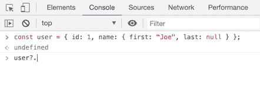

现在，控制台中的属性自动完成使用这个操作符(`user?.`)，就像您使用`user.`或`user[`:

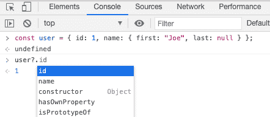

另外两个变化与 *sources* 面板中的语法高亮显示相关。

在 Chrome 84 之前，[私有字段和方法](https://developer.mozilla.org/en-US/docs/Web/JavaScript/Reference/Classes/Private_class_fields)显示为白色文本。在某些情况下，甚至该行的其余部分也被显示为白色:

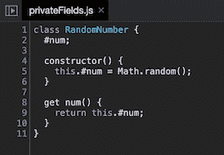

*源面板*使用[代码镜像](https://codemirror.net)来显示代码。

在 Chrome 85 中， [CodeMirror 被更新为版本 5.54.0](https://bugs.chromium.org/p/chromium/issues/detail?id=1073903) 。该版本[改进了私有属性和类字段](https://js.libhunt.com/codemirror-changelog/5.54.0)的解析:

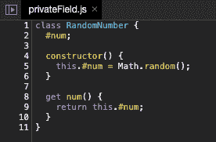

JavaScript 新特性的最后一个变化是关于 [nullish 合并操作符](https://developer.mozilla.org/en-US/docs/Web/JavaScript/Reference/Operators/Nullish_coalescing_operator)。

在 Chrome 85 之前，当代码包含以下操作符时，漂亮打印格式被破坏:

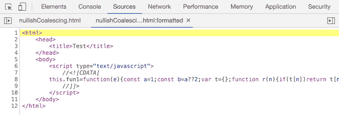

但是现在[它被修复了](https://bugs.chromium.org/p/chromium/issues/detail?id=1083797)并且格式化正常工作:

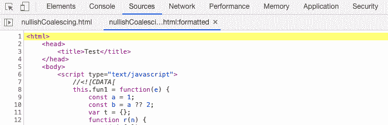

## 对“源”面板的更多更改

对**源**面板还有其他有益的改变。

现在我们有了[的能力来复制或剪切编辑器中的当前行，即使您没有选择任何内容](https://bugs.chromium.org/p/chromium/issues/detail?id=800028)。

为此，将光标放在要复制或剪切的行的末尾，然后按相应的键盘快捷键:

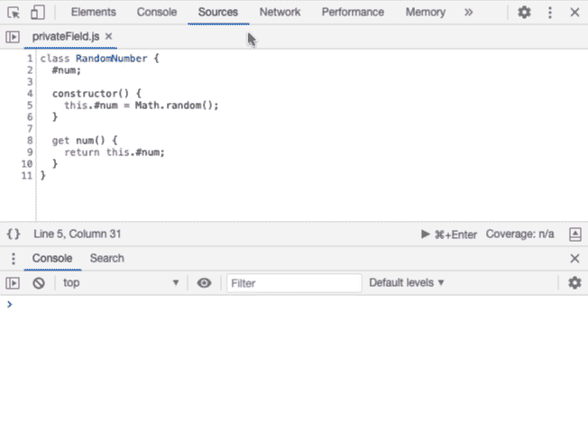

另一个改进是，如果您使用 WebAssembly 文件，编辑器现在[显示字节码(十六进制)偏移量](https://bugs.chromium.org/p/chromium/issues/detail?id=1071432)来显示 Wasm 模块中的源位置，而不是用于其他格式的基于行的位置:

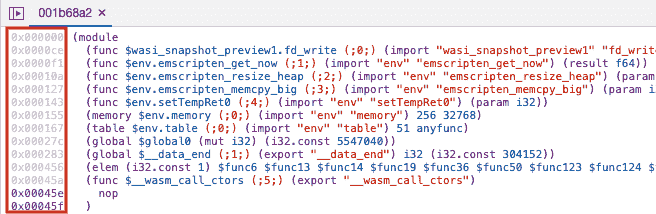

最后，还有断点、条件断点和日志点的新图标。

这是它们以前的样子:


同样，这是他们在黑暗模式下的样子:

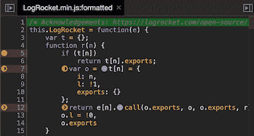

现在它们更加丰富多彩:

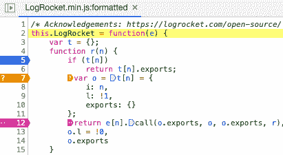

在我看来，这提高了断点图标的可读性，尤其是在启用黑暗模式时:

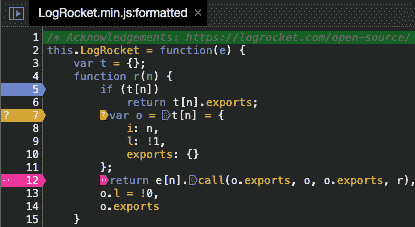

## 性能面板更新

DevTools 的**性能**面板有两个重要的变化。

关于第一个，在 Chrome 84 之前，如果给定的脚本没有被缓存，DevTools 不会显示缓存信息:

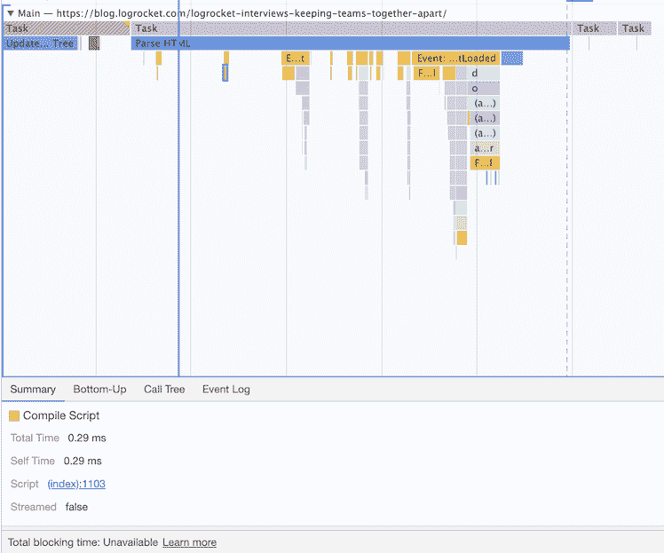

现在，缓存信息[总是显示在摘要选项卡](https://bugs.chromium.org/p/chromium/issues/detail?id=912581)中，显示缓存未发生的原因:

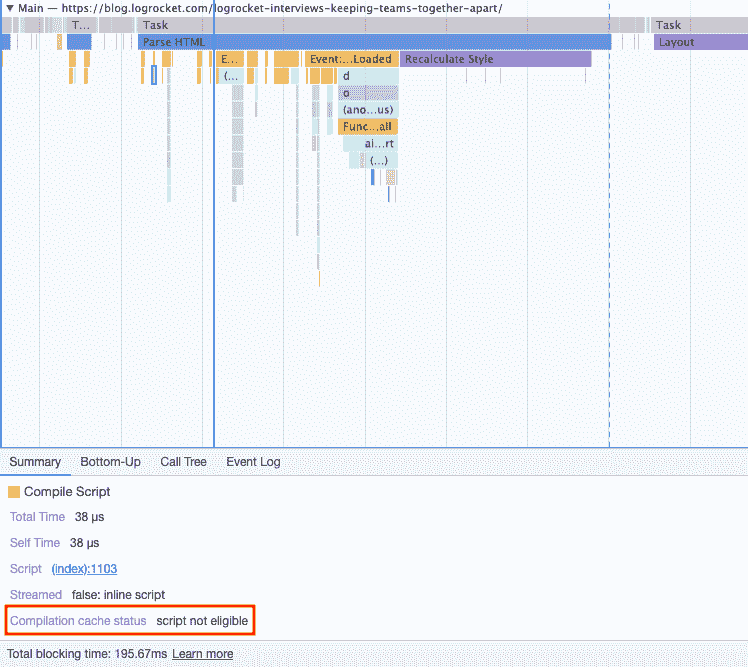

第二个变化与记录规则中显示的时间有关。

在以前的版本中，时间是根据录制开始的时间显示的:

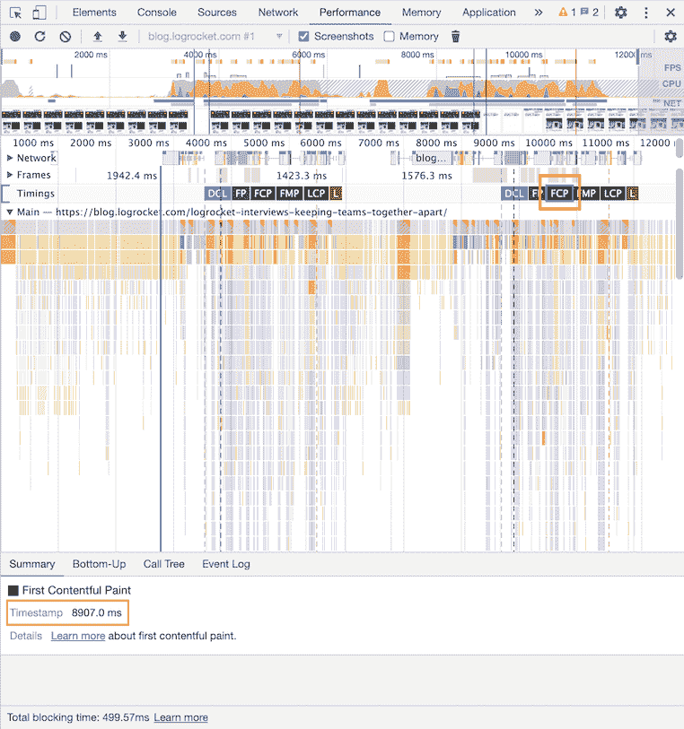

请注意第二页 FCP 显示的时间戳，8907 毫秒。这是自开始记录以来事件发生的时间。

现在，[时间相对于用户导航的位置](https://bugs.chromium.org/p/chromium/issues/detail?id=974550):

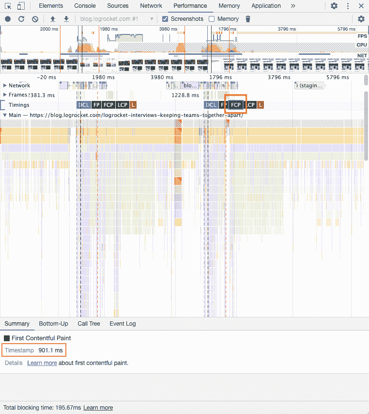

在上面的例子中，第二个页面的 FCP 的时间戳是 901.1 毫秒，这是页面加载后事件发生的时间。

## 结论

在本帖中，我们回顾了 Chrome 85 中 DevTools 最重要的变化。我没有深入回顾帖子开头提到的四个变化，但你可以在这个[帖子](https://developers.google.com/web/updates/2020/06/devtools)上了解更多信息([对开发团队的反馈](https://developers.google.com/web/updates/2020/06/devtools#feedback)也是受欢迎的)。

帖子还提到，在 Chrome 85 中，灯塔面板被更新为使用灯塔 6.0。幸运的是，在 Chrome 84 中引入了 [Lighthouse 6.0，我们不必等到下一个版本。查看这个](https://github.com/GoogleChrome/lighthouse/releases/tag/v6.0.0)[帖子](https://web.dev/lighthouse-whats-new-6.0/)或[发布说明](https://github.com/GoogleChrome/lighthouse/releases/tag/v6.0.0)来总结 6.0 版本带来的所有变化。

最后，记住你可以下载 [Chrome Canary](https://www.google.com/chrome/canary/) 或者 [Chrome 的开发版本](https://www.google.com/chrome/dev/)来访问最新的 DevTools 特性。

## 使用 [LogRocket](https://lp.logrocket.com/blg/signup) 消除传统错误报告的干扰

[](https://lp.logrocket.com/blg/signup)

[LogRocket](https://lp.logrocket.com/blg/signup) 是一个数字体验分析解决方案，它可以保护您免受数百个假阳性错误警报的影响，只针对几个真正重要的项目。LogRocket 会告诉您应用程序中实际影响用户的最具影响力的 bug 和 UX 问题。

然后，使用具有深层技术遥测的会话重放来确切地查看用户看到了什么以及是什么导致了问题，就像你在他们身后看一样。

LogRocket 自动聚合客户端错误、JS 异常、前端性能指标和用户交互。然后 LogRocket 使用机器学习来告诉你哪些问题正在影响大多数用户，并提供你需要修复它的上下文。

关注重要的 bug—[今天就试试 LogRocket】。](https://lp.logrocket.com/blg/signup-issue-free)