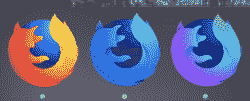
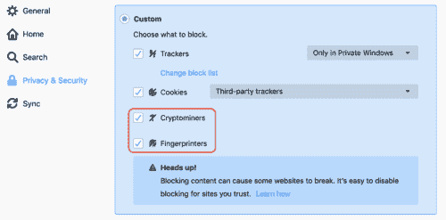

# 火狐 67 的新功能:更喜欢配色方案和更多日志

> 原文：<https://blog.logrocket.com/whats-new-in-firefox-67-prefers-color-scheme-and-more-195be81df03f/>

Mozilla 一直在向前推进，Firefox 67 的发布为可访问性和定制提供了一个很棒的新功能:`prefers-color-scheme`查询，它允许我们知道用户是否请求了浅色或深色主题，并相应地调整我们的设计。

对于用户和开发人员来说，还有许多其他的新特性，所以在深入研究这个令人敬畏的媒体查询之前，让我们先来看看这些特性。

### 对用户的改进

#### 并排轮廓

用户现在可以同时运行多个版本的 Firefox，每个版本都有不同的配置文件。以前，所有安装的版本共享一个单独的概要文件，所以这使得它更加安全可靠。



#### WebRender 的增强性能

经过多年的努力，Firefox 逐渐开始为 Windows 10 用户提供他们的 WebRender 引擎，其他平台也将陆续推出。这是一个巨大的性能改进，当它们以影响管道渲染步骤的方式实现时，将允许更快的动画和滚动。

#### 增强的隐私控制

现在，我们将能够阻止密码矿工和指纹。



#### 更好的帐户和密码管理

Firefox 67 包括许多旨在改善[密码和账户管理](https://matthew.noorenberghe.com/blog/2019/05/password-manager-improvements-firefox-67)的新功能，例如更容易访问已保存的登录信息，在私人窗口上保存密码的能力，以及对`autocomplete=”new-password”`的支持，它将不再由已保存的登录信息自动填充。

[](https://logrocket.com/signup/)

### 开发人员的改进

#### JavaScript string . prototype . match all()

Firefox 现在与 Chrome 一起支持 [matchAll()方法](https://developer.mozilla.org/en-US/docs/Web/JavaScript/Reference/Global_Objects/String/matchAll)，该方法返回所有匹配正则表达式字符串的结果的迭代器，包括捕获组。这使得通过避免循环来获得结果变得更加简单。

#### CSS revert 关键字

CSS `revert`关键字允许我们将选择器的任何属性恢复到用户代理样式表中指定的值(即浏览器的默认值)。有一个类似的关键字叫做`initial`，但是它是基于每个属性的，而不是基于每个选择器的。

这意味着，例如，如果我们出于某种原因将`<div>`标签设置为`display:flex`，`revert`会将其设置回`display:block`，这是浏览器对`<div>`元素的`display`属性的默认值。同样，`initial`会将其设置为`display:inline`，即`display`属性的初始值。

这似乎是一个奇怪的极端情况，当我们需要为某个规则添加一个例外时，它会非常有用。

### 首选颜色方案

现代操作系统允许用户选择他们喜欢的浅色或深色主题。

`prefers-color-scheme`媒体查询是 [CSS 媒体查询第 5 级规范](https://drafts.csswg.org/mediaqueries-5/#descdef-media-prefers-color-scheme)的一部分，该规范旨在通过允许浏览器查询用户偏好并相应地调整页面来在 web 上提供这一功能。

对于患有[畏光症(对光敏感)、前庭障碍](https://alistapart.com/article/accessibility-for-vestibular/)的人，以及任何只是喜欢黑暗方案的人来说，这是一个好消息，这些方案在网络上很少见，但奇怪的是，在我们的文本编辑器和 ide 中却非常流行。

有效值为`light`(浅色背景上的深色文本)、`dark`(深色背景上的浅色文本)和`no-preference`(当用户没有已知偏好时)。

在其更基本的形式中，我们可以如下使用它:

```
.element { background: white; color: black; }

@media (prefers-color-scheme: dark) {
  .element { background: black; color:  white; }
}
```

这将在白色背景上有一个默认的黑色文本，但当用户指定了深色主题的偏好时，将它们反转。

如果上面的例子看起来非常简单，那是因为它确实如此。每次我们在 CSS 中设置颜色时都定义一个媒体查询是非常疯狂的。

#### CSS 变量来拯救！

我们可以在根级别的 CSS 变量中定义所有文档的颜色，并在媒体查询中简单地切换它们的值，以立即使一切适应用户的偏好:

```
:root{
  --foreground: #001144;
  --background: #CCFFEE;
  color: var(--foreground);
  background: var(--background);
}

@media (prefers-color-scheme: dark) {
  :root{
    --foreground: white;
    --background: black;
  }
}

@media (prefers-color-scheme: light) {
  :root{
    --foreground: black;
    --background: white;
  }
}
```

默认情况下，这将在浅蓝色背景上提供深蓝色文本，当用户指定了深色主题的首选项时，这将变成黑色背景上的白色文本，当他们选择了浅色主题时，这将变成白色背景上的黑色文本。

上述方法可以很容易地适应多种颜色，无论主题约定。

#### 关于浏览器支持的说明

到目前为止，只有 Safari 支持这个查询。但是 Firefox 现在已经加入进来，Chrome 正在计划将其用于版本 76(计划于 7 月 30 日)，所以这是一个在我们的项目中开始实现它的好机会。

也就是说，IE、老 Edge 和 evergreen 浏览器的旧版本仍在使用，所以如果项目允许，我们应该考虑它们。那么，使用这个特性的正确方法是渐进增强。

使用上面的例子，不支持`prefers-color-scheme`媒体查询的浏览器将忽略这个规则，因此，简单地不提供这个特性。这并不坏，但如果可能的话，我们应该允许用户在需要时通过其他方式来调整主题，比如在我们的应用程序或网站配置中的一个选项。

更大的问题是不支持 CSS 变量的浏览器，比如 IE。但是我们可以用处理任何其他 CSS 变量的方式来处理它:设置一个默认值，该值稍后会被兼容浏览器上的变量覆盖:

```
:root{
  /* initial values for the color variables */
  --foreground: #001144;
  --background: #CCFFEE;

  /* fallbacks for browsers that don't support variables */
  color: black;
  background: white;

  /* Set colors for browsers that support CSS Variables */
  color: var(--foreground);
  background: var(--background);
}

/* change the theming on browsers that support both variables and prefers-color-scheme*/
@media (prefers-color-scheme: dark) {
  :root{
    --foreground: white;
    --background: black;
  }
}
```

#### 记住不同的媒体

这很容易忘记，但打印页面仍然是一件事，而且通常情况下，选择了深色主题的用户在打印时仍然喜欢浅色主题。所以我建议将配色方案媒体查询和`screen`类型一起使用。

```
@media screen and (prefers-color-scheme: dark) {
  :root{
    --foreground: white;
    --background: black;
  }
}
```

#### 这不仅仅是关于颜色

任何选择器的任何 CSS 属性都可以在这些媒体查询中更改，因此您可以调整从`opacity`(半透明的东西在切换背景时通常看起来很糟糕)到高级属性(如`mix-blend=mode`)的任何内容。

## 使用 [LogRocket](https://lp.logrocket.com/blg/signup) 消除传统错误报告的干扰

[](https://lp.logrocket.com/blg/signup)

[LogRocket](https://lp.logrocket.com/blg/signup) 是一个数字体验分析解决方案，它可以保护您免受数百个假阳性错误警报的影响，只针对几个真正重要的项目。LogRocket 会告诉您应用程序中实际影响用户的最具影响力的 bug 和 UX 问题。

然后，使用具有深层技术遥测的会话重放来确切地查看用户看到了什么以及是什么导致了问题，就像你在他们身后看一样。

LogRocket 自动聚合客户端错误、JS 异常、前端性能指标和用户交互。然后 LogRocket 使用机器学习来告诉你哪些问题正在影响大多数用户，并提供你需要修复它的上下文。

关注重要的 bug—[今天就试试 LogRocket】。](https://lp.logrocket.com/blg/signup-issue-free)

* * *