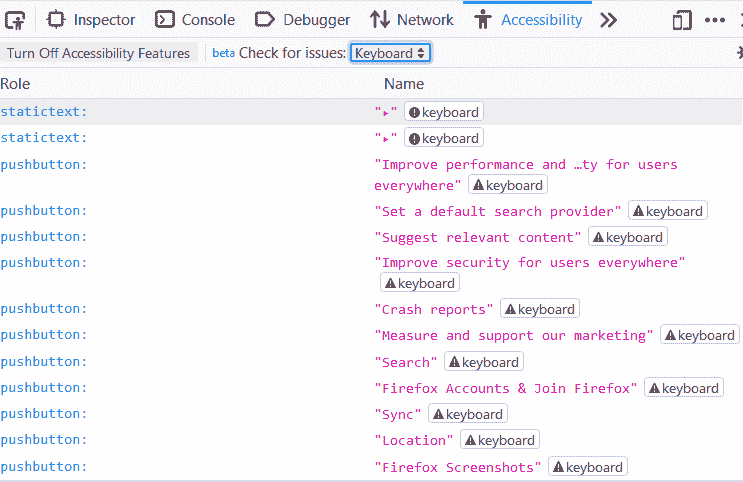

# Firefox 70 中的新内容

> 原文：<https://blog.logrocket.com/whats-new-in-firefox-70/>

Mozilla 发布了最新版本的 Firefox 浏览器，Firefox 70，它提供了许多强大的功能，扩展了我们对浏览器的控制。在本帖中，我们将看看所有的新功能，并演示它们如何帮助提高我们的浏览体验。

## 改进的增强型跟踪保护

新版火狐浏览器附带了一个名为“社交追踪保护”的功能它阻止来自 FACEBOOK、Twitter 或 LinkedIn 等网站的跨站点跟踪 cookies，让您控制自己的数字足迹并提高安全性。

这项功能被打包成一组其他功能，可以在您浏览时保护您的隐私，被很好地命名为“增强跟踪保护”此类别下的一些先前存在的功能可以保护您免受社交媒体追踪器和加密矿工的攻击。

## 综合违规警报

有时，您的私人数据可能会暴露在在线数据泄露中，在这种情况下，您可能希望使这些私人数据无效，以便黑客无法利用它们。问题是，如果您不知道哪些数据是违规的一部分，您如何做到这一点？

从 Firefox 70 开始，Firefox Lockwise 引入了一个新功能，向您显示潜在易受攻击的密码警报，以便您可以更新密码并保护您的隐私。

## 复杂密码生成

Firefox 70 提供了一项新功能，可以在您创建新的在线帐户时帮助您生成复杂而安全的密码，从而增强密码的安全性。这个新特性使得任何类型为 password 的 HTML `<input>`元素都可以在上下文菜单中选择生成一个安全的密码，然后保存在 Firefox Lockwise 中。

## 更快的 JavaScript 基线解释器

Firefox 已经很快了，但是在这个新版本中，由于改进了 JavaScript 基线解释器，它甚至更快了。

基线解释器可以被认为是 C++解释器和[基线即时](https://aboullaite.me/understanding-jit-compiler-just-in-time-compiler/)编译器的混合体。有了它，字节码在固定的解释器循环中执行，就像在 C++解释器中一样，内联缓存被用来提高性能和收集类型信息，就像在 Baseline Just In Time 编译器中一样。

这一改进主要是由于不断增长的 JavaScript 代码库。现在许多代码库都太大了，以至于一个基线 JIT 编译器不再及时编译。有了这个在浏览器中执行 JavaScript 的新管道，性能有了很大的提高。这并不是一个全新的特性，基线解释器已经存在于 Firefox nightly edition 中，但是，这次做了一些性能改进:

*   少量内存使用改进
*   提高了页面加载速度，最多可提高 8%
*   开发人员工具的性能测试提高了 10%
*   将视频处理资源的使用减少多达 [37%](https://treeherder.mozilla.org/perf.html#/compare?originalProject=mozilla-central&newProject=try&newRevision=3d7adefc36d5d5edae6b144dff82919adbb9339e&framework=10&selectedTimeRange=172800#table-header-2242869665)

如果你对这方面的所有技术细节感兴趣，你应该看看 Mozilla 的这篇博客文章。

## 开发人员工具的改进

在这个新版本中，对 Firefox 开发人员工具进行了一些非常有用的改进。让我们来看看它们:

*   **Inactive CSS 规则指示器**:当你写 CSS 的时候，有时候你犯了一个错误，你写的规则对元素没有影响。这些规则本质上是无用的代码。对于开发人员来说，手动弄清楚这些规则是什么是很困难的，但是有了这个新的开发工具，您所要做的就是在页面检查器的规则视图中查看应用于元素的规则，不活动的规则将显示为灰色。不仅如此，您还会看到一个信息图标，当您悬停在该图标上时，它会显示一个工具提示，解释为什么这些规则对您的元素没有影响，并提示您如何改进这些规则，以及一个“了解更多”链接来查找更多信息。
*   颜色选择器中的颜色对比信息:作为改善网页可访问性的努力的一部分，开发人员需要更加注意他们在工作中使用的颜色组合。对开发工具的这一补充使开发人员很容易知道前景和背景颜色之间的对比度是否符合可访问性准则。您可以通过在页面检查器的规则视图中单击颜色属性值来使用此工具。在下面的截图中，颜色对比具有“AAA”可访问性评级。
    T3
*   **键盘可访问性检查**:在可访问性检查器中，在“检查问题”下拉菜单下，增加了一个名为“键盘”的新选项。点击它会让 Firefox 浏览你的网页，检查每个节点的键盘可访问性问题，并标记每个有问题的元素。单击每个元素会显示关于该问题的信息，以及关于如何解决该问题的“了解更多”链接。下面是显示网站键盘辅助功能检查的屏幕截图。



*   **在调试器中 DOM 突变时暂停**:在某些情况下，当 DOM 元素发生突变时，您可能不知道到底是哪段代码导致了这种突变。Firefox 的这个新版本允许您在代码删除、添加或更改 DOM 树中的元素时设置断点。这些断点可以暂停代码执行，并允许您在断点期间、之前和之后查看脚本和 DOM 的状态。当调试大型代码库时，这个特性最受欢迎。当出现问题时，它有助于找出问题出在哪里，以及是什么原因造成的。

## 安全更新

在安全更新部分，Firefox 70 提供了新的安全功能，并对以前 Firefox 版本中的安全漏洞进行了大量修复。新的安全功能包括:

*   Firefox Lockwise 现在能够创建、更新和删除登录和密码，并能够在多个设备之间同步这些登录
*   如前所述，集成的违规警报可在保存的登录和密码因在线数据违规而受损时向您发出警报
*   生成高度复杂的密码，使您的在线帐户不容易受到危害

安全修复包括一系列中度、高度和严重的错误修复，你可以[在这里](https://www.mozilla.org/en-US/security/advisories/mfsa2019-34/)详细阅读。

## CSS 的改进

在这个新版本中，有两个新的 CSS 特性。让我们来看看它们:

*   **显示属性**的双关键字 CSS 属性值:以前`display`属性值为:`flex`、`grid`、`block`、`inline`、`none`中的任意一个。您可能不知道的是，在 CSS 盒子模型中，盒子有内部和外部显示属性，内部显示表示元素的子元素应该如何显示，而外部显示值表示该元素相对于同级元素的显示。

这意味着当你键入`display: grid`时，你说元素的显示是`block`并且它的子元素是`grid`，当你键入`display: inline-flex`时，你说元素的显示是`inline`并且它的子元素是`flex`。

在新的更新中，您可以使用两个关键字来表达这条规则，如下所示:

```
display: inline flex;
display: block grid;

```

*   **新的 CSS 属性用于设计下划线和下划线**:在这个版本的 Firefox 中增加了三个新的属性用于文本修饰和下划线。下面是它们的样子:
    *   `text-decoration-thickness` :声明文字装饰属性中线条的粗细

*   *   `text-underline-offset`:声明文本装饰中设置的文本下划线与其所在文本之间的距离
    *   `text-decoration-skip-ink`:当值为“自动”时，下划线和跨线不会绘制在字体的下行和上行上，而值为“无”意味着跨线和下划线会绘制在下行和上行上

## JavaScript 的改进

在 JavaScript 上，有两个主要变化:

*   数字分隔符:为了提高数字的可读性，JavaScript 现在允许使用下划线来分隔数字，比如:1_000_000_000_000。从 Firefox 70 开始，支持这个新规范
*   **国际改进**:这个有两个部分。首先，i18n(国际化)`Intl.RelativeTimeFormat.formatToParts()`方法被添加到这个版本中，它是一个特殊版本的`Intl.RelativeTimeFormat.format()`方法，它返回一个对象数组，其中每个对象代表本地化时间值的一部分，而不是返回一个字符串。这意味着现在您可以轻松地将数字部分从字符串中分离出来。例如:

```
const relativeTimeFormat = new Intl.RelativeTimeFormat("en", { numeric: "auto" });

relativeTimeFormat.format(-5, "month"); // logs "5 months ago"

relativeTimeFormat.formatToParts(-5, "month"); // logs [{type: "integer", value: "5", unit: "month"},
// {type: "literal", value: " months ago"}]
```

其次，原型链中的两个方法`Intl.NumberFormat`、`format()`和`formatToParts()`现在可以接受 [BigInt](https://developer.mozilla.org/en-US/docs/Web/JavaScript/Reference/Global_Objects/BigInt) 值作为参数。

## 其他更新

*   内置的 Firefox 页面现在遵循系统黑暗模式偏好
*   [别名主题属性已被移除](https://blog.mozilla.org/addons/2019/07/25/upcoming-deprecations-in-firefox-70/)，这可能会影响某些主题
*   除了现有的对 Windows 的支持，现在可以从 macOS 上的 Chrome 导入密码
*   现在，包括链接在内的欠行或多行文本的可读性大大提高了。这些线现在会被打断，而不是跨过一个字形
*   改进的[隐私和安全指标](https://blog.mozilla.org/security/2019/10/15/improved-security-and-privacy-indicators-in-firefox-70/)

## 结论

在本文中，我们介绍了 Firefox 70 的新更新。这次更新真的触动了很多部分；HTML、CSS、JavaScript、devtools、性能等等。

此次更新的一些主要亮点包括:

*   维护用户隐私的改进
*   防止追踪器
*   更好的密码管理
*   改进的开发工具

为了测试这些功能，你需要[将你的火狐浏览器](https://www.mozilla.org/en-US/firefox/70.0/releasenotes/)更新到最新版本的火狐 70，并亲自体验新的更新。

## 使用 [LogRocket](https://lp.logrocket.com/blg/signup) 消除传统错误报告的干扰

[](https://lp.logrocket.com/blg/signup)

[LogRocket](https://lp.logrocket.com/blg/signup) 是一个数字体验分析解决方案，它可以保护您免受数百个假阳性错误警报的影响，只针对几个真正重要的项目。LogRocket 会告诉您应用程序中实际影响用户的最具影响力的 bug 和 UX 问题。

然后，使用具有深层技术遥测的会话重放来确切地查看用户看到了什么以及是什么导致了问题，就像你在他们身后看一样。

LogRocket 自动聚合客户端错误、JS 异常、前端性能指标和用户交互。然后 LogRocket 使用机器学习来告诉你哪些问题正在影响大多数用户，并提供你需要修复它的上下文。

关注重要的 bug—[今天就试试 LogRocket】。](https://lp.logrocket.com/blg/signup-issue-free)