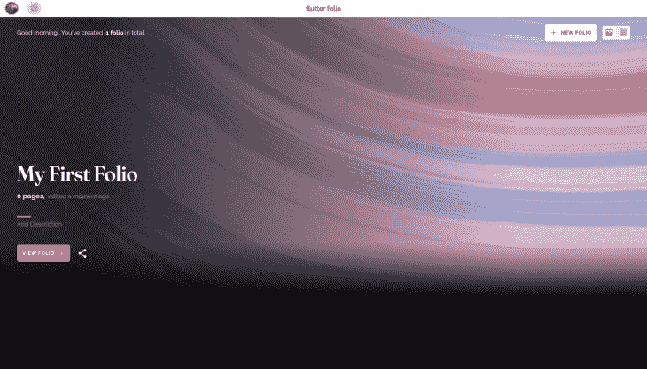
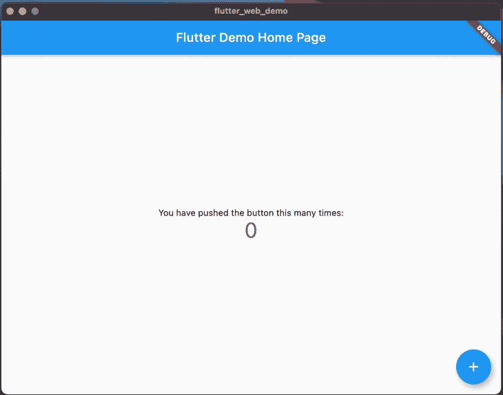
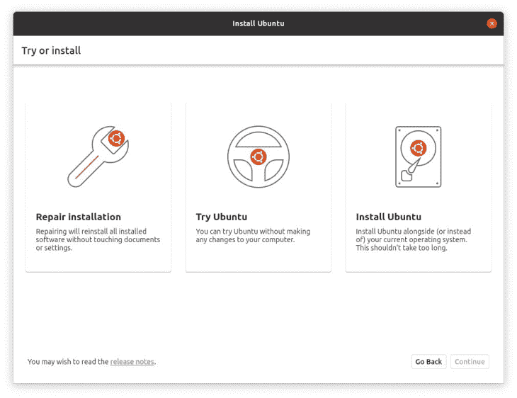

# Flutter 2.0 的新特性

> 原文：<https://blog.logrocket.com/whats-new-in-flutter-2-0/>

## 介绍

[Flutter](https://flutter.dev/) 最近在一次名为“Flutter Engage”的活动中宣布了其 2.0 版本，这标志着跨平台 UI 工具包快速发展的又一个里程碑，并带来了一系列变化和公告。这个活动是“30 天的颤振”倡议的高潮，将颤振介绍给新的观众，团队和社区一起实现它。


让我们来看看在活动上宣布了什么。

## Flutter 2.0 有什么新功能？

### 零安全

Null 安全性一直是许多试图在 Kotlin 等语言上转移到 Dart 的开发人员的主要症结。空安全引入了不能为空的类型，允许编译器知道一些变量不是空的，并避免不必要的空检查。

同时，它还帮助开发人员提前避免问题，因为如果某些事情处理不当，代码根本无法编译。Null safety 已经测试了一段时间，整个框架已经转移到以向后兼容的方式使用 null safety。

人们提前担心的一个问题是现有的包在没有安全性的情况下如何工作。目前，主要的包装已经转移或计划转移到零安全。

然而，许多仍然是非空安全版本。当应用程序使用不使用空安全的包时，应用程序运行在不健全的空安全模式下，当所有依赖项都迁移到空安全时，运行在健全的空安全模式下。

```
int i = 5; // i is now non nullable
int? j; // Nullable variables need to be explicitly declared

i = null; // Error
```

空安全还允许缩减代码的大小，因为可以删除额外的检查。有趣的是，Dart 语言没有选择 3.0 的空安全，而是留在了 2.x 版本中，因为空安全没有对现有代码进行重大更改，这给人留下了深刻的印象。

### 网络达到稳定



(Folio:在 Flutter Engage 上展示的 gskinner 团队的一个项目)

在 Flutter 1.0 发布会上宣布成为“蜂鸟计划”后，Flutter Web 引起了很大的兴奋，因为 Flutter 现在可以到达三大平台:Android、iOS 和 Web。经过一年半的时间和多种方法的渲染，在持续改进性能后，Flutter Web 终于稳定下来。

Flutter 进入 web 最初有几个障碍:首先，需要创建窗口小部件来提供身临其境、响应迅速的 web 体验。此外，需要实现悬停等功能，使网站看起来不只是一个大型移动应用程序。最后，因为 Dart 本身最初是作为 JavaScript 的替代品，所以 dart2js 编译器已经被广泛使用。然而，网络本身是一个棘手的平台。

Flutter Web 公告的一个自然好处是创建了渐进式 Web 应用程序(pwa)。PWAs 允许一个网站在移动设备上拥有类似应用的行为，同时仍然保留网络带来的许多自由。因为 Flutter 代码已经为处理手机大小的布局进行了优化，所以使用现有代码创建 pwa 变得非常容易。

随着 web 变得稳定，越来越多的包继续增加支持，使 Web 支持感觉更加完整。

### 台式机(某种程度上)达到稳定



Flutter 现在可以在 stable 上的桌面(MacOS，Windows，Linux)上使用。然而，这是一个早期版本，旨在预览桌面上运行的应用程序。最终的稳定版本会在适当的时候出现。与 Flutter Web 类似，desktop 需要全新类别的小部件和输入机制。

关于 Flutter Desktop 令人惊讶的事情是，在很长一段时间里，社区是开发桌面的驱动力，直到 Flutter 正式接管开发。现在，它几乎可以稳定发布了。

一个相对新的惊喜是 Canonical——Ubuntu T1 的创造者——对 Flutter 做出了贡献。稍后在另一篇文章中解释了这一点:Flutter 是未来 Ubuntu 应用的默认选择。


不仅如此，Ubuntu 安装程序本身也被转换为 Flutter:



你可以点击查看 Ubuntu 桌面安装库[。](https://github.com/canonical/ubuntu-desktop-installer)

### 丰田和 Flutter 联手

丰田宣布将与 Flutter 一起构建其新的信息娱乐平台，并在其 Flutter 团队中开放几个职位。随着像丰田这样的公司加入 Flutter 生态系统，这表明 Flutter 正在慢慢变成一个成熟、可信的框架。


## 对 Flutter 2.0 的其他改进

以下是现在发布的 2.0 中对 Flutter 的一些额外改进:

Dart DevTools 已经过改进，可以在调试时提供更好的功能。

*   `dart fix`命令允许删除不推荐使用的代码及其正确的实现
*   终于来到 master，允许像 Snackbars 这样的元素跨屏幕存在

## 展望未来

与 React Native 等竞争框架相比，Flutter now [在 GitHub](https://github.com/flutter/flutter) 上拥有更多明星。虽然还没有接近一个完美的指标，但它确实显示了 Flutter 在移动应用程序开发(现在更多)领域的受欢迎程度是如何迅速增长的。

就我个人而言，看到事物增长的幅度和速度令人惊叹。我记得第一次使用 Dart 是在 2013-2014 年用铬制作一个海盗徽章——从那以后事情有点停滞。

几年后，我开始研究 Flutter 的 alpha 和整个生态系统，包括框架本身、Dart 语言和工具包。颤振社区一直在扩大和改善到一个惊人的程度。

Flutter 2.0 展示了 Flutter 如何跨平台传播以实现其无处不在的潜力，并证明了它的稳定性，现在更大的公司正在加入进来。

如果您希望看到完整的(非常)详细的变更列表，[这个](https://flutter.dev/docs/development/tools/sdk/release-notes/release-notes-2.0.0)就是您要去的地方。

## 使用 [LogRocket](https://lp.logrocket.com/blg/signup) 消除传统错误报告的干扰

[](https://lp.logrocket.com/blg/signup)

[LogRocket](https://lp.logrocket.com/blg/signup) 是一个数字体验分析解决方案，它可以保护您免受数百个假阳性错误警报的影响，只针对几个真正重要的项目。LogRocket 会告诉您应用程序中实际影响用户的最具影响力的 bug 和 UX 问题。

然后，使用具有深层技术遥测的会话重放来确切地查看用户看到了什么以及是什么导致了问题，就像你在他们身后看一样。

LogRocket 自动聚合客户端错误、JS 异常、前端性能指标和用户交互。然后 LogRocket 使用机器学习来告诉你哪些问题正在影响大多数用户，并提供你需要修复它的上下文。

关注重要的 bug—[今天就试试 LogRocket】。](https://lp.logrocket.com/blg/signup-issue-free)