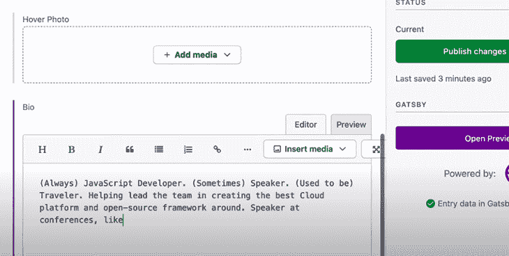
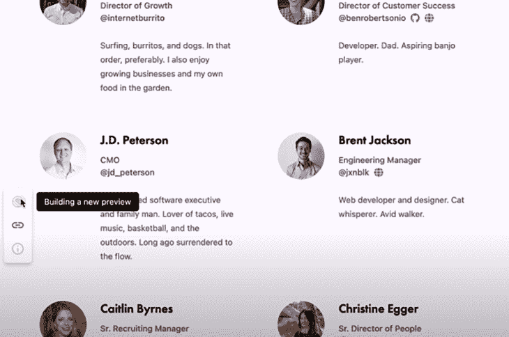

# 盖茨比 v4 中的新内容

> 原文：<https://blog.logrocket.com/whats-new-in-gatsby-v4/>

Gatsby 最为人所知的是一个基于 React、支持 GraphQL 的静态站点生成器，它有一个用于管理系统、API 和数据库的丰富的数据插件系统。Gatsby 还有几个插件，可以将其功能扩展到常规静态站点生成器之外。

2021 年 9 月发布的 [Gatsby v4.0](https://www.gatsbyjs.com/gatsby-4/) 框架为开发者和用户体验提供了巨大的改进，并首次涉足服务器端渲染领域。我们将在本文中介绍所有的新特性，包括:

让我们在下面回顾一下这些，包括一些相关的例子。

## 介绍并行查询运行

在以前的 Gatsby 版本中，[统一数据层](https://www.gatsbyjs.com/docs/porting-from-create-react-app-to-gatsby#unified-graphql-data-layer)用于简化来自多个内容管理系统的内容。盖茨比 v2.0 和 v3.0 的推出是为了让开发者推出更快的网站；他们启用了新的特性，只在开发服务器请求时构建页面或处理图像。

在 4.0 版本中，Gatsby 通过引入运行的[并行查询进一步减少了构建时间，这通常是构建过程中最大的部分。并行查询运行是迈向完全解耦未来的第一步，这意味着构建会更快。](https://www.gatsbyjs.com/blog/what-is-parallel-query-running/)

盖茨比历史上一直是单线程的；不管一台机器上有多少个可用的内核，Gatsby 只利用一个线程来执行任务。然而，并行查询运行利用了多个内核，这意味着较慢的构建现在将在更多更强大的机器上并行完成——这[将构建速度提高了 40%](https://www.gatsbyjs.com/blog/what-is-parallel-query-running/)。

## 通过预览用户界面改进内容管理

新的预览用户界面提供了改进的内容可视化和编辑体验，有助于内容编辑人员了解最新信息并提高工作效率。作为一名编辑，你只需点击一下鼠标，就可以实时看到你在 CMS 上所做的更改。

这是预览界面上的一个小演示:



当开发人员在他们的网站中没有 Gatsby 时，不管他们选择 CMS，他们的内容编辑人员在进行更改时不会束手无策。作为内容编辑器，如果您使用 [Contentful](https://www.contentful.co) 作为示例 CMS，您可以在编辑器中进行更改。当你点击**打开预览**按钮时，会显示一个**新建预览**按钮，就在左下角:



## 延迟静态生成

延迟静态生成(DSG)是一种通过延迟非关键页面的生成，而是只实时生成所需页面来加快构建速度的技术。

只有 Gatsby 站点的关键部分是在构建时生成的，而其余部分是在用户请求时生成并提供给用户的。当用户访问动态页面而不是预先生成所有内容时，就会触发构建。

DSG 可以[将构建时间缩短 10 倍](https://v4.gatsbyjs.com/docs/how-to/rendering-options/using-deferred-static-generation/)，尤其是对于那些内容可以在后台生成的较大网页。

对于不经常访问的旧站点或某些内容类型，您可以利用静态 web 生成器的优势，等待构建完成。

要启用 DSG，您可以遵循官方文档中的说明[。](https://v4.gatsbyjs.com/docs/how-to/rendering-options/using-deferred-static-generation/)

## 用盖茨比云托管

[Gatsby Cloud](https://www.gatsbyjs.com/blog/introducing-gatsby-cloud-hosting) 是一个新平台，它使用现代开发工具集和工作流来获得更好的 Gatsby 体验。

Gatsby 使用增量构建来减少构建时间或部署。当您对您的站点进行更改时，Gatsby 会计算从做出更改到通过 CDN 向您在世界各地的用户发布更改的时间。

此外，随着盖茨比转向更具活力的领域以满足团队的需求，盖茨比托管也揭开了面纱。它解决了将更新发布到现在已经转移到部署时间的站点的问题。

除了盖茨比云上的这个功能，[Gatsby-plugin-Gatsby-Cloud](https://www.gatsbyjs.com/plugins/gatsby-plugin-gatsby-cloud/)已经更新。这个插件帮助你在 Gatsby Cloud 上控制标题和重定向你的项目。

## Gatsby Shopify 源插件和启动器

Gatsby 现在提供自己的 [Shopify 店面启动器](https://www.gatsbyjs.com/starters/gatsby-inc/gatsby-starter-shopify-beta)来进一步说服内容创作者选择 Gatsby 作为他们电子商务网站的前端。

虽然它仍处于测试阶段，但新的 starter 让你比以前更快地开始使用 Gatsby，并为你的构建提供了广泛的易于定制的选项，其中大多数是用 CSS 模块构建的[。](https://blog.logrocket.com/a-deep-dive-into-css-modules/)

## 服务器端渲染

这个版本最大的变化之一是 Gatsby 新增了对服务器端渲染(SSR)的支持。[服务器端渲染](https://v4.gatsbyjs.com/docs/conceptual/rendering-options/)是在预用户和预请求基础上完成的。如果您想要扩展实时数据需求或获取基于服务器端条件的测试细节，SSR 将使您能够构建您的网站。

这些技术和渲染模型是盖茨比的[新功能。总的来说，这些工具和 API 将使构建时间缩短 10 倍。](https://blog.logrocket.com/next-js-vs-gatsby-comparing-react-frameworks/)

## 通过 Gatsby 实现安全部门改革

为了说明 SSR，我们将使用`getServerMethod()`从由 [Rocktim Saikia](https://www.rocktimcodes.site/) 编写的 animechan API 获取数据，这是一个简单的 API，它返回随机的动画引用、源动画的名称以及引用这些引用的角色的名称。然后，我们将在页面中动态呈现来自`getServerData()`方法的数据。

如果你没有现成的 Gatsby 网站，你可以[按照这个指南](https://v4.gatsbyjs.com/docs/quick-start/)开始。

这是我们的请求样本:

```
fetch('https://animechan.vercel.app/api/random')
.then(response =&gt; response.json())
.then(quote =&gt; console.log(quote))

```

这是我们的回答样本:

```
{
anime: 'Tengen Toppa Gurren Lagann',
character: 'Kamina',
quote: 'Don\'t believe in the you that believes in me and don\'t believe in the me that believes in you. Believe in the you that believes in yourself.'
}

```

创建一个简单的 React 组件并硬编码动画名称、引用和角色。我们将很快对此进行动态渲染:

```
import React from "react”;
const AnimeQ = () =&gt; (
&lt;main&gt;
&lt;h1&gt;Anime Quote Of The Day&lt;/h1&gt;
&lt;h3&gt;Anime&lt;/h3&gt;
&lt;p&gt;Anime Quotes&lt;/p&gt;
&lt;p&gt;Anime Character&lt;/p&gt;
&lt;/mani&gt;
export default AnimeQ;

```

从`getServerData()`内请求数据。async `getServerData()`是一种指示 Gatsby 为我们选择 SSR 呈现选项的方法。

该数据必须作为只有一个属性`props`的对象返回，其值是 API 响应:

```
export async function getServerData() {
try {
const res = await fetch(https://animechan.vercel.app/api/random)
if (!res.ok) throw new Error(`Couldn’t get response!`)

return {
  props: await res.json(),
}
} catch (err) {
return {
headers: {
status: 500,
},
      props: {}
    }
  }
}

```

每当用户访问页面时，API 被调用，返回的响应作为页面的`serverData`可用，我们将接受它作为一个道具。让我们动态地呈现这些数据，并取出硬编码的值:

```
const AnimeQ = ({serverData}) =&gt; (
&lt;h1&gt;Anime Quote Of The Day&lt;/h1&gt;
&lt;h3&gt;{serverData.message.anime}&lt;/h3&gt;
&lt;p&gt;{serverData.message.quote}&lt;/p&gt;
&lt;p&gt;{serverData.message.character}&lt;/p&gt;

)
export default AnimeQ;
export async function getServerData() {
try {
const res = await fetch(https://animechan.vercel.app/api/random)
if (!res.ok) throw new Error(`Couldn’t get response!`)

return {
  props: await res.json(),
}
} catch (err) {
 return {
    headers: {
   status: 500,
},
           props: {}
     }
  }
}

```

## 改进的文档和教程体验

最后，如果这些新特性引起了您的兴趣，Gatsby 提供了新的教程和完整的文档体验来帮助您快速入门。教程向你展示了如何建立一个博客，以及如何使用 Gatsby ≥v3 可用的最新 API。

## 结论

Gatsby 一直在发展，它的主要目标一直是让开发人员能够构建具有快速页面加载、快速图像加载和快速数据预取的站点。随着 Gatsby v4 的发布，由于 [DSG](https://v4.gatsbyjs.com/docs/how-to/rendering-options/using-deferred-static-generation/) 的实现，速度有了明显的提高——而且，随着他们计划每两周推出一个新的 Gatsby 开源版本，如果你用每个增量点版本更新你的 Gatsby 版本，你会注意到总体 Gatsby 用户体验的一些真正的改善，这是通过构建速度计算的。

现在更新将会更频繁，我们将会看到更多的 Gatsby，它具有更新的特性，使开发人员和编辑人员获得最佳体验。你还在等什么？[升级到盖茨比 4.0 版！](https://v4.gatsbyjs.com/docs/reference/release-notes/migrating-from-v3-to-v4/)

## 使用 [LogRocket](https://lp.logrocket.com/blg/signup) 消除传统错误报告的干扰

[](https://lp.logrocket.com/blg/signup)

[LogRocket](https://lp.logrocket.com/blg/signup) 是一个数字体验分析解决方案，它可以保护您免受数百个假阳性错误警报的影响，只针对几个真正重要的项目。LogRocket 会告诉您应用程序中实际影响用户的最具影响力的 bug 和 UX 问题。

然后，使用具有深层技术遥测的会话重放来确切地查看用户看到了什么以及是什么导致了问题，就像你在他们身后看一样。

LogRocket 自动聚合客户端错误、JS 异常、前端性能指标和用户交互。然后 LogRocket 使用机器学习来告诉你哪些问题正在影响大多数用户，并提供你需要修复它的上下文。

关注重要的 bug—[今天就试试 LogRocket】。](https://lp.logrocket.com/blg/signup-issue-free)