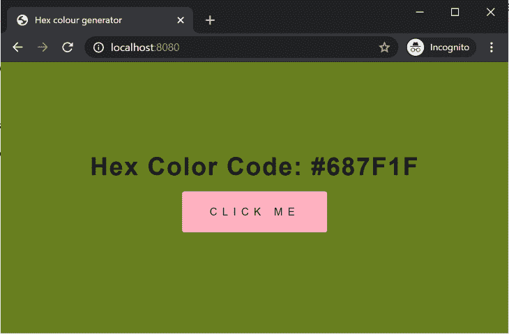
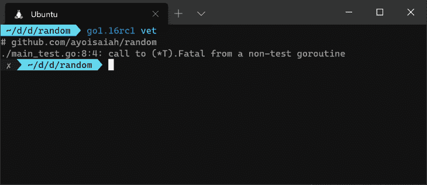

# Go 1.16 的新功能

> 原文：<https://blog.logrocket.com/whats-new-in-go-1-16/>

Go 编程语言的第 17 个主要版本 Go 1.16 刚刚发布。这是一次重大的升级，为语言带来了许多期待已久的特性和改进。默认情况下，模块感知模式是启用的，Apple silicon 支持是活动的，静态资产的原生嵌入是在这里，并且`io/ioutil`包中的方法已经过重新组织，因此它现在具有逻辑意义。在本文中，我们将看看这个版本的一些亮点。

## 苹果芯片的原生支持

从一开始，Go 就优先考虑不同操作系统和架构之间的可移植性，这反映在它对各种操作系统和架构组合的支持上。

在过去的几个月里，由于其在 CPU、GPU 和电池性能方面令人印象深刻的飞跃，苹果首款 64 位 ARM Mac 的发布一直是开发人员最主要的话题之一。Go 项目迅速做出反应，通过`GOOS=darwin`和`GOARCH=arm64`环境变量增加了对 ARM Macs 的原生支持。

如果你有一台 M1 Mac，你现在可以在你的电脑上构建和运行 Go 程序，如果你在不同的操作系统或基于英特尔的 Mac 上，你可以在为你的程序构建二进制文件时通过设置上面的环境变量来定位 ARM Macs:

```
GOARCH=arm64 GOOS=darwin go build myapp

```

## 静态文件的本机嵌入

Go 最大的好处之一是编译后的程序可以作为一个独立的二进制文件来分发和执行。当程序依赖静态文件(如 HTML 模板、数据库迁移文件、web 应用程序资产(如 JavaScript)或图像文件(如这些文件通常必须与二进制文件一起分发)时，这种优势会有所抵消，除非它们在第三方包(如 [pkger](https://github.com/markbates/pkger) 或 [packr](https://github.com/gobuffalo/packr) 的帮助下嵌入到二进制文件中。随着 Go 1.16 的发布，现在可以通过新的`embed`包在 Go 二进制文件中包含静态文件。

下面是这个特性如何工作的最基本的例子。假设您有一个内容如下所示的`sample.txt`文件:

```
Hello from text file

```

和一个`main.go`文件在同一个目录下，内容如下:

```
package main

import (
    _ "embed"
    "fmt"
)

//go:embed sample.txt
var text string

func main() {
    fmt.Print(text)
}

```

位于`text`变量上方的`go:embed`指令指示编译器将`sample.txt`文件的内容作为字符串嵌入到`text`变量中。如果您用`go build`构建程序，并将生成的二进制文件移动到不同的位置，您会注意到执行它会将嵌入文件的内容打印到标准输出中。这是因为`sample.txt`文件的所有内容都包含在二进制文件中，所以它可以按原样分发:

```
$ mv main /tmp
$ cd /tmp
$ ./main
Hello from text file

```

对于一个更现实的例子，假设我们有一个 web 应用程序项目，其目录结构如下:

```
.
├── assets
│   ├── css
│   │   └── style.css
│   └── js
│       └── script.js
├── go.mod
├── index.html
├── main.go
└── random

```

我们可以像这样将所有文件嵌入到`assets`文件夹和`index.html`文件中:

```
package main

import (
    "embed"
    "net/http"
)

//go:embed assets/*
var assets embed.FS

//go:embed index.html
var html []byte

func main() {
    fs := http.FileServer(http.FS(assets))
    http.Handle("/assets/", fs)
    http.HandleFunc("/", func(w http.ResponseWriter, r *http.Request) {
        w.Header().Add("Content-Type", "text/html")
        w.Write(html)
    })
    http.ListenAndServe(":8080", nil)
}

```

`FS`类型对于嵌入文件树很有用，比如 web 服务器资产的目录，就像上面的例子。对于嵌入像`index.html`这样的单个文件，类型为`string`或`[]byte`的变量是最好的。如果您构建并执行该程序，并导航到 [http://localhost:8080](http://localhost:8080) ，您将看到正确应用了静态资产的 HTML 文件的内容:

```
$ go version
go version go1.16rc1 linux/amd64
$ go build -o main
$ mv main /tmp
$ cd /tmp && ./main

```



如果您想在本地运行这个示例，可以下载[index.html](https://gist.github.com/finallyayo/c8959c7f95565bd6eb111719006381c3)、 [style.css](https://gist.github.com/finallyayo/2b44f3204a4d414db5a715601ce2bfc9) 和 [script.js](https://gist.github.com/finallyayo/00ad1c09b053c69b9be38e32865a0aaa) 文件的内容。更多细节，请参见新嵌入包的[文档](https://tip.golang.org/pkg/embed/)。

## 一些问题

在使用`//go:embed`指令之前，您必须导入`embed`包。否则，您会得到一个错误:

```
$ go run main.go
# command-line-arguments
./main.go:8:3: //go:embed only allowed in Go files that import "embed"

```

如果您没有直接使用来自`embed`的任何导出标识，请确保在 import 语句前加上下划线:

```
import (
    _ "embed"
)

```

另一件需要注意的事情是`//go:embed`只对包级变量有效。如果您试图在函数中使用它，您的代码将无法编译:

```
package main

import (
    _ "embed"
    "fmt"
)

func main() {
    //go:embed index.html
    var html string
    fmt.Println(html)
}

```

```
$ go run main.go
# command-line-arguments
./main.go:9:4: go:embed cannot apply to var inside func

```

## 默认情况下，模块感知模式处于启用状态

在 [Go 1.11](https://golang.org/doc/go1.11) 中 [Go 模块](https://blog.golang.org/using-go-modules)的引入预示着依赖性管理将远离`GOPATH`语义。在最初的版本和 [Go 1.12](https://golang.org/doc/go1.12) 中，模块仍然是实验性的，必须用环境变量`GO111MODULE=on`激活。 [Go 1.13](https://golang.org/doc/go1.13) 确保当`go.mod`文件出现在当前工作目录或父目录中时自动激活模块感知模式，即使该目录在`GOPATH`中，这种情况在 [Go 1.14](https://golang.org/doc/go1.14) 和 [1.15](https://golang.org/doc/go1.15) 中仍然存在。

随着 Go 1.16 的发布，`GO111MODULE`变量现在默认为`on`，这意味着默认启用模块感知模式，而不管当前目录中是否存在`go.mod`文件。如果您想恢复到之前的行为，请将`GO111MODULE`设置为`auto`。

在其他相关变更中，`go build`和`go test`默认不再修改`go.mod`和`go.sum`文件。相反，如果需要添加或更新模块要求或校验和，则会报告错误。然后，您可以使用`go mod tidy`或`go get`来相应地调整要求。

`go install`命令现在也是模块感知的，这意味着它不会影响当前目录或任何父目录(如果有的话)中的`go.mod`文件。此外，它现在可以将版本号作为后缀。例如:

```
$ go install github.com/[email protected]

```

在 Go 1.16 中，使用`go get`构建和安装包已经被弃用，取而代之的是`go install`。在未来的版本中，`go get`将不再能够构建和安装包，但会像现在一样启用`-d`标志，这意味着它将在不构建包的情况下调整当前模块的依赖性。`-insecure`或`-i` a 旗也已被弃用。

## 软件包作者现在可以收回旧版本

从 Go 1.16 开始，新的退刀指令将出现在`go.mod`文件中。这允许包作者将旧的包版本标记为不安全或损坏，或者某个版本是无意中发布的。下面是它的使用方法:

```
module example

go 1.16

retract v1.1.1 // retract single version
retract [v1.1.1, v1.3.2] // closed interval, so anything between v1.1.1 and v1.3.2

```

## `io/ioutil`包现在已被弃用

整个`ioutil`包现在在 Go 1.16 中被弃用，它的功能被移到了其他包中。明确地说，利用这个包的现有代码将继续工作，但是鼓励您迁移到`io`和`os`包中的新定义。

使用`ioutil`进行代码迁移应该很简单。这个包中一个流行的方法是`ReadAll()`方法，它通常用于将 HTTP 请求的整个响应体读入一个字节片。这个方法已经被移动到`io`包中:

```
resp, err := http.Get(url)
if err != nil {
    return err
}

defer resp.Body.Close()

// old way: body, err := ioutil.ReadAll(resp.Body)
body, err := io.ReadAll(resp.Body)
if err != nil {
    return err
}

```

导出的`io/ioutil`方法的新位置的完整列表如下所示:

## `io/fs`套餐

通过添加`io/fs`和`testing/testfs`包，对 Go 标准库的改进并没有被排除在这个版本之外。这些新的包使得在测试中抽象文件系统变得更加容易，这使得它们更容易被复制，而不管它们运行在什么操作系统上。访问文件也将更快，而且你不必事后清理临时文件。

在 Go 1.16 之前，模拟文件系统的任务经常落到流行的 [afero](https://github.com/spf13/afero) 包身上，该包提供了一个[接口类型](https://pkg.go.dev/github.com/spf13/afero#Fs)，必须满足该接口类型才能实现真实或模拟的文件系统。它还提供了一些提供该接口的常见实现，如 [afero。MemMapFs](https://pkg.go.dev/github.com/spf13/afero#MemMapFs) 是一个内存支持的文件系统，对于测试中的模拟非常有用。

与 afero 的 [Fs](https://pkg.go.dev/github.com/spf13/afero#Fs) 接口在编写时定义了 13 个方法不同，`io/fs`包提供的 [FS](https://tip.golang.org/pkg/io/fs/#FS) 接口相当简单:

```
type FS interface {
    Open(name string) (File, error)
}

```

要实现这个接口，您需要做的就是一个`Open`方法，该方法可以在一个路径下打开一个文件，并返回一个实现如下所示的`fs.File`接口的对象:

```
type File interface {
    Stat() (FileInfo, error)
    Read([]byte) (int, error)
    Close() error
}

```

从上面的界面中，您会注意到缺少允许您修改文件的方法。这是因为`io/fs`包只为文件系统提供了一个只读接口，不像 Afero 在这方面更完整。这个决定的[原因](https://github.com/golang/go/issues/41190#issuecomment-690848889)是阅读比写作更容易抽象，写作更复杂。

> 所有这些都是为了说明我认为将这个提议限制为只读操作的设计决策是一个好的决策。事实上，正是这个关键的见解(由@robpike 提出)解开了多年来的僵局，让我们在定义这个接口上取得了任何进展。

## 值得注意的提及

现在，当在测试或基准测试期间创建的 goroutine 中对`testing.T`或`testing.B`的`Fatal`、`Fatalf`或`FailNow`方法进行无效调用时，vet 工具会发出警告。这是因为这些方法退出 goroutine，而不是测试或基准函数:

```
package main

import "testing"

func TestFoo(t *testing.T) {
    go func() {
        if true {
            t.Fatal("Test failed") // exits the goroutine instead of TestFoo
        }
    }()
}

```



对上述方法的调用可以用`t.Error()`来代替，以表示测试失败，并用`return`语句来退出 goroutine:

```
package main

import "testing"

func TestFoo(t *testing.T) {
    go func() {
        if true {
            t.Error("Test failed.")
            return
        }
    }()
}

```

对标准库包也有一些小的更新和修正。完整的变更列表可以在[发行说明](https://tip.golang.org/doc/go1.16#minor_library_changes)中找到。

## 结论

如果你想探索这个版本中包含的错误修复和功能的完整列表，我鼓励你查看 GitHub 上的 [Go 1.16 里程碑](https://github.com/golang/go/milestone/145)中的已关闭问题列表。

感谢您的阅读，祝您编码愉快！

## 使用 [LogRocket](https://lp.logrocket.com/blg/signup) 消除传统错误报告的干扰

[](https://lp.logrocket.com/blg/signup)

[LogRocket](https://lp.logrocket.com/blg/signup) 是一个数字体验分析解决方案，它可以保护您免受数百个假阳性错误警报的影响，只针对几个真正重要的项目。LogRocket 会告诉您应用程序中实际影响用户的最具影响力的 bug 和 UX 问题。

然后，使用具有深层技术遥测的会话重放来确切地查看用户看到了什么以及是什么导致了问题，就像你在他们身后看一样。

LogRocket 自动聚合客户端错误、JS 异常、前端性能指标和用户交互。然后 LogRocket 使用机器学习来告诉你哪些问题正在影响大多数用户，并提供你需要修复它的上下文。

关注重要的 bug—[今天就试试 LogRocket】。](https://lp.logrocket.com/blg/signup-issue-free)