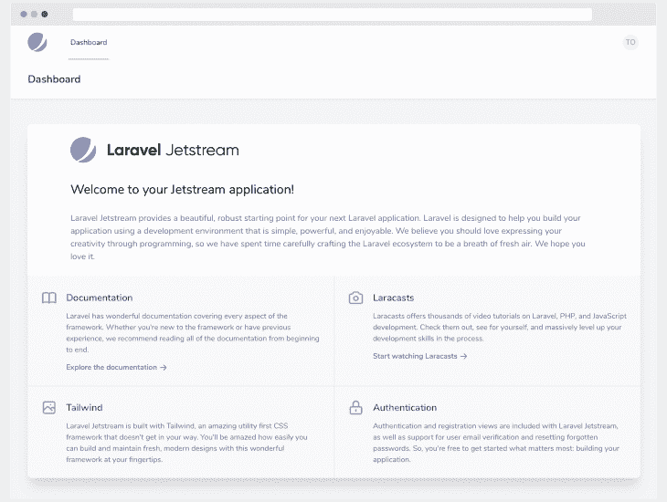
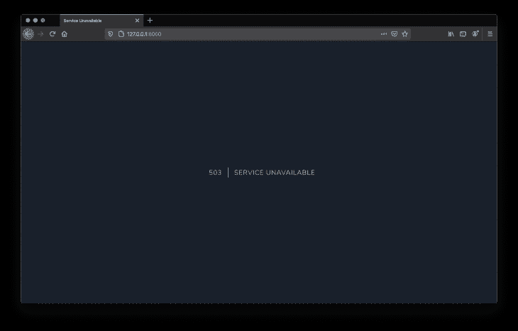

# Laravel 8 - LogRocket 博客中的新内容

> 原文：<https://blog.logrocket.com/whats-new-in-laravel-8/>

[Laravel 8 发布](https://laravel.com/docs/8.x/releases)2020 年 9 月 8 日。此版本延续了上一版本(版本 7)中的改进，以及新功能，包括对 Jetstream、作业批处理、动态刀片组件、模型工厂类、改进的 artisan serve 和许多其他功能的支持。

在这篇文章中，我们将看看这个新版本中引入的 13 个新特性，如下所示:

*   拉勒维尔急流
*   模型目录
*   模型工厂类
*   迁移挤压
*   作业批处理
*   改进的速率限制
*   改进的维护模式
*   关闭派单/连锁
*   动态刀片组件
*   时间测试助手
*   工匠服务改进
*   顺风分页视图
*   路由命名空间更新

## 拉勒维尔急流

Laravel Jetstream 是一个制作精美的应用程序，用于搭建 Laravel 应用程序。使用 Tailwind CSS 设计的 Jetstream 为新项目提供了一个完美的起点，它具有身份验证、配置文件管理、安全性和使用 [Laravel Sanctum](https://github.com/laravel/sanctum) 的 API 支持等功能。



此外，Jetstream 为前端脚手架提供了两种选择，要么是 [Livewire](https://jetstream.laravel.com/1.x/stacks/livewire.html) 要么是[惯性](https://jetstream.laravel.com/1.x/stacks/livewire.html)。

**Laravel Livewire —** 是一个库，它使得在 Laravel 上构建全栈应用成为可能，而不需要引入其他前端库/框架，如 React 和 Vue.js。由于 Livewire 使用已经很熟悉的 blend 模板引擎，Laravel 开发人员可以轻松构建动态界面，而无需离开 Laravel 的舒适环境。

**Inertia.js —** 是一个与 Laravel Jetstream 捆绑在一起的包，它让您可以使用 Vue.js 快速构建客户端模板。最酷的是，您可以享受 Vue 的全部功能，而没有前端路由的复杂性，因为您可以使用您熟悉的标准 Laravel 路由器。

**Jetstream 安装—** 如果您安装了 [Laravel 安装程序](https://laravel.com/docs/installation#installing-laravel)，您可以通过添加`--jet`标志轻松安装 Jetstream 和您的 Laravel 安装程序，如下所示

```
$ laravel new project-name --jet
```

通过运行迁移来完成设置:

```
$ php artisan migrate
```

或者，您可以使用 composer 将 Jetstream 安装到新的 Laravel 应用程序中。通过 composer 安装 Jetstream 需要您运行`jetstream:install` artisan 命令，该命令接受您首选的前端堆栈的名称，例如 livewire 或 Inertia.js。这可以通过运行以下命令来完成:

```
$ php artisan jetstream:install livewire

$ php artisan migrate

$ npm install && npm run dev
```

您可以访问 [Jetstream 官方文档](https://jetstream.laravel.com/)了解更多信息。

## 模型目录

一直有人建议 Laravel 应该将`Model`目录作为存储模型的默认目录。2016 年，Taylor Otwell 就此进行了一次民意调查，结果显示，更高比例的人想要一个默认的模型目录。四年后，人民的请求得到了批准。

> Laravel 应该有一个“模型”目录吗？

在 Laravel 的早期版本中，如果您在生成模型时没有指定路径，那么所有的模型文件都默认存储在`/app`目录中。然而，由于新的更新，Laravel 现在默认包含了`app/Models`目录。

所以，当你运行`$ php artisan make:model ModelName`命令时，`ModelName.php`将被保存在`app/Models`中。然而，如果该目录不存在，Laravel 将假设应用程序模型已经在`app/`目录中。

## 模型工厂类

雄辩的模型工厂让我们定义在测试我们的应用程序时用于生成虚假数据的模式。在以前的版本中，Laravel 提供了一个`$factory`全局对象，我们可以扩展它来定义我们的工厂。从 Laravel 8 开始，工厂现在是基于类的，并且改进了对工厂之间关系的支持(例如，一个用户有许多帖子)。

先前定义的工厂如下所示:

```
// database/factories/UserFactory.php

use Faker\Generator as Faker;
use Illuminate\Support\Str;

$factory->define(App\User::class, function (Faker $faker) {
    return [
        'name' => $faker->name,
        'email' => $faker->unique()->safeEmail,
        'email_verified_at' => now(),
        'password' => '$2y$10$92IXUNpkjO0rOQ5byMi.Ye4oKoEa3Ro9llC/.og/at2.uheWG/igi', // password
        'remember_token' => Str::random(10),
    ];
});
```

然后，我们可以像这样使用定义的工厂:

```
public function testDatabase()
{
    $user = factory(App\User::class)->make();

    // Use model in tests...
}
```

从新版本开始，工厂现在将被定义为一个类，像这样:

```
// database/factories/UserFactory.php

namespace Database\Factories;
use App\Models\User;
use Illuminate\Database\Eloquent\Factories\Factory;
use Illuminate\Support\Str;

class UserFactory extends Factory
    {
        /**
         * The name of the factory's corresponding model.
         *
         * @var string
         */
        protected $model = User::class;

        /**
         * Define the model's default state.
         *
         * @return array
         */
        public function definition()
        {
            return [
                'name' => $this->faker->name,
                'email' => $this->faker->unique()->safeEmail,
                'email_verified_at' => now(),
                'password' => '$2y$10$92IXUNpkjO0rOQ5byMi.Ye4oKoEa3Ro9llC/.og/at2.uheWG/igi', // password
                'remember_token' => Str::random(10),
            ];
        }
    }
```

随着新的`HasFactory`特性在生成的模型上可用，模型工厂可以这样使用:

```
use App\Models\User;
public function testDatabase()
{
    $user = User::factory()->make();
    // Use model in tests...
}
```

## 迁移挤压

借助新的迁移压缩功能，您可以将大型迁移文件压缩到一个 SQL 文件中，告别臃肿的迁移文件夹。当您运行迁移时，将首先执行生成的文件，然后 Laravel 执行不属于压缩模式文件的任何其他迁移文件。您可以使用下面的 artisan 命令挤压迁移文件:

```
$ php artisan schema:dump

// Dump the current database schema and prune all existing migrations...
$ php artisan schema:dump --prune
```

当您运行这个命令时，Laravel 会将一个模式文件写到您的`database/schema`目录中。

## 作业批处理

Laravel 的新版本还提供了一个漂亮的特性，允许您调度一组并行执行的作业。要监控分组/批处理作业的进度，您可以使用`then`、`catch`和`finally`方法来定义完成回调，如下所示:

```
use App\Jobs\ProcessPodcast;
use App\Podcast;
use Illuminate\Bus\Batch;
use Illuminate\Support\Facades\Batch;
use Throwable;

$batch = Bus::batch([
    new ProcessPodcast(Podcast::find(1)),
    new ProcessPodcast(Podcast::find(2)),
    new ProcessPodcast(Podcast::find(3)),
    new ProcessPodcast(Podcast::find(4)),
    new ProcessPodcast(Podcast::find(5)),
])->then(function (Batch $batch) {
    // All jobs completed successfully...
})->catch(function (Batch $batch, Throwable $e) {
    // First batch job failure detected...
})->finally(function (Batch $batch) {
    // The batch has finished executing...
})->dispatch();

return $batch->id;
```

您可以查看 Laravel 文档来了解更多关于新的 [job](https://laravel.com/docs/8.x/queues#job-batching) 批处理特性的信息。

## 改进的速率限制

有了新改进的速率限制，您现在可以使用`RateLimiter` facade 做更多的事情，例如动态限制请求。首先，让我们看看在以前的版本中是如何处理请求节流的。

在 Laravel 7 中，为了限制 API 请求，您需要编辑`app/Http`文件夹中的`Kernel.php`文件:

```
// app/Http/Kernel.php
...

protected $middlewareGroups = [
    'web' => [
        \App\Http\Middleware\EncryptCookies::class,
        \Illuminate\Cookie\Middleware\AddQueuedCookiesToResponse::class,
        \Illuminate\Session\Middleware\StartSession::class,
        \Illuminate\View\Middleware\ShareErrorsFromSession::class,
        \App\Http\Middleware\VerifyCsrfToken::class,
        \Illuminate\Routing\Middleware\SubstituteBindings::class,
    ],
    'api' => [
        'throttle:60,1', // Here the API request limit is set to 60 request per minute
        \Illuminate\Routing\Middleware\SubstituteBindings::class,
    ],
];

...
```

在 Laravel 8 中，上面的配置现在看起来像这样:

```
// app/Http/Kernel.php
...
protected $middlewareGroups = [
        'web' => [
            \App\Http\Middleware\EncryptCookies::class,
            \Illuminate\Cookie\Middleware\AddQueuedCookiesToResponse::class,
            \Illuminate\Session\Middleware\StartSession::class,
            // \Illuminate\Session\Middleware\AuthenticateSession::class,
            \Illuminate\View\Middleware\ShareErrorsFromSession::class,
            \App\Http\Middleware\VerifyCsrfToken::class,
            \Illuminate\Routing\Middleware\SubstituteBindings::class,
        ],
        'api' => [
            'throttle:api', // Request limit is now defined in RouteServiceProvider
            \Illuminate\Routing\Middleware\SubstituteBindings::class,
        ],
    ];
...
```

API 请求限制现在在`app/Providers/`目录的`RouteServiceProvider.php`中定义。让我们看看如何:

```
// app/Providers/RouteServiceProvider.php
use Illuminate\Cache\RateLimiting\Limit;
use Illuminate\Support\Facades\RateLimiter;
...
public function boot()
{
    $this->configureRateLimiting();
    ...
}
// Configure the rate limiters for the application.
protected function configureRateLimiting()
{
    RateLimiter::for('api', function (Request $request) {
    return Limit::perMinute(60); // 60 Request per minute
    });
}
```

在`boot`方法中，`configureRateLimiting()`被调用。顾名思义，它拥有速率限制的配置。

使用`RateLimiter` facade 的`for`方法定义速率限制器。`for`方法接受两个参数，一个速率限制器名称(即`api`)和一个闭包，后者返回限制配置，该配置应该只应用于分配了该速率限制器的路由。

如您所见，`for`方法接受 HTTP 请求实例，让我们完全控制动态限制请求。

假设我们希望为未经身份验证的用户设置每分钟十个请求的限制，为经过身份验证的用户设置无限制的请求限制。我们会这样做:

```
// app/Providers/RouteServiceProvider.php

protected function configureRateLimiting()
{
    ...
    RateLimiter::for('guest', function (Request $request) {
    return $request->user()
                ? Limit:none()
                : Limit::perMinute(10); // 10 Request per minute
    });
}
```

也可以使用中间件将配置的速率直接应用于路由，如下所示:

```
// routes/api.php
...
Route::get('posts', '[email protected]')->middleware('throttle:guest');
...
```

你可以在 [Laravel 路由文档](https://laravel.com/docs/8.x/routing#rate-limiting)中了解更多关于速率限制的信息。

## 改进的维护模式

在以前的 Laravel 版本中，可以通过设置允许访问应用程序的白名单 IP 地址列表来绕过维护模式，该功能已被删除，取而代之的是`secret/token`。让我们看看这是如何工作的:

将应用程序设置为维护模式时，您现在可以指定用于访问网站的密码，如下所示:

```
$ php artisan down --secret="my-secret"
```

当应用程序处于维护模式时，您可以通过如下方式指定您的密码来访问它:

> 此高级域名可供购买！该域名由 Saw.com 代理出售，该公司是网上领先的精品域名经纪公司。为 Your-Website.Com 的最佳保证价格在这里询问想要一个价格吗？致电+1 (781) 281-9475

然后，Laravel 用关键字`laravel_maintenance`在你的浏览器中设置一个 cookie，用来检查访问者是否可以访问。

## 维护预渲染

维护模式的另一个改进是能够预呈现您选择的维护视图。在 Laravel 的以前版本中，当应用程序停机维护时，更新运行`composer install`的依赖项很可能会让您的访问者得到一个实际的服务器错误。

这是因为 Laravel 的大部分必须启动，以便检查应用程序是否在维护中。通过允许您指定一个将在请求周期开始时返回的视图，维护预呈现变得非常方便。然后，在加载应用程序的任何依赖项之前，呈现这个视图。

您可以使用`artisan down`命令的`--render`选项预渲染一个默认视图，如下所示:

```
$ php artisan serve
// Starting Laravel development server: http://127.0.0.1:8000
...

$ php artisan down --render="errors::503"
// Application is now in maintenance mode.
```

运行上述命令将显示如下屏幕:


## 关闭派单/连锁

使用新的`catch`方法，您现在可以提供一个闭包，如果一个排队的闭包在用尽所有配置的队列后未能成功完成，就应该执行这个闭包，并重试它的尝试，如下所示:

```
use Throwable;

dispatch(function () use ($podcast) {
    $podcast->publish();
})->catch(function (Throwable $e) {
    // This job has failed...
});
```

## 动态刀片组件

有些情况下，您可能希望呈现一个依赖于运行时在视图中执行的操作的组件。使用动态刀片组件，您可以通过将组件名称作为变量传递来呈现组件，如下所示:

```
<x-dynamic-component :component="$componentName" class="mt-4" />
```

## 时间测试助手

受 Ruby on Rails 的启发，通过 [carbon PHP 库](https://carbon.nesbot.com/docs/)进行的时间修改在测试时的旅行方面更进了一步。

编写测试用例时，可能偶尔需要修改`now`或`Illuminate\Support\Carbon::now()`等帮助器返回的时间。Laravel 的基本特性测试类现在包括帮助器方法，允许您像这样操作当前时间:

```
public function testTimeCanBeManipulated()
{
    // Travel into the future...
    $this->travel(5)->milliseconds();
    $this->travel(5)->seconds();
    $this->travel(5)->minutes();
    $this->travel(5)->hours();
    $this->travel(5)->days();
    $this->travel(5)->weeks();
    $this->travel(5)->years();

    // Travel into the past...
    $this->travel(-5)->hours();

    // Travel to an explicit time...
    $this->travelTo(now()->subHours(6));

    // Return back to the present time...
    $this->travelBack();
}
```

## 工匠服务改进

在 Laravel 的早期版本中，当您使用`php artisan serve`命令启动应用程序时，修改`.env`需要您手动重启应用程序。由于新版本，修改`.env`将自动重新加载应用程序，所以你不必手动重启你的应用程序。

## 顺风分页视图

Laravel 的分页器已经更新为默认使用 [Tailwind CSS 框架](https://tailwindcss.com/)。同时仍然支持引导数据库 3 和 4。

要将分页视图配置为使用 Bootstrap 而不是默认的 Tailwind，可以在您的`AppServiceProvider`中调用分页器`useBootstrap`方法:

```
// app/Providers/AppServiceProvider.php

...
use Illuminate\Pagination\Paginator;
...
public function boot()
{
    Paginator::useBootstrap();
    ...
}
```

## 路由命名空间更新

在以前的 Laravel 版本中，`RouteServiceProvider`包含一个`$namespace`属性，该属性会自动添加到控制器路由定义和对动作助手`URL::action`方法的调用中。

```
// app/Providers/RouteServiceProvider.php

...

class RouteServiceProvider extends ServiceProvider
{
    protected $namespace = 'App\Http\Controllers';

    ...

}
```

这个默认值允许您定义一个路由控制器，如下所示:

```
// routes/web.php
...
Route::post('login', '[email protected]')
...
```

在 Laravel 8 中，`$namespace`属性默认为 null，这意味着 Laravel 不会自动添加名称空间前缀。应该使用标准的 PHP 可调用语法来定义控制器路由定义，如下所示:

```
// routes/web.php

use App\Http\Controllers\UserController;

Route::post('/login', [UserController::class, 'login']);
```

如果您喜欢以前的版本风格，您必须在`RouteServiceProvider`中指定您的控制器名称空间。

## 结论

在本文中，我们研究了 Laravel 8 的新特性。要将您当前的应用程序升级到版本 8，您可以查看[升级指南](https://laravel.com/docs/8.x/upgrade)以及[发行说明](https://laravel.com/docs/8.x/releases)。

## 使用 [LogRocket](https://lp.logrocket.com/blg/signup) 消除传统错误报告的干扰

[](https://lp.logrocket.com/blg/signup)

[LogRocket](https://lp.logrocket.com/blg/signup) 是一个数字体验分析解决方案，它可以保护您免受数百个假阳性错误警报的影响，只针对几个真正重要的项目。LogRocket 会告诉您应用程序中实际影响用户的最具影响力的 bug 和 UX 问题。

然后，使用具有深层技术遥测的会话重放来确切地查看用户看到了什么以及是什么导致了问题，就像你在他们身后看一样。

LogRocket 自动聚合客户端错误、JS 异常、前端性能指标和用户交互。然后 LogRocket 使用机器学习来告诉你哪些问题正在影响大多数用户，并提供你需要修复它的上下文。

关注重要的 bug—[今天就试试 LogRocket】。](https://lp.logrocket.com/blg/signup-issue-free)