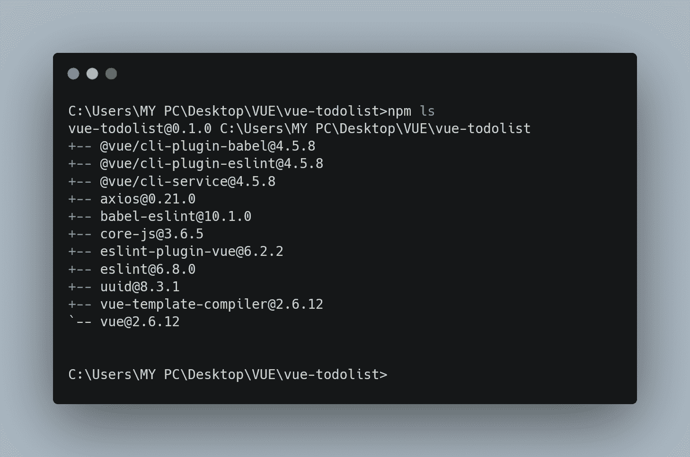
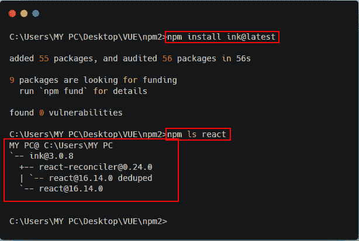
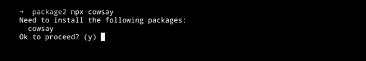

# npm v7 中的新内容- LogRocket 博客

> 原文：<https://blog.logrocket.com/whats-new-in-npm-v7/>

2020 年 10 月 13 日是 npm CLI 团队的[快乐发布星期二](https://blog.npmjs.org/post/631877012766785536/release-v700)，该团队经过几个月的努力终于正式发布了`[[email protected]](/cdn-cgi/l/email-protection)`。

npm 是 JavaScript 的包管理器，它是 Node.js 的默认包管理器，node . js 是基于 Chrome 的 V8 JavaScript 引擎构建的异步事件驱动的 JavaScript 运行时。

此新版本引入了 npm CLI 用户群高度要求的一些功能。

这些特性包括**工作区**，自动安装对等依赖关系的能力**，以及我将在本文中重点介绍的一些其他特性。**

要开始使用`npm v7.0.0`，请在您的终端中运行`npm i -g [[email protected]](/cdn-cgi/l/email-protection)`。

仍然是非常新的东西，所以它不会破坏使用 npm 的数百万工作流，尤其是在生产中。

因此，npm 不会被标记为`latest`；默认情况下，您的工作流不会获得 npm v7.0.0，除非您通过运行`npm install -g [[email protected]](/cdn-cgi/l/email-protection)`或安装 [Node.js 15](https://nodejs.medium.com/node-js-v15-0-0-is-here-deb00750f278) 来选择加入，这是最近在`[[email protected]](/cdn-cgi/l/email-protection)`发布后出现的。

## 有什么新鲜事？

npm 7 有 3 个令人激动的期待已久的重要特性。

### 工作区

这个特性是社区长期以来所要求的。工作区是 npm CLI 中的一组功能，支持在单个顶级根程序包中管理多个程序包。Yarn 和 Pnpm 都以相同的名称实现了类似的功能，这种情况一直存在。为了简单起见，他们选择重用它，以使更大的相关社区受益。

在`npm cli`中需要 2 个主要的实现或改变，您需要将它们放在适当的位置来访问支持嵌套包的更好管理的特性集。

*   使 npm cli 能够识别工作区。
*   在 npm 工作区设置中，用户希望能够安装所有嵌套的软件包，并从顶级工作区执行相关的生命周期脚本。它还应该知道工作区之间的依赖关系，并适当地对它们进行符号链接(文件之间的一个符号链接)。

你可以在这里阅读更多关于 npm 工作区[的信息。](https://github.com/npm/rfcs/blob/latest/implemented/0026-workspaces.md)

### 自动安装对等依赖项

在以前的版本(`npm v6`)中，默认情况下，对等依赖项不会随 npm 一起安装。相反，个人消费者必须自己安装和管理对等依赖关系。用户会得到一个警告提示，这通常被误解为一个问题。然后这将被报告给包的维护者，他们有时会忽略对等依赖，把它当作可选的依赖。这并没有对其版本范围或有效性进行任何检查。

此外，由于 npm 安装程序不知道对等依赖关系，它可以设计一个树，当存在对等依赖关系时，该树会导致问题。

这个新版本，(`npm v7.0.0`)，现在使得自动安装对等依赖关系变得容易，而以前开发者需要手动管理和安装这样的依赖关系。

根据 npm CLI 团队的说法，新的对等依赖关系算法确保在 node_modules 树中的对等依赖关系位置或其上方找到有效匹配的对等依赖关系。

这个被提议的算法解决了与先前版本中的对等依赖相关联的所有问题，使得对等依赖成为一个一级概念和对包树有效性的要求。

你可以在这里阅读更多关于安装对等依赖[的信息。](https://github.com/npm/rfcs/blob/latest/implemented/0025-install-peer-deps.md)

### 卷装锁 v2 和纱线锁支架

新的包锁格式将释放确定性可再生构建的能力，并包括 npm 完全构建包树所需的一切。

CLI 现在也可以使用`yarn.lock`作为包元数据和解决方案指南的来源。

这里可以阅读更多[。](https://blog.npmjs.org/post/621733939456933888/npm-v7-series-why-keep-package-lockjson)

## npm 7.0.0 中的突破性变化

除了这 3 个主要的新特性，在这个版本中还有一些开发者应该知道的[突破性的变化](https://en.wiktionary.org/wiki/breaking_change)，因为我们都知道一些突破性的变化对于改善整体开发者体验是必要的。

*   自动安装对等依赖项的能力有可能会中断某些工作流
*   npm 现在使用`package.exports`字段，使得不再可能使用`require()` npm 的内部模块。
*   `npx`已经完全重写，现在可以使用`npm exec`命令
*   `npm audit`的输出在人类可读和`--json`输出风格上都发生了变化。它不再使用表格来显示漏洞，漏洞计数不再乘以树中的每个节点
*   `npm ls`现在将默认只显示顶层包



如果你想得到与`npm6`相同的输出，你现在可以使用“全部”选项(即`npm ls --all`

你可以在这里阅读更多关于 npm 7.0.0 [的突破性变化。](https://blog.npmjs.org/post/626173315965468672/npm-v7-series-beta-release-and-semver-major)

## 立即获取更新

您可以通过运行以下命令立即开始使用此更新:

```
npm install -g [email protected]
```

通常，您可以使用`npm -v`或`npm --version`来确认版本。

> 注意:即使安装了最新版本，您也可以通过在“@”后面添加版本号(即`npm install -g [[email protected]](/cdn-cgi/l/email-protection)<version-number>`)来轻松切换回 npm 的以前版本。

下面的例子说明了`npm v7`如何帮助我们自动安装对等依赖。

让我们安装一个具有对等依赖关系的依赖关系，并看看它是如何安装的。

首先，让我们通过在 CLI 中运行`npm ls react`来确认我们没有依赖关系。


然后，我们现在可以继续安装我们选择的任何依赖项，以便看到这个新特性的实现。



我想指出的另一个例子是`npx`已经被重建。

以前，`npx`是它自己的包，即使它是在您安装 npm 时安装的。现在，它不再是一个单独的包了。这是 npm 的一部分(尽管人们并不关心它是否有效)。当您尝试安装某个东西时，它会提示您，以便检查您是否确实想要继续安装。



以前，它会直接安装你写的任何命令而不提示你。

有趣的是，你可能不喜欢它提示你回答问题的整个想法。因此，您可以使用`-y`标志。


## 结论

这是发布的第一个 npm CLI 版本，因为 npm 作为一家公司早在 2020 年 4 月就被 GitHub 收购了。这也是官方发布信息在 GitHub 博客上的原因。

在本文中，我解释了 npm v7 的新特性，以及如何开始使用最新版本的 npm。

我鼓励所有对这些新特性感兴趣的人开始使用 npm v7。

### 有用的资源

[这里的](https://speakerdeck.com/ruyadorno/npm-v7-highlights)是 Ruy Adorno 在 GitHub Presents meetup 上关于 npm v7 亮点演讲的链接。

## 200 只显示器出现故障，生产中网络请求缓慢

部署基于节点的 web 应用程序或网站是容易的部分。确保您的节点实例继续为您的应用程序提供资源是事情变得更加困难的地方。如果您对确保对后端或第三方服务的请求成功感兴趣，

[try LogRocket](https://lp.logrocket.com/blg/node-signup)

.

[](https://lp.logrocket.com/blg/node-signup)[https://logrocket.com/signup/](https://lp.logrocket.com/blg/node-signup)

LogRocket 就像是网络和移动应用程序的 DVR，记录下用户与你的应用程序交互时发生的一切。您可以汇总并报告有问题的网络请求，以快速了解根本原因，而不是猜测问题发生的原因。

LogRocket 检测您的应用程序以记录基线性能计时，如页面加载时间、到达第一个字节的时间、慢速网络请求，还记录 Redux、NgRx 和 Vuex 操作/状态。

[Start monitoring for free](https://lp.logrocket.com/blg/node-signup)

.