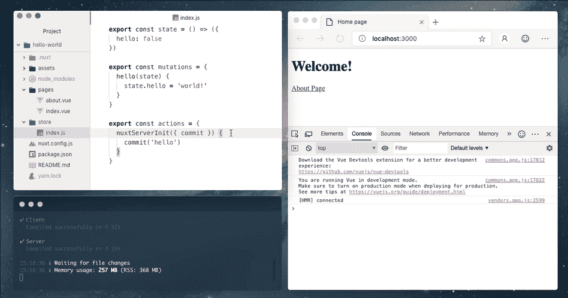
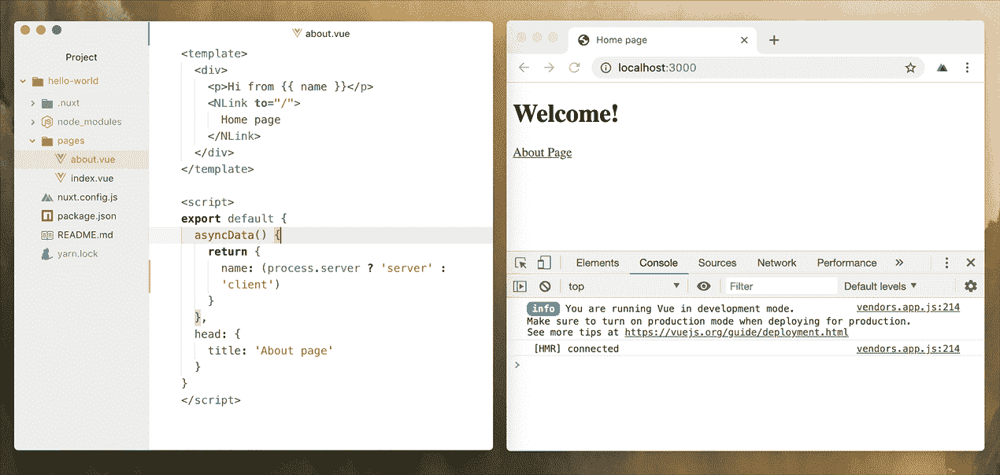
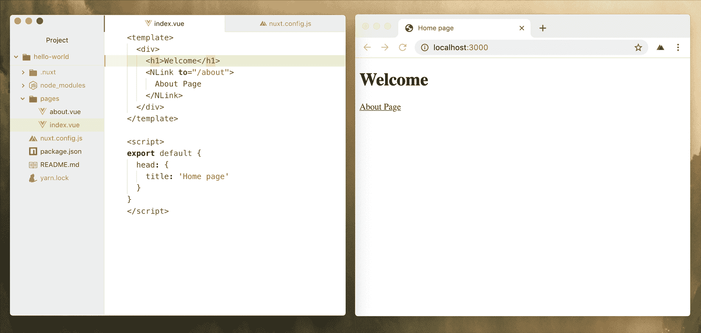
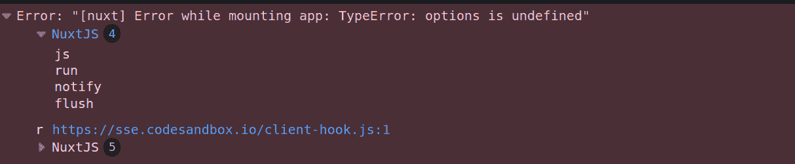
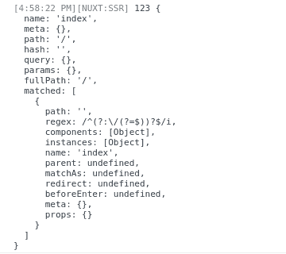

# Nuxt 2.8 中的新特性- LogRocket 博客

> 原文：<https://blog.logrocket.com/whats-new-in-nuxtjs-2-8/>

NuxtJS 是开发 VueJS 应用程序发展最快的框架之一。能够选择你可以用它创建什么类型的应用程序(通用、静态生成或单页应用程序)是它的独特功能之一。

自从最初发布以来，它已经吸引了 JavaScript 社区的大量关注。VueJS 社区非常支持这个工具，它可以帮助开发人员使用 VueJS 构建服务器端呈现的应用程序，而不需要深入的技术知识。如果你看看他们的 GitHub 简介，你会看到社区成员和用户提出的问题和各种各样的请求，以更好地改进框架。

核心团队已经发布了许多版本(您可以查看[这篇文章](https://blog.logrocket.com/whats-new-in-nuxt-2-7/)以了解 v2.7 中的新内容)。在这篇文章中，我将重点介绍 NuxtJS 新版本中值得注意的新增内容， **NuxtJS 2.8** 。

## 丰富

在使用 NuxtJS 时，已经做了一些改进来增强开发人员的体验。让我们探索其中的一些。

### SSR(通用渲染)日志分组

从 NuxtJS v2.7 开始，所有 SSR 日志都被报告给浏览器控制台。你不再需要切换屏幕。如下图所示，所有日志的结果都直接显示在浏览器中。



然而，当你试图一次记录两件或更多事情时，事情会变得很混乱，因为你的浏览器日志会不断地被弄乱。从 NuxtJS v2.8 开始，SSR 日志现在被分组，以避免污染浏览器控制台。



### 浏览器中的代码构建指示器

NuxtJS v2.8 附带的另一个令人兴奋的特性是一个指示器，可以在浏览器中显示新更改的构建状态。



这非常有用，尤其是当你的应用程序需要一些时间来构建的时候。现在，您可以在浏览器中快速查看状态，而不必切换到终端进行检查。

## 错误修复

新版本修复了一些错误。这些错误修复旨在改善开发人员的体验或解决社区表达的问题。

### **智能重装**

由于 NuxtJS 不直接使用的文件更改，监听没有支持的文件扩展名的目录可能会导致不必要的重新加载。如编辑使用的`*.swp`、`*~`或`*.bak`文件。从 v2.8 开始，NuxtJS 只监听支持的扩展名的文件更改。所以当一个新文件(没有被 NuxtJS 直接使用)被创建时，你不再需要担心。

### **自动检测页面目录创建**

页面是通用应用程序不可或缺的一部分。它们允许创建不同的文件，并在应用程序中自动路由。这是 NuxtJS 的默认行为。但是，当创建页面以查看它们的运行时，您必须重新启动服务器。在 v2.8 中，您不再需要这样做，因为 NuxtJS 现在可以检测您何时创建了一个`page/`目录，并且会自动重新加载。

### **简化的安装错误日志**

在创建应用程序时，大多数时候肯定会出现错误。发生错误时立即看到正确的错误消息将使调试过程更快更容易。从 Nuxtv2.8 开始，当安装应用程序时出现错误时，错误会以开发模式记录到控制台，这样更容易跟踪。

之前:



之后:


### 改进的延迟加载组件

NuxtJS 默认支持延迟加载。但是，有时用户编辑会改变这种行为。例如，如果用户用`splitChunks:{layouts: false, pages: false}`覆盖`webpack`的构建选项，页面将在运行应用程序时加载。即使这些组件已经加载到您的应用程序中，当 NuxtJS 完成解析过程时，它们仍然是延迟加载的。新更新中的更改解决了这个问题。现在，延迟加载的组件变得更小，并且得到了改进。

### **缩小的 SPA 回退 HTML 文件**

以前，SPA 回退的 HTML 在生成路由后不会缩小，从而导致在 SPA 模式下产生不同的文件。缩小通过将相关文件整理和分组在一起，有助于减少应用程序中使用的文件数量。
之前:

```
$ find examples/spa/dist/ -name '*.html' -exec md5sum {} \;
853e7d39c6c79431172d11c71115d487  examples/spa/dist/200.html
4014fb429eb22afeb868705a0dd476db  examples/spa/dist/about/index.html
4014fb429eb22afeb868705a0dd476db  examples/spa/dist/index.html
```

之后:

```
$ find examples/spa/dist/ -name '*.html' -exec md5sum {} \;
4014fb429eb22afeb868705a0dd476db  examples/spa/dist/200.html
4014fb429eb22afeb868705a0dd476db  examples/spa/dist/about/index.html
4014fb429eb22afeb868705a0dd476db  examples/spa/dist/index.html
```

### **改良控制台**

Consola 可以向您的控制台添加自定义样式。然而，在 NuxtJS 以前的版本中，自定义样式被覆盖了。这个问题在 2.8 版中已经得到修复，因为 consola 现在是可选的。

### **捆绑重新渲染**

控制你的 HTML 加载的脚本就是在你的 **nuxt.config.js** 文件**的 **bundleRenderer** 对象中编写`"inject: false"`。**然而**，**一些 JavaScript 文件甚至在改变选项后仍然被加载。此问题已在新版本中得到解决。所以你 100%的控制你的脚本。

### **安全 SSR 日志**

在使用 NuxtJS 进行开发时，您可能会在终端中遇到以下错误:

```
 WARN  Cannot stringify a function VueComponent                                                                          
 WARN  Cannot stringify arbitrary non-POJOs VueComponent 
```

在您的浏览器中:

```
Maximum call stack size exceeded error
```

当您尝试将消息记录到您的控制台时，就会出现这种情况，如下所示:

```
created() {
  console.log(this.$route)
}
```

虽然它不会阻止你的应用程序运行，但这不是你想要的行为，而且会让调试变得很痛苦。从 v2.8 开始，NuxtJS 现在可以安全地格式化 SSR 日志。



## 依赖性升级

移植提示 : 你不需要为了任何效果而修改你的项目中的任何一行代码。一旦升级到 NuxtJS v2.8，一切都会自动迁移。

## 结论

在本教程中，我们探索了 NuxtJS v2.8 中的一些新特性和改进。我们还研究了一些不推荐使用的特性和未来警告。要查看所有变更的具体列表并了解更多关于新版本的信息，请务必查看版本[页面](https://github.com/nuxt/nuxt.js/releases)。你最喜欢的新特性/API 是什么？分享在评论里**！**快乐编码！