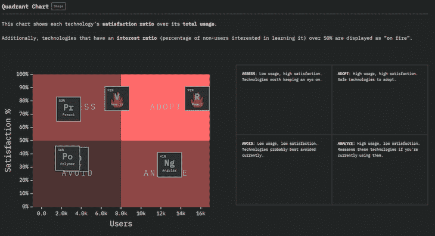
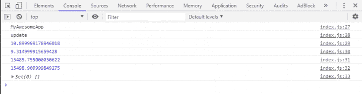
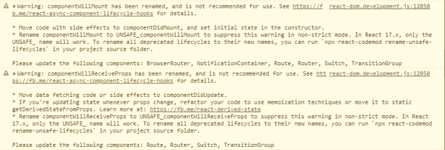

# React 16.9 的新特性:Profiler API、错误修复和更多内容

> 原文：<https://blog.logrocket.com/whats-new-in-react-16-9-profiler-api-bug-fixes-and-more/>

当“2018 年 JavaScript 现状”调查结果公布时， [React 以 91%的满意率和超过 16，000 名用户成为前端框架类别的赢家](https://2018.stateofjs.com/front-end-frameworks/conclusion/):



Sourced from the “State of JavaScript 2018” survey.

React 是当今最流行的构建用户界面的库，在本帖中，我们将关注 16.9 版本中添加的显著的新特性、弃用和错误修复。

## 探查器 API

[React Profiler](https://reactjs.org/blog/2018/09/10/introducing-the-react-profiler.html) 在 v16.5 中首次被添加到 [React DevTools](https://blog.logrocket.com/5-things-you-didnt-know-about-react-devtools-2c6e0ef22529/) 中。该功能测量渲染的每个组件，以找到渲染的“成本”，以便您可以更快地识别 React 应用程序中的性能瓶颈。

为了使用它，你可以打开 React 的 DevTools，运行一个记录，渲染一些 React 组件，然后停止记录。


React Profiler in the DevTools.

分析器很有用，但是有点麻烦。您必须启动和停止记录，然后检查记录中看起来加载时间很长的部分。这就是为什么我们现在有了`<React.Profiler>`组件，它可以用来以*编程方式*收集性能指标。

组件将需要两个属性:一个`id`属性和一个`onRender`属性。它将在树中的组件重新呈现时触发。以下是一些示例代码:

```
import React, {Profiler} from 'react';
import ReactDOM from 'react-dom';

ReactDOM.render(
  <*Profiler* id="MyAwesomeApp" onRender={onRender}>
    <*Router*>
      <*App /*>
    <*/Router*>
  <*/Profiler*>,
  document.getElementById("root")
);

*function* onRender(
  *id*,
  *phase*,
  *actualDuration*,
  *baseDuration*,
  *startTime*,
  *commitTime*,
  *interactions*
) 
{
  *console*.log(id)
  *console*.log(phase)
  *console*.log(actualDuration)
  *console*.log(baseDuration)
  *console*.log(startTime)
  *console*.log(commitTime)
  *console*.log(interactions)
}
```

这是控制台中的结果:



虽然 DevTools 的 Profiler 记录了所有的 React 应用程序，但是使用`<React.Profiler>`组件，您可以隔离并只记录树中需要更多关注的部分。此外，它的*在生产构建中自动禁用*，因此您不需要在测量后移除它。

关于分析器组件的更多细节及其参数的解释，请查看官方文档[这里](https://reactjs.org/docs/profiler.html)。

## 异步`act()`功能

React 引入了一个名为`act()`的测试工具来帮助开发人员创建 UI 测试。在编写 UI 测试时，有一些任务，如渲染、用户交互事件(如单击)或数据获取，可以被视为与 React 应用程序交互的“单元”。

由于 JavaScript 的异步特性，React 实际上可能会跳过一些任务并立即断言测试，而不会等到任务完成。

React 提供了一个名为`act()`的助手，它将确保在您做出任何断言之前，与这些“单元”相关的所有更新都已被处理并应用到 DOM。

但是`act()`的一个问题是它只能支持同步函数，所以如果你的`act()`中有异步函数，你就不走运了。

幸运的是，它现在已经得到了改进，您可以将 async/await 与`act()`一起使用:

```
await act(async () => {
  // ...
});

```

这将帮助您确保异步更新在断言之前完成。这里有一个关于如何使用`act()` 的很好的教程。

## 不安全的生命周期方法被重命名

React 团队几乎在一年前就已经宣布了这一变化。在这个版本中，不安全的生命周期方法最终被重命名为:

*   `componentWillMount` → `UNSAFE_componentWillMount`
*   `componentWillReceiveProps` → `UNSAFE_componentWillReceiveProps`
*   `componentWillUpdate` → `UNSAFE_componentWillUpdate`

别担心，不安全并不意味着你的应用更容易被黑客攻击——它只是提醒你，这些生命周期内的代码在 React 的未来版本中更有可能出现 bug。点击查看详情[。](https://reactjs.org/blog/2018/03/27/update-on-async-rendering.html)

不带`UNSAFE_`前缀的方法名称在这个版本中仍然有效，但是在 React 版本 17 发布时，它们将被完全删除。如果您打开开发人员控制台，您将会收到以下警告:



这些带前缀的方法名称旨在帮助具有问题模式的组件在代码审查和调试会话中脱颖而出。通常不推荐使用这些方法，所以你可以阻止你的团队更多地使用[严格模式](https://reactjs.org/docs/strict-mode.html)。

如果你的应用实际上使用了很多这样的方法，你可以使用这个 [codemod](https://github.com/reactjs/react-codemod) 来重构它，这比你自己手动编辑它们要快得多:

```
cd your_project
npx react-codemod rename-unsafe-lifecycles
```

它将启动一个交互式提示来选择您想要重命名的文件。

## `javascript:`计划删除的网址

在`href`属性中使用`javascript:`很久以前就很流行了，但是现在，这已经是一种过时的做法，它会在你的应用程序中打开安全漏洞。很容易意外地包含未排序的输出。例如:

```
const userProfile = {
  website: "javascript: alert('you got hacked')",
};
<a href={userProfile.website}>Profile</a>
```

上面的代码将在 React 17 中导致一个错误，如果你想在一个链接被点击时运行一个脚本，你需要使用 React `onClick`事件处理程序和一个样式为链接的按钮元素。它既安全又易于实施:

```
awesomeFunction = () => console.log("Here is javascript: URL alternative!");
// the button below used Bootstrap styling...
<button className="btn btn-link" onClick={this.awesomeFunction}>Profile</button>
```

## 贬低`FactoryComponent`模式

这是一种相当晦涩的代码模式，由 React 团队在用 Babel 编译类流行起来之前引入。它是一个用`render`方法返回对象的组件:

```
function FactoryComponent() {
  return { render() { return <div />; } }
}
```

语法看起来很糟糕，因为 Babel 已经成为 React 应用程序的标准编译器，所以不再需要这种组件模式。支持它会导致 React 比需要的稍微大一点和慢一点。它将在未来的主要版本中被完全删除。

如果你的应用程序碰巧使用了这种模式，你可以使用`FactoryComponent.prototype = React.Component.prototype`来保持它的工作，但是仅仅将代码转换成一个函数或者一个类要好得多。

## useEffect 中的 setState 循环记录了一个错误

由`useEffect`中的`setState`引起的无限循环现在会记录一个错误，类似于你在类组件中调用`componentDidUpdate`中的`setState`时看到的错误。以下是一些示例代码:

```
function App() {
  const [counter, setCounter] = React.useState(0);
  React.useEffect(() => {
    setCounter(counter + 1);
  })
  return <h1>Watch out infinite loop in the console!</h1>
}
```

由于没有第二个参数，这种效果依赖于更新，它将永远运行，直到您关闭浏览器窗口。

## 修正调用`findDOMNode()`时的暂停崩溃

`<React.Suspense>`组件用于延迟加载初始渲染中不需要的组件。但是从 16.7 版本开始，很多开发者在使用时开始收到错误`Invariant Violation: Unable to find node on an unmounted component`。

经过检查，开发人员弄清了这个错误是由调用`ReactDOM.findDOMNode()`内部悬念引起的。崩溃现在在这个版本中被修复了，但是如果你仍然感兴趣，这里有一个[代码沙箱](https://codesandbox.io/s/antd-reproduction-template-1r6pr)来测试这个错误。只是随机点击菜单，直到错误出现。

你可能不会直接使用`findDomNode()`，但是这个函数实际上在很多库中使用，比如[语义 UI](https://github.com/Semantic-Org/Semantic-UI-React/issues/3593#issuecomment-488595217) 和[蚂蚁设计](https://github.com/facebook/react/issues/14188#issuecomment-500478400)。所以如果你不更新你的 React 库，你可能会无意中触发这个 bug！

## React v16.9 已经可以从 npm 获得

要更新您的应用程序，只需运行:

```
npm install --save [email protected]^16.9.0 [email protected]^16.9.0
```

或者，如果你用的是纱线:

```
yarn add [email protected]^16.9.0 [email protected]^16.9.0
```

黑客快乐！

## [LogRocket](https://lp.logrocket.com/blg/react-signup-general) :全面了解您的生产 React 应用

调试 React 应用程序可能很困难，尤其是当用户遇到难以重现的问题时。如果您对监视和跟踪 Redux 状态、自动显示 JavaScript 错误以及跟踪缓慢的网络请求和组件加载时间感兴趣，

[try LogRocket](https://lp.logrocket.com/blg/react-signup-general)

.

[ ](https://lp.logrocket.com/blg/react-signup-general) [](https://lp.logrocket.com/blg/react-signup-general) 

LogRocket 结合了会话回放、产品分析和错误跟踪，使软件团队能够创建理想的 web 和移动产品体验。这对你来说意味着什么？

LogRocket 不是猜测错误发生的原因，也不是要求用户提供截图和日志转储，而是让您回放问题，就像它们发生在您自己的浏览器中一样，以快速了解哪里出错了。

不再有嘈杂的警报。智能错误跟踪允许您对问题进行分类，然后从中学习。获得有影响的用户问题的通知，而不是误报。警报越少，有用的信号越多。

LogRocket Redux 中间件包为您的用户会话增加了一层额外的可见性。LogRocket 记录 Redux 存储中的所有操作和状态。

现代化您调试 React 应用的方式— [开始免费监控](https://lp.logrocket.com/blg/react-signup-general)。