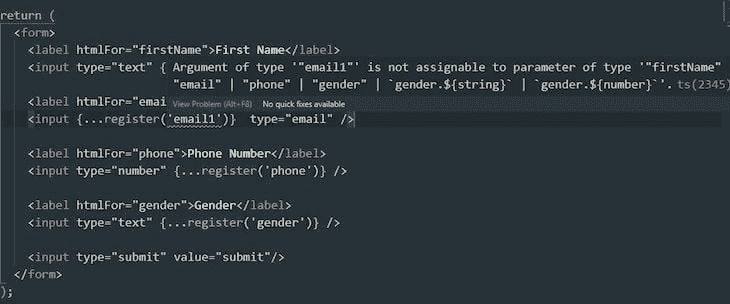
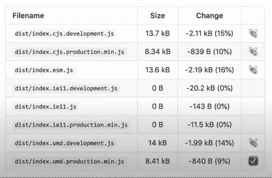

# React Hook Form V7 的新特性

> 原文：<https://blog.logrocket.com/whats-new-in-react-hook-form-v7/>

在 React 中使用表单一直是一件痛苦的事情，React 生态系统中的开发人员一直在努力简化这项繁琐的任务。React Hook Form ，许多由此产生的库之一，已经被证明在处理和验证表单方面是有效的。它还为开发人员提供了其他工具，这些工具可以改善开发人员的体验，并使构建表单更加令人兴奋。

从一开始，React Hook Form 就致力于不仅服务于最终用户，而且让开发者的工作变得更容易。

4 月初，React 团队发布了新版本的库， [React Hook Form V7。这个版本的亮点是 React Hook Form 现在在 TypeScript 的帮助下支持严格类型的表单，这预示着这个库的未来。](https://react-hook-form.com/migrate-v6-to-v7/)

让我们仔细看看这些新添加的功能，包括:

## 反应钩子形式 V7 示例

为了演示如何严格地输入表单，我们需要创建一个示例项目，其中包含一个带有一些输入字段的表单。如果你想继续下去，你需要:

*   一个文本编辑器，比如 VS 代码
*   您机器上安装的最新版本的 [Node.js](https://nodejs.org/en/)

有了这些，我们现在可以开始设置我们的项目。

因为我们将使用类型检查，所以我们需要通过在终端中运行以下命令在项目中包含 TypeScript:

```
npx create-react-app hook-form --template typescript

```

这将创建一个名为`hook-form`的集成了 TypeScript 的 React 应用程序。它还提供了一个`tsconfig.json`文件，所以您不需要创建一个。

接下来，将`react-hook-form`添加到项目中:

```
npm i react-hook-form

```

设置好示例应用程序后，我们就可以探索 React Hook Form V7 的新特性了。

## React Hook Form V7 中的严格类型表单

React Hook Form V7 在 React 表单中引入了静态类型的好处。这个特性使您能够编写错误较少的高效表单。

要查看严格类型的表单，请打开您的`App.tsx`文件并用下面的代码替换它的内容:

```
import React from 'react';
import { useForm } from 'react-hook-form'

function App() {
  return (
    <form>
      <label htmlFor="firstName">First Name</label>
      <input type="text" />

      <label htmlFor="email">Email</label>
      <input type="email" />

      <label htmlFor="phone">Phone Number</label>
      <input type="number" />

      <label htmlFor="gender"></label>
      <input type="text" />

      <input type="submit" value="submit"/>
    </form>
  );
}
export default App;

```

在这里，我们创建了一个带有几个输入字段的简单表单，从`react-hook-form`引入了`useForm`钩子，并从`useForm`提取了`register`函数。

为了实现严格类型化的形式，我们需要在函数体上声明一个类型别名(我们称之为`FormValues`)，并将其作为泛型类型传递给`useForm`:

```
import React from 'react';
import { useForm } from 'react-hook-form'

function App() {
  const { register } = useForm<FormValues>()

  type FormValues = {
    firstName: string,
    email: string,
    phone: number,
    gender: any
  }

  return (
    // ...
  );
}
export default App;

```

此别名包含每个输入字段上允许的类型的类型规范。

通过将它传递给`useForm` , `FormValues`现在充当一种模式，以确保任何输入字段的名称与别名中的一个键相关，并且输入到输入字段中的值符合类型规范。

有了这些，我们现在可以使用 React Hook Form 的`register`函数来注册我们创建的输入字段。但是在注册这些字段之前，我们应该指出版本 7 中 register 函数的语法变化。

在这个新版本之前，用于在 React Form Hook 中注册输入字段的语法如下所示:

```
<input type="text" name="firstName" ref={register} />
>
```

我们希望`react-hook-form`返回的输入字段的名称必须存储在 HTML 5 `name`属性中。虽然这样做很好，但也有局限性。

为了实现严格的类型检查，React Hook V7 利用了 TypeScript 4.1 [模板文字](https://www.typescriptlang.org/docs/handbook/2/template-literal-types.html)。register 函数已被修改，以接受输入字段的名称(作为其第一个参数)，并使用该名称对传入`useForm`的任何别名进行类型检查:

```
<input type="text" {...register('firstName') />

```

以下属性将扩展到输入中:

```
const { onChange, blur, ref, name } = register('firstName')

```

现在让我们在每个字段上使用 register 函数，但是我们将故意在电子邮件输入上打一个错字，以查看 TypeScript 如何反应:



这个特性的好处是不可否认的。使用严格类型的表单，您可以确保用户将正确的数据发送到服务器，并且甚至在运行之前就从代码中删除了错误。如果你问我，那是一个大胜利。

## 缩小包装尺寸

反应钩形式 V7 带来了减少 13%的包装尺寸。这是因为减少了解析器包的大小。

下表显示了每个文件大小的变化:



## 改进的性能

React 团队竭尽全力增强 React 钩子表单库的性能，包括引入一个新的自定义钩子和对 API 中一些现有钩子的改进。

让我们更详细地检查一下这些改进。

### useFormState(新)

这个新钩子的引入允许您订阅单独的表单状态，使得每个受控输入在 rerender 方面完全隔离。

这意味着，当您需要订阅表单的一部分时，只要该部分的状态发生变化，就会被重新呈现，而不是从根级别重新呈现整个应用程序。这种隔离渲染也适用于`useController`和`Controller`。

例如，假设我们希望在用户触摸任何输入字段时得到通知。这是组件级状态的一个例子。我们可以通过`useFormState`实现这一点:

```
import * as React from "react";
import { useForm, useFormState } from "react-hook-form";

export default function App() {
  const { register, control } = useForm();

  const { touchedFields } = useFormState({control});

  console.log(touchedFields)

  return (
    <form onSubmit={handleSubmit(onSubmit)}>
      <input {...register("firstName")} />
      <input {...register("lastName")} />

      <input type="submit" />
    </form>
  );
}

// Object logged to the console when user touches the firstName input field
{ firstName: true }

// Object logged when user touches both fields
{ firstName: true, lastName: true }

```

每次触摸输入字段并将对象记录到控制台时，其他输入中的现有表单状态不会改变，因为整个应用程序不会重新呈现。

* * *

### 更多来自 LogRocket 的精彩文章:

* * *

为了让`useFormState`工作，来自`useForm`的`control`对象必须被传递给它，因为这个对象包含将组件注册到`react-hook-form`的方法。

使用这个钩子可以提高大型复杂表单应用程序的性能。查看可通过`useFormState`认购的房产的[完整列表。](https://react-hook-form.com/api/useformstate)

### useFieldArray

这个定制钩子在语法上没有变化，但是在幕后有所改进。用于维护这个钩子的数据结构得到了增强，使它能够执行得更快。它还允许改进焦点管理，这意味着您可以将任何输入作为焦点，只要它们公开它们的 ref 属性。

### 使用手表

其手表机制得到了改进，使得订阅表单更改变得更加容易。

## 移除了对 IE 11 的支持

像技术世界中任何其他有远见的社区一样，React 团队用 React Hook Form V7 结束了对 Internet Explorer 11 的支持。微软本身将于 2021 年 8 月 17 日停止支持 IE 11，因此可以肯定地说，我们将不再担心网络开发领域的 IE 11。

尽管如此变化，React Hook Form V6 仍将保持支持 IE 11。我们将很快讨论关于迁移到最新版本的细节。

## 解析器的新改进

如果你以前使用过 React Hook Form，你应该知道 resolver 函数，并且可能知道如何在验证包中使用它，比如 [Yup](https://blog.logrocket.com/react-native-form-validations-with-formik-and-yup/) 。React Hook Form V7 通过向代码库引入第三个参数对此 API 进行了新的改进:

```
- resolver: (values: any, context?: object) => Promise<ResolverResult> | ResolverResult
+ resolver: (
+   values: any,
+   context: object | undefined,
+   options: {
+     criteriaMode?: 'firstError' | 'all',
+     names?: string[],
+     fields: { [name]: Field } // Support nested fields
+   }
+ ) => Promise<ResolverResult> | ResolverResult

```

新的`options`参数使其他库能够深入了解验证过程，并使开发人员能够编写更好的定制逻辑来:

这些例子归功于 React Hook Form 项目的核心贡献者 Joris T1。

React Hook Form V7 还支持其他验证库，如 [Zod](https://blog.logrocket.com/comparing-schema-validation-libraries-zod-vs-yup/) 、 [Vest](https://ealush.com/vest/) 、 [Joi](https://joi.dev/) 和 [Superstruct](https://docs.superstructjs.org/) 。

异步和同步验证选项也被添加到了`resolver` API 中，默认选项是`async`。我们可以通过使用`mode`参数在两者之间切换:

```
useForm({ resolver: yupResolver(schema, schemaOptions, { mode: "async" | "sync"}) })

```

除了 Superstruct，所有外部验证库中都有`async`选项。

## 从 React Hook 版本 6 迁移到版本 7

[React Hook Form 的创造者 Bill Luo](https://twitter.com/bluebill1049) 整理了一份[详细指南](https://react-hook-form.com/migrate-v6-to-v7/)帮助你将现有的 V6 应用迁移到 React Hook Form V7。该指南包括您需要对代码进行的更改，以及使您现有的应用程序与 React Hook Form V7 一起工作所需的其他重要信息。

## 使用 LogRocket 消除传统反应错误报告的噪音

[LogRocket](https://lp.logrocket.com/blg/react-signup-issue-free)

是一款 React analytics 解决方案，可保护您免受数百个误报错误警报的影响，只针对少数真正重要的项目。LogRocket 告诉您 React 应用程序中实际影响用户的最具影响力的 bug 和 UX 问题。

[ ](https://lp.logrocket.com/blg/react-signup-general) [  ](https://lp.logrocket.com/blg/react-signup-general) [LogRocket](https://lp.logrocket.com/blg/react-signup-issue-free)

自动聚合客户端错误、反应错误边界、还原状态、缓慢的组件加载时间、JS 异常、前端性能指标和用户交互。然后，LogRocket 使用机器学习来通知您影响大多数用户的最具影响力的问题，并提供您修复它所需的上下文。

关注重要的 React bug—[今天就试试 LogRocket】。](https://lp.logrocket.com/blg/react-signup-issue-free)