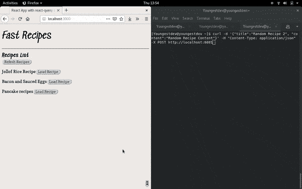

# react-query 1.0 版的新特性- LogRocket 博客

> 原文：<https://blog.logrocket.com/whats-new-in-react-query-v1-0/>

react-query v1.0 于 2 月 26 日发布，它带来了 react-query API 和全新专用开发工具的变化。

在这篇文章中，我将讨论以下变化:

*   查询键和查询函数
*   `useQuery`挂钩
*   新增查询操作处理程序，`queryCache`
*   [反应-查询-开发工具](https://github.com/tannerlinsley/react-query-devtools)

更新的完整列表(大部分是小改动)可以在 changelog 上找到。

接下来，我将在接下来的章节中讨论这些变化，但是您必须先查看这篇文章[中我谈到的 react-query 并构建了一个示例。](https://blog.logrocket.com/using-suspense-with-react-query/)

## 更新反应查询

在您现有的应用程序中，根据您选择的包管理器，使用以下命令之一更新您的 react-query 包:

```
npm install react-query

// or

yarn add react-query
```

## 查询键和查询函数

**查询关键字**
react-Query 中的新查询关键字现在可以在数组构造函数中容纳更多可序列化的成员，而不是以前只有一个`[String, Object]`成员的限制，为您的查询提供更多洞察力和细节。

示例:

```
//old
const { data } = useQuery(["recipes", { id: recipe.id }])

// new
const { data } = useQuery(["recipes", {id: recipe.id}, status])
```

### 查询功能

react-query 旧版本中的查询函数只接受一个参数，即指向要检索的数据的查询对象。但是，react-query 的新版本要求将所有查询关键字项传递给从数据源检索数据的查询函数。

在旧版本中，查询函数被编写为:

```
export async function fetchRecipe({ id }) {
  return (await fetch(
    `http://localhost:8081/${id}`
  )).json();
}
```

但是，在新版本中，上述查询被重写为:

```
export async function fetchRecipe(key, { id }) {
  return (await fetch(
    `http://localhost:8081/${id}`
  )).json();
}
```

在上面的例子中，`key`参数是来自`useQuery`钩子的查询名，这个查询函数将在这里使用。这一新增功能非常重要，因为它使查询函数能够在调用它的地方对特定的查询进行操作。

> 这是一个突破性的变化；在新版本中，编写查询函数的旧方法将不起作用。

## `useQuery`挂钩

在`useQuery`钩子中，由于引入了两个新的钩子:`usePaginatedQuery`和`useInfiniteQuery`，可选参数`paginated`已经被删除。这也包括以下选项和方法:

*   `isFetchingMore`
*   `canFetchMore`
*   `fetchMore`

`useQuery`挂钩仍然保持其操作模式。

## `queryCache`

```
import { queryCache } from "react-query";
```

`queryCache`实例负责管理一个查询在 react-query 中经历的所有状态活动。它管理每个查询的所有状态、缓存、生命周期和魔力。它有很多方法，比如以前是独立钩子的`prefetchQuery`。`queryCache`实例下的方法有:

### 1.`queryCache.prefetchQuery([, query], function, …)`

在 1.0.0 版本发布之前，`queryCache.prefetchQuery()`方法最初是 react-query 中的一个独立钩子，它在应用程序需要数据之前预取数据并将其存储在缓存中。

旧的`prefetchQuery`挂钩现已停产，不再供应。因此，如果您的应用程序使用这个钩子，您必须用`queryCache.prefetchQuery(arg)`替换`prefetchQuery()`，以避免在更新 react-query 包时破坏您的应用程序。

在旧版本中:

```
import { useQuery, prefetchQuery } from "react-query";

<Button
  onClick={() => {
    // Prefetch the Recipe query
    prefetchQuery(["Recipe", { id: Recipe.id }], fetchRecipe);
    setActiveRecipe(Recipe.id);
  }}
>
```

在新版本中:

```
import { useQuery, queryCache } from "react-query";

<Button
  onClick={() => {
    // Prefetch the Recipe query
    queryCache.prefetchQuery(["Recipe", { id: Recipe.id }], fetchRecipe);
    setActiveRecipe(Recipe.id);
  }}
>
```

### 2.`queryCache.getQueryData(querykey)`

这是一个同步方法，它返回与从缓存传递给它的查询键相对应的数据。如果查询不存在或找不到，则返回`undefined`。

示例:

```
import { queryCache } from "react-query";

const data = queryCache.getQueryData("Recipes") // Returns the list of recipes present else undefined. 
```

### 3.`queryCache.setQueryData(querykey, updater)`

该方法使用作为`updater`值传递的新数据来更新其标识符已经被传递到该方法中的查询。`updater`值可以是要更新的值，也可以是更新查询的函数。

示例:

```
import { queryCache } from "react-query";

queryCache.setQueryData("Recipes", ["Toast Sandwich", "Brocolli"]);

queryCache.setQueryData(queryKey,  oldData => newData);
```

`setQueryData`是一种同步方法，它立即更新传递的查询，如果传递的查询不存在，则创建一个新的查询。

### 4.`queryCache.refetchQueries(querykey)`

该方法根据传递给它的查询来重新提取单个或多个查询。当您想要刷新应用程序以获取新数据，但不想重新加载整个页面以避免重新呈现所有组件时，此方法特别有用。

下面是一个在`onClick`函数中使用`refetchQueries`来重新加载页面上的食谱列表的例子:

```
import { queryCache } from "react-query";

<Button onClick={() => {
    queryCache.refetchQueries("Recipes");
  }}>
  Refesh Recipes
</Button>
```

在上面的代码中，一旦点击按钮，就会重新提取`Recipes`查询，如果查询已经更新，页面就会更新为新的食谱。

### 5.`queryCache.removeQueries(queryKeyorFn, { exact })`

该方法根据传递给缓存的查询键从缓存中移除查询。也可以通过传递函数而不是查询键来删除查询。

示例:

```
import { queryCache } from "react-query";

queryCache.removeQueries("Recipes") // Removes all cached data with query key `Recipes`.
```

### 6.`queryCache.getQuery(queryKey)`

该方法返回查询的完整信息:实例、状态、查询标识符和来自缓存的查询数据。这是 react-query-devtools 中使用的查询方法，我们将在本文后面讨论。

在大多数情况下，这是不必要的，但在调试时却很方便。你会这样使用它:

```
import { queryCache } from "react-query";

queryCache.getQuery("Recipes"); // Returns complete information about the "Recipes" query
```

### 7.`queryCache.isfetching`

该方法返回应用程序中运行的查询的整数。它还用于确认是否有正在运行的查询。

```
import { queryCache } from "react-query";

if (queryCache.isFetching) {
  console.log('At least one query is fetching!')
}
```

> 注意这不是一个布尔方法。

### 8.`queryCache.subscribe(callbackFn)`

`subscribe`方法用于将查询缓存作为一个整体来订阅，以通知您缓存的安全/已知更新，比如查询状态的改变或者查询被更新、添加或删除。这种方法在调试时也很方便。

它是这样使用的:

```
import { queryCache } from "react-query";

const callback = cache => {}

const unsubscribe = queryCache.subscribe(callback)
```

### 9.`queryCache.clear()`

该方法清除当前存储在缓存中的每个查询。卸载组件时可以使用此方法。

```
import { queryCache } from "react-query";

queryCache.clear();
```

这标志着新`queryCache`功能的结束。让我们转到新的 react-query-devtools。

## 反应-查询-开发工具

像其他 devtools 一样，react-query-devtools 使您能够跟踪应用程序中的查询操作。它可以嵌入到你的应用程序中，也可以漂浮在空中，让你可以选择打开或关闭它。

可以通过 Yarn 或 npm 安装 react-query-devtools:

```
npm install react-query-devtools
// or

yarn add react-query-devtools
```

### 操作

react-query-devtools 允许您监控查询的状态，查看从查询中检索的数据，从缓存中删除查询以及重新提取查询。在 devtools 控制台中，有四个正在运行的查询的状态指示器:

1.  Fresh:这表明查询是一个新查询，并且几乎立即转换到下一个状态
2.  获取:这表明查询是从其获取器函数中获取的
3.  陈旧:这表示查询已被提取并处于备用状态。处于这种状态的查询会在有窗口聚焦时重新运行(除了从`ReactQueryConfigProvider`关闭时)
4.  Inactive:表示查询操作已经完成

下面是 react-query-devtools 的一个短片，演示了查询操作过程:



## 结论

react-query 的新更新非常出色。devtools 的加入使得用 react-query 构建应用程序和调试变得更加容易。

[点击此处](https://github.com/Youngestdev/react-query-app)参考上述新功能解释中使用的代码片段。继续创造惊人的东西，一定要经常查看博客上的新帖子，❤。

## [LogRocket](https://lp.logrocket.com/blg/react-signup-general) :全面了解您的生产 React 应用

调试 React 应用程序可能很困难，尤其是当用户遇到难以重现的问题时。如果您对监视和跟踪 Redux 状态、自动显示 JavaScript 错误以及跟踪缓慢的网络请求和组件加载时间感兴趣，

[try LogRocket](https://lp.logrocket.com/blg/react-signup-general)

.

[ ](https://lp.logrocket.com/blg/react-signup-general) [](https://lp.logrocket.com/blg/react-signup-general) 

LogRocket 结合了会话回放、产品分析和错误跟踪，使软件团队能够创建理想的 web 和移动产品体验。这对你来说意味着什么？

LogRocket 不是猜测错误发生的原因，也不是要求用户提供截图和日志转储，而是让您回放问题，就像它们发生在您自己的浏览器中一样，以快速了解哪里出错了。

不再有嘈杂的警报。智能错误跟踪允许您对问题进行分类，然后从中学习。获得有影响的用户问题的通知，而不是误报。警报越少，有用的信号越多。

LogRocket Redux 中间件包为您的用户会话增加了一层额外的可见性。LogRocket 记录 Redux 存储中的所有操作和状态。

现代化您调试 React 应用的方式— [开始免费监控](https://lp.logrocket.com/blg/react-signup-general)。