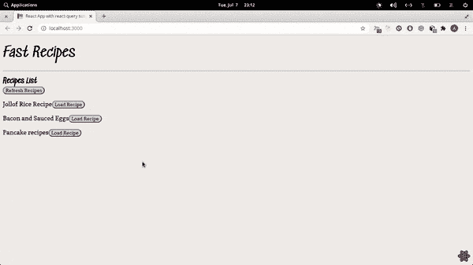

# react-query v2 中的新内容

> 原文：<https://blog.logrocket.com/whats-new-in-react-query-v2/>

react-query v2 是最近发布的，它再次带来了 react-query API 的变化以及整体性能的提高。在我写这篇文章的时候，它的版本是 2.5.4，在[变更日志](https://github.com/tannerlinsley/react-query/releases/tag/v2.0.0)上可以找到更新的完整列表。

在这篇文章中，我们将简要讨论新的变化，并重写一个在[以前的文章](https://blog.logrocket.com/whats-new-in-react-query-v1-0/)中用 react-query v1 构建的应用程序，以使用新版本。

接下来，我将在接下来的章节中讨论这些变化，但是您必须先阅读本文中我谈到的 react-query 并构建一个示例。

## `idle`查询状态

在旧版本的 react-query 中，依赖查询应该在`success`状态下开始。引入了一个新的查询状态，可以用作相关查询的默认状态。因此，可以根据查询的状态显示适当的消息。变更日志中的一个例子是:

```
const { status } = useQuery(queryKey, queryFunction)

return status == 'idle' ? 'Not ready' : status == 'loading' ? 'Loading data'
: status === 'error'
? error.message
: 'The data'
```

## `queryCache.invalidateQueries(queryKey)`

以前称为`queryCache.refetchQueries(queryKey)`，新的 API 方法只重新获取活动的查询，不像在以前的版本中，所有匹配的查询都被重新获取，不管它们的状态如何。

## 新的全局配置对象

新的全局配置对象现在被分段。这里的划分意味着来自一个系列的反应查询对象被分组到一个子对象下。新的全局配置有三个部分:

1.  `shared`部分，存放暂记期权。
2.  `queries`对象，包含所有与查询相关的选项。
3.  `mutations`对象，包含所有与突变相关的选项。

新的全局对象如下所示:

```
const globalConfig = {
  shared: {
    suspense,
  },
  queries: {
    ...queries  
  },
  mutations: {
    ...mutations
  },
}
```

在重写以前版本的应用程序的过程中，我们将重构应用程序的全局对象以遵循新的模式。

## 新的查询状态布尔值

从版本 2 开始，可以将一个查询分配给一个变量，而不必将它们分成单独的变量。新增的查询状态包括:

```
isLoading, isSuccess, and isError
```

这里有一个例子:

***之前:***

```
const { data, isFetching } = useQuery("Recipes", fetchRecipes);

{
  isFetching
  ? "Fetching"
  : data
}
```

***后:***

```
const recipeQuery = useQuery("Recipes", fetchRecipes);

return recipeQuery.isLoading ? ("Loading recipes") 
  : recipeQuery.isError 
  ? ( recipeQuery.error.message ) 
  : ( <div> recipeQuery.data )
```

这些是 v2 版本的一些亮点。其他更新，主要是错误修复和小更新，可以在变更日志中查看。

## 从 v1 迁移到 v2

在本节中，我们将把之前构建的应用从 react-query v1 迁移到 v2。我假设您有编写 JavaScript 和 React 以及使用 Yarn 和 Git 经验。

我们将从克隆 GitHub 存储库并更新 react-query 开始:

```
git clone https://github.com/Youngestdev/react-query-app
```

克隆后:

```
cd react-query-app & yarn install & yarn upgrade react-query
```

在我们的应用程序中，只有三个组件受到新变化的影响。食谱，食谱和主要成分，我们将反映他们的新变化。我们将从主要组件开始:

### `src/index.js`

在此组件中，我们将重新配置全局配置对象。用下面的代码块替换现有代码:

```
import React, {lazy} from "react";
import ReactDOM from "react-dom";
import {ReactQueryConfigProvider} from "react-query";
import {ReactQueryDevtools} from "react-query-devtools";

const Recipes = lazy(() => import("./components/Recipes"));
const Recipe = lazy(() => import("./components/Recipe"));

const queryConfig = {
    shared: {
        suspense: true
    },
    queries: {
        refetchOnWindowFocus: true
    }

};

function App() {
    const [activeRecipe, setActiveRecipe] = React.useState(null);

    return (
        <React.Fragment>
            <h1>Fast Recipes</h1>
            <hr/>

            <ReactQueryConfigProvider config={queryConfig}>
                <React.Suspense fallback={<h1> Loading ...</h1>}>
                    {activeRecipe ? (
                        <Recipe
                            activeRecipe={activeRecipe}
                            setActiveRecipe={setActiveRecipe}
                        />
                    ) : (
                        <Recipes setActiveRecipe={setActiveRecipe}/>
                    )}
                </React.Suspense>
            </ReactQueryConfigProvider>
            <ReactQueryDevtools initailIsOpen={false}/>
        </React.Fragment>
    );
}

const rootElement = document.getElementById("root");
ReactDOM.render(<App/>, rootElement)
```

如上所述，全局配置已被修改。我们还添加了一个新选项`refetchOnWindowFocus`，当浏览器窗口被访问时，它会重新获取呈现的查询。

接下来，我们将更新`Recipe`组件。

### `src/components/Recipe.jsx`

在这个组件中，我们将更新查询变量以使用新的查询状态布尔值。用以下代码替换现有代码:

```
import React from "react";
import {useQuery} from 'react-query';

import Button from "./Button";

import {fetchRecipe} from "../queries";

export default function Recipe({activeRecipe, setActiveRecipe}) {
 const recipeQuery = useQuery(
        ["Recipe", {id: activeRecipe}],
        fetchRecipe
    );

    return (
        <React.Fragment>
            <Button onClick={() => setActiveRecipe(null)}>Back</Button>
            <h2>
                ID: {activeRecipe} {recipeQuery.isFetching ? "Loading Recipe" : null}
            </h2>
            {recipeQuery.data ? (
                <div>
                    <p>Title: {recipeQuery.data.title}</p>
                    <p>Content: {recipeQuery.data.content}</p>
                </div>
            ) : null}
            <br/>
            <br/>
        </React.Fragment>
    );
}
```

粗体代码表示代码的更新部分。

接下来，我们更新`Recipes`组件。

### `src/components/Recipes.jsx`

在这个组件中，我们将更新查询处理程序和呈现样式。我们还将替换使用`refetchQueries`到`invalidateQueries`。

用以下代码替换现有代码:

```
import React from "react";
import {queryCache, useQuery} from "react-query";

import Button from "./Button";

import {fetchRecipe, fetchRecipes} from "../queries";

export default function Recipes({setActiveRecipe}) {
    const recipesQuery = useQuery("Recipes", fetchRecipes);

    return (
        <div>
            <h2>Recipes List <br/>
                {recipesQuery.isFetching
                    ? "Loading"
                    : <Button onClick={() => {
                        queryCache.invalidateQueries("Recipes")
                    }}>
                        Refresh Recipes
                    </Button>
                }
            </h2>
            {recipesQuery.data.map(Recipe => (
                <p key={Recipe.title}>
                    {Recipe.title}
                    <Button
                        onClick={() => {
                            // Prefetch the Recipe query
                            queryCache.prefetchQuery(["Recipe", {id: Recipe.id}], fetchRecipe);
                            setActiveRecipe(Recipe.id);
                        }}
                    >
                        Load Recipe
                    </Button>{" "}
                </p>
            ))}
        </div>
    );
}
```

我们已经成功地将我们的应用从 v1 迁移到 v2。我们的应用程序功能和以前一样。



## 结论

react-query 的新更新非常出色。新的查询状态布尔值的添加使得在每个查询状态下显示适当的消息变得容易。

[点击此处](https://github.com/Youngestdev/react-query-app/tree/v2)参考上述新功能解释中使用的代码片段。继续创造惊人的东西，一定要经常查看博客上的新帖子，❤。

## [LogRocket](https://lp.logrocket.com/blg/react-signup-general) :全面了解您的生产 React 应用

调试 React 应用程序可能很困难，尤其是当用户遇到难以重现的问题时。如果您对监视和跟踪 Redux 状态、自动显示 JavaScript 错误以及跟踪缓慢的网络请求和组件加载时间感兴趣，

[try LogRocket](https://lp.logrocket.com/blg/react-signup-general)

.

[ ](https://lp.logrocket.com/blg/react-signup-general) [](https://lp.logrocket.com/blg/react-signup-general) 

LogRocket 结合了会话回放、产品分析和错误跟踪，使软件团队能够创建理想的 web 和移动产品体验。这对你来说意味着什么？

LogRocket 不是猜测错误发生的原因，也不是要求用户提供截图和日志转储，而是让您回放问题，就像它们发生在您自己的浏览器中一样，以快速了解哪里出错了。

不再有嘈杂的警报。智能错误跟踪允许您对问题进行分类，然后从中学习。获得有影响的用户问题的通知，而不是误报。警报越少，有用的信号越多。

LogRocket Redux 中间件包为您的用户会话增加了一层额外的可见性。LogRocket 记录 Redux 存储中的所有操作和状态。

现代化您调试 React 应用的方式— [开始免费监控](https://lp.logrocket.com/blg/react-signup-general)。